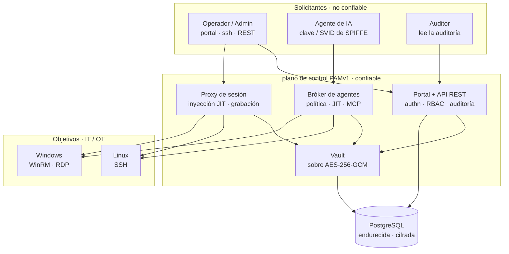
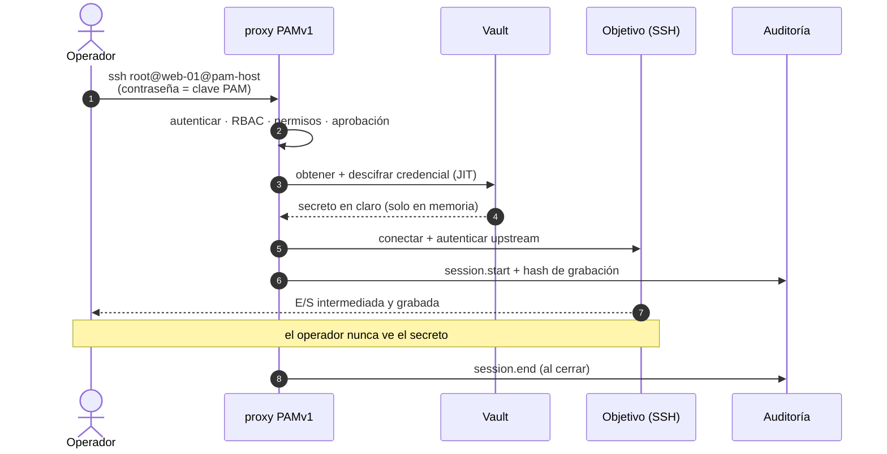

# PAMv1

> ⚠️ **Beta · con fines educativos.** Este es un proyecto educativo creado para explorar cómo
> funciona de principio a fin un sistema de Gestión de Acceso Privilegiado (PAM). **Beta**
> significa completo frente a su [hoja de ruta](ROADMAP.md) — se han entregado todas las
> fases, están cerrados todos los hallazgos de su propia
> [autoauditoría de seguridad](docs/SECURITY-GAPS.md), y cada capacidad tiene pruebas y se
> despliega como código. Sigue **sin** haber sido auditado por nadie ajeno al proyecto y **no**
> está listo para producción — no lo uses para custodiar credenciales privilegiadas reales.
> Úsalo para aprender, experimentar y contribuir.
>
> 🟢 **Documento vivo** — se actualiza en el mismo cambio que el código, sin pedir permiso
> aparte (ver la política en el [centro de documentación](docs/README.md)).

[](https://github.com/morandeirachema/pamv1/actions/workflows/ci.yml)
[](https://github.com/morandeirachema/pamv1/releases/latest)
[](LICENSE)
[](https://go.dev/)
[](https://www.postgresql.org/)

**Gestión de Acceso Privilegiado** (PAM) de código abierto en Go. PAMv1 guarda las
credenciales privilegiadas en un vault endurecido y luego coloca un **intermediario** entre
el solicitante y la máquina: lo autentica, descifra el secreto **just-in-time**, lo inyecta
en la propia conexión y lo graba todo. La contraseña llega al objetivo — nunca llega a la
persona (ni, ahora, al **agente de IA**) que la pidió. Encima, un **portal AS/400 / IBM 5250
de fósforo verde** sin concesiones, porque tocar un PAM debe *sentirse* serio.

> **La única idea.** *Confía en el punto de estrangulamiento, no en el solicitante.* Cada
> acción privilegiada — una sesión SSH humana, un comando Windows, la llamada a herramienta de
> un agente de IA — pasa por un único plano de control auditado que custodia el secreto y solo
> devuelve el resultado. Quítale la credencial al solicitante y con ella se va casi toda la
> superficie de ataque.

<p align="center">
  
  <br><em>La consola de gestión — pantalla verde AS/400 / IBM 5250, orientada al teclado (el ratón es opcional).</em>
</p>

Construido fase a fase con una regla: **cada fase es funcional de principio a fin** — arranca,
pasa los tests y se despliega como Infraestructura-como-Código. El **[roadmap](ROADMAP.md)**
abarca de la 0 a la 225, **se han entregado todas las fases**, y la release etiquetada y
firmada con cosign vigente es la
**[v0.61.0](https://github.com/morandeirachema/pamv1/releases/tag/v0.61.0)** (2026-08-27;
la primera fue la v0.10.0, el 2026-07-28). Lo que eso suma:
**intermediación de sesiones JIT** para SSH, PostgreSQL, WinRM y RDP en el portal;
**RBAC + perfiles a medida** con login AD/Entra/OIDC y MFA TOTP; **break-glass** con quórum
M de N; **safes** y propagación a cuentas dependientes; **Privilegio Cero Permanente** con
certificados SSH efímeros; **sesiones supervisadas** (observación en vivo, control de
comandos, elevación en sesión y un interruptor de corte para todo el clúster); un **bróker
de acceso para agentes de IA** (política sobre la herramienta *y sus argumentos*, ejecución
JIT en el servidor, cadena de auditoría verificable, transporte MCP, identidad SPIFFE);
**gobierno de accesos** (campañas de certificación, pasarela ITSM, aprobaciones N de M,
concesiones de contrato a proveedores); **analítica de amenazas privilegiadas** y un motor
de **radio de impacto de identidad / CIEM**; adaptación OT y herramientas NIS2; y la
consola **5250** completa, pensada para el teclado. Es un proyecto **beta y educativo** —
completo frente a su hoja de ruta y autoauditado, pero sin auditoría externa: léelo,
ejecútalo, aprende de él, pero no le confíes secretos reales.

🔎 **Resumen interactivo:** [página del proyecto](https://claude.ai/code/artifact/b9f19443-5ad1-42d2-955f-e43ca17ac542) — qué funciona, arquitectura y hoja de ruta de un vistazo &nbsp;·&nbsp; 📖 **[Read it in English →](README.md)**

## Documentación

**[📚 Centro de documentación](docs/README.md)** — documentos vivos con rutas de
lectura por audiencia (nuevo / operador / administrador / desarrollador / auditor
/ OT). Empieza ahí, o ve directamente a:

- **[Guía de sysadmin — cómo funciona](docs/SYSADMIN-GUIDE.md)** — la mejor primera lectura: qué hace PAMv1, cómo encajan las piezas y recetas `curl`/`ssh` para copiar y pegar. El modelo mental + el runbook.
- **[Guía de usuario](docs/USER-GUIDE.md)** — para operadores / auditores / aprobadores: iniciar sesión, conectar por el proxy, capacidades por rol.
- **[Guía de administración](docs/ADMIN-GUIDE.md)** — la referencia completa: desplegar, configurar (cada variable), gestionar objetivos / credenciales / usuarios / roles, break-glass, registro y auditoría.
- **Arquitectura y código** — **[alto nivel](docs/ARCHITECTURE-HIGH-LEVEL.md)**, **[bajo nivel](docs/ARCHITECTURE-LOW-LEVEL.md)** (el mapa más completo), **[diagramas derivados del código](docs/ARCHITECTURE-DIAGRAMS.md)** (generados desde el código y verificados por CI) y la **[guía del código](docs/CODE-GUIDE.md)** (recorrido narrativo para quien contribuye; abre con un manual de *leer Go si escribes Python*).
- **Seguridad y operación** — **[brechas de seguridad](docs/SECURITY-GAPS.md)** (auto-auditoría) · **[protocolos y criptografía](docs/PROTOCOLS-AND-CRYPTO.md)** (cada protocolo y cifrado, y dónde la verificación es opcional) · **[requisitos](docs/REQUIREMENTS.md)** · **[puertos y flujos](docs/PORTS-AND-FLOWS.md)** · **[copia y restauración](docs/BACKUP-AND-RESTORE.md)** · **[brechas que dependen de infraestructura externa](docs/EXTERNAL-INFRA-GAPS.md)**.
- **Cumplimiento y panorama** — **[despliegue OT](docs/OT-DEPLOYMENT.md)** · **[cumplimiento NIS2](docs/NIS2-COMPLIANCE.md)** · **[proyectos PAM relacionados](docs/RELATED-PROJECTS.md)** — cómo se sitúa PAMv1 entre los proyectos de código abierto (JumpServer, Teleport, Warpgate, Vault/OpenBao, step-ca, Guacamole …) y los fabricantes comerciales (CyberArk, BeyondTrust, Delinea, Wallix …), incluyendo cuáles se construyen sobre núcleos de código abierto (documento en inglés).
- **Meta del proyecto** — **[CHANGELOG.md](CHANGELOG.md)** (releases — la historia por fases vive en el roadmap) · **[CONTRIBUTING.md](CONTRIBUTING.md)** · **[SECURITY.md](SECURITY.md)** (aviso privado de vulnerabilidades).

## Arquitectura

Los solicitantes — humanos o máquinas — nunca tocan la zona de datos ni los objetivos
directamente. El plano de control lo intermedia todo; el vault es lo único capaz de convertir
el texto cifrado en un secreto usable, y solo durante lo que dura una conexión.


```mermaid
flowchart TB
    subgraph REQ[" Solicitantes · no confiable "]
        direction LR
        OPS["Operador / Admin<br/>portal · ssh · REST"]
        AGENT["Agente de IA<br/>clave / SVID de SPIFFE"]
        AUD["Auditor<br/>lee la auditoría"]
    end

    subgraph CP[" plano de control PAMv1 · confiable "]
        direction LR
        API["Portal + API REST<br/>authn · RBAC · auditoría"]
        PROXY["Proxy de sesión<br/>inyección JIT · grabación"]
        BROKER["Bróker de agentes<br/>política · JIT · MCP"]
        VAULT["Vault<br/>sobre AES-256-GCM"]
    end

    DB[("PostgreSQL<br/>endurecida · cifrada")]

    subgraph TGT[" Objetivos · IT / OT "]
        direction LR
        LNX["Linux<br/>SSH"]
        WIN["Windows<br/>WinRM · RDP"]
    end

    OPS --> API
    OPS --> PROXY
    AGENT --> BROKER
    AUD --> API
    API --> VAULT
    PROXY --> VAULT
    BROKER --> VAULT
    VAULT --> DB
    API --> DB
    PROXY --> LNX
    PROXY --> WIN
    BROKER --> LNX
    BROKER --> WIN
```

## Cómo funciona la inyección just-in-time

Cuatro movimientos, una garantía: el solicitante queda autenticado pero nunca conoce la
credencial del objetivo. El secreto existe en claro solo dentro del plano de control, solo
después de superar todas las comprobaciones de autorización, y solo para la conexión saliente.


```mermaid
sequenceDiagram
    autonumber
    actor Op as Operador
    participant PX as proxy PAMv1
    participant V as Vault
    participant T as Objetivo (SSH)
    participant A as Auditoría

    Op->>PX: ssh root@web-01@pam-host<br/>(contraseña = clave PAM)
    PX->>PX: autenticar · RBAC · permisos · aprobación
    PX->>V: obtener + descifrar credencial (JIT)
    V-->>PX: secreto en claro (solo en memoria)
    PX->>T: conectar + autenticar upstream
    PX->>A: session.start + hash de grabación
    T-->>Op: E/S intermediada y grabada
    Note over Op,T: el operador nunca ve el secreto
    PX->>A: session.end (al cerrar)
```

El bróker de agentes de IA hace el mismo movimiento con una llamada a herramienta: la política
decide `permitir / denegar / requerir-aprobación` sobre la herramienta **y sus argumentos**, una
llamada aprobada se ejecuta en el servidor con una credencial JIT, y el agente recibe solo el
resultado.

## Qué funciona hoy

Fases 0–151, agrupadas por área. Cada capacidad está cubierta por tests y se despliega como código.

### Identidad y acceso

- **Control de acceso por roles + perfiles personalizados** — cuatro roles integrados (`admin`, `user`, `auditor`, `approver`) más **perfiles de permisos personalizados**: nombra cualquier conjunto de capacidades (`read_inventory`, `manage_credentials`, `connect`, `reveal_secret`, `read_audit`, `approve`, …) y asígnalo a un usuario como un rol. Una única matriz rol/perfil→capacidad aplicada por la API **y** el proxy; los admins emiten tokens por usuario (guardados como SHA-256); cada denegación se audita con el usuario real.
- **SSO con AD, Entra ID, OIDC y SAML** — autentícate con un usuario+contraseña de AD por **LDAPS**, con **Microsoft Entra ID**, por **SSO OIDC Authorization Code + PKCE** (el IdP hace el login y su MFA; PAMv1 valida la firma RS256 del ID token contra el [JWKS](https://datatracker.ietf.org/doc/html/rfc7517) del IdP), o — para IdPs sin endpoint OIDC, sobre todo **AD FS** on-prem — por **SAML 2.0** con PAMv1 como Service Provider (iniciado por el SP; la [firma XML-DSig](https://www.w3.org/TR/xmldsig-core1/) de la aserción se verifica mediante una biblioteca bien auditada, Fase 151). Los grupos / app roles se mapean a los roles, y el login emite un token de sesión de corta duración que sirve en el portal y el proxy. Las fuentes se combinan; los tokens locales y el break-glass quedan como vía de emergencia.
- **Doble factor TOTP** — alta autoservicio ([RFC 6238](https://datatracker.ietf.org/doc/html/rfc6238), cualquier app de autenticación); el secreto se guarda cifrado en el vault y el login exige el código de 6 dígitos una vez dado de alta. Códigos de recuperación de un solo uso y una política opcional de MFA obligatoria (con primer inicio solo para alta).
- **Safes (contenedores de acceso delegado)** — agrupa objetivos en un **safe** con sus propios miembros; un miembro puede conectar a **todos los objetivos del safe** (una vía de autorización junto a las concesiones por objetivo), y un miembro `can_manage` es un **administrador delegado del safe**. Poner un objetivo en un safe lo restringe a sus miembros. `POST /api/safes`, `/api/safes/{id}/members`, `PUT /api/targets/{id}/safe`.

### Sesiones y el proxy JIT

- **Proxy de sesión con inyección JIT** — los operadores conectan por una pasarela SSH; el proxy los autentica, obtiene la credencial del vault, **la descifra solo al conectar** (y solo tras superar toda la autorización), la inyecta en la sesión con el objetivo y lo graba todo. Demostrado de extremo a extremo por un test de integración donde el upstream acepta *solo* la contraseña del vault que el cliente nunca tuvo. Las host keys upstream pueden fijarse (`PAM_SSH_KNOWN_HOSTS`); hay soporte de host de salto (bastión) y sesiones de **observador** de solo lectura — y, para un objetivo al que PAMv1 no puede llegar en absoluto (NAT, sin regla de entrada), un **agente de endpoint solo-saliente** (`pam-agent`, Fase 153) marca hacia fuera a la pasarela SSH y mantiene un túnel inverso por el que el proxy intermedia la misma sesión con inyección JIT y grabación.
- **Objetivos Windows (WinRM + RDP)** — ejecuta comandos en hosts Windows con `POST /api/targets/{id}/winrm` (auth básica o NTLM) o un bucle WinRM interactivo por el proxy, o intermedia un escritorio **RDP** completo con [Apache Guacamole](https://guacamole.apache.org/) (túnel WebSocket `GET /api/targets/{id}/rdp`, con verificación de certificado por defecto). El **visor va integrado en el portal**: abre *Work with Targets* → opción 7 y el escritorio se dibuja en un canvas (el portal incluye el cliente JavaScript de Guacamole; el propio guacd viene en los despliegues). En ambos casos la credencial se inyecta just-in-time (funcionan las cuentas de dominio), las sesiones se auditan y el operador nunca ve el secreto. El **portapapeles de la sesión** se controla con `PAM_RDP_CLIPBOARD` (`allow`/`readonly`/`deny`, endurecible **por objetivo** — gana el más estricto) y la redirección de unidades está siempre deshabilitada — así una sesión RDP no puede usarse como canal de copia/pegado ni de archivos sin auditar. `PAM_RDP_CLIPBOARD_AUDIT` añade la otra mitad: `meta` registra dirección, tipo, tamaño y digest de cada transferencia del portapapeles, y `full` guarda además el contenido (opt-in, porque un escritorio privilegiado copia secretos).
- **Proxy de sesión de base de datos (SQL Server)** — el hermano TDS del proxy de PostgreSQL (`PAM_MSSQL_ADDR`, p. ej. `:1433`): apunta `sqlcmd` a PAMv1 con `-U '<credbd>@<objetivo>'` y tu clave PAM como contraseña. Las mismas comprobaciones de autorización, la credencial SQL del vault inyectada just-in-time en el propio LOGIN7 del cliente, **cada sentencia auditada** —incluidas las que los drivers envían por `sp_executesql`, que un analizador de solo-nombre-de-procedimiento no vería—, además de grabación, monitorización en vivo, elevación y corte en todo el clúster. El códec TDS es propio (sin dependencias nuevas) y sus tests se fijan contra bytes derivados de la especificación; hay TLS disponible en ambos tramos, pero **no por defecto**: el tramo del operador solo se cifra si defines `PAM_TLS_CERT`/`PAM_TLS_KEY` —hasta entonces la clave PAM viaja en claro como contraseña TDS— y `PAM_REQUIRE_DB_CLIENT_TLS` hace que eso falle en cerrado. Demostrado de extremo a extremo por un upstream falso que acepta *solo* el secreto del vault — **la interoperabilidad con un SQL Server real aún no está verificada**.
- **Escritorios VNC** — intermediados por la misma ruta de [Guacamole](https://guacamole.apache.org/) que RDP y dibujados en el portal (*Work with Targets* → opción 7): la contraseña VNC del vault se inyecta en el servidor, la sesión se audita y se graba, y el portapapeles obedece la misma política (`PAM_RDP_CLIPBOARD`, endurecible por objetivo) mientras el canal de ficheros SFTP de VNC queda forzado a off. Conviene saber qué es VNC en sí: RFB en claro, **sin autenticación del servidor** y con una contraseña truncada a 8 caracteres por DES — que es justamente el argumento para intermediarlo en vez de exponerlo (ver [PROTOCOLS-AND-CRYPTO §3.5](docs/PROTOCOLS-AND-CRYPTO.md)).
- **Proxy de sesión de base de datos (PostgreSQL)** — apunta `psql` a PAMv1 (`PAM_DB_ADDR`, p. ej. `:5433`) con `user=<credbd>@<objetivo>` y tu clave PAM como contraseña; el proxy aplica las mismas comprobaciones de autorización que el proxy SSH, inyecta la credencial de BD del vault just-in-time (auth upstream por cleartext / MD5 / **SCRAM-SHA-256**) e intermedia el protocolo — **auditando cada sentencia SQL** (`db.query`) y grabando la sesión. El operador nunca conoce la contraseña de la base de datos. Demostrado de extremo a extremo por un upstream falso que acepta *solo* el secreto del vault.
- **Grabación de sesiones** — cada sesión (stdout **y** stderr, o cada sentencia SQL) capturada en [asciicast v2](https://docs.asciinema.org/manual/asciicast/v2/), encadenada por hash SHA-256 a prueba de manipulación, y el hash escrito en la auditoría. Los fallos de grabación se auditan y `PAM_REQUIRE_RECORDING` rechaza de plano una sesión no grabable — en los proxies SSH, WinRM y PostgreSQL **y**, desde la Fase 52c, en el visor RDP del portal y en el endpoint WinRM REST, comprobado *antes* de que nada llegue al objetivo.
- **Sesiones supervisadas (monitorización en vivo + control de comandos)** — un supervisor puede **ver en vivo una sesión SSH, PostgreSQL o WinRM** — y las ejecuciones `ssh_exec`/`winrm_exec` del bróker de agentes — por `GET /api/sessions/{id}/stream` (Server-Sent Events, `CapReadAudit`); el stream **termina en el momento en que termina la sesión**, así que un panel en silencio es una sesión tranquila, no una muerta. En un despliegue HA tanto el **listado como la visualización abarcan todo el clúster** (Fase 55): la petición puede caer en cualquier réplica, y la réplica que aloja la sesión retransmite su salida a través del almacén — solo mientras alguien la está viendo de verdad. Una lista de denegación por regex (`PAM_COMMAND_DENY_FILE`) **bloquea un comando peligroso antes de que llegue al objetivo** en las rutas de exec, WinRM y SQL — rechazado y auditado (`command.blocked`). Para las shells SSH interactivas se usa el modo observador de solo lectura. Un fichero de denegación que no produzca ningún patrón utilizable es un **error fatal en el arranque**, no un control silenciosamente desactivado.
- **Elevación dentro de la sesión** — donde el control de comandos es un bloqueo duro, `PAM_DB_STEPUP_FILE` marca sentencias que **se pausan a la espera de una decisión humana en vivo** en lugar de matar la sesión: la sentencia espera (auditada, visible en el monitor en vivo), un aprobador la permite o la rechaza desde la consola, y la sesión sobrevive en cualquier caso. Nadie puede aprobar la elevación de su propia sesión.
- **Interruptor de corte para todo el clúster** — una terminación emitida en cualquier réplica corta la sesión **allí donde esté alojada** (publicada por Postgres LISTEN/NOTIFY), de modo que el interruptor, la cascada de revocación, el barrido de proveedores y la respuesta automática de analítica funcionan en HA. Toda ejecución intermediada — el endpoint WinRM REST y las herramientas exec del bróker incluidas — es una sesión registrada, contable y terminable, no solo los proxies interactivos.
- **Control de transferencia de ficheros SFTP** — SFTP viaja sobre un subsistema SSH con un protocolo binario que el control de comandos nunca veía. El proxy **analiza ese flujo** para auditar cada operación (`sftp.open`/`sftp.modify`), y `PAM_SSH_SFTP` fija la política: `allow` (reenviar + auditar), `readonly` (**rechazar subidas, borrados y renombrados** con un permiso denegado sintetizado — el objetivo nunca se contacta; las descargas siguen funcionando) o `deny` (rechazar el subsistema entero). `PAM_SSH_SFTP_DENY_FILE` añade la otra dimensión — una **lista de denegación por regex sobre rutas** (el mismo motor que el control de comandos), rechazada en *todos* los modos incluidas las descargas y en ambos lados de un renombrado, porque una ruta que deniegas y aun así se puede descargar no está denegada. Cierra una vía de exfiltración de ficheros que de otro modo no se auditaría.
- **Control de transferencia de archivos (SFTP)** — SFTP viaja sobre un subsistema SSH con un protocolo binario que el control de comandos no veía. Ahora el proxy **analiza ese flujo** para auditar cada operación de archivo (`sftp.open`/`sftp.modify`), y `PAM_SSH_SFTP` fija la política: `allow` (reenviar + auditar), `readonly` (**rechaza subidas, borrados y renombrados** con un permiso denegado sintetizado — el objetivo nunca es contactado; las descargas siguen funcionando) o `deny` (rechaza el subsistema por completo). Cierra una vía de exfiltración de archivos que antes no se auditaba. Probado de extremo a extremo con un cliente y servidor SFTP reales intercambiando paquetes genuinos a través del proxy.

### Vault y ciclo de vida de credenciales

- **Vault endurecido (cifrado en sobre)** — cada secreto se sella con una clave de datos [AES-256-GCM](https://pkg.go.dev/crypto/cipher) por secreto, envuelta por una **KEK intercambiable**: una clave local para desarrollo, o en producción **[HashiCorp Vault Transit](https://developer.hashicorp.com/vault/docs/secrets/transit)**, **[AWS KMS](https://aws.amazon.com/kms/)** o un **HSM por [PKCS#11](https://en.wikipedia.org/wiki/PKCS_11)** (build con tag `pkcs11`) — la clave raíz nunca sale del KMS/HSM. El AAD liga cada texto cifrado a su objetivo (un token copiado no descifra); los tokens versionados `v2:` permiten rotar la KEK en caliente.
- **Inventario de objetivos y API de credenciales** — máquinas Linux/Windows con endpoints ssh/winrm/rdp; las credenciales se guardan en el vault, se listan (sin devolver material secreto), se revelan bajo demanda (auditado) y se borran. El modelo JSON *no puede* serializar el texto cifrado (`json:"-"`).
- **Ciclo de vida (rotación · reconciliación · préstamo · descubrimiento)** — `POST /api/credentials/{id}/rotate` genera un secreto fuerte, lo fija **en el objetivo** (SSH `chpasswd` / WinRM `net user` / nueva `ssh_key`) y lo re-cifra — la nueva contraseña nunca se muestra. `/reconcile` verifica que el secreto del vault sigue autenticando y detecta **desincronización** (`?remediate=true` la corrige). El **préstamo (checkout)** concede una reserva exclusiva y temporal y rota el secreto al devolverlo. El **descubrimiento** (`/api/discovery/scan`) sondea hosts en busca de puertos SSH/WinRM/RDP y puede dar de alta objetivos. Un worker en segundo plano rota secretos antiguos y reconcilia según un calendario; los secretos pueden rotarse en cuanto termina una sesión proxied. **Cuentas dependientes** — declara los consumidores de una credencial (Servicios de Windows / Tareas programadas / App Pools de IIS) y la rotación actualiza cada uno por WinRM, para que rotar una cuenta de servicio no rompa producción.
- **Cero Privilegio Permanente y certificados de operador** — una credencial `ssh_ca` **no guarda ningún secreto**: el proxy acuña un certificado SSH de corta vida por sesión, firmado por la CA de PAMv1 (`PAM_SSH_CA_KEY`), de modo que la cuenta no tiene credencial permanente que robar. Un operador puede además pedir un certificado para **su propia clave** con prueba de posesión, acotado por principal y dirección de origen, revocable por KRL. En HA, la clave de host y la de la CA se guardan **en custodia compartida** en el store, cifradas con la KEK, para que no se reparta una CA distinta por pod.

### Auditoría, break-glass y alertas

- **Registro de auditoría** — un registro de solo adición de cada acción sensible, con atribución de actor, más una exportación a prueba de manipulación (`GET /api/audit/export`, JSON/CSV + resumen SHA-256) para el reporte de incidentes.
- **Logs operativos** — [slog](https://pkg.go.dev/log/slog) estructurado a stdout, una línea por petición HTTP y por sesión del proxy, etiquetado por servicio (`server`/`api`/`proxy`/`store`); JSON para un SIEM o texto para humanos (`PAM_LOG_LEVEL`, `PAM_LOG_FORMAT`). Separado de la auditoría; los secretos nunca se registran.
- **Break-glass (v2)** — una clave de emergencia sellada, o **apertura por quórum M-de-N** ([shares de Shamir](https://en.wikipedia.org/wiki/Shamir%27s_secret_sharing) divididos con `-split-key`; los custodios envían sus shares para reconstruirla). En ambos casos obtienes una sesión de admin **de corta duración y autoexpiración**, y cada acceso/apertura break-glass se audita con fuerza y se **alerta en tiempo real** (webhook, syslog o correo).
- **Registro de auditoría a prueba de manipulación** — con `PAM_AUDIT_HMAC_KEY` cada evento encadena un HMAC sobre el anterior, de modo que alterar o borrar una fila rompe la cadena de forma detectable (`GET /api/audit/verify`), y un **checkpoint de cabeza firmado con ed25519** detecta el truncamiento de la cola, que una cadena por sí sola no ve.
- **Reenvío continuo de auditoría al SIEM** — `PAM_AUDIT_FORWARD_ADDR` transmite cada evento desde un cursor duradero como **syslog RFC 5424**, **CEF** o **LEEF** sobre UDP/TCP/**TLS**, con exportación **OCSF** para las plataformas que la esperan. La evidencia sale del edificio sin depender de que alguien recuerde exportarla.
- **Retención con archivado WORM** — `PAM_RETENTION_ARCHIVE_DIR` archiva grabaciones y auditoría envejecidas, con digest, **antes** de purgar; el borrado solo se ejecuta si el archivado tuvo éxito. Con la cadena HMAC activada las filas se archivan pero **no** se purgan, porque purgarlas rompería la verificación.
- **Grabaciones protegidas en reposo** — `PAM_RECORDING_ENCRYPT` sella cada grabación con el mismo cifrado en sobre y la misma KEK que las credenciales, y `PAM_RECORDING_OPAQUE_NAMES` saca los metadatos del nombre de fichero al registro de auditoría, para que el volumen de respaldo no filtre quién accedió a qué. Ojo: la clave de datos de una grabación sellada va envuelta **dentro del fichero**, así que conserva la KEK antigua mientras conserves grabaciones.

### Configuración y la consola de gestión

- **Consola de gestión AS/400** — una consola completa consciente de roles en fósforo verde: Sign On, un menú principal numerado y pantallas `Work with…` para objetivos y concesiones, credenciales (revelar/prestar/rotar/reconciliar), sesiones activas (monitor en vivo + corte + un **panel de observación en directo**), solicitudes de acceso a cuatro ojos (ticket, aprobaciones N-de-M, ventanas programadas), usuarios y perfiles, MFA, descubrimiento, reconciliación, auditoría (filtro + exportación CSV), break-glass, **perfiles de permisos**, **configuración del sistema**, **config efectiva + exportación a IaC**, **secretos de aplicación**, **cajas fuertes (safes)**, **campañas de certificación**, **analítica de riesgo**, **reproducción de grabaciones**, los **dos puntos de decisión humana** (aprobar la llamada de un agente y liberar una sentencia pausada), **proveedores**, **certificados SSH de operador**, **radio de impacto**, **sesiones de inicio**, **claves de agentes de IA** y **tokens delegados de agente (RFC 8693)** — opciones numéricas (`2=Cambiar`, `4=Borrar`, `5=Ver`), teclas F, líneas de barrido. Toda capacidad entregada se opera desde la consola; nada es solo-curl. Es **orientada al teclado** (el ratón es opcional): el foco cae en el campo de cada pantalla, `Esc` vuelve atrás, `↑/↓` mueven entre filas. El menú muestra solo lo que tu rol permite.

<p align="center">
  
  <br><em>Menú 15 — Work with application secrets</em>: acuñar identidades de aplicación y concederles credenciales individuales (Nivel 4).</em>
</p>

- **Configuración con hot-swap** — los ajustes de identidad, SSO y política operativa pasan a ser editables y **persistidos en la BD**, y se **aplican en caliente sin reiniciar** (secretos cifrados en el vault, un cambio rechazado se revierte). Una pantalla de solo lectura de config efectiva + salud de backends y una **exportación a IaC** (`env` / Helm / Terraform) devuelven los cambios de la consola a código. El arranque y la red/TLS permanecen solo en el entorno a propósito.

### El bróker de acceso para agentes de IA

PAM para agentes de IA — el mismo punto de estrangulamiento, extendido a herramientas autónomas.
Opcional vía `PAM_BROKER_POLICY_FILE`.

- **Política sobre herramienta + argumentos** — un motor [YAML](https://yaml.org/) estilo sudoers decide `permitir / denegar / requerir-aprobación` sobre la herramienta **y sus argumentos** (gana la primera coincidencia, denegación implícita); una llamada aprobada se ejecuta **en el servidor con una credencial just-in-time** y el agente recibe solo el resultado. Herramientas: `winrm_exec`, `ssh_exec`, `list_targets`, `list_credentials`, `rotate_credential` y `reveal_credential` (entregado **denegado por defecto**). Los agentes obedecen las mismas concesiones por objetivo y la puerta de cuatro ojos que los humanos.
- **Aprobación humana + reanudación de un solo uso** — una llamada `require_approval` queda en espera de una decisión humana (`/v1/approvals`); al aprobarse se ejecuta y el agente recoge el resultado **exactamente una vez** con un token de un solo uso.
- **Auditoría verificable** — cada paso es un evento **encadenado por hash con HMAC con clave** (`GET /v1/audit/verify`, más un checkpoint de cabeza firmado con ed25519 para detectar truncamiento) separado del registro general. Las claves de esa cadena viven en **custodia compartida** — generadas una vez, selladas por la KEK en el almacén, convergidas por todas las réplicas y reenvueltas por `-rotate-kek` — salvo que las fijes explícitamente en el entorno, que es además cómo se rota el firmante.
- **Transporte MCP + identidad SPIFFE** — el bróker habla **[MCP](https://modelcontextprotocol.io/)** (JSON-RPC 2.0 en `POST /mcp`) a la par con REST, y los agentes se autentican con una clave estática o un **JWT-SVID de [SPIFFE](https://spiffe.io/)** (RS256/ES256/EdDSA, JWKS del dominio de confianza) con cadenas de delegación [RFC 8693](https://datatracker.ietf.org/doc/html/rfc8693) acotadas por un límite de profundidad.

### OT / industrial y cumplimiento

- **Aprobación de sesión OT (cuatro ojos)** — protege un objetivo tras una solicitud de acceso aprobada: un usuario la crea, un aprobador *distinto* la aprueba (se rechaza la auto-aprobación), y solo entonces puede conectar — aplicado en el proxy SSH, WinRM **y** RDP, con break-glass como bypass. Por objetivo (`require_approval`) o global (`PAM_REQUIRE_APPROVAL`), con ventana temporal para mantenimientos. Una solicitud puede además exigir un **ticket de cambio**: validación por formato + webhook (Fase 20), re-comprobado en el momento de usar el acceso (`PAM_TICKET_REVALIDATE`, Fase 60) y — desde la Fase 84 — validado **de primera clase contra [ServiceNow](https://www.servicenow.com/) o [Jira](https://www.atlassian.com/software/jira)**: el estado del ticket, su ventana de cambio y que **nombre al operador**, nada de lo cual podía expresar un webhook 2xx.
- **Endurecimiento OT** — **listas blancas de protocolos** por zona (`PAM_ALLOWED_PROTOCOLS`), sesiones **observador** de solo lectura y un **modo air-gap** (`PAM_OT_AIRGAP`) sin llamadas salientes. Ver la [guía de despliegue OT](docs/OT-DEPLOYMENT.md) y el [pack NIS2](docs/NIS2-COMPLIANCE.md).
- **Puerta de acceso para terceros (proveedores)** — el acceso de un proveedor externo se rige por **concesiones de contrato acotadas en el tiempo y aprobadas por el cliente**, con atestación de empleo en vivo: si el proveedor deja de emplear a esa persona, el acceso cae. Dar de baja a un proveedor desencadena una **cascada instantánea** — se revocan las concesiones y se cortan las sesiones vivas — y hay exportación de evidencias por proveedor para SOC 2 / DORA.
- **Campañas de certificación de accesos con separación de funciones** — un revisor recorre quién tiene acceso a qué y certifica o revoca cada elemento; **nadie puede certificar un acceso que él mismo concedió**, y revocar corta también las sesiones vivas de esa persona a los objetivos afectados, no solo la concesión. Las campañas pueden **acotarse** (por safe o por sujeto) y **programarse** (recurrentes), cada elemento lleva su **revisor asignado**, y se **avisa a los revisores antes de que la campaña caduque** (Fases 68–70).
- **Radio de impacto de identidad (CIEM)** — `internal/blast` evalúa permisos efectivos de AWS IAM y recorre rutas de escalada sobre un grafo de identidad normalizado (`POST /api/blast/analyze`), señalando combinaciones tóxicas y proponiendo la remediación como código. Solo análisis de lectura: no toca credenciales de nube ni guarda estado.
- **Analítica de amenazas privilegiadas** — un puntuador de riesgo conductual y explicable sobre el registro de auditoría (señales con nombre, topes por señal, enfriamiento entre alertas), **consciente del histórico** desde la Fase 86: una línea base construida con la ventana anterior a la puntuada alimenta una señal de **novedad de objetivo** que calla sin histórico (un recién llegado no es una anomalía) y una señal de **atípico entre pares** medida contra la mediana del grupo. La respuesta automática actúa solo sobre la actividad del propio actor y tiene dos peldaños: **revocar los inicios de sesión** para que la siguiente acción vuelva a autenticarse (`PAM_ANALYTICS_AUTO_STEPUP`) y **matar las sesiones vivas** (`PAM_ANALYTICS_AUTO_KILL`).

### Almacenamiento y operaciones

- **Almacenamiento PostgreSQL** con [pgx](https://github.com/jackc/pgx) y migraciones embebidas y versionadas; un almacén en memoria para tests y demos; **alta disponibilidad con [CloudNativePG](https://cloudnative-pg.io/)** opcional.
- **Observabilidad** — un endpoint [Prometheus](https://prometheus.io/) `/metrics` sin dependencias (conteos por estado, volumen de auditoría, uso de break-glass, rotaciones, gauge de sesiones activas), más una separación liveness/readiness (`/healthz`, `/readyz` que comprueba la BD).
- **Despliegue como código** — [Docker](https://docs.docker.com/) (distroless, sin root), [docker-compose](https://docs.docker.com/compose/) con Postgres endurecida, manifiestos [Kubernetes](https://kubernetes.io/) bajo el PSS restringido, un **[chart de Helm](deploy/helm/pamv1)** y un módulo de [Terraform](https://developer.hashicorp.com/terraform). El pipeline de release construye por digest con **[SBOM](https://www.cisa.gov/sbom), firma keyless [cosign](https://docs.sigstore.dev/) y procedencia SLSA**. *Release vigente: **[v0.61.0](https://github.com/morandeirachema/pamv1/releases/tag/v0.61.0)** (2026-08-27; la primera fue la v0.10.0) — la imagen firmada es pública en `ghcr.io/morandeirachema/pamv1:0.61.0`, que es la que fijan todos los manifiestos, así que las rutas de instalación por artefacto publicado ya funcionan.*
- **Secretos cifrados en git** — el manifiesto de Secret de Kubernetes puede sellarse con **[SOPS](https://github.com/getsops/sops) + [age](https://age-encryption.org/)**: los valores se cifran mientras `kind`/`metadata` quedan legibles, y se descifra al desplegar (`sops -d | kubectl apply -f -`, el texto plano nunca toca el disco) o de forma nativa con Flux / Argo / helm-secrets — así los secretos viven en el **mismo repo de IaC** sin filtrarse. Ver **[deploy/k8s/sops/](deploy/k8s/sops/)**.
- **O aprovisiona los secretos desde CyberArk Conjur** — como alternativa en tiempo de ejecución a SOPS, define `PAM_CONJUR_URL` y PAMv1 obtiene sus secretos de arranque (clave maestra, clave de API, URL de la BD, …) de **[Conjur](https://www.conjur.org/)** al arrancar, autenticándose con una clave de API de host o un token proyectado de Kubernetes (**`authn-jwt`**) — de modo que ningún secreto de arranque vive en Git. Con `PAM_CONJUR_REFRESH_MIN` (Fase 78), los secretos que honestamente pueden cambiar con el servidor en marcha (`PAM_API_KEY`, `PAM_BREAK_GLASS_KEY_HASH`) se **releen periódicamente sin reiniciar**; la KEK, la URL de la base de datos y las claves de la cadena de auditoría quedan ancladas a un reinicio por diseño. Ambos mecanismos se entregan; SOPS sigue siendo el predeterminado sin dependencias. Ver **[deploy/k8s/conjur/](deploy/k8s/conjur/)**.

## Roles, usuarios y perfiles

Cuatro roles integrados, aplicados de forma idéntica por la API y el proxy, más perfiles personalizados:

| Rol | Puede | No puede |
|---|---|---|
| `admin` | gestionar objetivos/credenciales/usuarios, revelar secretos, conectar, leer auditoría, gestionar config/perfiles | — |
| `user` | conectar a objetivos por el proxy, leer el inventario | gestionar, revelar, leer auditoría |
| `auditor` | leer el inventario y la auditoría | gestionar, revelar, conectar |
| `approver` | leer inventario + auditoría, aprobar solicitudes de acceso | gestionar, revelar, conectar |

¿Necesitas algo intermedio? Define un **perfil personalizado** — un conjunto de capacidades con
nombre — y asígnalo como un rol (menú 12, o `POST /api/profiles`). Los cuatro integrados no cambian.

Un admin crea un usuario y recibe el token de acceso de ese usuario **una sola vez**:

```bash
curl -H "X-API-Key: $PAM_API_KEY" -X POST http://localhost:8080/api/users \
  -d '{"username":"alice","role":"user"}'
# → {"id":1,"username":"alice","role":"user","token":"pamt_…"}   (guárdalo ya)
```

El usuario presenta ese token como `X-API-Key` (Sign On del portal) o como contraseña del proxy
SSH. La `PAM_API_KEY` de arranque es la identidad `admin`; la clave break-glass también es `admin`
(auditada con fuerza). Para inicio de sesión con directorio, AD/Entra/OIDC mapean grupos a estos
mismos roles.

## Conectar por el proxy (inyección JIT)

Una vez que un objetivo y su credencial están en el vault, los operadores llegan al objetivo
**a través de** PAMv1 — el secreto se descifra solo para la conexión saliente y nunca se muestra:

```bash
# el usuario selecciona el objetivo; la contraseña SSH es tu clave PAM (o token por usuario)
ssh -p 2222 web-01@pam-host                 # primera credencial del objetivo "web-01"
ssh -p 2222 root@web-01@pam-host            # una credencial concreta (usuario "root")
```

El proxy te autentica, obtiene la contraseña de `root` del vault, la inyecta en la conexión SSH
saliente, graba la sesión (asciicast v2) con un SHA-256 en la auditoría y transmite tu E/S. Nunca
ves la credencial. Las grabaciones van a `PAM_RECORDING_DIR`; desactiva el proxy con
`PAM_SSH_ADDR=off`.

## Hoja de ruta

Se han entregado todas las fases (0–94) — detalle por fase en **[ROADMAP.md](ROADMAP.md)**:

| Fase | Tema | Estado |
|---|---|---|
| 0 | Cimientos del proyecto | ✅ entregada |
| 1 | Núcleo: vault, inventario, auditoría, portal | ✅ entregada |
| 2 | Proxy de sesión SSH con inyección JIT | ✅ entregada |
| 3 | Identidad y control de acceso (RBAC, AD/Entra/OIDC/SAML, MFA) | ✅ entregada |
| 4 | Objetivos Windows (WinRM + RDP vía Guacamole) | ✅ entregada |
| 5 | Endurecimiento: base de datos, vault, transporte | ✅ entregada |
| 6 | Break-glass v2 (quórum M-de-N) | ✅ entregada |
| 7 | Ciclo de vida de credenciales (rotación, reconciliación) | ✅ entregada |
| 8 | Adaptación OT (aprobaciones a cuatro ojos, air-gap) | ✅ entregada |
| 9 | Pack de cumplimiento NIS2 | ✅ entregada |
| 10 | Escala y operaciones (métricas, Helm, HA, releases firmadas) | ✅ entregada |
| 11 | Consola de gestión 5250 completa | ✅ entregada |
| 12 | Subsistema de configuración + RBAC de perfiles + hot-swap | ✅ entregada |
| 13 | Bróker de acceso para agentes de IA (política, herramientas JIT, auditoría verificable, MCP, SPIFFE) | ✅ entregada |
| 14 | Secretos de Kubernetes cifrados con SOPS (age; Flux/Argo/helm-secrets) | ✅ entregada |
| 15 | Proxy de sesión de base de datos PostgreSQL (inyección JIT + auditoría de consultas) | ✅ entregada |
| 16 | Monitorización de sesiones en vivo (SSE) + control de comandos | ✅ entregada |
| 17 | Safes (contenedores de acceso delegado) + propagación a cuentas dependientes | ✅ entregada |
| 18 | Aprovisionamiento de secretos desde CyberArk Conjur (opcional, junto a SOPS) | ✅ entregada |
| 19 | Campañas de certificación / atestación de accesos | ✅ entregada |
| 20 | Pasarela ITSM / tickets en las solicitudes de acceso | ✅ entregada |
| 21 | Flujos de aprobación más ricos (N-de-M, ventanas programadas, códigos de motivo) | ✅ entregada |
| 22 | Privilegio Cero Permanente (certificados SSH efímeros de corta vida) | ✅ entregada |
| 23 | Analítica de amenazas privilegiadas (riesgo conductual + respuesta automática) | ✅ entregada |
| 24 | API de secretos para aplicaciones (entrega estilo Conjur para apps sin agente) | ✅ entregada |
| 25 | Paridad de la consola (safes, campañas, analítica de riesgo, visor de sesiones en directo) | ✅ entregada |
| 26 | Reproducción de grabaciones de sesión (verificada por hash) + acceso de un solo uso | ✅ entregada |
| 27 | Compleción del broker de agentes IA (SoD, checkpoints de auditoría firmados, exportación OCSF, MCP SSE + elicitación) | ✅ entregada |
| 28 | Certificados SSH emitidos al operador (certificados JIT para humanos, revocación por KRL) | ✅ entregada |
| 29 | Pasarela de acceso de terceros/proveedores (concesiones contractuales con caducidad, atestación de empleo, cascada de baja) | ✅ entregada |
| 30 | Política en sesión + step-up (comparadores numéricos de política, pausa-para-supervisor en el proxy de BD) | ✅ entregada |
| 31 | Motor de radio de impacto de identidad / CIEM (evaluador de permisos efectivos de AWS IAM + rutas de escalada) | ✅ entregada |
| 32 | Control y auditoría de transferencia de archivos SFTP (analiza el subsistema; allow/readonly/deny) | ✅ entregada |
| 33 | Control del portapapeles RDP (regula el puente de portapapeles de Guacamole; redirección de unidades deshabilitada) | ✅ entregada |
| 34 | Interruptor de corte de sesión en HA (corte entre réplicas vía Postgres LISTEN/NOTIFY) | ✅ entregada |
| 35 | Reenvío de auditoría a SIEM (flujo continuo RFC 5424 syslog / CEF) | ✅ entregada |
| 36 | Retención / purga (grabaciones y filas de auditoría antiguas; preserva la integridad) | ✅ entregada |
| 37 | Pasada de análisis de brechas (los borrados de recursos hijo se acotan a su padre; las credenciales bearer fallidas se limitan y auditan en todas las superficies) | ✅ entregada |
| 38 | Control de comandos en todas las rutas de comando (un único `cmdguard` compartido; el endpoint WinRM REST y las herramientas exec del broker ya respetan la lista de denegación) | ✅ entregada |
| 39 | Capacidad de aprobación en los dos puntos de decisión (liberar una sentencia en pausa y decidir una campaña pasan a `approve`) | ✅ entregada |
| 40 | Toda ejecución intermediada es una sesión supervisada (el endpoint WinRM REST y las herramientas exec del broker entran en el registro de sesiones vivas) | ✅ entregada |
| 41 | Grabaciones de sesión cifradas en disco (AES-256-GCM por bloques bajo la KEK del vault; la evidencia de manipulación no cambia) | ✅ entregada |
| 42 | Custodia compartida de las claves de host y CA en HA (reclamación atómica en el store; las réplicas convergen en una sola clave) | ✅ entregada |
| 43 | Consola: los dos puntos de decisión humana (aprobar la llamada de un agente · decidir una sentencia en pausa) | ✅ entregada |
| 44 | Objetos editables y listados acotados (`PUT` para editar in situ; todo listado usa un cursor `?limit=&after=` acotado) | ✅ entregada |
| 45 | El resto de pantallas de consola (proveedores, certificados de operador, radio de impacto, sesiones de login, claves de agente, dependientes, cadena de auditoría) | ✅ entregada |
| 46 | Cuatro ojos por ítem en la certificación (los permisos registran quién los creó; no puedes certificar el acceso que concediste) | ✅ entregada |
| 47 | Formato LEEF + transporte TLS para el reenvío a SIEM (RFC 5425, verificación de certificado siempre activa) | ✅ entregada |
| 48 | Nombres de grabación opacos (los metadatos pasan del nombre de fichero a la traza de auditoría) | ✅ entregada |
| 49 | Archivado WORM antes de purgar (exportación sellada con digest; el borrado solo ocurre si el archivado tuvo éxito) | ✅ entregada |
| 50 | Auditoría del portapapeles en el puente RDP (dirección, tipo, tamaño, digest; el contenido es opcional) | ✅ entregada |
| 51 | Política de rutas en SFTP (lista de denegación por regex, rechazada en todos los modos y en ambos lados de un rename) | ✅ entregada |
| 52 | Cerrar los hallazgos de inyección de comandos (dependencias de credenciales; lista de denegación → lista de permitidos en `net user`) | ✅ entregada |
| 52a | Dejar `-rotate-kek` completo (re-envuelve la custodia de claves; grabaciones selladas documentadas en vez de rotas) | ✅ entregada |
| 52b | Las dos regresiones del mismo día, y el hueco del contrato de store que ocultó una | ✅ entregada |
| 52c | Coherencia de las puertas de autorización (seis que no coincidían con sus equivalentes) | ✅ entregada |
| 52d | Tiempos de vida, plazos y comportamientos que fallaban en abierto | ✅ entregada |
| 52e | Integridad del registro de auditoría, archivado y dos errores de concurrencia | ✅ entregada |
| 52f | La marca de agua del archivado, hecha robusta — encontrada al revisar la 52e | ✅ entregada |
| 52g | Seis más, encontradas al revisar todo lo anterior — incluido un test que no podía fallar | ✅ entregada |
| 53 | Proxy de sesión SQL Server (TDS) — inyección JIT y auditoría por sentencia | ✅ entregada |
| 54 | Conector VNC (intermediado por guacd, visor en el portal, mismas puertas que RDP) | ✅ entregada |
| 55 | Monitorización en vivo entre réplicas (listado de sesiones de todo el clúster + visualización SSE mediante un relé sobre el almacén activado por interés) | ✅ entregada |
| 56 | Decisiones de step-up entre réplicas (lista pendiente de todo el clúster, sellada en reposo; la decisión se envía a la réplica que aloja la pausa) | ✅ entregada |
| 57 | Emisión por intercambio de tokens RFC 8693 + remediación como Terraform (el bróker emite los SVID delegados; el corte CIEM se representa como HCL) | ✅ entregada |
| 58 | Política a nivel de safe (un safe lleva `require_approval` + un suelo de doble control; gana el más estricto en las cinco puertas) | ✅ entregada |
| 59 | Grabación del contenido por fichero en SFTP (artefactos chunk-log sellados y encadenados por hash; reproducibles; el tope hace también de límite de tamaño) | ✅ entregada |
| 59a | Cierre de la revisión de la 59 (tres elusiones de captura, contención del nombre del artefacto, `lsetstat`, falsificación de campos de auditoría, un panic alcanzable) | ✅ entregada |
| 60 | La puerta de tickets aguanta al conectar (el ticket de cambio se re-comprueba al usar el acceso, en las cinco puertas) | ✅ entregada |
| 61 | Una cuenta dependiente nombra la credencial que la gestiona (la propagación deja de iniciar sesión como la cuenta que rota) | ✅ entregada |

La tabla se detiene en la 61 para seguir siendo legible; **las fases 62–94 se
entregaron igual de completas** (cada una tiene su sección en
[ROADMAP.md](ROADMAP.md)): la primera ola de releases y sus revisiones (62–66),
la pantalla de consola del intercambio de tokens (67), profundidad en las
campañas de certificación — acotado, programación, revisores por elemento,
recordatorios (68–70), una red de seguridad para la consola (71), el almacén
recompuesto sobre interfaces de rol (72), una cobertura de CI honesta (73), la
paridad de políticas entre los proxies de base de datos fijada por una puerta
de deriva (74), una descomposición de `internal/api` (75), un único
sanitizador de auditoría + validación estricta de entradas (76–77), secretos
de arranque refrescables en caliente (78), ejemplos de despliegue GitOps que
funcionan y el bug del quickstart que destaparon (79–80), un job de CI que
"demuestra que es un PAM" de extremo a extremo (81–82), conectores de tickets
de primera clase para ServiceNow/Jira (84), analítica consciente del histórico
con un peldaño de respuesta que revoca inicios de sesión (86–87), el cierre
del backlog de hallazgos abiertos (89), y una revisión adversarial de las
joyas de la corona (91–93) que corrigió una brecha de contención en el SFTP de
solo lectura y confirmó sólidos el vault, los proxies de base de datos y los
cuatro ojos del bróker — publicado de forma continua como **v0.10.0 →
v0.61.0**. Las releases quedan registradas en **[CHANGELOG.md](CHANGELOG.md)**;
el resto honesto vive en
**[ROADMAP.md → What is left](ROADMAP.md#what-is-left-)**.

## Cobertura frente al PAM comercial (CyberArk, Wallix, …)

PAMv1 es un proyecto **educativo y beta** — no un reemplazo directo de
[CyberArk](https://www.cyberark.com/products/privileged-access-manager/),
[Wallix Bastion](https://www.wallix.com/privileged-access-management/),
[BeyondTrust](https://www.beyondtrust.com/),
[Delinea](https://delinea.com/products/secret-server),
[Teleport](https://goteleport.com/) ni [StrongDM](https://www.strongdm.com/). En el
**bucle central de sesión/credencial** ya está a la par — proxy de inyección JIT
(SSH/WinRM/RDP), grabaciones encadenadas por hash a prueba de manipulación, rotación
+ reconciliación + concesiones de checkout, break-glass M-de-N, RBAC + AD/Entra/OIDC +
MFA, y una cadena de auditoría verificable — y su **bróker de acceso para agentes de
IA** (política sobre la herramienta *y sus argumentos*, transporte MCP, identidad
SPIFFE) va por delante de la mayoría de los titulares.

Las brechas siguientes son de **amplitud y gobierno**. Cada una indica cómo encaja en
la arquitectura de punto de estrangulamiento existente de PAMv1, y se corresponden con
posibles fases futuras.

### Nivel 1 — brechas estructurales / de conectores

| Brecha | Qué hacen los líderes | PAMv1 hoy | Encaje |
|---|---|---|---|
| ~~**Cajas fuertes (safes) / contenedores** con propiedad delegada~~ **✅ entregado (Fase 17)** | Todo el modelo de autorización de CyberArk son las [safes](https://docs.cyberark.com/pam-self-hosted/latest/en/content/pasref/safes-and-safe-members.htm) — contenedores de credenciales con sus propios miembros, flujos y administración delegada; Wallix usa dominios de objetivos | los **safes** agrupan objetivos con miembros `can_manage` delegados; un miembro alcanza todos los objetivos del safe (`EffectiveTargetGrants`) | hecho — los flujos de aprobación por safe son posteriores |
| ~~**Proxy de sesión de base de datos** con auditoría por consulta~~ **✅ entregado (Fases 15 + 53: PostgreSQL, SQL Server)** | [Teleport](https://goteleport.com/docs/enroll-resources/database-access/), [StrongDM](https://www.strongdm.com/), CyberArk y Wallix intermedian Postgres/MySQL/MSSQL/Oracle nativos con auditoría por consulta + inyección JIT | **PostgreSQL y SQL Server intermediados** (`PAM_DB_ADDR`, `PAM_MSSQL_ADDR`): inyección JIT, auditoría `db.query` por sentencia, control de comandos que ve a través de `sp_executesql`. MySQL/Oracle aún por llegar | hecho para Postgres y SQL Server (Fase 53); el mismo patrón de listener se generaliza a los protocolos restantes |
| ~~**Monitorización en vivo + control de comandos**~~ **✅ entregado (Fase 16)** | [CyberArk PSM](https://www.cyberark.com/products/privileged-session-manager/) y Wallix permiten a un supervisor ver una sesión en vivo, bloquear un comando peligroso a mitad de flujo (`rm -rf /`, `DROP TABLE`) y terminarla de forma interactiva | **stream SSE en vivo** (`GET /api/sessions/{id}/stream`) + **control de comandos** (lista de denegación regex en exec/WinRM/SQL, `command.blocked`); el corte interactivo ya existía | hecho — el filtrado de shell interactiva es el seguimiento pendiente (el visor RDP en el portal ya se entregó) |
| ~~**Propagación a cuentas dependientes** al rotar~~ **✅ entregado (Fase 17)** | El CPM de CyberArk actualiza cada [consumidor](https://docs.cyberark.com/pam-self-hosted/latest/en/content/pasimp/managing-service-accounts-service.htm) de una cuenta de servicio rotada (Servicios de Windows, Tareas programadas, App Pools de IIS, COM+) | la rotación ahora actualiza **Servicios de Windows / Tareas programadas / App Pools de IIS** declarados por WinRM con el nuevo secreto | hecho — COM+ y una credencial de gestión por consumidor son posteriores |

### Nivel 2 — profundidad de gobierno de accesos

- ~~**Campañas de certificación / atestación de accesos**~~ **✅ entregado (Fase 19)** — una campaña toma una instantánea del acceso actual (concesiones por objetivo + miembros de safes); un revisor certifica o revoca cada elemento, y una revocación borra la concesión subyacente (`POST /api/campaigns`). El control de revisión de accesos de SOX / ISO 27001 / NIS2.
- ~~**Pasarela ITSM / tickets**~~ **✅ entregado (Fase 20)** — una solicitud de acceso puede exigir un ticket de cambio/incidencia, validado por un regex de formato y/o un webhook que el ITSM responde `2xx` para un ticket válido (`PAM_REQUIRE_TICKET`), y grabado en la auditoría.
- ~~**Flujos de aprobación más ricos**~~ **✅ entregado (Fase 21)** — cadenas multinivel **N-de-M** (`PAM_APPROVALS_REQUIRED`), ventanas de acceso **programadas** (`not_before`/`not_after`) y códigos de motivo obligatorios. *(El acceso de un solo uso se entregó en la Fase 26: una aprobación de un solo uso se consume con la primera conexión que admite, en todas las pasarelas.)*

**Las tres brechas de gobierno de accesos de Nivel 2 están cerradas.**

### Nivel 3 — hacia dónde va el mercado

| Brecha | Líderes | PAMv1 hoy |
|---|---|---|
| ~~**Cero Privilegio Permanente**~~ **✅ entregado (Fase 22)** — certificados SSH efímeros de corta vida en lugar de un secreto permanente | [CyberArk ZSP](https://www.cyberark.com/what-is/zero-standing-privileges/), Teleport | una credencial `ssh_ca` **no guarda secreto**; el proxy acuña un certificado de corta vida (`PAM_SSH_CA_KEY`) firmado por la CA de PAMv1 por sesión — la cuenta no tiene credencial permanente |
| ~~**Analítica de amenazas privilegiadas**~~ **✅ entregado (Fase 23)** — puntuación de riesgo conductual + respuesta automática | CyberArk PTA, Wallix | `internal/analytics` puntúa la auditoría en riesgo explicable por actor (`GET /api/analytics/risk`); un worker alerta y puede cortar las sesiones de un actor crítico |
| **Amplitud de conectores / plugins** — dispositivos de red (Cisco/Juniper/F5/Palo Alto), cuentas de BD, IAM en la nube, VMware/SAP/mainframe | el foso principal de CyberArk | SSH (incl. dispositivos de red) / WinRM / PostgreSQL / rotación ssh_key — **requiere dispositivos/BD reales** para extenderlo con honestidad |
| ~~**CIEM en la nube (radio de impacto de identidad)**~~ **✅ motor entregado (Fase 31)** — análisis de permisos efectivos + detección de rutas de escalada | CyberArk, Wallix, Sonrai/Wiz | `internal/blast` es un **evaluador real de permisos efectivos de AWS IAM** + recorrido del radio de impacto, hallazgos de combinaciones tóxicas y remediación como código sobre un grafo de identidad normalizado (`POST /api/blast/analyze`). El **motor** está completo y probado; solo la **ingesta en vivo** (boto3/Okta/GitHub) necesita una cuenta y queda fuera. (El *brokering* de credenciales de nube de corta vida sigue siendo la parte que depende de una cuenta) |
| **Proxy de sesiones web / SaaS** — grabar + inyectar en consolas de administración web | CyberArk Secure Web Sessions, Wallix | solo SSH/WinRM/RDP (el mayor esfuerzo; **requiere un navegador + consola SaaS**) |

Tres de las cinco brechas de Nivel 3 están cerradas (Cero Privilegio Permanente,
analítica de amenazas y el **motor** de radio de impacto CIEM); la amplitud de
conectores y el proxy web/SaaS — más la ingesta CIEM **en vivo** y el brokering de
credenciales de nube de corta vida — requieren cada uno infraestructura externa o
una cuenta para construirlos con honestidad, catalogados en
**[docs/EXTERNAL-INFRA-GAPS.md](docs/EXTERNAL-INFRA-GAPS.md)**.

### Nivel 4 — ecosistema

- ~~**API de secretos para apps sin agente**~~ **✅ entregado (Fase 24)** — una vía estilo
  [Conjur](https://www.conjur.org/) (`PAM_APP_SECRETS_ENABLED`) donde una aplicación recupera
  los secretos que se le han **concedido explícitamente** con una clave portadora
  (`GET /v1/app-secrets/{credential_id}`); denegación por defecto, conceder requiere
  `reveal_secret`, cada recuperación auditada.
- Pendientes (requieren infraestructura/cuenta externa): un
  [**provider** de Terraform](https://developer.hashicorp.com/terraform) para los objetos de
  PAMv1 (un módulo aparte + el Registry de Terraform) · sincronización de salida estilo
  [Secrets Hub](https://www.cyberark.com/products/secrets-hub/) hacia AWS Secrets Manager /
  Azure Key Vault (una cuenta de nube) · descubrimiento de claves SSH del parque a escala (un
  parque de hosts real) · componentes de conexión para apps de escritorio (auto-login en
  SSMS / Toad / vSphere vía RDP RemoteApp — hosts Windows RemoteApp). Ver
  [docs/EXTERNAL-INFRA-GAPS.md](docs/EXTERNAL-INFRA-GAPS.md).

### Nivel 5 — profundidad de auditoría y sesión (investigación de brechas, 2026-08-12)

Dos investigaciones independientes frente a CyberArk PAM y Wallix Bastion —
cada hallazgo verificado contra este repositorio antes de reportarlo, no
tomado de material de marketing — coincidieron por separado en el mismo
hallazgo principal. Solo elementos construibles sin infraestructura externa;
cada uno indica qué haría falta para cerrarlo.

| Brecha | Líderes | PAMv1 hoy |
|---|---|---|
| ~~**Búsqueda de contenido en grabaciones de sesión**~~ **✅ entregado (Fase 110)** | CyberArk indexa por OCR/texto las grabaciones de PSM; Wallix hace lo mismo con su captura estilo DVR — ninguno obliga a un auditor a repasar una sesión entera para encontrar algo | `GET /api/recordings/search?q=` reconstruye el flujo de salida de una grabación SSH (una búsqueda puede abarcar más de una escritura grabada, porque una terminal ecoa en los fragmentos que van llegando) y devuelve el fragmento de cada coincidencia **junto con el instante de reproducción al que saltar**. RDP/VNC (sin capa de texto) y WinRM (texto plano, pero pospuesto) aún no están cubiertos |
| ~~**Informes de cumplimiento reales**~~ **✅ entregado (Fase 114, solo NIS2)** | Informes predefinidos y mapeados a controles (PCI-DSS/ISO27001/NIS2/SOX), no solo exportaciones en crudo | `GET /api/compliance/nis2?since=&until=` proyecta la actividad de auditoría de una ventana temporal sobre la matriz Art. 21(2) ya existente: el estado es arquitectónico, y los controles con una señal de auditoría natural (cadena de suministro, eficacia de políticas, control de acceso, MFA, gestión de incidentes) llevan un recuento en vivo de eventos por familia de acción. Mismas convenciones de digest/auditoría que la exportación en crudo. Solo NIS2 — PCI-DSS/ISO27001/SOX necesitarían cada uno su propia taxonomía de controles, no abordada aquí |
| ~~**Supervisión en vivo obligatoria**~~ **✅ entregado (Fase 112, SSH)** | Una sesión puede exigir un supervisor **conectado activamente** antes de proceder, no solo observación a posteriori | `PAM_REQUIRE_LIVE_SUPERVISION` retiene un canal interactivo — antes de que se abra el canal hacia el objetivo — hasta que un supervisor esté observando (comprobado contra el hub entre réplicas de la Fase 55) o `PAM_LIVE_SUPERVISION_TIMEOUT_SEC` lo rechace. Las sesiones observadoras y el break-glass están exentos. PostgreSQL/SQL Server usan el mecanismo distinto de step-up por sentencia para la misma preocupación; extender esta puerta a ellos necesita un cambio estructural (el registro de la sesión ocurre después de que la credencial ya se conectó al objetivo), pospuesto |
| ~~**MFA FIDO2/WebAuthn**~~ **✅ entregado (Fase 124)** | Segundo factor sin contraseña por llave de hardware, junto a TOTP/push | Un segundo factor independiente al TOTP — cualquiera de los dos satisface el MFA por sí solo. Verificado por `github.com/go-webauthn/webauthn` en vez de implementación propia (un fallo sutil en CBOR/COSE/firma aquí es una elusión real de autenticación, la misma clase de riesgo que implementar AES-GCM a mano). Un usuario sin TOTP confirmado recibe una sesión `MFAPending` estrecha de 5 minutos al acertar la contraseña — válida solo para la ceremonia WebAuthn de dos llamadas — cerrando la trampa de enumeración de un "reto para este usuario" ingenuo. Un usuario puede registrar más de una llave |
| ~~**Descubrimiento autenticado tras el login**~~ **✅ entregado (Fase 128)** | Enumerar cuentas locales/de servicio y señalar exposición de credenciales en hosts ya alcanzados (CyberArk DNA) | `POST /api/targets/{id}/discover-accounts` conecta con el objetivo usando su propia credencial guardada y ejecuta un comando fijo de solo lectura (SSH `cat /etc/passwd`; WinRM `net user` + `net localgroup Administrators`), y cruza cada cuenta hallada con todas las credenciales ya guardadas para ese objetivo — `"managed":false` es el hallazgo. Nuevo paquete puro `internal/accountscan`; solo SSH/WinRM en v1 |
| ~~**Autorización de conexión por red/CIDR**~~ **✅ entregado (Fase 118)** | Condicionar una conexión a la red de origen del operador | Una lista blanca de CIDR por usuario, separada por comas (`store.User.IPAllowlist`), aplicada tanto en el middleware `authz` de REST como en la puerta `admit()` del proxy de sesión (SSH/PostgreSQL/SQL Server), exenta para break-glass. Vacía significa sin restricción; los principals de directorio/OIDC quedan fuera del alcance v1 (no tienen una fila `store.User` de origen) |
| ~~**Compartir una sesión en vivo**~~ **✅ entregado (Fase 116)** | Quien aloja una sesión en vivo genera un enlace temporal para que un segundo participante se una, observe y opcionalmente controle, todo auditado (un diferenciador genuino de Wallix) | `SessionShareInvite` con flujo de cuatro-ojos, solicitud→aprobación: una invitación interna se canjea por SSH como `join:<token>`; una invitación externa/de proveedor se envía por correo con un código QR, de un solo uso, con TTL de 15 minutos, canjeada por una nueva página de invitado sin autenticar — nunca por SSH. Varios participantes con control simultáneo; un panel en vivo de participantes unidos con opción de expulsar |
| ~~**Suspender una sesión en vivo**~~ **✅ entregado (Fase 122)** | Congelar la entrada del operador sin terminar la sesión, un escalón por debajo de matarla | `POST /api/sessions/{id}/suspend`/`.../resume` condicionan el mismo multiplexor de entrada que introdujo la Fase 116 para compartir sesiones — sin plumbing nuevo. Idempotente, exigiendo `approve`, local a la réplica igual que compartir; el operador recibe un aviso claro en pantalla en cada transición, nunca un bloqueo silencioso |
| ~~**Política de ventanas recurrentes / complejidad configurable**~~ **✅ entregado (Fase 120)** | Ventanas de acceso repetidas (frente a un rango de fechas único); histórico/no-reutilización de contraseñas (frente a un generador fijo) | Una solicitud de acceso aprobada con `recur_days` establecido presenta automáticamente una sucesora (aún pendiente de aprobación) cada N días en su propio worker, reutilizando la forma de anclaje del scheduler de campañas de certificación; `rotate.PasswordPolicy` hace configurables la longitud y los mínimos por clase de la contraseña generada, y `PAM_PASSWORD_HISTORY_COUNT` rechaza reemitir uno de los últimos N secretos rotados de una credencial (rastreado por SHA-256, nunca el secreto). También cerró la brecha señalada de extensión de checkout: `POST /api/credentials/{id}/checkout/extend`, con un techo de duración total configurable |

Un gestor de ciclo de vida de certificados X.509 de propósito general (el
empuje de "identidad de máquina" de CyberArk, impulsado por su adquisición de
Venafi) es más una pregunta de alcance que una brecha: PAMv1 ya opera una CA
local para Privilegio Cero Permanente (Fase 22), y un producto completo de
emisión/renovación/alerta de expiración se acerca más a una decisión de
alcance (PAM frente a PKI) que a un ítem del tamaño de una fase.

### Nivel 6 — investigación de brechas BeyondTrust / Delinea / Teleport / StrongDM (2026-08-14)

Cuatro investigaciones independientes — una por proveedor, cada una
verificada contra el código real de este repositorio antes de reportarse —
cubriendo los proveedores que este documento ya nombra como puntos de
comparación pero que ninguna investigación anterior había cubierto. Dos
hallazgos fueron confirmados independientemente por dos proveedores cada
uno: soporte de objetivos Kubernetes (Teleport, StrongDM) y admisión
consciente del dispositivo (identidad de dispositivo por hardware de
Teleport, postura EDR en vivo de StrongDM). Las filas se añaden a medida
que cada fase se entrega, no se predeclaran en bloque.

| Brecha | Líderes | PAMv1 hoy |
|---|---|---|
| ~~**Privilegio Cero Permanente más allá de SSH**~~ **✅ entregado, solo PostgreSQL (Fase 129)** | ZSP basado en certificado para RDP (StrongDM); aprovisionamiento de usuarios efímeros para bases de datos (Teleport) | Una credencial `db_zsp` aprovisiona un rol PostgreSQL nuevo y de nombre aleatorio mediante la credencial de aprovisionamiento del objetivo, guardada aparte, y lo elimina al terminar la sesión — probado contra un intercambio real del protocolo de cable de Postgres. RDP **no es alcanzable**: la propia documentación de Guacamole confirma que no existe ningún parámetro de autenticación RDP por certificado/tarjeta inteligente, una limitación permanente del protocolo. SQL Server queda diferido: `internal/tds` aún no tiene un lector de tokens de respuesta del lado cliente |
| ~~**Lista blanca de comandos**~~ **✅ entregado (Fase 131)** | Lista blanca positiva de comandos para sesiones humanas ("Command Menus", Delinea) | `PAM_COMMAND_ALLOW_FILE`, una vez fijada, restringe cada vía de control de comandos (SSH, WinRM, PostgreSQL/SQL Server, WinRM por REST, herramientas de ejecución del bróker) a SOLO los comandos listados — la denegación sigue ganando si coincide con ambas. `cmdguard.Guard` gana `Allowed(cmd)`, que lee el mismo conjunto de patrones que ya usa `Blocked`; un segundo valor Guard, sin cambios en el motor de lista negra existente. Opcional e independiente — sin fijar, cada vía sigue siendo solo de denegación |
| ~~**Control de acceso consciente del dispositivo**~~ **✅ entregado (Fase 133)** | Puerta de postura EDR en vivo (StrongDM) + vínculo de identidad de dispositivo (Teleport, redefinido) | El webhook `PAM_POSTURE_ATTEST_URL` se revisa en cada conexión Y en cada llamada autenticada, exento para break-glass. `PAM_DEVICE_HEADER` confía en una huella de certificado de cliente inyectada por un proxy inverso, comparada contra un `device_fingerprint` inscrito por usuario — solo en la superficie REST, con alcance honesto: los proxies SSH/PostgreSQL/SQL Server no tienen capa HTTP por la que viaje una cabecera. Ninguno de los dos alcanza al bróker de agentes IA, que se autentica por una vía distinta |
| ~~**DoubleLock**~~ **✅ entregado (Fase 135)** | Clave de cifrado específica del secreto, independiente del RBAC (Delinea DoubleLock/QuantumLock) | La contraseña de una persona nombrada, exigida además para revelar/retirar una credencial — ni un admin comprometido puede leerla, ni desactivar la protección, sin ella. Mantenida fuera del KEK a propósito: `DoubleLockEnc` es un segundo cifrado con clave derivada directamente por PBKDF2(contraseña), nunca `vault.Encrypt`, así que el re-envolvimiento exhaustivo de `-rotate-kek` (que no dispone de la contraseña a mitad de rotación) no necesita ningún cambio — un hallazgo de construcción, no el mecanismo de mezcla en el AAD del plan original. Rotar el secreto limpia el DoubleLock |
| ~~**Aprobación por enlace mágico + marca de agua de sesión**~~ **✅ entregado (Fase 137)** | Aprobación fuera de banda por enlace (BeyondTrust) + marca de agua de sesión (BeyondTrust) | Un `ApprovalInvite` refleja casi exactamente la invitación de sesión compartida de la Fase 116, pero crearlo ya exige `CapApprove` — la invitación ES la delegación. La redención es un `GET` de vista previa seguro y sin consumo, más un `POST` de decisión de un solo uso, disparado solo con un clic explícito, a propósito distinto del auto-redimido de `share.html` — aprobar una solicitud es más delicado que unirse a una sesión. Una segunda comprobación de cuatro ojos en la *creación* de la invitación (no solo en la redención) impide que quien solicita se auto-apruebe a través de su propio enlace por correo, un hueco que una comprobación de actor sintético por sí sola habría pasado por alto. Marca de agua: una superposición DOM para RDP/VNC, un aviso `Hub.Publish` de una sola vez para sesiones de texto/BD |
| ~~**Carpetas de secretos personales/privadas**~~ **✅ entregado (Fase 139)** | Secretos invisibles incluso para administradores por defecto, con un rol de anulación nombrado (Delinea) | `Safe.Personal` sustituye el acceso incondicional de administrador de `CanConnectTarget` por una comprobación de una nueva capacidad estrecha, `unlimited_vault_access` — deliberadamente ausente del rol admin integrado, solo concedible mediante un perfil personalizado. Una corrección equivalente en `canManageSafe` cierra una puerta trasera hallada al construirlo: `manage_targets` por sí solo, suficiente para gestionar la lista de cualquier caja fuerte ordinaria, no basta para una personal — o un gestor de objetivos podría simplemente añadirse a sí mismo como miembro. Usar la anulación queda auditado en voz alta, reflejando el break-glass. El listado del inventario y el borrado de la caja fuerte no se ven afectados — solo se protegen conectar/revelar/retirar |
| ~~**Reenvío de puertos TCP en bruto**~~ **✅ entregado, solo al propio objetivo (Fase 141)** | Reenvío al estilo `ssh -L` (StrongDM) | Un canal `direct-tcpip` iniciado por el cliente se admite solo hacia el propio host del objetivo conectado — cualquier puerto, ya que el puerto propio del objetivo es su puerto SSH, no el servicio que el operador realmente quiere — cerrando lo que de otro modo sería un pivote SSRF hacia la red del objetivo; un host distinto se rechaza antes de que se pida siquiera al upstream que lo marque. Rechazado sin más en una sesión observadora o mientras se exige supervisión en vivo/grabación, ya que ninguno de esos mecanismos cubre un flujo de bytes en bruto y no registrable. `PAM_SSH_PORT_FORWARD` (por defecto true) |
| ~~**Escaneo ICAP de transferencias de archivos**~~ **✅ entregado, solo detección (Fase 143)** | Integración ICAP/DLP-AV para transferencias de archivos en sesión (BeyondTrust) | Una subida o bajada SFTP ya finalizada se envía entera a un servicio ICAP RESPMOD (`PAM_ICAP_URL`); un veredicto marcado se audita en voz alta (`sftp.icap_flagged`, citando la propia razón del fabricante) y un fallo del escáner también se audita (`sftp.icap_scan_failed`), abierto por necesidad — esto es **detección, no prevención**: un escaneo de objeto completo no puede terminar hasta después de que el archivo ya haya llegado a su destino a través del relé existente por paquetes, demostrado por una prueba donde un servidor ICAP inalcanzable igualmente deja pasar la transferencia. Una captura limitada o rota se omite en vez de escanearse incompleta |
| ~~**Secretos de archivo adjunto genéricos**~~ **✅ entregado (Fase 145)** | Campos de secreto para subida de archivos: claves de licencia, paquetes de certificados, documentos cortos (Delinea) | Un nuevo tipo de secreto `file` usa exactamente el mismo camino `vault.Encrypt`/`Decrypt` y la misma ruta `POST /api/credentials` que cualquier otro tipo de secreto, codificado en base64 por el cliente, limitado por `PAM_CREDENTIAL_FILE_MAX_KB` (1024 KB por defecto) antes de cifrarse — rechazado sin más al superar el límite, nunca truncado. Al construir la corrección de coste de la consulta de listado que también pedía el plan surgió un error casi enviado: quitar `secret_enc` de `ListCredentials` sin más rompía la inyección JIT real del proxy de PostgreSQL, porque código interno lista primero y descifra después a propósito; corregido con un `ListCredentialsMeta` aparte y de alcance estrecho, en vez de cambiar el contrato del método compartido |
| ~~**Autocompletado de contraseñas por extensión de navegador**~~ **✅ entregado (Fase 147)** | Web Password Filler (Delinea) / Workforce Passwords (BeyondTrust) | Una extensión Manifest V3 real (`extension/`) llama a la ruta de revelado *ya existente* y auditada — ninguna superficie nueva de divulgación de secretos. Se autentica con un nuevo token `ExtensionOnly` de alcance estrecho (`POST /api/extension-token`, requiere `reveal_secret` para emitirlo, `PAM_EXTENSION_TOKEN_TTL_HOURS` con 24h por defecto), rechazado en cualquier otra ruta mediante una nueva división `authzCore`/`authzExtOK` — una copia extraída del almacenamiento local de la extensión es inútil en cualquier otro punto de la API. El alcance v1 es solo autocompletar — sin explorar el vault, un host mapeado manualmente a una credencial. No verificada interactivamente contra un navegador real en este entorno; en su lugar, JS comprobado sintácticamente y manifest JSON validado |
| ~~**Ciclo de vida y botón de parada para identidades de agente IA**~~ **✅ entregado (Fase 159)** | Suspender, caducar, poner en cuarentena y dar de baja la identidad de un agente IA — el ciclo de vida que CyberArk, Microsoft Entra Agent ID, BeyondTrust y Teleport ofrecen para agentes, y el "botón de parada" que exige el Art. 14(4)(e) del Reglamento de IA de la UE | Lo encontró la primera investigación de carencias dirigida al propio broker de agentes de PAMv1, y destapó un defecto real: `AgentKey.Disabled` se respetaba al leer en ambos almacenes mientras **ninguna ruta de código podía activarlo**, así que una identidad de agente solo podía *destruirse* — llevándose la fila que necesita una investigación e invalidando en silencio sus aprobaciones aparcadas — y `revalidateAgent` condicionaba a `KeyID > 0`, cosa que una identidad SVID nunca cumple, así que la postura SPIFFE prevista **no tenía contención local alguna**. Ahora: `POST /v1/agents/{id}/disable`/`enable` (reversible) y una **cuarentena** por sujeto cuya clave es que el nombre canónico de un agente SVID *es* su SPIFFE ID — así una sola lista detiene ambas vías de autenticación, aplicada en la puerta de entrada **y** de nuevo cuando una llamada aparcada llega a aprobación, fallando **en cerrado** ante un error del almacén. Además `expires_in_days` al crear (aplicado en el verificador y trasladado a la identidad, así que la lógica de caducidad de los SVID cubre también las claves estáticas), `last_used_at` en cada autenticación correcta para poder informar de credenciales inactivas, y borrar a un humano **suspende** todas las claves de agente de las que era responsable. Suspender, nunca borrar: el agente debe parar, el registro no |
| ~~**Comportamiento del agente IA visible para la detección, y una ejecución reconstruible**~~ **✅ entregado (Fase 161)** | Monitorización de la actividad del agente y trazabilidad a nivel de ejecución — lo que esperan CyberArk, Entra Agent ID y el deber de registro del Art. 12 del Reglamento de IA de la UE para una identidad no humana | El segundo par de hallazgos de la investigación dirigida al broker, y se habían combinado hasta dejar ceguera total: cada llamada a herramienta se escribía en el registro principal con una única acción, `broker.tool_call`, con el resultado enterrado en el texto del detalle — así que la regla de Detection Finding de la exportación SIEM para `broker.tool_call.denied` **no se había disparado ni una sola vez** desde la Fase 27 (ese nombre solo llegaba a la cadena de hash, que el exportador no lee), y el motor de riesgo por comportamiento **no tenía ninguna acción de agente en ningún mapa de señales**: un agente podía ejecutar llamadas privilegiadas a cualquier ritmo, a cualquier hora, contra máquinas que no había tocado nunca, y puntuar cero. Ahora la acción lleva el resultado, una llamada ejecutada alimenta la puntuación de velocidad/atípico-entre-pares/novedad, y una denegación, una aprobación rechazada o un agente en cuarentena que sigue llamando alimentan la clase de señal que sí puede disparar una respuesta automática — con una exención deliberada: el agente queda **exento de la señal de fuera de horario**, porque las 03:00 no dicen nada de una máquina y marcar a todos los agentes para siempre es como se consigue que una señal se ignore. También llega la correlación de ejecuciones: `session_id` — aceptado por la API desde la Fase 13 y escrito **en ningún sitio** — más la procedencia declarada de cliente/modelo y el `jti` del token de reanudación cosen la llamada aparcada, su aprobación y su recogida final en una sola historia, y la cadena de hash por fin registra el momento en que un agente **recoge** un resultado (para `reveal_credential`, el momento en que un secreto sale de PAMv1), que nunca había registrado. De camino apareció un fallo sistémico del clasificador — la regla de sufijo `_failed` nunca casaba con nombres con punto, así que `agent.disable.failed` se exportaba como actividad rutinaria — ya corregido y protegido por un test que recorre el árbol y falla ante cualquier acción clasificada que ningún código pueda emitir |
| ~~**Política de agentes que no se puede eludir por omisión**~~ **✅ entregado (Fase 163)** | Autorización a nivel de argumento que significa lo que dice — la forma de guarda que muestra la documentación de política de agentes de todos los fabricantes, y la que la guía de agencia excesiva de OWASP da por hecho que funciona | El defecto más afilado que sacó la investigación dirigida al broker, y estaba en la dirección que mira al operador, que es peor porque producía reglas que *se leen* bien. Una condición `not`/`not_in` se cumplía con un argumento **ausente**, y `list_credentials` lista **todas** las credenciales cuando se omite su `target` opcional — así que la guarda natural `when: { args.target: { not_in: [vault-prod] } }` admitía justo la llamada que existía para impedir. **La regla se lee como una restricción y se derrotaba enviando menos datos**: sin inyección, sin credencial robada, solo un JSON más pequeño. Ahora todos los operadores exigen que el argumento esté presente, `present: true|false` expresa la ausencia de forma deliberada (es como se escribe "la forma sin ámbito, la que lista todo, no está permitida"), y los argumentos de las herramientas se validan contra el esquema declarado por la propia herramienta *antes* de que los vea la política — un argumento no declarado se rechaza en vez de ignorarse, uno obligatorio que falta ya no llega como cadena vacía, un tipo equivocado ya no puede hacer que una regla case con una cosa mientras la herramienta hace otra, y una cadena vacía suministrada se rechaza porque `""` está *presente* para la política pero significa "sin filtro" para la herramienta. A los clientes MCP también se les dice la verdad: `tools/list` anuncia `required`, y una denegación vuelve con `isError: true` en vez de leerse como un éxito |
| ~~**Salida acotada para agentes + transcripción de cada comando intermediado**~~ **✅ entregado (Fase 165)** | Límites de salida en las llamadas a herramientas y un registro duradero de lo que devolvió cada una — el control de recursos que trae toda pasarela de agentes comercial, y el rastro de evidencia que un auditor da por hecho | Los argumentos estaban acotados desde la Fase 13; los resultados nunca, que es justo al revés cuando quien llama es un modelo de lenguaje. Construirlo destapó un agujero mayor que nadie había nombrado: la primitiva de ejecución SSH leía la salida remota **sin límite alguno** — y es la que sostiene `ssh_exec`, el descubrimiento de cuentas, la verificación de rotación y la recogida forense posterior a la sesión, así que un `cat /var/log/huge` permitido por política era un vector de agotamiento de memoria contra el propio host del PAM. Ahora acotada a 4 MiB (igual que la ruta WinRM, que tenía ese tope desde la Fase 13 — la asimetría era la pista), más `PAM_BROKER_MAX_RESULT_BYTES` sobre lo que llega al agente, donde un megabyte de texto de log influido por un atacante es a la vez coste y superficie de inyección de prompt. Se trunca, nunca se rechaza: cuando existe un resultado el comando YA se ha ejecutado, así que fallar ocultaría la salida y conservaría el efecto — y un resultado **que lleva un secreto nunca se trunca**, porque un secreto partido por la mitad no es un secreto más corto, es uno roto. `ssh_exec` además ya escribe una transcripción `.ssh.log`, la última ruta intermediada sin ella (WinRM desde la 13, Kubernetes desde la 155, forense desde la 157, sesiones SSH humanas desde la Fase 2), que es lo que hace que acotar la copia del agente sea honesto y no una pérdida. Y una lectura truncada se **informa, nunca se infiere del silencio**: un `/etc/passwd` acortado se analiza perfectamente y solo lista menos cuentas, así que el descubrimiento marca el escaneo como `partial` en vez de dar un parte limpio |
| ~~**Presupuestos acumulados para agentes IA**~~ **✅ entregado (Fase 167)** | Un tope total de cuánto puede hacer un agente, no solo de a qué ritmo — el límite de consumo que trae toda pasarela de agentes IA, y el "techo de recursos" que la guía de riesgo agéntico da por supuesto | El único control de volumen era un límite opcional por minuto, que acota una ráfaga y nada más: un agente con 60 llamadas por minuto todavía puede hacer **86.400 llamadas privilegiadas al día**, y nadie eligió esa cifra — es lo que sale del único mando que existía. `PAM_BROKER_BUDGET_PER_DAY` más una anulación por agente responde a la pregunta que un límite de ritmo no puede: *¿cuánto en total?* Cuatro decisiones que conviene conocer: la ventana son **24 horas móviles**, no un día natural, porque un reinicio por calendario le da a cada agente un instante previsible en el que se recarga su cuota — justo cuando aterrizaría el trabajo en cola — y obliga a elegir una zona horaria para algo ajeno a la jornada de nadie; el consumo se cuenta **del propio registro de auditoría**, así que la cifra que ve el operador y la que aplica la puerta no pueden divergir, y solo cuentan las llamadas `executed` y `resumed`, porque dejar que las denegaciones gasten cuota supondría que un agente mal configurado se agote solo y luego se rechace una llamada legítima por el motivo equivocado; la comprobación acota **solo trabajo nuevo**, así que recoger el resultado de una llamada que un humano ya aprobó nunca se retiene; y **falla en cerrado**, que suena duro para un control de recursos hasta que se ve que la cuenta se lee del registro: si no se puede leer, la llamada tampoco se habría podido auditar. Un `0` explícito por agente es una parada en seco deliberada, distinta de "sin definir" — una distinción que la primera implementación erró y que atrapó un test |
| ~~**Forense de sesión a nivel de kernel**~~ **✅ entregado como reconstrucción posterior a la sesión (Fase 157)** — *el mecanismo eBPF previsto es arquitectónicamente imposible para un proxy; ver al lado* | Reconstrucción forense de lo que realmente se ejecutó dentro de una PTY, venciendo la ofuscación con base64 y el eco desactivado, a posteriori (Enhanced Session Recording de Teleport) | **El go/no-go descartó el mecanismo, no el resultado.** Teleport puede enganchar sondas eBPF porque su servicio SSH *es* el sshd del nodo; PAMv1 es un proxy, así que el shell del operador corre en el kernel del OBJETIVO y una sonda en el host de PAMv1 observaría **cero** eventos por sesión (verificado: no hay `os/exec` en ninguna ruta de producción). Es una limitación permanente de intermediar, documentada en [EXTERNAL-INFRA-GAPS.md](docs/EXTERNAL-INFRA-GAPS.md), no una tarea pendiente. Lo entregado ofrece el mismo resultado por el único mecanismo que tiene un proxy: al terminar una sesión SSH interactiva, PAMv1 ejecuta UN comando fijo y de solo lectura con la credencial del propio objetivo, en una conexión nueva, obtiene los **registros de auditoría del kernel del objetivo**, los filtra a la ventana de esa sesión y los guarda junto a la grabación como artefacto con hash y reproducible — así `echo …| base64 -d | sh` deja constancia del `curl …` decodificado que realmente se ejecutó, y `stty -echo` no oculta nada. Se decodifican las codificaciones hex y por trozos de auditd (justo donde vive una línea de comandos ofuscada); "el objetivo no pudo decírnoslo" (sin auditd, sin permiso) es un **hallazgo** auditado, nunca silencio; una sesión de Zero Standing Privilege se rechaza en voz alta en lugar de acuñar un segundo certificado tras haberse consumido la aprobación; el propio literal de PAMv1 sigue obedeciendo al control de comandos. Solo auditoría, solo SSH interactivo, desactivado por defecto (`PAM_SESSION_FORENSICS`), y tan fiable como los registros del propio objetivo — cosa que el artefacto dice explícitamente |
| ~~**Kubernetes como objetivo**~~ **✅ entregado, operaciones discretas (Fase 155)** | Intermediar y auditar el acceso a clústeres de Kubernetes — el único hallazgo que Teleport y StrongDM reportaron por separado, y ausente de la propia lista de carencias de conectores de PAMv1 | Un objetivo `kubernetes` es el **API server** de un clúster, no un host, así que no hay sesión que intermediar: `POST /api/targets/{id}/kubectl` intermedia UNA operación discreta cada vez — `get`, `logs`, `apply` (server-side apply, `fieldManager=pamv1`) y `delete` — con un token de cuenta de servicio del vault (`k8s_token`) inyectado justo a tiempo como cabecera de portador y nunca mostrado al operador. Las mismas puertas que cualquier otro comando intermediado (política de protocolos, concesiones/cajas fuertes, aprobación de cuatro ojos, contrato de proveedor, límite de sesiones y registro en vivo, lista blanca de IP y postura del dispositivo), el mismo control de comandos (la línea canónica `kubectl …` es la que casan tus patrones de denegación/permiso, así que `^kubectl delete` puede prohibirse en toda la flota), la misma transcripción `.k8s.log` con su hash en la auditoría, y el mismo contrato de resultado retenido si falla la escritura de auditoría. Lo que ese token puede hacer dentro del clúster lo decide el **RBAC del propio clúster** — un rechazo allí vuelve como su propio `403` en el sobre, una respuesta y no un error de PAMv1. El cliente está escrito a mano (HTTPS + JSON, sin `client-go`) y toma la versión de API de forma explícita en lugar de recorrer el discovery, así que una operación es una petición y los CRD funcionan de inmediato; todo valor que acaba siendo un segmento de la URL se valida antes contra las propias reglas de nombres de Kubernetes. Consola: opción 6 en *Work with Targets*. `exec`/`attach`/`port-forward` (flujos SPDY multiplexados sin precedente de análisis para auditoría aquí), credenciales de certificado de cliente y el discovery son exclusiones deliberadas de la v1; no verificado contra un clúster real en este entorno |
| ~~**Agente de endpoint solo-saliente**~~ **✅ entregado (Fase 153)** | Alcanzabilidad estilo Jump Client para endpoints a los que PAMv1 nunca puede marcar — cajas de sucursal tras NAT, portátiles de contratistas tras CGNAT, hosts sin regla de entrada (BeyondTrust) | Un tercer binario, `cmd/pam-agent` (activos estáticos de la Release para linux amd64/arm64), marca HACIA FUERA al listener SSH `:2222` existente como `endpoint-agent:<nombre>` con su propia clave de portador (se guarda el hash, `PAM_ENDPOINT_AGENTS_ENABLED`), mantiene un túnel inverso RFC 4254, y el proxy abre flujos de vuelta a través de él como el "marcado" del objetivo — el handshake SSH upstream ordinario, la inyección JIT, la grabación, la monitorización y todas las puertas de admisión corren sin cambios dentro del túnel. La mitad cliente salía gratis (x/crypto ya implementa el mecanismo de `ssh -R`); la mitad servidor era el trabajo real: pam-server descartaba toda petición global SSH y ahora acepta exactamente un `tcpip-forward` de una identidad de clase agente mientras rechaza cualquier canal que esa identidad abra. Límites decididos de antemano: el agente elige por sí solo la ÚNICA dirección local que expone (un pam-server comprometido no puede apuntarlo), fija la host key de pam-server o se niega a arrancar, no transporta nada hacia PAMv1; un objetivo vinculado es túnel-o-nada, nunca un marcado directo silencioso; un agente vivo por objetivo, revocar corta el túnel; por réplica (lista todas las réplicas); solo objetivos SSH, sin modo pasarela/"Jumpoint". Menú 28 de la consola. Demostrado con la biblioteca real del agente contra un sshd upstream real a través del túnel; no verificado a través de un NAT real |
| ~~**SSO SAML 2.0**~~ **✅ entregado (Fase 151)** | SAML 2.0 como Service Provider — Okta/OneLogin/Azure AD y, en particular, AD FS on-prem sin endpoint OIDC (Delinea) | PAMv1 como SP SAML en el perfil Web Browser SSO iniciado por el SP: `GET /api/auth/saml/start` (AuthnRequest, HTTP-Redirect), `POST /api/auth/saml/acs` (la Response firmada del IdP, HTTP-POST), `GET /api/auth/saml/metadata` (el descriptor del SP que importa el administrador del IdP). Cableado exactamente como OIDC — `PAM_SAML_SP_URL` lo activa por presencia, `PAM_SAML_ROLE_*` mapea un atributo de grupo/rol a roles, intercambiable en caliente, mismo aterrizaje en el portal — y el ID de la AuthnRequest reutiliza la tabla de estado OIDC de un solo uso ya existente, así que **sin migración**. **La segunda excepción deliberada de biblioteca para verificación criptográfica tras WebAuthn**, razonada en ROADMAP.md: XML-DSig sobre XML canonicalizado es exactamente donde vive la clase de vulnerabilidad de *signature wrapping*, no "un JWT con más pasos" — la verificación se delega en `crewjam/saml`+`goxmldsig` y PAMv1 se queda solo con la política (solo iniciado por el SP, sin logins iniciados por el IdP, sin SLO). Un par de claves opcional del SP firma las AuthnRequests y acepta aserciones cifradas. Demostrado contra un **IdP SAML real en proceso**: aserciones firmadas y cifradas aceptadas; atributo/sujeto manipulados, firmas eliminadas, audiencia/emisor incorrectos, condiciones caducadas y ambas formas de *signature wrapping* rechazadas, y también la reproducción y los POST desde otro navegador. Interoperabilidad con un tenant real de AD FS/Okta no verificada en este entorno |
| ~~**Aprovisionamiento de usuarios SCIM 2.0**~~ **✅ entregado (Fase 149)** | Ciclo de vida de usuarios por empuje desde el IdP (StrongDM) | Una nueva `/scim/v2/Users` (RFC 7643/7644), autenticada con una identidad de portador `ScimKey` no humana que refleja `AgentKey`/`AppKey` — nunca un principal humano, así que todo usuario aprovisionado por SCIM recibe el rol fijo y de menor privilegio `user`. Complementa la reconciliación de identidad ya existente, `POST /api/identity/reconcile`, de tipo pull. `store.User` gana `ExternalID` y `Active`; desactivar (`PATCH`/`DELETE`, un borrado suave) ahora bloquea de verdad el token local de ese usuario — `auth.Resolver.Resolve()` falla de forma cerrada, demostrado de extremo a extremo, no solo afirmado en la capa de almacenamiento. `CreateUser` en ambos backends ahora siempre crea un usuario activo sin importar el struct de entrada, cerrando toda una clase de fallos por construcción — de paso detectó y corrigió una regresión real en los propios fixtures de test preexistentes de `internal/auth`. `PATCH` admite tanto la forma basada en `path` de RFC 7644 como la variante documentada de Azure AD sin `path`. No verificado interactivamente contra un IdP real en este entorno |

### No-objetivo deliberado

La [gestión de privilegios en el endpoint (EPM)](https://www.beyondtrust.com/privilege-management)
— quitar derechos de administrador local y elevar sudo/apps mediante un **agente en el
endpoint** (el núcleo de BeyondTrust / Delinea) — es una categoría de producto distinta
que no encaja en un punto de estrangulamiento vault + proxy, y queda **fuera de alcance**
por diseño.

### Dónde está, y qué viene después

Todas las fases hasta la 62 están entregadas y las autoauditorías de seguridad de
2026-07 y 2026-08 están cerradas
([docs/SECURITY-GAPS.md](docs/SECURITY-GAPS.md)). La
**[v0.10.0](https://github.com/morandeirachema/pamv1/releases/tag/v0.10.0)** — la
primera release firmada — cumplió el 2026-07-28 el último de los cuatro criterios de
beta, y la
**[v0.11.0](https://github.com/morandeirachema/pamv1/releases/tag/v0.11.0)**
(2026-08-07) devolvió la imagen fijada al día del árbol —la 0.10.0 se etiquetó dos días
antes de que aterrizaran las correcciones del barrido del 2026-07-30, así que durante una
semana todos los manifiestos fijaron una build anterior a ellas— y la
**todas las releases posteriores** la han mantenido ahí, cada una cortada sin
dejar que las correcciones se acumularan indefinidamente en un `main` sin
etiquetar — la última, la
**[v0.61.0](https://github.com/morandeirachema/pamv1/releases/tag/v0.61.0)**. La lista completa está en
[CHANGELOG.md](CHANGELOG.md).

Lo que queda está consolidado en
**[ROADMAP.md → What is left](ROADMAP.md#what-is-left-)** — mejoras en curso, la
mayor la **grabación del contenido de cada fichero SFTP**, junto a política por
caja fuerte, profundidad de campañas / pasarela de tickets / configuración /
analítica, las pantallas de consola de proveedores, más ejemplos de despliegue y
las **decisiones de elevación entre réplicas** (la *monitorización* en vivo entre
réplicas se entregó en la Fase 55: listado de sesiones de todo el clúster y
visualización SSE mediante un relé sobre el almacén activado por interés; una
elevación en pausa aún se decide en la réplica que aloja la sesión). Todo
lo que depende de infraestructura externa o de una cuenta de pago queda catalogado con
honestidad en [EXTERNAL-INFRA-GAPS.md](docs/EXTERNAL-INFRA-GAPS.md) en lugar de
simularse.

**Las cuatro brechas de Nivel 1 y las tres de Nivel 2 están cerradas** (incluido el acceso de un solo uso, Fase 26), **tres de las cinco de Nivel 3** (Privilegio Cero Permanente, analítica de amenazas y el motor de radio de impacto / CIEM) y la **primera de Nivel 4** (la API de secretos para aplicaciones). Las grabaciones de sesión ya se **reproducen en el portal, verificadas por hash contra el registro de auditoría** (Fase 26). El resto del Nivel 3 (amplitud de conectores, ingesta *en vivo* de CIEM en la nube, proxy web) y del Nivel 4 (provider de Terraform, sincronización Secrets-Hub, descubrimiento de claves SSH, componentes para apps de escritorio) son la siguiente frontera — cada uno condicionado a infraestructura externa o cuentas, catalogado en [docs/EXTERNAL-INFRA-GAPS.md](docs/EXTERNAL-INFRA-GAPS.md).

## Inicio rápido

> Las **especificaciones de ejecución** (puertos, recursos, versiones de Docker/Kubernetes, PostgreSQL, almacenamiento, dimensionado) están en **[docs/REQUIREMENTS.md](docs/REQUIREMENTS.md)**.

### Aparato virtual (VirtualBox / VMware)

Todo el sistema en una sola máquina virtual importable: Debian 13, PostgreSQL, el
binario y el código fuente completo. Lo construye
[`deploy/ova/build.sh`](deploy/ova/) con QEMU, sin necesidad de root, de
VirtualBox ni de Packer:

```bash
cd deploy/ova && ./build.sh          # ~15 min; → ~/.cache/pamv1-ova/*.ova
VBoxManage import ~/.cache/pamv1-ova/pamv1-appliance-13.6.0.ova
VBoxManage modifyvm pamv1-appliance --natpf1 "portal,tcp,127.0.0.1,8080,,8080"
VBoxManage startvm pamv1-appliance --type headless
# → http://127.0.0.1:8080 — la clave de administración se genera en el primer
#   arranque y se imprime en la consola de la VM (y en /root/pamv1-credentials.txt)
```

En la imagen no va grabado ningún secreto: la clave maestra del vault, la clave de
administración, la contraseña de la base de datos y las claves de host SSH se
generan en el **primer arranque**, así que dos importaciones de la misma OVA nunca
comparten una raíz de confianza. Véase
[deploy/ova/README.md](deploy/ova/README.md).

### Demo local (sin base de datos)

```bash
go build ./cmd/pam-server
export PAM_MASTER_KEY=$(./pam-server -genkey)
export PAM_API_KEY=$(openssl rand -hex 24)
export PAM_DATABASE_URL=memory
./pam-server
# → portal en http://localhost:8080 (Sign On con tu PAM_API_KEY)
#   proxy SSH en :2222
```

### docker-compose (con PostgreSQL endurecida)

Los archivos de Docker/compose están en [`deploy/docker/`](deploy/docker/):

```bash
cd deploy/docker
cp .env.example .env      # rellena PAM_MASTER_KEY, PAM_API_KEY, POSTGRES_PASSWORD
docker compose up --build
# → http://localhost:8080
```

### Kubernetes

```bash
kubectl apply -f deploy/k8s/namespace.yaml
kubectl -n pamv1 create secret generic pam-secrets \
  --from-literal=PAM_MASTER_KEY=... \
  --from-literal=PAM_API_KEY=... \
  --from-literal=PAM_BREAK_GLASS_KEY_HASH=... \
  --from-literal=PAM_DATABASE_URL=postgres://...
kubectl apply -k deploy/k8s/
```

O con Helm (readiness/métricas cableadas, réplicas configurables, ServiceMonitor opcional):

```bash
helm install pamv1 deploy/helm/pamv1 \
  --set secret.data.PAM_MASTER_KEY=... \
  --set secret.data.PAM_API_KEY=... \
  --set secret.data.PAM_DATABASE_URL=postgres://...
```

### Terraform (IaC)

```bash
cd deploy/terraform
terraform init
terraform apply \
  -var master_key=... -var api_key=... -var database_url=postgres://...
```

## Configuración

Lo esencial — el conjunto completo de variables `PAM_*` (proveedores de KEK, AD/Entra/OIDC,
WinRM/RDP, OT, rotación, alertas, el bróker de agentes) está tabulado en
**[docs/ARCHITECTURE-LOW-LEVEL.md](docs/ARCHITECTURE-LOW-LEVEL.md#4-configuration-env-pam_)**.
Las claves de identidad/SSO/política son además editables en caliente desde la consola (fase 12);
las de arranque y transporte de abajo permanecen solo en el entorno.

| Variable | Requerida | Descripción |
|---|---|---|
| `PAM_MASTER_KEY` | sí | Clave maestra del vault (32 bytes base64 urlsafe). Genera: `pam-server -genkey` |
| `PAM_API_KEY` | sí | Clave admin (cabecera `X-API-Key`, Sign On del portal) |
| `PAM_DATABASE_URL` | sí | `postgres://…` o `memory` (demo efímera) |
| `PAM_BREAK_GLASS_KEY_HASH` | no | SHA-256 hex de la clave de emergencia sellada; vacío desactiva break-glass |
| `PAM_LISTEN_ADDR` | no | Dirección HTTP, por defecto `:8080` |
| `PAM_SSH_ADDR` | no | Dirección del proxy SSH, por defecto `:2222`; `off` lo desactiva |
| `PAM_SSH_HOST_KEY` | no | Ruta para persistir la host key del proxy (PEM); vacío = efímera |
| `PAM_SSH_KNOWN_HOSTS` | no | Fija las host keys de los objetivos (fichero known_hosts); vacío = confiar en cualquiera (logueado) |
| `PAM_RECORDING_DIR` | no | Dónde se escriben las grabaciones, por defecto `recordings` |
| `PAM_BROKER_POLICY_FILE` | no | Política YAML del bróker de agentes; ponerla activa el bróker de IA |

### Flags de utilidad

`pam-server` arranca como servidor por defecto; cinco flags le hacen una sola cosa y salir.

| Flag | Qué hace |
|---|---|
| `-genkey` | Imprime una clave maestra nueva para `PAM_MASTER_KEY` |
| `-hashkey` | Lee una clave de emergencia por stdin e imprime su SHA-256 para `PAM_BREAK_GLASS_KEY_HASH` |
| `-split-key` | Lee una clave de emergencia por stdin e imprime N fragmentos de Shamir |
| `-rotate-kek` | Vuelve a cifrar todo secreto del vault bajo una KEK nueva — credenciales, altas MFA, ajustes secretos **y** las claves compartidas de host SSH y CA. Funciona entre proveedores (local ⇄ Vault-Transit ⇄ KMS ⇄ HSM), así que es también la vía de migración. Avisa si quedan grabaciones selladas que aún necesitan la clave antigua |
| `-healthcheck` | Sondea el `/healthz` local y sale con 0 si está sano (lo que usa el HEALTHCHECK del contenedor) |

## Procedimiento break-glass

1. Genera una clave de emergencia fuerte y haz su hash — el texto plano **nunca** se configura ni almacena:
   ```bash
   openssl rand -base64 30                       # la clave de emergencia
   echo -n "<esa-clave>" | ./pam-server -hashkey  # → PAM_BREAK_GLASS_KEY_HASH
   ```
2. Sella el texto plano en un sobre / caja fuerte física (control dual recomendado). Configura solo el hash.
3. **En una emergencia** (vía de auth normal caída): usa la clave sellada como `X-API-Key`. El acceso funciona al instante — y cada petición se audita como actor `break-glass` y se loguea con fuerza, parpadeando en rojo en la pantalla de auditoría del portal.
4. **Tras el incidente**: rota la clave de emergencia (nuevo hash), rota cualquier credencial revelada, revisa la auditoría.

Para mayor garantía, divide la clave de emergencia en **shares M-de-N de [Shamir](https://en.wikipedia.org/wiki/Shamir%27s_secret_sharing)** (`pam-server -split-key`) en manos de custodios separados que envían sus shares a `/api/breakglass/unseal`; la sesión reconstruida autoexpira y cada apertura se alerta.

## Modelo de seguridad y endurecimiento

- **Los secretos nunca salen como datos.** El texto cifrado se descifra **solo tras superar toda la autorización**, se mantiene transitoriamente en memoria para la conexión saliente y nunca se serializa a un cliente ni se escribe en un log. `Credential.SecretEnc` es `json:"-"`; las vías de revelado deliberadas (endpoint humano de reveal, herramienta `reveal_credential` del agente) se auditan y se entregan restringidas.
- **Cifrado a nivel de aplicación**, así que un volcado de la BD por sí solo es inútil sin `PAM_MASTER_KEY` — defensa en profundidad sobre el endurecimiento de Postgres (`scram-sha-256`, TLS, [pgAudit](https://www.pgaudit.org/)).
- **Confía en el punto de estrangulamiento.** Las host keys upstream pueden fijarse para que el proxy no inyecte una credencial en un objetivo suplantado; el bróker de agentes falla **cerrado** (una cadena de auditoría no disponible rechaza la llamada); el apagado ordenado drena las sesiones activas para volcar grabaciones y auditoría.
- **A prueba de manipulación.** Las grabaciones y la auditoría del bróker se encadenan por hash; la exportación de auditoría lleva un resumen SHA-256 y la cadena del bróker un checkpoint de cabeza firmado con ed25519.
- **Endurecido por construcción** — comparación de claves en tiempo constante ([`crypto/subtle`](https://pkg.go.dev/crypto/subtle)), límites de tamaño de cuerpo, límites de tasa por agente, una CSP estricta en el portal, un contenedor distroless sin root, FS raíz de solo lectura y capacidades caídas en K8s.
- ¿Encontraste una vulnerabilidad? Abre un aviso de seguridad privado en GitHub en vez de una issue pública.

## Entornos OT / industriales

PAMv1 encaja en arquitecturas orientadas a [IEC 62443](https://www.isa.org/standards-and-publications/isa-standards/isa-iec-62443-series-of-standards): el proxy de sesión vive en la DMZ industrial (nivel Purdue 3.5) como **única** vía IT→OT, con operación compatible con air-gap, listas blancas de protocolos por celda, ventanas de aprobación y acceso de proveedores grabado. Detalles en la [guía de despliegue OT](docs/OT-DEPLOYMENT.md).

## NIS2

Para entidades bajo la [Directiva (UE) 2022/2555 (NIS2)](https://eur-lex.europa.eu/eli/dir/2022/2555/oj), PAMv1 apunta a las medidas de gestión de riesgos del Art. 21 — mapeo completo en el **[pack de cumplimiento NIS2](docs/NIS2-COMPLIANCE.md)**:

| NIS2 Art. 21(2) | PAMv1 |
|---|---|
| (i) control de acceso y gestión de activos | Inventario de objetivos, RBAC + perfiles personalizados + concesiones por objetivo, aprobación a cuatro ojos |
| (h) criptografía y políticas de cifrado | Cifrado en sobre (AES-256-GCM + KEK intercambiable), TLS en todo |
| (j) MFA y comunicaciones seguras | MFA TOTP/WebAuthn + SSO OIDC/Entra/SAML, sesiones proxied y grabadas |
| (b)(c) gestión de incidentes y continuidad | Auditoría, quórum break-glass, runbook de copias |
| Reporte Art. 23 | Exportación de auditoría a prueba de manipulación (`GET /api/audit/export`, JSON/CSV + SHA-256) para notificaciones a 24h/72h |

## Desarrollo

```bash
go build ./...             # construir todo
go test -race ./...        # tests unitarios + API + proxy (store en memoria) — lo que corre CI
go vet ./... && gofmt -l . # gofmt no debe imprimir nada
```

CI además corre un contrato del store contra PostgreSQL real, un build con tag `pkcs11` contra
[SoftHSM2](https://www.opendnssec.org/softhsm/), un build de imagen Docker y una comprobación de
que los **diagramas de arquitectura derivados del código** están al día. El
[doc de arquitectura de bajo nivel](docs/ARCHITECTURE-LOW-LEVEL.md) es el mapa más completo del
código — léelo primero.

Las contribuciones son bienvenidas — el [ROADMAP](ROADMAP.md) es el mejor sitio para empezar.
Mantén los PR pequeños y cubiertos por tests.

## Licencia

[Apache-2.0](LICENSE)
