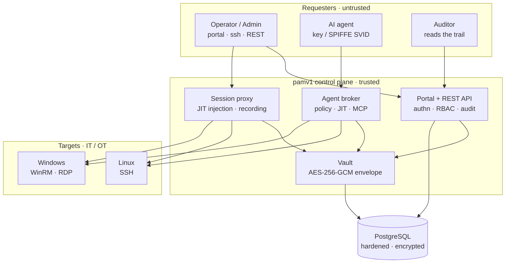
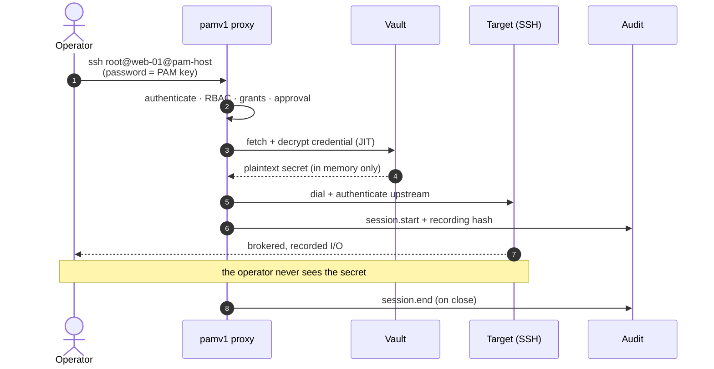

# pamv1

> ⚠️ **Beta · for learning purposes.** This is an educational project built to explore how a
> Privileged Access Management system works end to end. **Beta** means feature-complete against
> its [roadmap](ROADMAP.md) — every phase through 52g has shipped, every finding of its own
> [security self-audit](docs/SECURITY-GAPS.md) is closed, and every capability is exercised by
> tests and deploys as code. It still has **not** been audited by anyone outside the project and
> is **not** production-ready — do not use it to guard real privileged credentials. Use it to
> learn, experiment and contribute.
>
> 🟢 **Living document** — updated in the same change as the code, without a
> separate ask (the policy is in the [documentation hub](docs/README.md)).

[](https://github.com/morandeirachema/pamv1/actions/workflows/ci.yml)
[](https://github.com/morandeirachema/pamv1/releases/latest)
[](LICENSE)
[](https://go.dev/)
[](https://www.postgresql.org/)

Open-source **Privileged Access Management** (PAM) in Go. pamv1 keeps privileged
credentials in a hardened vault and then puts a **broker** between the requester and the
machine: it authenticates the requester, decrypts the secret **just-in-time**, injects it
into the connection itself, and records everything. The password reaches the target — it
never reaches the person (or, now, the **AI agent**) who asked. On top sits an
unapologetically **AS/400 / IBM 5250 green-screen console**, because touching a PAM should
*feel* serious.

> **The one idea.** *Trust the chokepoint, not the requester.* Every privileged action —
> a human SSH session, a Windows command, an AI agent's tool call — flows through one
> audited control plane that holds the secret and hands back only the result. Take away the
> credential from the requester and most of the attack surface goes with it.

<p align="center">
  
  <br><em>The management console — an AS/400 / IBM 5250 green-screen, keyboard-first (the mouse is optional).</em>
</p>

Built phase by phase with a single rule: **every phase is functional end to end** — it
runs, passes tests, and deploys as Infrastructure-as-Code. The **[roadmap](ROADMAP.md)**
runs 0–200 and **every phase has shipped**, and the current
tagged, cosign-signed release is
**[v0.54.0](https://github.com/morandeirachema/pamv1/releases/tag/v0.54.0)** (2026-08-25;
the first was v0.10.0 on 2026-07-28). What that adds up to: **JIT session
brokering** for SSH, PostgreSQL, WinRM and in-portal RDP; **RBAC + custom profiles** with
AD/Entra/OIDC login and TOTP MFA; **break-glass** with M-of-N quorum unseal; **safes** and
dependent-account propagation; **Zero Standing Privilege** via ephemeral SSH certificates;
**supervised sessions** (live watch, command control, in-session step-up, a cluster-wide
kill switch); an **AI-agent access broker** (policy over the tool *and its arguments*, JIT
server-side execution, a verifiable audit chain, MCP transport, SPIFFE identity);
**access governance** (certification campaigns, an ITSM gate, N-of-M approvals, vendor
contract grants); **privileged threat analytics** and an **identity blast-radius / CIEM
engine**; OT adaptation and NIS2 tooling; and the full **5250 console**, keyboard-first.
It is a **beta, educational** codebase — feature-complete against its roadmap and
self-audited, but unaudited by outsiders: read it, run it, learn from it, and don't trust it
with real secrets.

🔎 **Live overview:** [interactive project page](https://claude.ai/code/artifact/a1b34e5b-cd84-4fc7-8389-ebb1897495f7) — what works, architecture and roadmap at a glance &nbsp;·&nbsp; 📖 **[Léelo en español →](README.es.md)**

## Documentation

**[📚 Documentation hub](docs/README.md)** — living docs with reading paths by
audience (new / operator / admin / developer / auditor / OT). Start there, or jump to:

- **[Sysadmin Guide — how it works](docs/SYSADMIN-GUIDE.md)** — best first read: what pamv1 does, how the pieces fit, and copy-paste `curl`/`ssh` recipes. The mental model + runbook.
- **[User Guide](docs/USER-GUIDE.md)** — operators / auditors / approvers: signing in, connecting through the proxy, per-role abilities.
- **[Administrator Guide](docs/ADMIN-GUIDE.md)** — the full reference: deploy, configure (every flag), manage targets / credentials / users / roles, break-glass, logging & audit.
- **Architecture & code** — **[high level](docs/ARCHITECTURE-HIGH-LEVEL.md)**, **[low level](docs/ARCHITECTURE-LOW-LEVEL.md)** (the fullest map), **[code-derived diagrams](docs/ARCHITECTURE-DIAGRAMS.md)** (CI-enforced current), and the **[Code Guide](docs/CODE-GUIDE.md)** (narrative walkthrough — for contributors).
- **Security & ops** — **[Security Gaps](docs/SECURITY-GAPS.md)** (self-audit) · **[Protocols & Crypto](docs/PROTOCOLS-AND-CRYPTO.md)** (every protocol and cipher, and where verification is opt-in) · **[Requirements](docs/REQUIREMENTS.md)** · **[Ports & Flows](docs/PORTS-AND-FLOWS.md)** · **[Backup & Restore](docs/BACKUP-AND-RESTORE.md)** · **[External-Infra Gaps](docs/EXTERNAL-INFRA-GAPS.md)**.
- **Compliance & landscape** — **[OT Deployment](docs/OT-DEPLOYMENT.md)** · **[NIS2 Compliance](docs/NIS2-COMPLIANCE.md)** · **[Related PAM projects](docs/RELATED-PROJECTS.md)** (open-source & commercial landscape).
- **Project meta** — **[CHANGELOG.md](CHANGELOG.md)** (releases — the per-phase history stays in the roadmap) · **[CONTRIBUTING.md](CONTRIBUTING.md)** · **[SECURITY.md](SECURITY.md)** (private vulnerability reporting).

## Architecture

Requesters — human or machine — never touch the data zone or the targets directly. The
control plane brokers everything; the vault is the only thing that can turn ciphertext back
into a usable secret, and only for the length of a dial.


```mermaid
flowchart TB
    subgraph REQ[" Requesters · untrusted "]
        direction LR
        OPS["Operator / Admin<br/>portal · ssh · REST"]
        AGENT["AI agent<br/>key / SPIFFE SVID"]
        AUD["Auditor<br/>reads the trail"]
    end

    subgraph CP[" pamv1 control plane · trusted "]
        direction LR
        API["Portal + REST API<br/>authn · RBAC · audit"]
        PROXY["Session proxy<br/>JIT injection · recording"]
        BROKER["Agent broker<br/>policy · JIT · MCP"]
        VAULT["Vault<br/>AES-256-GCM envelope"]
    end

    DB[("PostgreSQL<br/>hardened · encrypted")]

    subgraph TGT[" Targets · IT / OT "]
        direction LR
        LNX["Linux<br/>SSH"]
        WIN["Windows<br/>WinRM · RDP"]
    end

    OPS --> API
    OPS --> PROXY
    AGENT --> BROKER
    AUD --> API
    API --> VAULT
    PROXY --> VAULT
    BROKER --> VAULT
    VAULT --> DB
    API --> DB
    PROXY --> LNX
    PROXY --> WIN
    BROKER --> LNX
    BROKER --> WIN
```

## How just-in-time injection works

Four moves, one guarantee: the requester is authenticated but never learns the target's
credential. The secret exists in plaintext only inside the control plane, only after every
authorization gate has passed, and only for the upstream dial.


```mermaid
sequenceDiagram
    autonumber
    actor Op as Operator
    participant PX as pamv1 proxy
    participant V as Vault
    participant T as Target (SSH)
    participant A as Audit

    Op->>PX: ssh root@web-01@pam-host<br/>(password = PAM key)
    PX->>PX: authenticate · RBAC · grants · approval
    PX->>V: fetch + decrypt credential (JIT)
    V-->>PX: plaintext secret (in memory only)
    PX->>T: dial + authenticate upstream
    PX->>A: session.start + recording hash
    T-->>Op: brokered, recorded I/O
    Note over Op,T: the operator never sees the secret
    PX->>A: session.end (on close)
```

The AI-agent broker makes the same move for a tool call: policy decides `allow / deny /
require-approval` on the tool **and its arguments**, an approved call runs server-side with a
JIT credential, and the agent receives only the result.

## What works today

Phases 0–151, grouped by area. Every capability is exercised by tests and deploys as code.

### Identity & access

- **Role-based access control + custom profiles** — four built-in roles (`admin`, `user`, `auditor`, `approver`) plus **custom permission profiles**: name any capability set (`read_inventory`, `manage_credentials`, `connect`, `reveal_secret`, `read_audit`, `approve`, …) and assign it to a user like a role. A single role/profile→capability matrix is enforced by *both* the REST API and the SSH proxy; admins mint per-user access tokens (stored only as SHA-256); every denial is audited under the real username.
- **AD, Entra ID, OIDC & SAML single sign-on** — sign in with an AD username + password over **LDAPS**, with **Microsoft Entra ID**, via **OIDC Authorization Code + PKCE SSO** (the IdP does the login and its MFA; pamv1 validates the ID token's RS256 signature against the IdP's [JWKS](https://datatracker.ietf.org/doc/html/rfc7517)), or — for IdPs with no OIDC endpoint, on-prem **AD FS** above all — via **SAML 2.0** with pamv1 as the Service Provider (SP-initiated; the signed assertion's [XML-DSig](https://www.w3.org/TR/xmldsig-core1/) is verified through a well-audited library, Phase 151). Directory groups / app roles map to the roles, and login issues a short-lived session token that works in the portal and the proxy. Sources compose; local tokens and break-glass remain the emergency path.
- **TOTP multi-factor auth** — self-service enrollment ([RFC 6238](https://datatracker.ietf.org/doc/html/rfc6238), any authenticator app); the secret is stored vault-encrypted and login requires the 6-digit code once enrolled. Single-use **recovery codes** and an optional **require-MFA-for-all** policy (with enrollment-only first sign-in).
- **Safes (delegated-access containers)** — group targets into a named **safe** with its own members; a member may connect to **every target in the safe** (an authorization path alongside per-target grants), and a `can_manage` member is a **delegated safe administrator**. Placing a target in a safe restricts it to the safe's members. `POST /api/safes`, `/api/safes/{id}/members`, `PUT /api/targets/{id}/safe`.

### Sessions & the JIT proxy

- **Session proxy with JIT injection** — operators connect through an SSH gateway; the proxy authenticates them, pulls the credential from the vault, **decrypts it only at connection time** (and only after every authorization gate passes), injects it into the upstream session and records everything. Proven end to end by an integration test where the upstream accepts *only* the vaulted password the client never possessed. Upstream host keys can be pinned (`PAM_SSH_KNOWN_HOSTS`); a jump-host/bastion path and read-only **observer** sessions are supported — and for a target pamv1 cannot dial into at all (NAT, no inbound rule), an **outbound-only endpoint agent** (`pam-agent`, Phase 153) dials out to the SSH gateway and holds a reverse tunnel the proxy brokers the same JIT-injected, recorded session through.
- **Windows targets (WinRM + RDP)** — run commands on Windows hosts via `POST /api/targets/{id}/winrm` (basic or NTLM) or an interactive WinRM loop through the proxy, or broker a full **RDP** desktop through [Apache Guacamole](https://guacamole.apache.org/) (`GET /api/targets/{id}/rdp` WebSocket tunnel, cert-verified by default). The **in-portal viewer is built in** — open *Work with Targets* → option 7 and the desktop renders on a canvas (the portal vendors the Guacamole JS client; guacd itself ships in the deploys). Either way the credential is injected just-in-time (AD-joined accounts work), sessions are audited, and the operator never sees the secret. The **session clipboard is gated** by `PAM_RDP_CLIPBOARD` (`allow`/`readonly`/`deny`, tightenable **per target** — strictest wins) and drive redirection is always disabled — so an RDP session can't be used as an unaudited copy-out/paste-in or file channel — and `PAM_RDP_CLIPBOARD_AUDIT` **records what actually crossed it** (direction, type, size, SHA-256; content only under an explicit opt-in, since a privileged clipboard often holds a just-copied password).
- **Database session proxy (SQL Server)** — the TDS sibling of the PostgreSQL broker (`PAM_MSSQL_ADDR`, e.g. `:1433`): point `sqlcmd` at pamv1 with `-U '<dbcred>@<target>'` and your PAM key as the password. Same authorization gates, the vaulted SQL login injected into the client's own LOGIN7 just-in-time, **every statement audited** — including the ones drivers send through `sp_executesql`, which a procedure-name-only parser would miss — plus recording, live monitoring, step-up and cluster-wide kill. The TDS codec is hand-rolled (no new dependency) and its tests are pinned to spec-derived byte literals; TLS is available on both legs but is **not** the default: the operator leg is encrypted only when `PAM_TLS_CERT`/`PAM_TLS_KEY` are set — until then the PAM key travels as the TDS password in cleartext — and `PAM_REQUIRE_DB_CLIENT_TLS` makes that fail closed. Proven end to end by a fake upstream that accepts *only* the vaulted secret — **interop against a real SQL Server is not yet verified**.
- **VNC desktops** — brokered through the same [Guacamole](https://guacamole.apache.org/) path as RDP and rendered in the portal (*Work with Targets* → option 7): the vaulted VNC password is injected server-side, the session is audited and recorded, and the clipboard obeys the same gate (`PAM_RDP_CLIPBOARD`, tightenable per target) while VNC's SFTP file channel is forced off. Worth knowing what VNC itself is: plaintext RFB, **no server authentication**, and a password DES-truncated to 8 characters — which is precisely the argument for brokering it rather than exposing it (see [PROTOCOLS-AND-CRYPTO §3.5](docs/PROTOCOLS-AND-CRYPTO.md)).
- **Database session proxy (PostgreSQL)** — point `psql` at pamv1 (`PAM_DB_ADDR`, e.g. `:5433`) with `user=<dbcred>@<target>` and your PAM key as the password; the proxy runs the same authorization gates as the SSH proxy, injects the vaulted DB credential just-in-time (upstream auth via cleartext / MD5 / **SCRAM-SHA-256**), and brokers the wire protocol — **auditing every SQL statement** (`db.query`) and recording the session. The operator never learns the database password. Proven end to end by a fake upstream that accepts *only* the vaulted secret.
- **Session recording** — every session (stdout **and** stderr, or each SQL statement) captured in [asciicast v2](https://docs.asciinema.org/manual/asciicast/v2/), hashed with SHA-256 into a tamper-evident chain, and the hash written to the audit trail. Recording failures are audited, and `PAM_REQUIRE_RECORDING` refuses an unrecordable session outright — on the SSH, WinRM and PostgreSQL proxies **and**, since Phase 52c, on the in-portal RDP viewer and the REST WinRM endpoint, checked *before* anything reaches the target.
- **Supervised sessions (live monitoring + command control)** — a supervisor can **watch an SSH, PostgreSQL or WinRM session live** — and the agent broker's `ssh_exec`/`winrm_exec` runs — over `GET /api/sessions/{id}/stream` (Server-Sent Events, `CapReadAudit`); the stream **ends the moment the session does**, so a quiet pane means a quiet session, not a dead one. In an HA deployment both the session **listing and the watch are cluster-wide** (Phase 55): the request can land on any replica, and the hosting replica relays a watched session's output over the store — only while someone is actually watching. A regex denylist (`PAM_COMMAND_DENY_FILE`) **blocks a dangerous command before it reaches the target** on the exec, WinRM and SQL paths — refused and audited (`command.blocked`). A deny file that yields no usable patterns is **fatal at startup** rather than a silently disabled control, so an unmounted ConfigMap fails loudly. Interactive SSH shells use read-only observer mode instead.
- **In-session step-up** — where command control is a hard block, `PAM_DB_STEPUP_FILE` marks statements that **pause for a live supervisor decision** instead of killing the session: the statement waits (audited, visible on the live monitor), an approver allows or refuses it from the console, and the session survives either way.
- **Cluster-wide kill switch** — a kill issued on any replica terminates the session **wherever it is hosted** (published over Postgres LISTEN/NOTIFY), so the kill switch, the revoke cascade, the vendor sweeper and the analytics auto-response all work in HA. Every brokered execution — the REST WinRM endpoint and the agent broker's exec tools included — is a registered, killable, capped session, not just the interactive proxies.
- **SFTP file-transfer control** — SFTP rides an SSH subsystem carrying a binary protocol that command control never saw. The proxy now **parses that stream** to audit every file operation (`sftp.open`/`sftp.modify`), and `PAM_SSH_SFTP` sets the policy: `allow` (forward + audit), `readonly` (**refuse uploads, deletes and renames** with a synthesized permission-denied — the target is never contacted; downloads still work), or `deny` (refuse the subsystem entirely). `PAM_SSH_SFTP_DENY_FILE` adds the other dimension — a **regex denylist over paths** (the same engine as command control), refused in *every* mode including downloads and on both sides of a rename (the classic packet *and* the OpenSSH `SSH_FXP_EXTENDED` operations a modern client actually sends — `posix-rename`, `hardlink`, `lsetstat`), because a path you deny that can still be fetched is not denied at all. And with `PAM_SSH_SFTP_CAPTURE`, the **content itself is recorded** (Phase 59): every transferred file leaves a chunk-log artifact beside the session recordings — sealed under the vault KEK, SHA-256 hash-chained, attributed in the audit trail, and replayable from the console as the reconstructed bytes; a per-file cap refuses (not merely stops recording) anything larger, and an unparsable stream fails closed while capture is on. Closes an otherwise unaudited file-exfiltration path. Proven end to end by a real SFTP client + server exchanging genuine packets through the proxy.

### Vault & credential lifecycle

- **Hardened vault (envelope encryption)** — each secret is sealed with a per-secret [AES-256-GCM](https://pkg.go.dev/crypto/cipher) data key that is wrapped by a **pluggable Key Encryption Key (KEK)**: a `local` key for dev/test, or in production **[HashiCorp Vault Transit](https://developer.hashicorp.com/vault/docs/secrets/transit)**, **[AWS KMS](https://aws.amazon.com/kms/)**, or an on-prem **HSM via [PKCS#11](https://en.wikipedia.org/wiki/PKCS_11)** (`pkcs11`-tagged build) — the root key never leaves the KMS/HSM. Additional Authenticated Data binds each ciphertext to its owning target (a copied token fails to decrypt); versioned `v2:` tokens enable online KEK rotation.
- **Target inventory & credentials API** — Linux/Windows machines with ssh/winrm/rdp endpoints; credentials are vaulted, listed (never returning secret material), revealed on demand (audited), and deleted. The JSON model *cannot* serialize the ciphertext (`json:"-"`).
- **Credential lifecycle (rotation · reconciliation · checkout · discovery)** — `POST /api/credentials/{id}/rotate` generates a strong secret, sets it **on the target** (SSH `chpasswd` / WinRM `net user` / fresh `ssh_key`), and re-vaults it — the new password is never shown. `/reconcile` verifies the vaulted secret still authenticates and flags **out-of-sync drift** (`?remediate=true` heals it). **Checkout/check-in** grants an exclusive time-boxed lease and rotates the secret on return. **Discovery** (`/api/discovery/scan`) probes hosts for SSH/WinRM/RDP ports and can auto-onboard targets. A background worker rotates aged secrets and reconciles on a schedule; secrets can be rotated the moment a proxied session ends. **Dependent accounts** — declare a credential's consumers (Windows Services / Scheduled Tasks / IIS App Pools) and rotation updates each over WinRM, so rotating a service account doesn't break production.

- **Zero Standing Privilege & operator certificates** — an `ssh_ca` credential stores **no secret at all**: the proxy mints a short-lived SSH certificate just-in-time per session. Operators can also prove possession of their own key and receive a short-lived certificate scoped to one principal and source address, revocable by serial through a published **KRL**. The host and CA keys are held in **shared custody** (vault-encrypted in the database, claimed atomically), so scaling past one replica no longer hands operators a different host key per pod.

### Audit, break-glass & alerting

- **Audit trail** — an append-only record of every sensitive action, with actor attribution, plus a tamper-evident export (`GET /api/audit/export`, JSON/CSV + SHA-256 digest) for incident reporting.
- **Operational logs** — structured [slog](https://pkg.go.dev/log/slog) to stdout, one line per HTTP request and per proxy session, tagged by service (`server`/`api`/`proxy`/`store`); JSON for a SIEM or text for humans (`PAM_LOG_LEVEL`, `PAM_LOG_FORMAT`). Separate from the audit trail; secrets are never logged.
- **Tamper-evident audit chain** — set `PAM_AUDIT_HMAC_KEY` and every audit event is HMAC-linked to the previous one, so an edit, a reorder or a deletion is detectable (`GET /api/audit/verify`); an ed25519-**signed head checkpoint** (`/api/audit/head`), archived out-of-band, also catches tail truncation, which a chain alone cannot.
- **Continuous audit→SIEM forwarding** — every event streamed to a collector as it is written (`PAM_AUDIT_FORWARD_ADDR`) in **RFC 5424 syslog, ArcSight CEF or IBM QRadar LEEF**, over UDP, TCP or **TLS with always-on certificate verification** — from a durable cursor with spool-and-retry, leader-locked so N replicas produce one stream. Plus a pull-based **[OCSF](https://schema.ocsf.io/) export** for schema-normalized SIEM ingest.
- **Retention with WORM archiving** — aged recordings and audit rows are swept on a schedule, and with `PAM_RETENTION_ARCHIVE_DIR` set the sweep becomes **archive-then-prune**: rows are exported as digest-stamped JSON Lines and recordings are *moved* into a write-once archive, and the delete runs **only if the archive succeeded** — a broken archive costs disk space, never evidence.
- **Recordings protected at rest** — `PAM_RECORDING_ENCRYPT` seals each recording as chunked AES-256-GCM under a per-recording key wrapped by the same KEK that protects credentials, and `PAM_RECORDING_OPAQUE_NAMES` strips target and actor from the *file name* too (the mapping moves into the audit trail, behind the same capability as replay).
- **Break-glass (v2)** — a sealed emergency key, or **M-of-N quorum unseal** ([Shamir shares](https://en.wikipedia.org/wiki/Shamir%27s_secret_sharing) split with `-split-key`; custodians POST shares to reconstruct it). Either way you get a **short-lived, auto-expiring** admin session, and every break-glass access/unseal is loudly audited and **alerted in real time** (webhook, syslog or email).

### Configuration & the management console

- **AS/400 management console** — a full role-aware console in green phosphor: Sign On, a numbered main menu, and menu-driven `Work with…` screens for targets & grants, credentials (reveal/check-out/rotate/reconcile), active sessions (live monitor + kill + a **live watch pane**), 4-eyes access requests (ticket, N-of-M approvals, scheduled windows), users & profiles, MFA, discovery, reconciliation, audit (filter + CSV export), break-glass, **permission profiles**, **system configuration**, **effective config + IaC export**, **application secrets**, **safes**, **certification campaigns**, **risk analytics**, **session-recording replay**, the two human decision points (**approve an agent's parked tool call** · **decide a paused statement**), **vendors & contract grants**, **operator SSH certificates**, **identity blast radius**, **login sessions**, **AI-agent keys** and **delegated agent tokens (RFC 8693)** — numeric options (`2=Change`, `4=Delete`, `5=Display`), F-keys, scanlines. Every shipped capability is operable from the console; nothing is curl-only. It is **keyboard-first** (the mouse is optional): focus lands on each screen's field, `Esc` goes back, `↑/↓` move between rows. The menu shows only what your role permits.

<p align="center">
  
  <br><em>Menu 15 — Work with application secrets</em>: mint app identities and grant them individual credentials (Tier-4).</em>
</p>

- **Hot-swappable configuration** — the identity, SSO and operational-policy settings become editable settings **persisted in the database** and **applied live without a restart** (secrets vault-encrypted at rest, a rejected change rolled back). A read-only effective-config + backend-health screen and an **IaC export** (`env` / Helm / Terraform) round-trip console changes back into code. Bootstrap and networking/TLS deliberately stay environment-only.

### The AI-agent access broker

PAM for AI agents — the same chokepoint, extended to autonomous tools. Opt-in via
`PAM_BROKER_POLICY_FILE`.

- **Policy over tool + arguments** — a sudoers-style [YAML](https://yaml.org/) engine decides `allow / deny / require-approval` on the tool **and its arguments** (first match wins, implicit deny); an approved call runs **server-side with a just-in-time credential** and the agent gets only the result. Tools: `winrm_exec`, `ssh_exec`, `list_targets`, `list_credentials`, `rotate_credential`, and `reveal_credential` (shipped **default-deny**). Agents obey the same target grants and four-eyes gate as humans.
- **Human approval + single-use resume** — a `require_approval` call parks for a human decision (`/v1/approvals`); on approval it executes and the agent collects the result **exactly once** with a single-use token.
- **Verifiable audit** — every step is a keyed-**HMAC hash-chained** event (`GET /v1/audit/verify`, plus an ed25519-signed head checkpoint for truncation detection) kept separate from the general trail. The chain's own keys live under **shared custody** — generated once, KEK-sealed in the store, converged on by every replica, re-wrapped by `-rotate-kek` — unless you set them explicitly in the environment, which is also how a signer rotation is driven.
- **MCP transport + SPIFFE identity** — the broker speaks **[MCP](https://modelcontextprotocol.io/)** (JSON-RPC 2.0 at `POST /mcp`) at parity with REST, and agents authenticate with a static key or a **[SPIFFE](https://spiffe.io/) JWT-SVID** (RS256/ES256/EdDSA, trust-domain JWKS) with [RFC 8693](https://datatracker.ietf.org/doc/html/rfc8693) delegation chains bounded by a depth cap.

### OT / industrial & compliance

- **OT session approval (4-eyes)** — gate a target behind an **approved access request**: a user files it, a *different* approver approves (self-approval refused), and only then may the user connect — enforced on the SSH proxy, WinRM **and** RDP, with break-glass as the bypass. Per-target (`require_approval`) or global (`PAM_REQUIRE_APPROVAL`), time-boxed for maintenance windows. A request can also require a **change ticket**: format + webhook validation (Phase 20), re-checked at the moment access is used (`PAM_TICKET_REVALIDATE`, Phase 60), and — since Phase 84 — validated **first-class against [ServiceNow](https://www.servicenow.com/) or [Jira](https://www.atlassian.com/software/jira)**: the ticket's state, its change window, and that it **names the operator**, none of which a 2xx webhook could express.
- **Third-party vendor access gate** — a vendor reaches a target only inside a **time-boxed contract grant** a *customer* approved (never the vendor), with live employment attestation; an offboard revokes every grant and cuts live sessions instantly, a sweeper ends sessions the moment the window closes, and per-vendor evidence exports carry a SHA-256 digest.
- **Access certification with real separation of duties** — periodic campaigns snapshot who has access to what; a dedicated `approver` certifies or revokes each item **without** holding any access-granting capability, and the principal who *created* a grant cannot certify it themselves (revoking your own grant stays allowed — it only reduces access). Campaigns can be **scoped** (by safe or subject) and **scheduled/recurring**, items carry a per-item **reviewer assignment**, and reviewers are **nudged before a campaign lapses** (Phases 68–70).
- **Identity blast radius (CIEM)** — a read-only AWS IAM effective-permission evaluator over a normalized identity graph: escalation-path traversal, toxic-combination findings, and remediation-as-code that names the earliest edge to cut.
- **Privileged threat analytics** — an explainable behavioral risk scorer over the audit trail (named signals, per-signal caps, re-alert cooldown), **history-aware** since Phase 86: a baseline built from the window preceding the scored one powers a **new-target novelty** signal that stays silent without history (a new joiner is not an anomaly) and a **peer-outlier** signal measured against the group median. The automated response acts only on the actor's own activity and has two rungs: **revoke logins** so the next action re-authenticates (`PAM_ANALYTICS_AUTO_STEPUP`) and **kill live sessions** (`PAM_ANALYTICS_AUTO_KILL`).
- **OT hardening** — per-zone **protocol allowlists** (`PAM_ALLOWED_PROTOCOLS`), read-only **observer** sessions, and an **air-gap mode** (`PAM_OT_AIRGAP`) that makes zero outbound calls. See the [OT Deployment Guide](docs/OT-DEPLOYMENT.md) and the [NIS2 Compliance Pack](docs/NIS2-COMPLIANCE.md).

### Storage & operations

- **PostgreSQL storage** via [pgx](https://github.com/jackc/pgx) with embedded, versioned migrations; an in-memory store for tests and demos; optional **[CloudNativePG](https://cloudnative-pg.io/) HA**.
- **Observability** — a dependency-free [Prometheus](https://prometheus.io/) `/metrics` endpoint (request counts by status, audit volume, break-glass use, rotations, active-sessions gauge), plus a health/readiness split (`/healthz` liveness, `/readyz` checks the database).
- **IaC deployment** — [Docker](https://docs.docker.com/) (distroless, non-root), [docker-compose](https://docs.docker.com/compose/) with hardened Postgres, [Kubernetes](https://kubernetes.io/) manifests under the restricted Pod Security Standard, a **[Helm chart](deploy/helm/pamv1)**, and a [Terraform](https://developer.hashicorp.com/terraform) module. The release pipeline builds by digest with an **[SBOM](https://www.cisa.gov/sbom), [cosign](https://docs.sigstore.dev/) keyless signature and SLSA provenance** — see [Verifying a release](#verifying-a-release). *Current release: **[v0.54.0](https://github.com/morandeirachema/pamv1/releases/tag/v0.54.0)** (2026-08-25; first was v0.10.0) — the signed image is public at `ghcr.io/morandeirachema/pamv1:0.54.0`, which is what every manifest here pins, so the published-artifact paths below work.*
- **Encrypted secrets in git** — the Kubernetes secret manifest can be sealed with **[SOPS](https://github.com/getsops/sops) + [age](https://age-encryption.org/)**: values are encrypted while `kind`/`metadata` stay reviewable, decrypted at deploy time (`sops -d | kubectl apply -f -`, plaintext never on disk) or natively by Flux / Argo / helm-secrets — so secrets live in the **same IaC repo** without leaking. See **[deploy/k8s/sops/](deploy/k8s/sops/)**.
- **Or source secrets from CyberArk Conjur** — as a runtime alternative to SOPS, set `PAM_CONJUR_URL` and pamv1 fetches its own bootstrap secrets (master key, API key, DB URL, …) from **[Conjur](https://www.conjur.org/)** at startup, authenticating with a host API key or a **Kubernetes `authn-jwt`** projected token — so no bootstrap secret lives in Git at all. With `PAM_CONJUR_REFRESH_MIN` (Phase 78), the secrets that can honestly change on a running server (`PAM_API_KEY`, `PAM_BREAK_GLASS_KEY_HASH`) are **re-read periodically without a restart**; the KEK, database URL and audit-chain keys stay pinned to a restart by design. Both mechanisms ship; SOPS stays the zero-dependency default. See **[deploy/k8s/conjur/](deploy/k8s/conjur/)**.

## Roles, users & profiles

Four built-in roles, enforced identically by the API and the proxy, plus custom profiles:

| Role | Can | Cannot |
|---|---|---|
| `admin` | manage targets/credentials/users, reveal secrets, connect, read audit, manage config/profiles | — |
| `user` | connect to targets through the proxy, read the inventory | manage, reveal, read audit |
| `auditor` | read the inventory and the audit trail | manage, reveal, connect |
| `approver` | read inventory + audit, approve access requests | manage, reveal, connect |

Need something in between? Define a **custom profile** — a named capability set — and assign
it like a role (menu 12, or `POST /api/profiles`). The four built-ins stay unchanged.

An admin creates a user and receives that user's access token **once**:

```bash
curl -H "X-API-Key: $PAM_API_KEY" -X POST http://localhost:8080/api/users \
  -d '{"username":"alice","role":"user"}'
# → {"id":1,"username":"alice","role":"user","token":"pamt_…"}   (store it now)
```

The user then presents that token as `X-API-Key` (portal Sign On) or as the SSH proxy
password. The bootstrap `PAM_API_KEY` is the `admin` identity; the break-glass key is also
`admin` (audited loudly). For directory-backed sign-in, AD/Entra/OIDC map directory groups to
these same roles.

## Connect through the proxy (JIT injection)

Once a target and its credential are vaulted, operators reach the target **through** pamv1 —
the secret is decrypted only for the upstream dial and is never shown:

```bash
# username selects the target; SSH password is your PAM API key (or per-user token)
ssh -p 2222 web-01@pam-host                 # first credential of target "web-01"
ssh -p 2222 root@web-01@pam-host            # a specific credential (user "root")
```

The proxy authenticates you, pulls `root`'s password from the vault, injects it into the
upstream SSH connection, records the session (asciicast v2) with a SHA-256 in the audit trail,
and proxies your I/O. You never see the credential. Recordings go to `PAM_RECORDING_DIR`;
disable the proxy with `PAM_SSH_ADDR=off`.

## Roadmap

Every phase (0–94) has shipped — full per-phase detail in **[ROADMAP.md](ROADMAP.md)**:

| Phase | Theme | Status |
|---|---|---|
| 0 | Project foundation | ✅ shipped |
| 1 | Core: vault, inventory, audit, portal | ✅ shipped |
| 2 | SSH session proxy with JIT injection | ✅ shipped |
| 3 | Identity & access control (RBAC, AD/Entra/OIDC/SAML, MFA) | ✅ shipped |
| 4 | Windows targets (WinRM + RDP via Guacamole) | ✅ shipped |
| 5 | Hardening: database, vault, transport | ✅ shipped |
| 6 | Break-glass v2 (M-of-N quorum) | ✅ shipped |
| 7 | Credential lifecycle (rotation, reconciliation) | ✅ shipped |
| 8 | OT adaptation (4-eyes approvals, air-gap) | ✅ shipped |
| 9 | NIS2 compliance pack | ✅ shipped |
| 10 | Scale & operations (metrics, Helm, HA, signed releases) | ✅ shipped |
| 11 | Full 5250 management console | ✅ shipped |
| 12 | Configuration subsystem + custom-profile RBAC + hot-swap | ✅ shipped |
| 13 | AI-agent access broker (policy, JIT tools, verifiable audit, MCP, SPIFFE) | ✅ shipped |
| 14 | SOPS-encrypted Kubernetes secrets (age; Flux/Argo/helm-secrets) | ✅ shipped |
| 15 | PostgreSQL database session proxy (JIT injection + query audit) | ✅ shipped |
| 16 | Live session monitoring (SSE) + command control | ✅ shipped |
| 17 | Safes (delegated-access containers) + dependent-account propagation | ✅ shipped |
| 18 | CyberArk Conjur secret sourcing (optional, alongside SOPS) | ✅ shipped |
| 19 | Access certification / attestation campaigns | ✅ shipped |
| 20 | ITSM / ticketing gate on access requests | ✅ shipped |
| 21 | Richer approval workflows (N-of-M, scheduled windows, reason codes) | ✅ shipped |
| 22 | Zero Standing Privilege (ephemeral short-lived SSH certificates) | ✅ shipped |
| 23 | Privileged threat analytics (behavioral risk scoring + auto-response) | ✅ shipped |
| 24 | Application-secrets API (Conjur-style delivery for non-agent apps) | ✅ shipped |
| 25 | Console parity (safes, campaigns, risk analytics, live session viewer) | ✅ shipped |
| 26 | Session-recording playback (hash-verified replay) + one-time access | ✅ shipped |
| 27 | AI-agent broker completion (SoD, signed audit checkpoints, OCSF export, MCP SSE + elicitation) | ✅ shipped |
| 28 | Operator-issued SSH certificates (JIT certs for humans, KRL revocation) | ✅ shipped |
| 29 | Third-party vendor access gate (time-boxed contract grants, employment attestation, offboard cascade) | ✅ shipped |
| 30 | In-session policy + step-up (numeric policy comparators, pause-for-supervisor on the DB proxy) | ✅ shipped |
| 31 | Identity blast-radius / CIEM engine (AWS IAM effective-permission evaluator + escalation paths) | ✅ shipped |
| 32 | SFTP file-transfer control + audit (parse the subsystem stream; allow/readonly/deny) | ✅ shipped |
| 33 | RDP clipboard control (gate the Guacamole clipboard bridge; drive redirection off) | ✅ shipped |
| 34 | HA session kill-switch (cross-replica kill over Postgres LISTEN/NOTIFY) | ✅ shipped |
| 35 | Audit→SIEM push forwarding (continuous RFC 5424 syslog / CEF stream) | ✅ shipped |
| 36 | Retention / pruning (aged recordings + audit rows; integrity-preserving) | ✅ shipped |
| 37 | Gap-analysis pass (child-resource deletes scoped to their parent; failed bearer credentials throttled + audited on every surface) | ✅ shipped |
| 38 | Command control on every command path (one shared `cmdguard`; the REST WinRM endpoint and the broker's exec tools now obey the denylist) | ✅ shipped |
| 39 | Approver capability on the two decision points (step-up release and certification decisions move to `approve`) | ✅ shipped |
| 40 | Every brokered execution is a supervised session (REST WinRM + agent exec tools join the live-session registry) | ✅ shipped |
| 41 | Session recordings encrypted at rest (chunked AES-256-GCM under the vault KEK; tamper evidence unchanged) | ✅ shipped |
| 42 | Shared custody of the SSH host and CA keys in HA (atomic claim in the store; replicas converge on one key) | ✅ shipped |
| 43 | Console: the two human decision points (approve an agent's parked tool call · decide a paused statement) | ✅ shipped |
| 44 | Editable objects and bounded lists (`PUT` edit-in-place; every inventory list is a clamped `?limit=&after=` cursor) | ✅ shipped |
| 45 | The remaining console screens (vendors, operator certs, blast radius, login sessions, agent keys, dependents, audit chain) | ✅ shipped |
| 46 | Per-item four-eyes on certification (grants record their creator; you cannot certify access you granted) | ✅ shipped |
| 47 | LEEF format + TLS transport for the SIEM forwarder (RFC 5425, always-on certificate verification) | ✅ shipped |
| 48 | Opaque recording file names (metadata moves from the filename into the audit trail) | ✅ shipped |
| 49 | Archive to WORM before pruning (digest-stamped export; the delete runs only if the archive succeeded) | ✅ shipped |
| 50 | Clipboard auditing on the RDP bridge (direction, type, size, digest; content opt-in) | ✅ shipped |
| 51 | SFTP path policy (regex denylist over paths, refused in every mode and on both sides of a rename) | ✅ shipped |
| 52 | Close the command-injection findings (credential dependencies; the `net user` blocklist → allowlist) | ✅ shipped |
| 52a | Make `-rotate-kek` whole (re-wraps key custody; sealed recordings documented rather than broken) | ✅ shipped |
| 52b | The two same-day regressions, and the store-contract gap that hid one | ✅ shipped |
| 52c | Authorization-gate consistency (six gates that did not match their peers) | ✅ shipped |
| 52d | Lifetimes, deadlines and fail-open defaults | ✅ shipped |
| 52e | Audit-trail integrity, archiving, and two concurrency bugs | ✅ shipped |
| 52f | The archive high-water mark, made robust — found by reviewing 52e | ✅ shipped |
| 52g | Six more, found by reviewing all of the above — including a test that could not fail | ✅ shipped |
| 53 | SQL Server (TDS) session proxy (JIT injection + per-statement audit) | ✅ shipped |
| 54 | VNC connector (guacd-brokered, in-portal viewer, shared gates with RDP) | ✅ shipped |
| 55 | Cross-replica live monitoring (cluster-wide session listing + SSE watch over an interest-gated store relay) | ✅ shipped |
| 56 | Cross-replica step-up decisions (cluster-wide pending list, sealed at rest; the decision dispatched to the hosting replica) | ✅ shipped |
| 57 | RFC 8693 token-exchange minting + remediation as Terraform (the broker issues delegated SVIDs; the CIEM cut renders as HCL) | ✅ shipped |
| 58 | Safe-scoped policy (a safe carries `require_approval` + a dual-control floor, strictest-wins at all five gates) | ✅ shipped |
| 59 | SFTP per-file content recording (sealed, hash-chained chunk-log artifacts; replayable; cap doubles as a size limit) | ✅ shipped |
| 59a | Close the review of 59 (three capture bypasses, artifact-name containment, `lsetstat`, audit-field forgery, a reachable panic) | ✅ shipped |
| 60 | The ticket gate holds at connect time (the change ticket is re-checked when access is used, at all five gates) | ✅ shipped |
| 61 | A dependent account names the credential that manages it (propagation stops logging in as the account it rotates) | ✅ shipped |

The table stops at 61 to stay readable; **phases 62–94 shipped just as
completely** (each has its own section in [ROADMAP.md](ROADMAP.md)): the first
release wave and its reviews (62–66), the token-exchange console screen (67),
certification-campaign depth — scoping, scheduling, per-item reviewers,
reminders (68–70), a console safety net (71), the store recomposed on role
interfaces (72), honest CI coverage (73), database-proxy policy parity pinned
by a drift gate (74), an `internal/api` decomposition (75), one shared audit
sanitiser + strict input validation (76–77), bootstrap secrets refreshable at
runtime (78), working GitOps deploy examples and the quickstart bug they
uncovered (79–80), an end-to-end "prove it is a PAM" CI job (81–82),
first-class ServiceNow/Jira ticket connectors (84), history-aware analytics
with a revoke-logins response rung (86–87), the open-findings backlog closed
(89), and an adversarial review of the crown jewels (91–93) that fixed one
SFTP read-only containment gap and confirmed the vault, database proxies and
broker four-eyes sound — released steadily as **v0.10.0 → v0.54.0**. Releases
are recorded in **[CHANGELOG.md](CHANGELOG.md)**; the honest remainder lives in
**[ROADMAP.md → What is left](ROADMAP.md#what-is-left-)**.

## Coverage vs. commercial PAM (CyberArk, Wallix, …)

pamv1 is an **educational, beta** project — not a drop-in replacement for
[CyberArk](https://www.cyberark.com/products/privileged-access-manager/),
[Wallix Bastion](https://www.wallix.com/privileged-access-management/),
[BeyondTrust](https://www.beyondtrust.com/),
[Delinea](https://delinea.com/products/secret-server),
[Teleport](https://goteleport.com/) or [StrongDM](https://www.strongdm.com/). On the
**core session/credential loop** it is already at parity — a JIT-injection proxy
(SSH/WinRM/RDP), tamper-evident hash-chained recordings, rotation + reconciliation +
checkout leases, M-of-N break-glass, RBAC + AD/Entra/OIDC + MFA, and a verifiable
audit chain — and its **AI-agent access broker** (policy over the tool *and its
arguments*, MCP transport, SPIFFE identity) is ahead of most incumbents.

The gaps below are about **breadth and governance**. Each notes how it fits pamv1's
existing chokepoint architecture, and they map to candidate future phases.

### Tier 1 — structural / connector gaps

| Gap | What the leaders do | pamv1 today | Fit |
|---|---|---|---|
| ~~**Safe / vault containers** with delegated ownership~~ **✅ shipped (Phase 17)** | CyberArk's whole authorization model is [Safes](https://docs.cyberark.com/pam-self-hosted/latest/en/content/pasref/safes-and-safe-members.htm) — credential containers with their own members, workflows & delegated admin; Wallix uses target domains | **safes** group targets with delegated `can_manage` members; a member reaches every target in the safe (`EffectiveTargetGrants`) | done — per-safe approval workflows are a follow-on |
| ~~**Database session proxy** with query-level audit~~ **✅ shipped (Phases 15 + 53: PostgreSQL, SQL Server)** | [Teleport](https://goteleport.com/docs/enroll-resources/database-access/), [StrongDM](https://www.strongdm.com/), CyberArk & Wallix broker native Postgres/MySQL/MSSQL/Oracle with per-query audit + JIT injection | **PostgreSQL and SQL Server brokered** (`PAM_DB_ADDR`, `PAM_MSSQL_ADDR`): JIT injection, `db.query` audit per statement, command control that sees through `sp_executesql`. MySQL/Oracle still to come | done for Postgres + SQL Server (Phase 53); the same listener pattern generalizes to the remaining wire protocols |
| ~~**Live monitoring + command control**~~ **✅ shipped (Phase 16)** | [CyberArk PSM](https://www.cyberark.com/products/privileged-session-manager/) & Wallix let a supervisor watch a live session, block a dangerous command mid-stream (`rm -rf /`, `DROP TABLE`) and terminate it interactively | **live SSE stream** (`GET /api/sessions/{id}/stream`) + **command control** (regex denylist blocks exec/WinRM/SQL, `command.blocked`); interactive kill already existed. **SFTP file-transfer control** shipped (Phase 32): the proxy parses the SFTP subsystem to audit + optionally block file operations (`PAM_SSH_SFTP`) | done — interactive-shell (PTY) filtering is the remaining follow-on (SFTP and the in-portal RDP viewer have since shipped) |
| ~~**Dependent-account propagation** on rotation~~ **✅ shipped (Phase 17)** | CyberArk CPM updates every [consumer](https://docs.cyberark.com/pam-self-hosted/latest/en/content/pasimp/managing-service-accounts-service.htm) of a rotated service account (Windows Services, Scheduled Tasks, IIS App Pools, COM+) | rotation now updates declared **Windows Services / Scheduled Tasks / IIS App Pools** over WinRM with the new secret | done — COM+ and a per-consumer management credential are follow-ons |

### Tier 2 — access-governance depth

- ~~**Access certification / attestation campaigns**~~ **✅ shipped (Phase 19)** — a campaign snapshots current access (target grants + safe members); a reviewer certifies or revokes each item, and a revoke deletes the underlying grant (`POST /api/campaigns`). The SOX / ISO 27001 / NIS2 access-review control.
- ~~**ITSM / ticketing gate**~~ **✅ shipped (Phase 20)** — an access request can require a change/incident ticket, validated by a format regex and/or a webhook the ITSM answers `2xx` for a valid ticket (`PAM_REQUIRE_TICKET`), then stamped into the audit trail.
- ~~**Richer approval workflows**~~ **✅ shipped (Phase 21)** — multi-tier **N-of-M** chains (`PAM_APPROVALS_REQUIRED`), **scheduled** access windows (`not_before`/`not_after`), and mandatory reason codes. *(One-time single-use access shipped in Phase 26: a single-use approval is consumed by the first connection it admits, in every gate.)*

**All three Tier-2 access-governance gaps are now closed.**

### Tier 3 — where the market is moving

| Gap | Leaders | pamv1 today |
|---|---|---|
| ~~**Zero Standing Privilege**~~ **✅ shipped (Phase 22)** — ephemeral short-lived SSH certificates instead of a stored standing secret | [CyberArk ZSP](https://www.cyberark.com/what-is/zero-standing-privileges/), Teleport | an `ssh_ca` credential stores **no secret**; the proxy mints a short-lived cert (`PAM_SSH_CA_KEY`) signed by the pamv1 CA per session — the account has no standing credential |
| ~~**Privileged threat analytics**~~ **✅ shipped (Phase 23)** — behavioural risk scoring + automated response | CyberArk PTA, Wallix | `internal/analytics` scores the audit trail into explainable per-actor risk (`GET /api/analytics/risk`); a worker alerts on and can auto-kill a critical actor's sessions |
| **Connector / plugin breadth** — network devices (Cisco/Juniper/F5/Palo Alto), database accounts, cloud IAM, VMware/SAP/mainframe | CyberArk's core moat | SSH (incl. network devices) / WinRM / PostgreSQL / ssh_key rotation — **needs real devices/DBs** to extend honestly |
| ~~**Cloud CIEM (identity blast-radius)**~~ **✅ engine shipped (Phase 31)** — effective-permission analysis + escalation-path detection | CyberArk, Wallix, Sonrai/Wiz | `internal/blast` is a real **AWS IAM effective-permission evaluator** + blast-radius traversal, toxic-combination findings and remediation-as-code over a normalized identity graph (`POST /api/blast/analyze`). The **engine** is complete and tested; only **live cloud ingestion** (boto3/Okta/GitHub) needs an account and stays external. (Short-lived cloud-credential *brokering* — the CIEM-lite mint path — remains the cloud-account-bound part) |
| **Web / SaaS session proxying** — record + inject into web admin consoles | CyberArk Secure Web Sessions, Wallix | SSH/WinRM/RDP only (the heaviest lift; **needs a browser + SaaS console**) |

Three of the five Tier-3 gaps are closed (Zero Standing Privilege, threat
analytics, and the cloud-CIEM blast-radius **engine**); connector breadth and web/SaaS
proxying — plus **live** CIEM ingestion and short-lived cloud-credential brokering —
each still require external infrastructure or an account to build and verify honestly,
catalogued in **[docs/EXTERNAL-INFRA-GAPS.md](docs/EXTERNAL-INFRA-GAPS.md)**.

### Tier 4 — ecosystem

- ~~**Application-secrets API for non-agent apps**~~ **✅ shipped (Phase 24)** — a
  [Conjur](https://www.conjur.org/)-style path (`PAM_APP_SECRETS_ENABLED`) where an
  application retrieves the specific secrets it was **explicitly granted** with a
  bearer key (`GET /v1/app-secrets/{credential_id}`); default-deny, granting needs
  `reveal_secret`, every retrieval audited.
- Remaining (external-infra/account-bound): a
  [Terraform **provider**](https://developer.hashicorp.com/terraform) for pamv1 objects
  (a separate module + the Terraform Registry) ·
  [Secrets Hub](https://www.cyberark.com/products/secrets-hub/)-style sync-out to AWS
  Secrets Manager / Azure Key Vault (a cloud account) · SSH-key fleet discovery at
  scale (a real host fleet) · thick-app connection components (auto-login into SSMS /
  Toad / vSphere via RDP RemoteApp — Windows RemoteApp hosts). See
  [docs/EXTERNAL-INFRA-GAPS.md](docs/EXTERNAL-INFRA-GAPS.md).

### Tier 5 — audit & session depth (2026-08-12 gap research)

Two independent research passes against CyberArk PAM and Wallix Bastion — each
fact-checked against this repo before being reported, not taken from marketing
copy — converged separately on the same top finding. Buildable-without-infra
items only; each notes what closing it would take.

| Gap | Leaders | pamv1 today |
|---|---|---|
| ~~**Searchable session recordings**~~ **✅ shipped (Phase 110)** | CyberArk OCR/text-indexes PSM recordings; Wallix does the same for its DVR-style capture — neither leaves an auditor scrubbing a session to find something | `GET /api/recordings/search?q=` reconstructs an SSH recording's output stream (a query can span more than one recorded write, since a terminal echoes in whatever chunks arrive) and returns each hit's snippet **and the playback time to seek to**. RDP/VNC (no text layer) and WinRM (plain text, but deferred) are not yet covered |
| ~~**Real compliance reporting**~~ **✅ shipped (Phase 114, NIS2 only)** | Canned, control-mapped reports (PCI-DSS/ISO27001/NIS2/SOX-shaped), not just raw exports | `GET /api/compliance/nis2?since=&until=` maps window-scoped audit activity onto the existing Art. 21(2) matrix: status is architectural, controls with a natural signal (supply-chain, policy effectiveness, access control, MFA, incident handling) carry a live event count by action family. Same digest/audit conventions as the raw export. Only NIS2 — PCI-DSS/ISO27001/SOX would each need their own control taxonomy authored from scratch, not attempted here |
| ~~**Mandatory live-supervision gate**~~ **✅ shipped (Phase 112, SSH)** | A session can be required to have an **actively-connected** supervisor before it proceeds, not just after-the-fact watching | `PAM_REQUIRE_LIVE_SUPERVISION` holds an interactive channel — before the upstream channel opens — until a supervisor is watching (polled against the Phase 55 cross-replica hub) or `PAM_LIVE_SUPERVISION_TIMEOUT_SEC` refuses it. Observer sessions and break-glass are exempt. PostgreSQL/SQL Server use the different per-statement step-up mechanism for the same concern; extending this gate to them needs a structural change (session registration happens after the credential already dials the target), deferred |
| ~~**FIDO2/WebAuthn MFA**~~ **✅ shipped (Phase 124)** | Passwordless hardware-key second factor alongside TOTP/push | A second, independent MFA factor to TOTP — either alone satisfies MFA. Verified by `github.com/go-webauthn/webauthn` rather than hand-rolled (a subtle CBOR/COSE/signature bug here is a real auth bypass, the same risk class as hand-rolling AES-GCM). A user with no confirmed TOTP gets a narrow, 5-minute `MFAPending` session on password success — good for nothing but the two-call WebAuthn ceremony — closing the naive "challenge for this username" enumeration trap. A user may register more than one key |
| ~~**Authenticated post-login discovery**~~ **✅ shipped (Phase 128)** | Enumerate local/service accounts and flag credential exposure on hosts already reached (CyberArk DNA) | `POST /api/targets/{id}/discover-accounts` dials a target with its own vaulted credential and runs a fixed, read-only command (SSH `cat /etc/passwd`; WinRM `net user` + `net localgroup Administrators`), then cross-references every found account against every credential already vaulted for that target — `"managed":false` is the finding. New pure `internal/accountscan` package; SSH/WinRM only in v1 |
| ~~**CIDR/network-based connect authorization**~~ **✅ shipped (Phase 118)** | Gate a connection by the operator's source network | A per-user, comma-separated CIDR allowlist (`store.User.IPAllowlist`) enforced at both the REST `authz` middleware and the session-proxy `admit()` gate (SSH/PostgreSQL/SQL Server), break-glass exempt. Empty is unrestricted; directory/OIDC principals are out of v1 scope (no backing `store.User` row) |
| ~~**Live session sharing**~~ **✅ shipped (Phase 116)** | A host in a live session generates an expiring link letting a second party join, watch and optionally control it, fully audited (a genuine Wallix differentiator) | Four-eyes request→approve `SessionShareInvite`: an internal invite redeems over SSH as `join:<token>`; an external/vendor invite is emailed with a QR code, single-use, 15-minute TTL, redeemed through a new unauthenticated guest page — never the SSH path. Multi-parallel view-control joiners; a live joined-parties roster with kick |
| ~~**Suspend a live session**~~ **✅ shipped (Phase 122)** | Freeze operator input without ending the session, as a rung below killing it | `POST /api/sessions/{id}/suspend`/`.../resume` gate the same input mux Phase 116's session-sharing introduced — no new plumbing. Idempotent, `approve`-gated, replica-local like sharing; the operator gets a clear on-screen notice on either transition, never a silent hang |
| ~~**Recurring / configurable-complexity policy**~~ **✅ shipped (Phase 120)** | Repeating access windows (vs. one-shot date ranges); password history/reuse prevention (vs. a fixed generator) | An approved access request with `recur_days` set auto-files a fresh (still-approval-needed) successor every N days on its own worker, reusing the certification-campaign scheduler's anchor shape; `rotate.PasswordPolicy` makes generated-password length and per-class minimums configurable, and `PAM_PASSWORD_HISTORY_COUNT` refuses to reissue one of a credential's last N rotated secrets (SHA-256 tracked, never the secret). Also closed the noted checkout-lease-extension gap: `POST /api/credentials/{id}/checkout/extend`, capped at a configured total-duration ceiling |

A general-purpose X.509 certificate lifecycle manager (CyberArk's Venafi-driven
"machine identity" push) is a bigger question than a gap: pamv1 already runs a
local CA for Zero Standing Privilege (Phase 22), and a full cert
issuance/renewal/expiry-alerting product is closer to a scope decision (PAM vs.
PKI) than a phase-sized item.

### Tier 6 — BeyondTrust / Delinea / Teleport / StrongDM gap research (2026-08-14)

Four independent research passes — one per vendor, each fact-checked against
this repo's own code before being reported — covering the vendors this doc
already names as comparison points but neither prior research round reached.
Two findings were confirmed independently by two vendors each: Kubernetes
target support (Teleport, StrongDM) and device-aware admission (Teleport's
hardware device identity, StrongDM's live EDR posture). Rows are added as
each phase ships, not pre-declared as a block.

| Gap | Leaders | pamv1 today |
|---|---|---|
| ~~**Zero Standing Privilege beyond SSH**~~ **✅ shipped, PostgreSQL only (Phase 129)** | Cert-based ZSP for RDP (StrongDM); ephemeral-user provisioning for databases (Teleport) | A `db_zsp` credential provisions a fresh, randomly-named PostgreSQL role via the target's separately vaulted provisioner credential and drops it when the session ends — proven against a real Postgres wire-protocol exchange. RDP is **not achievable**: Guacamole's own documentation confirms no certificate/smartcard RDP auth parameter exists, a permanent protocol limitation. SQL Server is deferred: `internal/tds` has no client-side response-token reader yet |
| ~~**Command allow-listing**~~ **✅ shipped (Phase 131)** | Positive allow-listing of commands for human sessions ("Command Menus," Delinea) | `PAM_COMMAND_ALLOW_FILE`, once set, narrows every command-control path (SSH, WinRM, PostgreSQL/SQL Server, REST WinRM, broker exec tools) to ONLY the listed commands — deny still wins on overlap. `cmdguard.Guard` gains `Allowed(cmd)` reading the same pattern set `Blocked` already does; a second Guard value, zero changes to the existing deny-list engine. Optional and independent — unset, every path stays deny-only |
| ~~**Device-aware access control**~~ **✅ shipped (Phase 133)** | Live EDR-posture gate (StrongDM) + device-identity binding (Teleport, rescoped) | `PAM_POSTURE_ATTEST_URL` webhook re-checked on every connect AND every authenticated call, break-glass exempt. `PAM_DEVICE_HEADER` trusts a reverse-proxy-injected client-certificate fingerprint against a per-user enrolled `device_fingerprint` — REST surface only, honestly scoped: the SSH/PostgreSQL/SQL Server proxies have no HTTP layer for a header to travel on. Neither reaches the AI-agent broker, which authenticates on a separate path |
| ~~**DoubleLock**~~ **✅ shipped (Phase 135)** | Secret-specific encryption key independent of RBAC (Delinea DoubleLock/QuantumLock) | A named person's password, additionally required to reveal/checkout a credential — even a compromised admin can't read it, or disable the protection, alone. Kept outside the KEK on purpose: `DoubleLockEnc` is a second ciphertext keyed directly by PBKDF2(password), never `vault.Encrypt`, so `-rotate-kek`'s exhaustive re-wrap (which has no password to work with mid-rotation) needs zero changes — a build-time discovery, not the plan's original AAD-mixing mechanism. Rotating the secret clears DoubleLock |
| ~~**Magic-link approval + session watermarking**~~ **✅ shipped (Phase 137)** | Out-of-band approval link (BeyondTrust) + session watermarking (BeyondTrust) | An `ApprovalInvite` mirrors Phase 116's session-share invite almost exactly, but creating one already requires `CapApprove` — the invite IS the delegation. Redemption is a safe, non-consuming preview `GET` plus a single-use decision `POST`, fired only on an explicit button click, deliberately unlike `share.html`'s auto-redeem — approving a request is higher-stakes than joining a session. A second four-eyes check at invite *creation* (not just redemption) stops a requester self-approving through their own emailed link, a hole a synthetic-actor check alone would have missed. Watermarking: a DOM overlay for RDP/VNC, a one-time `Hub.Publish` banner for text/DB sessions |
| ~~**Personal/private secret folders**~~ **✅ shipped (Phase 139)** | Secrets invisible even to admins by default, with a named override role (Delinea) | `Safe.Personal` replaces `CanConnectTarget`'s unconditional admin bypass with a check for a new, narrow `unlimited_vault_access` capability — deliberately absent from the built-in admin role, grantable only via a custom profile. A matching fix in `canManageSafe` closes a side door found while building: `manage_targets` alone, enough to manage any ordinary safe's roster, is not enough for a personal one, or a target manager could just add themselves as a member. Using the override is audited loudly, mirroring break-glass. Inventory listing and safe deletion are unaffected — only connect/reveal/checkout are gated |
| ~~**Raw TCP port-forwarding**~~ **✅ shipped, same-target only (Phase 141)** | `ssh -L`-style forwarding (StrongDM) | A client-initiated `direct-tcpip` channel is admitted only to the connected target's own host — any port, since the target's own port is its SSH port, not the service the operator actually wants — closing what would otherwise be an SSRF pivot into the target's network; a different host is refused before the upstream is ever asked to dial it. Refused outright in an observer session or while live supervision/recording is required, since none of those mechanisms cover a raw, unrecordable byte stream. `PAM_SSH_PORT_FORWARD` (default true) |
| ~~**ICAP file-transfer scanning**~~ **✅ shipped, detection only (Phase 143)** | ICAP/DLP-AV integration for in-session file transfers (BeyondTrust) | A finalized SFTP upload or download is submitted whole to an ICAP RESPMOD service (`PAM_ICAP_URL`); a flagged verdict is audited loudly (`sftp.icap_flagged`, naming the vendor's own reason) and a scanner failure is audited too (`sftp.icap_scan_failed`), fail-open by necessity — this is **detection, not prevention**: a whole-object scan cannot complete until after the file has already reached its destination through the existing per-packet relay, proven by a test where an unreachable ICAP server still lets the transfer through. A capped or broken capture is skipped rather than scanned incomplete |
| ~~**File-attachment secrets**~~ **✅ shipped (Phase 145)** | File-upload secret fields for license keys, cert bundles, short documents (Delinea) | A new `file` secret type rides the exact same `vault.Encrypt`/`Decrypt` pathway and `POST /api/credentials` route every other secret type already uses, base64-encoded by the client, size-capped by `PAM_CREDENTIAL_FILE_MAX_KB` (default 1024 KB) before it is ever vaulted — refused outright over the cap, never truncated. Building the list-query cost fix the plan also called for surfaced a near-miss: naively stripping `secret_enc` from `ListCredentials` broke the PostgreSQL proxy's real JIT credential injection, because internal code deliberately lists first and decrypts later; fixed with a separate, narrowly-scoped `ListCredentialsMeta` instead of changing the shared method's contract |
| ~~**Browser-extension password autofill**~~ **✅ shipped (Phase 147)** | Web Password Filler (Delinea) / Workforce Passwords (BeyondTrust) | A real Manifest V3 extension (`extension/`) calls the *existing*, already-audited reveal route — no new secrets-disclosure surface. Authenticates with a new narrow `ExtensionOnly` bearer token (`POST /api/extension-token`, `reveal_secret` required to mint, `PAM_EXTENSION_TOKEN_TTL_HOURS` default 24h) refused on every other route via a new `authzCore`/`authzExtOK` split, so a copy pulled from the extension's local storage is useless anywhere else against the API. V1 is autofill only — no vault browsing, one hostname mapped to one credential ID manually. Not interactively verified against a real browser in this environment; JS syntax-checked and manifest JSON-validated instead |
| ~~**AI-agent identity lifecycle &amp; stop button**~~ **✅ shipped (Phase 159)** | Suspend, expire, quarantine and offboard an AI-agent identity — the lifecycle CyberArk, Microsoft Entra Agent ID, BeyondTrust and Teleport all ship for agents, and the "stop button" EU AI Act Art. 14(4)(e) requires | Found by the first gap-research pass aimed at pamv1's own agent broker, and it turned up a real defect: `AgentKey.Disabled` was honoured on read by both stores while **no code path could ever set it**, so an agent identity could only be *destroyed* — taking the row an investigation needs and silently invalidating its parked approvals — and `revalidateAgent` gated on `KeyID > 0`, which an SVID identity never is, so the intended SPIFFE posture had **no local containment at all**. Now: `POST /v1/agents/{id}/disable`/`enable` (reversible), and a subject-keyed **quarantine** whose insight is that an SVID agent's canonical name *is* its SPIFFE ID — so one list stops both authentication paths, enforced at the front door **and** again when a parked call comes up for approval, failing **closed** on a store error. Plus `expires_in_days` at creation (enforced in the verifier and carried on the identity, so the SVID-shaped expiry logic covers static keys too), `last_used_at` on every successful authentication so a dormant credential is reportable, and deleting a human **suspends** every agent key they owned. Suspend, never delete: the agent must stop, the record must not |
| ~~**AI-agent behaviour visible to detection, and a reconstructible run**~~ **✅ shipped (Phase 161)** | Agent activity monitoring and run-level traceability — what CyberArk, Entra Agent ID and the EU AI Act's Art. 12 record-keeping duty all expect of a non-human identity | The second finding pair from the broker-aimed research, and it had compounded into total blindness: every tool call was written to the primary trail as one action, `broker.tool_call`, with the outcome buried in the detail text — so the SIEM export's Detection-Finding rule for `broker.tool_call.denied` had **never once fired** since Phase 27 (that name reached only the hash chain, which the exporter does not read), and the behavioural risk engine had **no agent action in any signal map at all**: an agent could run privileged calls at any rate, at any hour, against hosts it had never touched, and score zero. Now the action carries the outcome, an executed call feeds velocity/peer-outlier/novelty scoring, and a denial, a refused approval or a quarantined agent still knocking all feed the signal class that may drive an automated response — with one deliberate exemption: an agent is **exempt from off-hours scoring**, because 03:00 says nothing about a machine and flagging every agent forever is how a signal gets ignored. Run correlation lands too: `session_id` — accepted by the API since Phase 13 and written **nowhere** — plus declared client/model provenance and the resume token's `jti` now stitch a parked call, its approval and its eventual collection into one story, and the hash chain finally records the moment an agent **takes** a result (for `reveal_credential`, the moment a secret leaves pamv1), which it never had. On the way it found a systemic classifier bug — the `_failed` suffix rule never matched dotted names, so `agent.disable.failed` exported as routine activity — now fixed and guarded by a test that walks the tree and fails on any classified action no code can emit |
| ~~**Agent policy that cannot be bypassed by omission**~~ **✅ shipped (Phase 163)** | Argument-level authorization that means what it says — the guard shape every vendor's agent-policy documentation shows, and the one OWASP's excessive-agency guidance assumes works | The sharpest defect the broker-aimed research turned up, and it was in the operator-facing direction, which is worse because it produced rules that *read* correctly. A `not`/`not_in` condition was satisfied by an **absent** argument, and `list_credentials` lists **every** credential when its optional `target` is omitted — so the natural guard `when: { args.target: { not_in: [vault-prod] } }` admitted exactly the call it existed to stop. **The rule reads as a restriction and was defeated by sending less data**: no injection, no stolen credential, just a smaller JSON object. Every operator now requires the argument to be present, `present: true|false` expresses absence deliberately (it is how you write "the unscoped, list-everything form is not allowed"), and tool arguments are checked against the tool's own declared schema *before* policy sees them — an undeclared argument is refused rather than ignored, a missing required one no longer arrives as an empty string, a wrong type can no longer make a rule match one thing while the tool does another, and a supplied-but-empty string is refused because `""` is *present* to policy but means "no filter" to the tool. MCP clients are now told the truth too: `tools/list` advertises `required`, and a denial comes back `isError: true` instead of reading as a success |
| ~~**Bounded agent output + a transcript for every brokered command**~~ **✅ shipped (Phase 165)** | Output limits on agent tool calls and a durable record of what each returned — resource control every vendor's agent gateway ships, and the evidence trail an auditor assumes exists | Arguments had been capped since Phase 13; results never were, which is the wrong way round when the caller is a language model. Building it found a third, larger hole nobody had named: the SSH exec primitive read remote output with **no bound at all** — and it backs the broker's `ssh_exec`, account discovery, rotation verification and the post-session forensics pull, so a policy-allowed `cat /var/log/huge` was a memory-exhaustion vector against the PAM host itself. Now bounded at 4 MiB (matching the WinRM path, which has had exactly that cap since Phase 13 — the asymmetry was the tell), plus `PAM_BROKER_MAX_RESULT_BYTES` on what reaches the agent, where a megabyte of attacker-influenced log text is both a cost and a prompt-injection surface. Truncated, never refused: by the time a result exists the command has already run, so failing would hide the output and keep the side effect — and a **secret-bearing result is never truncated**, because a secret cut in half is not a smaller secret, it is a broken one. `ssh_exec` also finally writes a `.ssh.log` transcript, the last brokered path without one (WinRM since 13, Kubernetes since 155, forensics since 157, human SSH sessions since Phase 2), which is what makes capping the agent's copy honest rather than lossy. And a truncated read is now **reported, never inferred from silence**: a shortened `/etc/passwd` parses perfectly and simply lists fewer accounts, so account discovery marks the scan `partial` instead of filing a clean bill of health |
| ~~**Cumulative budgets for AI agents**~~ **✅ shipped (Phase 167)** | A total cap on how much an agent may do, not just how fast — the spend/usage limit every AI-agent gateway ships, and the "resource ceiling" agentic-risk guidance assumes exists | The only volume control was an opt-in per-minute rate limit, which bounds a burst and nothing else: an agent capped at 60 calls a minute may still make **86,400 privileged tool calls a day**, and nobody chose that number — it is what falls out of the only knob that existed. `PAM_BROKER_BUDGET_PER_DAY` plus a per-agent override answers the question a rate limit cannot: *how much, in total?* Four decisions worth knowing: the window is a **rolling 24 hours**, not a calendar day, because a calendar reset hands every agent a predictable instant at which its quota refills — exactly when queued work would land — and forces a timezone choice about something unrelated to anyone's working day; usage is counted **from the audit trail itself**, so the number an operator reads and the number the gate enforces cannot drift, and only `executed` and `resumed` calls count, since letting refusals burn quota would mean a misconfigured agent exhausts itself and then a legitimate call is refused for the wrong reason; the check bounds **new work only**, so collecting the result of a call a human already approved is never withheld; and it **fails closed**, which sounds harsh for a resource control until you notice the count is read from the trail, so if it cannot be read the call could not have been audited either. An explicit per-agent `0` is a deliberate hard stop, kept distinct from "unset" — a distinction the first implementation got wrong and a test caught |
| ~~**Kernel-level session forensics**~~ **✅ shipped as post-session reconstruction (Phase 157)** — *the planned eBPF mechanism is architecturally impossible for a proxy; see below* | Forensic reconstruction of what actually ran inside a PTY, defeating base64-obfuscated and disabled-echo evasion after the fact (Teleport's Enhanced Session Recording) | **The go/no-go killed the mechanism, not the outcome.** Teleport can attach eBPF probes because its SSH service *is* the sshd on the node; pamv1 is a proxy, so an operator's shell runs in the TARGET's kernel and a probe on the pamv1 host would observe **zero** events per session (verified: no `os/exec` anywhere in the production paths). That is a permanent limitation of brokering, documented in [EXTERNAL-INFRA-GAPS.md](docs/EXTERNAL-INFRA-GAPS.md), not a to-do. What ships delivers the same outcome by the only mechanism a proxy has: when an interactive SSH session ends, pamv1 runs ONE fixed, read-only command over that target's own vaulted credential on a fresh connection, pulls the **target's own kernel audit records**, filters them to that session's window, and stores them beside the recording as a hash-chained, replayable artifact — so `echo …| base64 -d | sh` still leaves a record of the decoded `curl …` that actually ran, and `stty -echo` hides nothing. auditd's hex and chunked argv encodings are decoded (that is exactly where an obfuscated command line lives); "the target could not tell us" (no auditd, no permission) is an audited **finding**, never silence; a Zero Standing Privilege session is refused loudly rather than minting a second certificate after the approval was consumed; pamv1's own literal still obeys command control. Audit-only, interactive SSH only, off by default (`PAM_SESSION_FORENSICS`), and only as trustworthy as the target's own logs — which the artifact says out loud |
| ~~**Kubernetes as a target**~~ **✅ shipped, discrete operations (Phase 155)** | Broker and audit access to Kubernetes clusters — the one finding Teleport and StrongDM reported independently, and absent from pamv1's own connector-breadth gap list | A `kubernetes` target is a cluster's **API server**, not a host, so there is no session to proxy: `POST /api/targets/{id}/kubectl` brokers ONE discrete operation at a time — `get`, `logs`, `apply` (server-side apply, `fieldManager=pamv1`) and `delete` — with a vaulted service-account token (`k8s_token`) injected just-in-time as the request's bearer header and never shown to the operator. Same gates as every other brokered command (protocol policy, grants/safes, four-eyes approval, vendor contract, session cap + live registry, IP allowlist and device posture), same command control (the canonical `kubectl …` line is what your deny/allow patterns match, so `^kubectl delete` can be forbidden fleet-wide), same `.k8s.log` transcript hashed into the audit trail, same withheld-result contract if the audit write fails. What the token may do inside the cluster is the **cluster's own RBAC** — a refusal there comes back as its own `403` in the envelope, an answer rather than a pamv1 error. The client is hand-rolled (HTTPS + JSON, no `client-go`) and takes the API version explicitly instead of walking discovery, so one operation is one request and CRDs work immediately; every value that becomes a URL path segment is validated against Kubernetes' own naming rules first. Console: *Work with Targets* option 6. `exec`/`attach`/`port-forward` (multiplexed SPDY streams with no audit-parsing precedent here), client-certificate credentials and discovery are deliberate v1 exclusions; not verified against a real cluster in this environment |
| ~~**Outbound-only endpoint agent**~~ **✅ shipped (Phase 153)** | Jump Client-style reachability for endpoints pamv1 can never dial into — NAT'd branch boxes, CGNAT'd contractor laptops, hosts with no inbound rule (BeyondTrust) | A third binary, `cmd/pam-agent` (static Release assets for linux amd64/arm64), dials OUT to the existing `:2222` SSH listener as `endpoint-agent:<name>` with its own bearer key (hash stored, `PAM_ENDPOINT_AGENTS_ENABLED`), holds an RFC 4254 reverse tunnel, and the proxy opens streams back through it as the target's "dial" — the ordinary upstream SSH handshake, JIT injection, recording, monitoring and every admission gate then run unchanged inside the tunnel. The client half was free (x/crypto already implements `ssh -R`'s mechanism); the server half was the real work: pam-server used to discard every SSH global request and now accepts exactly one `tcpip-forward` from an agent-class identity while refusing every channel that identity opens. Boundaries decided up front: the agent alone chooses the ONE local address it exposes (a compromised pam-server cannot aim it), pins pam-server's host key or refuses to run, carries nothing toward pamv1; a bound target is tunnel-or-nothing, never a silent direct fallback; one live agent per target, revoke kicks the tunnel; per replica (list every replica); SSH targets only, no gateway/"Jumpoint" mode. Console menu 28. Proven with the real agent library against a real upstream sshd through the tunnel; not verified across a real NAT |
| ~~**SAML 2.0 SSO**~~ **✅ shipped (Phase 151)** | SAML 2.0 as a Service Provider — Okta/OneLogin/Azure AD and specifically on-prem AD FS with no OIDC endpoint (Delinea) | pamv1 as a SAML SP in the SP-initiated Web Browser SSO profile: `GET /api/auth/saml/start` (AuthnRequest, HTTP-Redirect), `POST /api/auth/saml/acs` (the IdP's signed Response, HTTP-POST), `GET /api/auth/saml/metadata` (the SP descriptor an IdP admin imports). Wired exactly like OIDC — `PAM_SAML_SP_URL` presence-enables, `PAM_SAML_ROLE_*` map a group/role attribute to roles, hot-swappable, same portal landing — with the AuthnRequest ID reusing the existing single-use OIDC-state table, so **no migration**. **The second deliberate crypto-verification library exception after WebAuthn**, reasoned through in ROADMAP.md: XML-DSig over canonicalized XML is exactly where the signature-wrapping vulnerability class lives, not "a JWT with more steps" — verification is delegated to `crewjam/saml`+`goxmldsig`, pamv1 keeps only the policy (SP-initiated only, no IdP-initiated logins, no SLO). Optional SP key pair signs AuthnRequests and accepts encrypted assertions. Proven against a **real in-process SAML IdP**: signed and encrypted assertions accepted; tampered attribute/subject, stripped signatures, wrong audience/issuer, expired conditions and both signature-wrapping shapes refused, replay and cross-browser POSTs refused. Interop with a live AD FS/Okta tenant not verified in this environment |
| ~~**SCIM 2.0 user provisioning**~~ **✅ shipped (Phase 149)** | Push-based IdP user lifecycle (StrongDM) | A new `/scim/v2/Users` (RFC 7643/7644), authenticated by a non-human `ScimKey` bearer identity mirroring `AgentKey`/`AppKey` — never a human principal, so every SCIM-provisioned user gets the fixed, least-privileged `user` role. Complements the existing pull-based `POST /api/identity/reconcile`. `store.User` gains `ExternalID` and `Active`; deactivating (`PATCH`/`DELETE`, a soft-delete) now actually blocks that user's local token from authenticating — `auth.Resolver.Resolve()` fails closed, proven end to end, not asserted at the store layer alone. `CreateUser` in both backends now always creates an active user regardless of the input struct, closing a bug class by construction — caught and fixed a real regression in `internal/auth`'s own pre-existing test fixtures along the way. `PATCH` honors both RFC 7644's path-based shape and Azure AD's documented no-path variant. Not interactively verified against a real IdP in this environment |

### Deliberate non-goal

[Endpoint Privilege Management](https://www.beyondtrust.com/privilege-management) —
removing local admin rights and elevating sudo/apps via an **endpoint agent**
(BeyondTrust / Delinea's core) — is a different product category that doesn't fit a
vault + proxy chokepoint, and is **out of scope** by design.

### Where it stands, and what's next

Every phase through 62 has shipped and the 2026-07 and 2026-08 security self-audits
are closed ([docs/SECURITY-GAPS.md](docs/SECURITY-GAPS.md)).
**[v0.10.0](https://github.com/morandeirachema/pamv1/releases/tag/v0.10.0)** — the
first signed release — met the last of the four beta criteria on 2026-07-28, and
**[v0.11.0](https://github.com/morandeirachema/pamv1/releases/tag/v0.11.0)**
(2026-08-07) brought the pinned image back in step with the tree — 0.10.0 was tagged
two days before the 2026-07-30 sweep's fixes landed, so for a week every manifest
pinned a build that predated them — and
**[v0.11.2](https://github.com/morandeirachema/pamv1/releases/tag/v0.11.2)** and
**every release since** has kept it there — each cut without letting fixes bank
indefinitely on an unpinned `main`, most recently
**[v0.54.0](https://github.com/morandeirachema/pamv1/releases/tag/v0.54.0)**. The full list is in
[CHANGELOG.md](CHANGELOG.md).

What is left is consolidated in
**[ROADMAP.md → What is left](ROADMAP.md#what-is-left-)** — in-process feature
follow-ons: campaign / ticket-gate / config / analytics depth, a per-consumer
management credential for dependent-account propagation, a console screen for
the Phase 57 token exchange, and richer deploy examples. The larger items that
sat there — cross-replica live monitoring (55) and step-up decisions (56),
safe-scoped policy (58), and per-file SFTP content recording (59) — have each
since shipped as their own phase. Anything needing external infrastructure or
a paid account stays honestly catalogued in
[EXTERNAL-INFRA-GAPS.md](docs/EXTERNAL-INFRA-GAPS.md) rather than being faked.

**All four Tier-1 gaps and all three Tier-2 gaps are closed** (including one-time access, Phase 26), **three of the five Tier-3 gaps** (Zero Standing Privilege, privileged threat analytics, and the identity blast-radius / CIEM engine), and the **first Tier-4 gap** (the application-secrets API). The rest of Tier 3 (connector breadth, *live* cloud-CIEM ingestion, web proxying) and Tier 4 (Terraform provider, Secrets-Hub sync-out, SSH-key fleet discovery, thick-app components) are the next frontier — each gated on external infrastructure or accounts, catalogued in [docs/EXTERNAL-INFRA-GAPS.md](docs/EXTERNAL-INFRA-GAPS.md).

## Quickstart

> **Run specs** (ports, resource requests/limits, Docker/Kubernetes versions, PostgreSQL, storage, sizing) live in **[docs/REQUIREMENTS.md](docs/REQUIREMENTS.md)**.

### Virtual appliance (VirtualBox / VMware)

The whole thing as one importable VM — Debian 13, PostgreSQL, the binary and the
full source tree. Built by [`deploy/ova/build.sh`](deploy/ova/) with QEMU and no
root, VirtualBox or Packer required:

```bash
cd deploy/ova && ./build.sh          # ~15 min; → ~/.cache/pamv1-ova/*.ova
VBoxManage import ~/.cache/pamv1-ova/pamv1-appliance-13.6.0.ova
VBoxManage modifyvm pamv1-appliance --natpf1 "portal,tcp,127.0.0.1,8080,,8080"
VBoxManage startvm pamv1-appliance --type headless
# → http://127.0.0.1:8080 — the admin key is generated on first boot and
#   printed to the VM console (also /root/pamv1-credentials.txt)
```

No secret is baked into the image: the vault master key, admin key, database
password and SSH host keys are all generated on **first boot**, so two imports of
the same OVA never share a root of trust. See
[deploy/ova/README.md](deploy/ova/README.md).

### Local demo (no database)

```bash
go build ./cmd/pam-server
export PAM_MASTER_KEY=$(./pam-server -genkey)
export PAM_API_KEY=$(openssl rand -hex 24)
export PAM_DATABASE_URL=memory
./pam-server
# → portal at http://localhost:8080 (Sign On with your PAM_API_KEY)
#   SSH proxy on :2222
```

### docker-compose (with hardened PostgreSQL)

The Docker/compose files live under [`deploy/docker/`](deploy/docker/):

```bash
cd deploy/docker
cp .env.example .env      # fill PAM_MASTER_KEY, PAM_API_KEY, POSTGRES_PASSWORD
docker compose up --build
# → http://localhost:8080
```

### Kubernetes

> ⚠️ **One thing to know before you run this:**
> `deploy/k8s/postgres-cnpg.yaml` declares a **CloudNativePG** `Cluster`, so
> `kubectl apply -k deploy/k8s/` fails on an unknown kind unless the
> [CloudNativePG operator](https://cloudnative-pg.io/) is installed first.
> Install it, or apply the individual manifests you want and bring your own
> PostgreSQL. Use **`-k`**, not `-f`: `-f` on the directory sweeps up
> `secret.example.yaml`, which declares `pam-secrets` with `CHANGE_ME` values and
> would overwrite the secret you just created. (The image the manifests pin,
> `ghcr.io/morandeirachema/pamv1:0.54.0`, is published and public.)

```bash
kubectl apply -f deploy/k8s/namespace.yaml
kubectl -n pamv1 create secret generic pam-secrets \
  --from-literal=PAM_MASTER_KEY=... \
  --from-literal=PAM_API_KEY=... \
  --from-literal=PAM_BREAK_GLASS_KEY_HASH=... \
  --from-literal=PAM_DATABASE_URL=postgres://...
kubectl apply -k deploy/k8s/
```

Or with Helm (readiness/metrics wired, configurable replicas, optional ServiceMonitor):

```bash
helm install pamv1 deploy/helm/pamv1 \
  --set secret.data.PAM_MASTER_KEY=... \
  --set secret.data.PAM_API_KEY=... \
  --set secret.data.PAM_DATABASE_URL=postgres://...
```

### Terraform (IaC)

```bash
cd deploy/terraform
terraform init
terraform apply \
  -var master_key=... -var api_key=... -var database_url=postgres://...
```

## Configuration

The essentials — the full set of `PAM_*` variables (KEK providers, AD/Entra/OIDC, WinRM/RDP,
OT, rotation, alerting, the agent broker) is tabulated in
**[docs/ARCHITECTURE-LOW-LEVEL.md](docs/ARCHITECTURE-LOW-LEVEL.md#4-configuration-env-pam_)**.
Identity/SSO/policy keys are additionally editable at runtime from the console (Phase 12);
bootstrap and transport keys below stay environment-only.

| Variable | Required | Description |
|---|---|---|
| `PAM_MASTER_KEY` | yes | Vault master key (32 bytes urlsafe-base64). Generate: `pam-server -genkey` |
| `PAM_API_KEY` | yes | Admin API key (header `X-API-Key`, portal Sign On) |
| `PAM_DATABASE_URL` | yes | `postgres://…` or `memory` (ephemeral demo) |
| `PAM_BREAK_GLASS_KEY_HASH` | no | Hex SHA-256 of the sealed emergency key; empty disables break-glass |
| `PAM_LISTEN_ADDR` | no | HTTP listen address, default `:8080` |
| `PAM_SSH_ADDR` | no | SSH proxy address, default `:2222`; `off` disables it |
| `PAM_SSH_HOST_KEY` | no | Path to persist the proxy host key (PEM); empty = ephemeral |
| `PAM_SSH_KNOWN_HOSTS` | no | Pin upstream target host keys (known_hosts file); empty = trust-any (logged) |
| `PAM_RECORDING_DIR` | no | Where session recordings are written, default `recordings` |
| `PAM_REQUIRE_RECORDING` | no | Refuse any session that cannot be recorded — the fail-closed knob; covers every path to a target |
| `PAM_DB_ADDR` | no | PostgreSQL session proxy listen address, default `off` |
| `PAM_MSSQL_ADDR` | no | SQL Server (TDS) session proxy listen address, default `off` |
| `PAM_BROKER_POLICY_FILE` | no | YAML agent-broker policy; set to enable the AI-agent broker |

### Utility flags

`pam-server` runs as a server by default; five flags make it do one job and exit.

| Flag | What it does |
|---|---|
| `-genkey` | Print a fresh vault master key for `PAM_MASTER_KEY` |
| `-hashkey` | Read an emergency key on stdin, print its SHA-256 for `PAM_BREAK_GLASS_KEY_HASH` |
| `-split-key` | Read an emergency key on stdin, print N Shamir shares |
| `-rotate-kek` | Re-encrypt every vaulted secret under a new KEK — credentials, MFA enrollments, secret settings **and** the shared SSH host/CA keys. Works across providers (local ⇄ Vault-Transit ⇄ KMS ⇄ HSM), so it is also how you migrate. Warns if sealed recordings still need the old key |
| `-healthcheck` | Probe the local `/healthz` and exit 0 if healthy (what the container HEALTHCHECK uses) |

## Verifying a release

Once a release exists, every artifact is verifiable — and these are the commands
to do it, because a signature nobody can check is decoration.

```bash
TAG=v0.54.0                       # the released version
IMAGE=ghcr.io/morandeirachema/pamv1

# 1. The image was built by this repository's release workflow, not by someone else.
cosign verify \
  --certificate-identity-regexp "^https://github.com/morandeirachema/pamv1/.github/workflows/release.yml@refs/tags/" \
  --certificate-oidc-issuer https://token.actions.githubusercontent.com \
  "$IMAGE:${TAG#v}"

# 2. The SBOM attached to it is the one that build produced.
cosign verify-attestation --type spdxjson \
  --certificate-identity-regexp "^https://github.com/morandeirachema/pamv1/.github/workflows/release.yml@refs/tags/" \
  --certificate-oidc-issuer https://token.actions.githubusercontent.com \
  "$IMAGE:${TAG#v}"

# 3. SLSA build provenance.
gh attestation verify "oci://$IMAGE:${TAG#v}" --repo morandeirachema/pamv1
```

And to confirm what you are actually running:

```bash
kubectl -n pamv1 exec deploy/pamv1 -- /pam-server -version   # → pam-server 0.54.0 (<full commit sha>)
curl -s http://pamv1:8080/metrics | grep pam_build_info      # same, for monitoring
```

**Status:** **[v0.54.0](https://github.com/morandeirachema/pamv1/releases/tag/v0.54.0)
was released on 2026-08-25** and is what every manifest here pins — image digest
**recorded here once the publish workflow has run** (see the release page until
then). Each tag's own digest is on its release page. (`v0.11.1` is a source tag only: its pipeline failed
before the push, and it stays where it is because the Go module proxy had already
cached it.) The first release was
**[v0.10.0](https://github.com/morandeirachema/pamv1/releases/tag/v0.10.0)** on
2026-07-28 (digest
`sha256:ab2a5fa5db27fae805f9096dfdf526497ddff4cc3774b33469ab108b98637b39`). Each
release publishes its cosign signature, SPDX SBOM attestation and SLSA provenance
alongside the image in GHCR — the commands above work against either.

## Break-glass procedure

1. Generate a strong emergency key and hash it — the plaintext is **never** configured or stored:
   ```bash
   openssl rand -base64 30                       # the emergency key
   echo -n "<that-key>" | ./pam-server -hashkey  # → PAM_BREAK_GLASS_KEY_HASH
   ```
2. Seal the plaintext key in an envelope / physical safe (dual control recommended). Configure only the hash.
3. **In an emergency** (normal auth path down): use the sealed key as `X-API-Key`. Access works immediately — and every request is audited as actor `break-glass` and logged loudly, blinking red in the portal's audit screen.
4. **After the incident**: rotate the emergency key (new hash), rotate any revealed credentials, review the audit trail.

For higher assurance, split the emergency key into **M-of-N [Shamir shares](https://en.wikipedia.org/wiki/Shamir%27s_secret_sharing)** (`pam-server -split-key`) held by separate custodians who POST their shares to `/api/breakglass/unseal`; the reconstructed session auto-expires and every unseal is alerted.

## Security model & hardening

- **Secrets never leave as data.** Ciphertext is decrypted **only after every authorization gate passes**, held transiently in memory for the upstream dial, and never serialized to a client or written to a log. `Credential.SecretEnc` is `json:"-"`; the deliberate reveal paths (human reveal endpoint, agent `reveal_credential`) are audited and shipped restricted.
- **Encrypted at the application layer**, so a DB dump alone is useless without `PAM_MASTER_KEY` — defense in depth on top of Postgres hardening (`scram-sha-256` auth, TLS, [pgAudit](https://www.pgaudit.org/)).
- **Trust the chokepoint.** Upstream SSH host keys can be pinned so the proxy won't inject a credential into a spoofed target; the agent broker fails **closed** (an unavailable audit chain refuses the call); graceful shutdown drains active sessions so recordings and audit events are flushed.
- **Tamper-evidence.** Session recordings and the broker audit are hash-chained; the audit export carries a SHA-256 digest and the broker chain an ed25519-signed head checkpoint.
- **Hardened by construction** — constant-time key comparison ([`crypto/subtle`](https://pkg.go.dev/crypto/subtle)), body-size limits, per-agent rate limits, a strict CSP on the portal, a distroless non-root container, read-only root FS and dropped capabilities in K8s.
- Found a vulnerability? Please open a private security advisory on GitHub rather than a public issue.

## OT / industrial environments

pamv1 drops into [IEC 62443](https://www.isa.org/standards-and-publications/isa-standards/isa-iec-62443-series-of-standards)-oriented architectures: the session proxy lives in the industrial DMZ (Purdue level 3.5) as the **only** IT→OT path, with air-gap-friendly operation, per-cell protocol allowlists, approval windows and recorded vendor access. Details in the [OT Deployment Guide](docs/OT-DEPLOYMENT.md).

## NIS2

For entities under [Directive (EU) 2022/2555 (NIS2)](https://eur-lex.europa.eu/eli/dir/2022/2555/oj), pamv1 targets the Art. 21 risk-management measures — full mapping in the **[NIS2 Compliance Pack](docs/NIS2-COMPLIANCE.md)**:

| NIS2 Art. 21(2) | pamv1 |
|---|---|
| (i) access control & asset management | Target inventory, RBAC + custom profiles + per-target grants, 4-eyes approval |
| (h) cryptography & encryption policies | Envelope encryption (AES-256-GCM + pluggable KEK), TLS everywhere |
| (j) MFA & secured communications | TOTP/WebAuthn MFA + OIDC/Entra/SAML SSO, proxied recorded sessions |
| (b)(c) incident handling & business continuity | Audit trail, break-glass quorum, backup runbook |
| Art. 23 reporting | Tamper-evident audit export (`GET /api/audit/export`, JSON/CSV + SHA-256) for 24h/72h notifications |

## Development

```bash
go build ./...             # build everything
go test -race ./...        # unit + API + proxy tests (in-memory store) — what CI runs
go vet ./... && gofmt -l . # gofmt must print nothing
```

CI additionally runs **`staticcheck`, `govulncheck` and `gosec`**, a live-PostgreSQL
store contract, a `pkcs11`-tagged build against
[SoftHSM2](https://www.opendnssec.org/softhsm/), a Docker image build, a check that the
committed SOPS example really is encrypted, and a check that the
**code-derived architecture diagrams** are current. The
[architecture low-level doc](docs/ARCHITECTURE-LOW-LEVEL.md) is the fullest map of the
codebase — read it first.

Contributions are welcome — the [ROADMAP](ROADMAP.md) is the best place to pick something up.
Please keep PRs small and covered by tests.

## License

[Apache-2.0](LICENSE)
