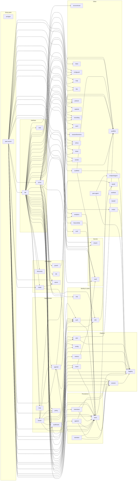
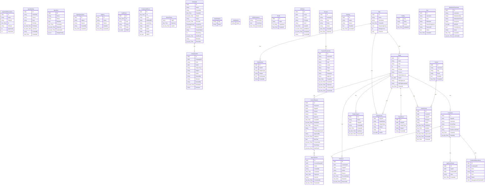

# PAMv1 — Architecture Diagrams (generated)

> **Do not edit by hand.** This file is regenerated from the source by
> `go run ./cmd/archgen` (or `go generate ./...`). CI runs the
> generator and fails if the committed copy is stale, so these diagrams stay in
> step with the code on every change. Conceptual flows (trust zones, the JIT
> proxy sequence, deployment) live in the hand-authored
> [High-Level Architecture](ARCHITECTURE-HIGH-LEVEL.md) and
> [Low-Level Architecture](ARCHITECTURE-LOW-LEVEL.md).

Rendering: these are [Mermaid](https://mermaid.js.org/) diagrams; GitHub renders
them inline.

## 1. Package dependency graph

Every Go package in the module and the imports between them. Arrows point from a package to the packages it imports.

```mermaid
flowchart LR
  subgraph n_Entry_point["Entry point"]
    n_archgen[archgen]
    n_pam_server[pam-server]
  end
  subgraph n_Interface["Interface"]
    n_api[api]
    n_proxy[proxy]
    n_web[web]
  end
  subgraph n_Identity___authz["Identity & authz"]
    n_auth[auth]
    n_mfa[mfa]
    n_oidc[oidc]
  end
  subgraph n_Secrets["Secrets"]
    n_shamir[shamir]
    n_vault[vault]
  end
  subgraph n_Persistence["Persistence"]
    n_memstore[memstore]
    n_pgstore[pgstore]
    n_store[store]
    n_storetest[storetest]
  end
  subgraph n_Connectors["Connectors"]
    n_discovery[discovery]
    n_guacd[guacd]
    n_rotate[rotate]
    n_tds[tds]
    n_winrm[winrm]
  end
  subgraph n_Agent_broker["Agent broker"]
    n_agentid[agentid]
    n_auditchain[auditchain]
    n_broker[broker]
    n_mcp[mcp]
    n_policy[policy]
  end
  subgraph n_Platform["Platform"]
    n_alert[alert]
    n_config[config]
    n_logging[logging]
    n_maint[maint]
    n_metrics[metrics]
    n_session[session]
  end
  subgraph n_Other["Other"]
    n_accountscan[accountscan]
    n_analytics[analytics]
    n_auditfmt[auditfmt]
    n_auditfwd[auditfwd]
    n_blast[blast]
    n_cmdguard[cmdguard]
    n_conjur[conjur]
    n_endpointagent[endpointagent]
    n_icap[icap]
    n_jwtutil[jwtutil]
    n_k8s[k8s]
    n_keycustody[keycustody]
    n_ocsf[ocsf]
    n_pam_agent[pam-agent]
    n_posture[posture]
    n_ratelimit[ratelimit]
    n_recording[recording]
    n_saml[saml]
    n_samltest[samltest]
    n_sessionforensics[sessionforensics]
    n_sshca[sshca]
    n_testutil[testutil]
    n_ticket[ticket]
    n_vendor[vendor]
  end
  n_agentid --> n_auditfmt
  n_agentid --> n_auth
  n_agentid --> n_jwtutil
  n_agentid --> n_store
  n_alert --> n_auditfmt
  n_alert --> n_logging
  n_analytics --> n_store
  n_api --> n_accountscan
  n_api --> n_agentid
  n_api --> n_alert
  n_api --> n_analytics
  n_api --> n_auditchain
  n_api --> n_auditfmt
  n_api --> n_auth
  n_api --> n_blast
  n_api --> n_broker
  n_api --> n_cmdguard
  n_api --> n_config
  n_api --> n_discovery
  n_api --> n_guacd
  n_api --> n_k8s
  n_api --> n_logging
  n_api --> n_maint
  n_api --> n_mcp
  n_api --> n_metrics
  n_api --> n_mfa
  n_api --> n_ocsf
  n_api --> n_oidc
  n_api --> n_policy
  n_api --> n_posture
  n_api --> n_ratelimit
  n_api --> n_recording
  n_api --> n_rotate
  n_api --> n_saml
  n_api --> n_session
  n_api --> n_sessionforensics
  n_api --> n_shamir
  n_api --> n_sshca
  n_api --> n_store
  n_api --> n_ticket
  n_api --> n_vault
  n_api --> n_vendor
  n_api --> n_web
  n_api --> n_winrm
  n_auditchain --> n_store
  n_auditfwd --> n_auditfmt
  n_auditfwd --> n_logging
  n_auditfwd --> n_store
  n_auth --> n_oidc
  n_auth --> n_store
  n_broker --> n_agentid
  n_broker --> n_alert
  n_broker --> n_auditchain
  n_broker --> n_auditfmt
  n_broker --> n_auth
  n_broker --> n_logging
  n_broker --> n_policy
  n_broker --> n_store
  n_conjur --> n_logging
  n_guacd --> n_auditfmt
  n_keycustody --> n_store
  n_maint --> n_store
  n_maint --> n_vault
  n_memstore --> n_session
  n_memstore --> n_store
  n_ocsf --> n_store
  n_oidc --> n_jwtutil
  n_pam_agent --> n_endpointagent
  n_pam_agent --> n_logging
  n_pam_server --> n_agentid
  n_pam_server --> n_alert
  n_pam_server --> n_analytics
  n_pam_server --> n_api
  n_pam_server --> n_auditchain
  n_pam_server --> n_auditfwd
  n_pam_server --> n_auth
  n_pam_server --> n_cmdguard
  n_pam_server --> n_config
  n_pam_server --> n_conjur
  n_pam_server --> n_icap
  n_pam_server --> n_k8s
  n_pam_server --> n_keycustody
  n_pam_server --> n_logging
  n_pam_server --> n_maint
  n_pam_server --> n_memstore
  n_pam_server --> n_oidc
  n_pam_server --> n_pgstore
  n_pam_server --> n_policy
  n_pam_server --> n_posture
  n_pam_server --> n_proxy
  n_pam_server --> n_recording
  n_pam_server --> n_rotate
  n_pam_server --> n_saml
  n_pam_server --> n_session
  n_pam_server --> n_shamir
  n_pam_server --> n_sshca
  n_pam_server --> n_store
  n_pam_server --> n_ticket
  n_pam_server --> n_vault
  n_pam_server --> n_vendor
  n_pam_server --> n_winrm
  n_pgstore --> n_logging
  n_pgstore --> n_session
  n_pgstore --> n_store
  n_proxy --> n_auditfmt
  n_proxy --> n_auth
  n_proxy --> n_cmdguard
  n_proxy --> n_icap
  n_proxy --> n_logging
  n_proxy --> n_posture
  n_proxy --> n_ratelimit
  n_proxy --> n_recording
  n_proxy --> n_session
  n_proxy --> n_sshca
  n_proxy --> n_store
  n_proxy --> n_tds
  n_proxy --> n_vault
  n_proxy --> n_winrm
  n_rotate --> n_store
  n_rotate --> n_winrm
  n_session --> n_logging
  n_storetest --> n_session
  n_storetest --> n_store
  n_store --> n_auditfmt
  n_store --> n_session
```

## 2. Domain data model

Entities are the exported structs in `internal/store/store.go` (never-serialized fields such as `SecretEnc`/`TokenHash` are omitted). Relationships are inferred from `<Entity>ID` foreign keys.

```mermaid
erDiagram
  AccessRequest {
    int64 ID
    string Requester
    int64 TargetID
    string Reason
    string Status
    string Approver
    time_Time CreatedAt
    ptr_time_Time DecidedAt
    time_Time ExpiresAt
    string Ticket
    int RequiredApprovals
    string ApprovedBy
    ptr_time_Time NotBefore
    bool OneTime
    ptr_time_Time ConsumedAt
    int RecurDays
    ptr_time_Time NextRunAt
  }
  AgentCallReservation {
    int64 ID
    string Agent
    string TokenID
    time_Time At
    string Refused
    int AgentUsed
    int TokenUsed
  }
  AgentIdentity {
    int64 ID
    string SPIFFEID
    string Owner
    string Note
    bool Enrolled
    ptr_time_Time FirstSeen
    ptr_time_Time LastSeen
    string CreatedBy
    time_Time CreatedAt
  }
  AgentKey {
    int64 ID
    string Name
    string Owner
    bool Disabled
    time_Time CreatedAt
    ptr_time_Time ExpiresAt
    ptr_time_Time LastUsedAt
    ptr_int BudgetPerDay
  }
  AgentQuarantine {
    int64 ID
    string Subject
    string Reason
    string CreatedBy
    time_Time CreatedAt
  }
  AppKey {
    int64 ID
    string Name
    string Owner
    bool Disabled
    time_Time CreatedAt
  }
  AppSecretGrant {
    int64 ID
    int64 AppID
    int64 CredentialID
    string Alias
    time_Time CreatedAt
  }
  ApprovalInvite {
    int64 ID
    int64 AccessRequestID
    string Email
    string CreatedBy
    time_Time CreatedAt
    time_Time ExpiresAt
    string Decision
    ptr_time_Time ConsumedAt
    ptr_time_Time RevokedAt
  }
  AuditEvent {
    int64 ID
    time_Time TS
    string Actor
    string Action
    string Detail
    arr_byte HMAC
  }
  BrokerAuditEvent {
    int64 ID
    time_Time TS
    string Actor
    string OnBehalfOf
    string ActorChain
    string Action
    string Detail
    string Scope
    arr_byte HMAC
  }
  BrokerToken {
    string CallID
    time_Time ExpiresAt
    ptr_time_Time UsedAt
  }
  Campaign {
    int64 ID
    string Name
    string CreatedBy
    time_Time CreatedAt
    ptr_time_Time DueAt
    string Status
    ptr_time_Time ClosedAt
    CampaignScope ScopeKind
    ptr_int64 ScopeSafeID
    string ScopeSubject
    int RecurDays
    ptr_time_Time NextRunAt
    string Reviewer
    ptr_time_Time RemindAt
  }
  CampaignItem {
    int64 ID
    int64 CampaignID
    string Kind
    int64 RefID
    string SubjectType
    string Subject
    string Detail
    string GrantedBy
    string Decision
    string DecidedBy
    ptr_time_Time DecidedAt
    string Reviewer
  }
  Checkout {
    int64 ID
    int64 CredentialID
    int64 TargetID
    string Holder
    string Reason
    time_Time CheckedOutAt
    time_Time ExpiresAt
    ptr_time_Time ReturnedAt
  }
  Credential {
    int64 ID
    int64 TargetID
    string Username
    string SecretType
    bool Provisioner
    string DoubleLockHolder
    time_Time CreatedAt
    ptr_time_Time RotatedAt
  }
  CredentialDependency {
    int64 ID
    int64 CredentialID
    string Kind
    string Host
    int Port
    string Name
    int64 ManagementCredentialID
  }
  EndpointAgent {
    int64 ID
    string Name
    int64 TargetID
    string CreatedBy
    time_Time CreatedAt
    ptr_time_Time LastSeen
    ptr_time_Time RevokedAt
  }
  GrantSubject {
    string Type
    string Name
  }
  KeyMaterial {
    string Name
  }
  MFAEnrollment {
    string Username
    bool Confirmed
    time_Time CreatedAt
  }
  Profile {
    int64 ID
    string Name
    arr_string Capabilities
    time_Time CreatedAt
  }
  SSHCert {
    int64 ID
    int64 Serial
    string KeyID
    string Principal
    string Actor
    time_Time IssuedAt
    ptr_time_Time ValidBefore
    ptr_time_Time RevokedAt
    string RevokedBy
  }
  Safe {
    int64 ID
    string Name
    string Description
    time_Time CreatedAt
    bool RequireApproval
    int MinApprovers
    bool Personal
  }
  SafeMember {
    int64 ID
    int64 SafeID
    string SubjectType
    string Subject
    bool CanManage
    string CreatedBy
  }
  ScimKey {
    int64 ID
    string Name
    string Owner
    bool Disabled
    time_Time CreatedAt
  }
  Session {
    int64 ID
    string Username
    string Role
    string Roles
    string Scope
    time_Time CreatedAt
    time_Time ExpiresAt
  }
  SessionShareInvite {
    int64 ID
    string SessionID
    string Mode
    string Kind
    string Invitee
    string Email
    string Status
    string Requester
    string Approver
    time_Time CreatedAt
    ptr_time_Time DecidedAt
    ptr_time_Time ExpiresAt
    ptr_time_Time ConsumedAt
    ptr_time_Time RevokedAt
  }
  Setting {
    string Key
    string Value
    bool Secret
    time_Time UpdatedAt
  }
  SubjectGrant {
    int64 TargetID
    string TargetName
    string SubjectType
    string Subject
    string Via
    ptr_int64 SafeID
  }
  Target {
    int64 ID
    string Name
    string Host
    int Port
    string OSType
    string Protocol
    bool RequireApproval
    ptr_int64 SafeID
    string RDPClipboard
    string RDPClipboardAudit
    time_Time CreatedAt
  }
  TargetGrant {
    int64 ID
    int64 TargetID
    string SubjectType
    string Subject
    string CreatedBy
  }
  User {
    int64 ID
    string Username
    string Role
    string IPAllowlist
    string DeviceFingerprint
    string ExternalID
    bool Active
    time_Time CreatedAt
  }
  Vendor {
    int64 ID
    string Username
    string Org
    string Email
    bool Disabled
    time_Time CreatedAt
  }
  VendorGrant {
    int64 ID
    int64 VendorID
    int64 TargetID
    string Principal
    string Status
    ptr_time_Time NotBefore
    time_Time NotAfter
    string Approver
    ptr_time_Time ApprovedAt
    ptr_time_Time RevokedAt
    time_Time CreatedAt
  }
  WebAuthnCredential {
    int64 ID
    string Username
    string AttestationType
    string AttestationFormat
    string Transports
    arr_byte AAGUID
    bool CloneWarning
    string Name
    time_Time CreatedAt
    ptr_time_Time LastUsedAt
  }
  AccessRequest ||--o{ ApprovalInvite : "has"
  Campaign ||--o{ CampaignItem : "has"
  Credential ||--o{ AppSecretGrant : "has"
  Credential ||--o{ Checkout : "has"
  Credential ||--o{ CredentialDependency : "has"
  Safe ||--o{ SafeMember : "has"
  Safe ||--o{ SubjectGrant : "has"
  Safe ||--o{ Target : "has"
  Session ||--o{ SessionShareInvite : "has"
  Target ||--o{ AccessRequest : "has"
  Target ||--o{ Checkout : "has"
  Target ||--o{ Credential : "has"
  Target ||--o{ EndpointAgent : "has"
  Target ||--o{ SubjectGrant : "has"
  Target ||--o{ TargetGrant : "has"
  Target ||--o{ VendorGrant : "has"
  Vendor ||--o{ VendorGrant : "has"
```

## 3. REST API surface

The 193 routes registered on the API mux, with the capability or guard each enforces (see `internal/auth` for the role → capability matrix).

| Method | Path | Guard |
|---|---|---|
| GET | `/api/access-requests` | CapApprove |
| POST | `/api/access-requests` | CapConnect |
| POST | `/api/access-requests/{id}/approve` | CapApprove |
| POST | `/api/access-requests/{id}/deny` | CapApprove |
| POST | `/api/access-requests/{id}/invite` | CapApprove |
| GET | `/api/access-requests/{id}/invites` | CapApprove |
| POST | `/api/access-requests/{id}/stop-recurrence` | CapApprove |
| GET | `/api/access/reach` | CapReadAudit |
| GET | `/api/analytics/risk` | CapReadAudit |
| POST | `/api/approval-invites/{id}/revoke` | CapApprove |
| GET | `/api/approval/preview/{token}` | token (single-use link) |
| POST | `/api/approval/redeem/{token}` | token (single-use link) |
| GET | `/api/audit` | CapReadAudit |
| GET | `/api/audit/export` | CapReadAudit |
| GET | `/api/audit/head` | CapReadAudit |
| GET | `/api/audit/ocsf` | CapReadAudit |
| GET | `/api/audit/verify` | CapReadAudit |
| GET | `/api/auth/oidc/callback` | public (rate-limited) |
| GET | `/api/auth/oidc/start` | public (rate-limited) |
| POST | `/api/auth/saml/acs` | public (rate-limited) |
| GET | `/api/auth/saml/metadata` | public (rate-limited) |
| GET | `/api/auth/saml/start` | public (rate-limited) |
| POST | `/api/blast/analyze` | CapReadAudit |
| POST | `/api/breakglass/unseal` | public (rate-limited) |
| GET | `/api/ca/ssh` | CapReadInventory |
| GET | `/api/ca/ssh/certs` | CapReadInventory |
| POST | `/api/ca/ssh/challenge` | CapConnect |
| GET | `/api/ca/ssh/krl` | CapReadInventory |
| POST | `/api/ca/ssh/revoke` | CapManageTargets |
| POST | `/api/ca/ssh/sign` | CapConnect |
| GET | `/api/campaigns` | CapReadAudit |
| POST | `/api/campaigns` | CapManageUsers |
| GET | `/api/campaigns/mine` | CapApprove |
| GET | `/api/campaigns/{id}` | CapReadAudit |
| POST | `/api/campaigns/{id}/close` | CapManageUsers |
| POST | `/api/campaigns/{id}/items/{iid}/decision` | CapApprove |
| PUT | `/api/campaigns/{id}/items/{itemID}/reviewer` | CapManageUsers |
| GET | `/api/checkouts` | CapReadAudit |
| GET | `/api/compliance/nis2` | CapReadAudit |
| GET | `/api/config` | CapManageUsers |
| PUT | `/api/config` | CapManageUsers |
| GET | `/api/config/effective` | CapManageUsers |
| GET | `/api/config/iac` | CapManageUsers |
| DELETE | `/api/config/{key}` | CapManageUsers |
| GET | `/api/credentials` | CapReadInventory |
| POST | `/api/credentials` | CapManageCredentials |
| DELETE | `/api/credentials/{id}` | CapManageCredentials |
| POST | `/api/credentials/{id}/checkin` | CapRevealSecret |
| POST | `/api/credentials/{id}/checkout` | CapRevealSecret |
| POST | `/api/credentials/{id}/checkout/extend` | CapRevealSecret |
| GET | `/api/credentials/{id}/dependencies` | CapReadInventory |
| POST | `/api/credentials/{id}/dependencies` | CapManageCredentials |
| DELETE | `/api/credentials/{id}/dependencies/{did}` | CapManageCredentials |
| DELETE | `/api/credentials/{id}/doublelock` | CapRevealSecret |
| POST | `/api/credentials/{id}/doublelock` | CapRevealSecret |
| POST | `/api/credentials/{id}/reconcile` | CapManageCredentials |
| POST | `/api/credentials/{id}/reveal` | CapRevealSecret |
| POST | `/api/credentials/{id}/rotate` | CapManageCredentials |
| POST | `/api/discovery/scan` | CapManageTargets |
| GET | `/api/endpoint-agents` | CapReadInventory |
| POST | `/api/endpoint-agents` | CapManageTargets |
| DELETE | `/api/endpoint-agents/{id}` | CapManageTargets |
| POST | `/api/extension-token` | CapRevealSecret |
| POST | `/api/identity/reconcile` | CapManageUsers |
| POST | `/api/login` | public (rate-limited) |
| GET | `/api/login-sessions` | CapManageUsers |
| POST | `/api/login-sessions/revoke` | CapManageUsers |
| POST | `/api/logout` | authenticated |
| GET | `/api/me` | authenticated |
| DELETE | `/api/mfa` | authenticated |
| GET | `/api/mfa` | authenticated |
| POST | `/api/mfa/enroll` | authenticated |
| POST | `/api/mfa/recovery-codes` | authenticated |
| POST | `/api/mfa/verify` | authenticated (rate-limited) |
| GET | `/api/profiles` | CapManageUsers |
| POST | `/api/profiles` | CapManageUsers |
| DELETE | `/api/profiles/{id}` | CapManageUsers |
| POST | `/api/rdp-token` | CapConnect |
| GET | `/api/reconcile` | CapManageCredentials |
| GET | `/api/recordings` | CapReadAudit |
| GET | `/api/recordings/search` | CapReadAudit |
| GET | `/api/recordings/{name}` | CapReadAudit |
| GET | `/api/safes` | CapReadInventory |
| POST | `/api/safes` | CapManageTargets |
| DELETE | `/api/safes/{id}` | CapManageTargets |
| PUT | `/api/safes/{id}` | CapManageTargets |
| GET | `/api/safes/{id}/members` | CapReadInventory |
| POST | `/api/safes/{id}/members` | CapReadInventory |
| DELETE | `/api/safes/{id}/members/{mid}` | CapReadInventory |
| GET | `/api/sessions` | CapReadAudit |
| GET | `/api/sessions/stepups` | CapReadAudit |
| DELETE | `/api/sessions/{id}` | CapManageTargets |
| POST | `/api/sessions/{id}/resume` | CapApprove |
| GET | `/api/sessions/{id}/share` | CapReadAudit |
| POST | `/api/sessions/{id}/share` | CapConnect |
| POST | `/api/sessions/{id}/share/kick` | CapManageTargets |
| GET | `/api/sessions/{id}/share/roster` | CapReadAudit |
| POST | `/api/sessions/{id}/stepup` | CapApprove |
| GET | `/api/sessions/{id}/stream` | CapReadAudit |
| GET | `/api/sessions/{id}/suspend` | CapReadAudit |
| POST | `/api/sessions/{id}/suspend` | CapApprove |
| POST | `/api/share-invites/{id}/approve` | CapApprove |
| POST | `/api/share-invites/{id}/deny` | CapApprove |
| POST | `/api/share-invites/{id}/revoke` | CapManageTargets |
| POST | `/api/share/input` | token (single-use link) |
| POST | `/api/share/redeem/{token}` | token (single-use link) |
| GET | `/api/share/stream` | token (single-use link) |
| GET | `/api/targets` | CapReadInventory |
| POST | `/api/targets` | CapManageTargets |
| DELETE | `/api/targets/{id}` | CapManageTargets |
| GET | `/api/targets/{id}` | CapReadInventory |
| PUT | `/api/targets/{id}` | CapManageTargets |
| POST | `/api/targets/{id}/discover-accounts` | CapManageTargets |
| GET | `/api/targets/{id}/grants` | CapManageTargets |
| POST | `/api/targets/{id}/grants` | CapManageTargets |
| DELETE | `/api/targets/{id}/grants/{gid}` | CapManageTargets |
| POST | `/api/targets/{id}/kubectl` | CapConnect |
| GET | `/api/targets/{id}/rdp` | token (query) |
| PUT | `/api/targets/{id}/safe` | CapManageTargets |
| GET | `/api/targets/{id}/vnc` | token (query) |
| POST | `/api/targets/{id}/winrm` | CapConnect |
| GET | `/api/users` | CapManageUsers |
| POST | `/api/users` | CapManageUsers |
| DELETE | `/api/users/{id}` | CapManageUsers |
| PUT | `/api/users/{id}` | CapManageUsers |
| POST | `/api/vendor-grants/{gid}/approve` | CapApprove |
| POST | `/api/vendor-grants/{gid}/revoke` | CapManageTargets |
| GET | `/api/vendors` | CapReadInventory |
| POST | `/api/vendors` | CapManageUsers |
| PUT | `/api/vendors/{id}` | CapManageUsers |
| GET | `/api/vendors/{id}/evidence` | CapReadAudit |
| GET | `/api/vendors/{id}/grants` | CapReadInventory |
| POST | `/api/vendors/{id}/grants` | CapManageTargets |
| POST | `/api/vendors/{id}/offboard` | CapManageUsers |
| POST | `/api/vnc-token` | CapConnect |
| GET | `/api/webauthn/credentials` | authenticated |
| DELETE | `/api/webauthn/credentials/{id}` | authenticated |
| POST | `/api/webauthn/login/begin` | MFA-pending token (rate-limited) |
| POST | `/api/webauthn/login/finish` | MFA-pending token (rate-limited) |
| POST | `/api/webauthn/register/begin` | authenticated |
| POST | `/api/webauthn/register/finish` | authenticated |
| GET | `/approve.html` | public |
| GET | `/healthz` | public |
| GET | `/mcp` | agent credential |
| POST | `/mcp` | agent credential |
| GET | `/metrics` | public |
| GET | `/readyz` | public |
| GET | `/scim/v2/ServiceProviderConfig` | SCIM client key |
| GET | `/scim/v2/Users` | SCIM client key |
| POST | `/scim/v2/Users` | SCIM client key |
| DELETE | `/scim/v2/Users/{id}` | SCIM client key |
| GET | `/scim/v2/Users/{id}` | SCIM client key |
| PATCH | `/scim/v2/Users/{id}` | SCIM client key |
| PUT | `/scim/v2/Users/{id}` | SCIM client key |
| GET | `/share.html` | public |
| GET | `/static/guacamole-common.min.js` | public |
| GET | `/v1/agents` | CapManageUsers |
| POST | `/v1/agents` | CapManageUsers |
| GET | `/v1/agents/identities` | CapManageUsers |
| POST | `/v1/agents/identities` | CapManageUsers |
| DELETE | `/v1/agents/identities/{id}` | CapManageUsers |
| POST | `/v1/agents/identities/{id}/owner` | CapManageUsers |
| GET | `/v1/agents/quarantine` | CapManageUsers |
| POST | `/v1/agents/quarantine` | CapManageUsers |
| DELETE | `/v1/agents/quarantine/{id}` | CapManageUsers |
| DELETE | `/v1/agents/{id}` | CapManageUsers |
| POST | `/v1/agents/{id}/budget` | CapManageUsers |
| POST | `/v1/agents/{id}/disable` | CapManageUsers |
| POST | `/v1/agents/{id}/enable` | CapManageUsers |
| GET | `/v1/app-secrets/by-alias/{alias}` | application key |
| GET | `/v1/app-secrets/{id}` | application key |
| GET | `/v1/approvals` | CapApprove |
| POST | `/v1/approvals/{id}/decision` | CapApprove |
| GET | `/v1/apps` | CapManageUsers |
| POST | `/v1/apps` | CapManageUsers |
| DELETE | `/v1/apps/{id}` | CapManageUsers |
| GET | `/v1/apps/{id}/grants` | CapManageUsers |
| POST | `/v1/apps/{id}/grants` | CapRevealSecret |
| DELETE | `/v1/apps/{id}/grants/{gid}` | CapRevealSecret |
| POST | `/v1/apps/{id}/grants/{gid}/alias` | CapRevealSecret |
| GET | `/v1/audit` | CapReadAudit |
| GET | `/v1/audit/head` | CapReadAudit |
| GET | `/v1/audit/jwks` | CapReadAudit |
| GET | `/v1/audit/verify` | CapReadAudit |
| GET | `/v1/scim-keys` | CapManageUsers |
| POST | `/v1/scim-keys` | CapManageUsers |
| DELETE | `/v1/scim-keys/{id}` | CapManageUsers |
| POST | `/v1/token` | agent credential |
| GET | `/v1/token/jwks` | CapReadAudit |
| POST | `/v1/tool-calls` | agent credential |
| GET | `/v1/tool-calls/{id}` | agent credential |
| POST | `/v1/tool-calls/{id}/resume` | agent credential |
| GET | `/{$}` | public |

