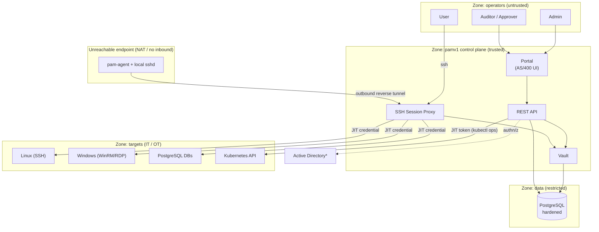
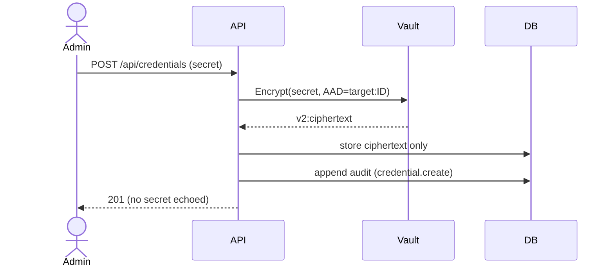
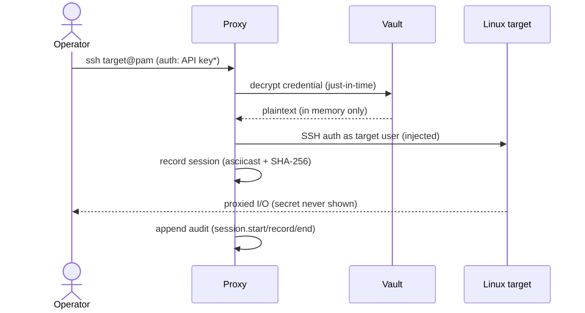
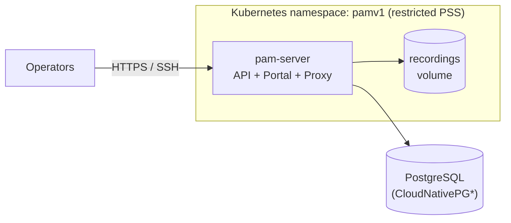

# pamv1 — High-Level Architecture

> **Living document.** Update this on every change that alters components,
> boundaries, data flows or trust zones. Keep it conceptual — implementation
> detail belongs in [ARCHITECTURE-LOW-LEVEL.md](ARCHITECTURE-LOW-LEVEL.md).
>
> **Code-derived diagrams** (package graph, data model, REST surface) are
> generated from the source and CI-enforced current — see
> [ARCHITECTURE-DIAGRAMS.md](ARCHITECTURE-DIAGRAMS.md). This file holds the
> hand-authored conceptual diagrams below.
>
> Last updated: 2026-08-18 · Reflects: Phases 0–175 + the 2026-07 hardening pass — the PostgreSQL database session proxy (15), live session monitoring + command control (16), safes + dependent-account propagation (17), optional CyberArk Conjur secret sourcing (18), access certification campaigns (19), an ITSM/ticketing gate (20), richer approval workflows (21), Zero Standing Privilege via ephemeral SSH certificates (22), privileged threat analytics (23), a Conjur-style application-secrets API for non-agent apps (24), console parity (25), session-recording playback + one-time access (26 — stored recordings replay from the portal hash-verified against the audit trail, and a single-use approval is consumed by the first use it admits), and AI-agent broker completion (27 — approver-group separation of duties, ed25519 in-chain audit checkpoints + signing-key rotation/JWKS + truncation floor, OCSF SIEM export, MCP SSE transport with elicitation; see [AGENT-THREAT-MODEL.md](AGENT-THREAT-MODEL.md)). All four Tier-1 and all three Tier-2 competitive-coverage gaps are closed, plus **two of five Tier-3** (Zero Standing Privilege, threat analytics) and the **first Tier-4** (application secrets); the 5250 console is **keyboard-first** and has **full parity** with the backend. Phases 71–94 deepened rather than widened: bootstrap secrets refreshable at runtime (78), working GitOps deploy examples (79), an end-to-end "prove it is a PAM" CI job (81), **first-class ServiceNow/Jira ticket connectors** (84), **history-aware threat analytics** with a revoke-logins response rung (86), and an adversarial review of the crown-jewel subsystems (91–94) that fixed one SFTP read-only containment gap and confirmed the vault, database proxies and broker four-eyes sound. **Live session-sharing** (116) followed: a live SSH session can be brought into view — or view-**control** — for a second party through the same four-eyes request→approve shape as an access request, an internal invite redeemed over SSH or an external one by emailed QR through a new unauthenticated guest page. **CIDR/network-based connect authorization** (118) closed the last confirmed gap from that research pass: a per-user source-address allowlist, checked at both the REST `authz` middleware and the session-proxy `admit()` gate, break-glass exempt. **Phase 120** closed three more policy-richness gaps from the same plan: recurring access-request windows (reusing the certification-campaign scheduler's anchor-spawns-pending-children shape, its own worker), configurable password-generation policy with per-class minimums, reuse-history enforcement, and checkout-lease extension up to a configured ceiling. **Phase 122** closed the plan's one CyberArk-primary finding — a live SSH session's operator input can be suspended (frozen) without ending the session, and explicitly resumed — built entirely on Phase 116's own input mux rather than new plumbing; an end-to-end test against a real upstream caught a real gate-placement race the unit tests alone had missed. **Phase 124** closed the plan's last open finding — FIDO2/WebAuthn as a second, independent MFA factor to TOTP — using a well-audited library (`go-webauthn`) for the ceremony's own cryptographic verification rather than hand-rolling CBOR/COSE parsing, a deliberate exception to this codebase's usual protocol-client posture; the login-flow enumeration trap a naive design would hit is closed by minting a narrow, password-gated session scope before ever building a challenge. **Phase 126** closed the plan's sixth and final item, added after approval on a direct ask: selectable portal color themes — every hardcoded color became a CSS custom property, two new dark palettes (amber, slate) sit alongside the existing green as `[data-theme]` overrides, and **F2** cycles between them client-only, no new store table, route or audit event — completing the Wallix-weighted plan's full run. **Phase 128** then returned to the original CyberArk/Wallix gap-research backlog's remaining item: authenticated post-login account discovery — a fixed, read-only enumeration command run over a target's own vaulted credential, cross-referenced against every credential pamv1 already vaults for that target, so a login-capable account the host has but pamv1 doesn't track ("unmanaged") is surfaced as a finding, CyberArk DNA-style. **Phase 129** extended Zero Standing Privilege (Phase 22, SSH-only until now) to PostgreSQL: a `db_zsp` credential provisions a fresh, randomly-named role via the target's separately vaulted provisioner credential and drops it when the session ends, so no standing database secret exists for the connecting identity at all — proven against a real Postgres wire-protocol exchange. Two exclusions decided *before* writing code, not discovered after: RDP has no equivalent (Guacamole's own documentation confirms no certificate-based RDP auth parameter exists, a permanent protocol limitation), and SQL Server is deferred (`internal/tds` has no client-side response-token reader yet). **Phase 131** added an optional command allow-list (`PAM_COMMAND_ALLOW_FILE`): `cmdguard.Guard` gained an `Allowed(cmd)` method reading the same compiled pattern set `Blocked` already does, so an allow-list is just a second Guard value used the other way round, wired at every existing command-control call site — deny always wins when both would match. **Phase 133** closed the batch's second item: a pluggable `internal/posture` webhook re-checks live device posture on every connect and every authenticated call (a new gate in `gates.go` plus a matching `authz` check, both break-glass exempt), and an optional `PAM_DEVICE_HEADER` binds a principal to one reverse-proxy-injected client-certificate fingerprint — honestly scoped to the REST surface only, since the three raw SSH/PostgreSQL/SQL Server proxies have no HTTP layer for a header to travel on. Neither check can reach a `RoleAgent` identity: the broker's tools bypass `admit()` entirely and never authenticate through `authz`. **Phase 135** closed the batch's third item, DoubleLock: a named person's password, independent of RBAC, additionally required to reveal or check out a credential — even a compromised admin account can't read it alone, and can't strip the protection without that same password either. The plan's original AAD-mixing-on-the-existing-vault mechanism didn't survive contact with `-rotate-kek`'s exhaustive KEK re-wrap, which has no way to obtain a password mid-rotation — resolved by keeping the DoubleLock ciphertext entirely outside the KEK (a second, independent AES-256-GCM encryption keyed directly by PBKDF2(password)), so `-rotate-kek` needed zero changes. **Phase 137** closed the batch's fourth item, two independent pieces bundled together: magic-link access-request approval, an `ApprovalInvite` that near-structurally copies Phase 116's session-share invite but needs no separate approval step of its own — creating one already requires `CapApprove`, so the invite is the delegation — with redemption split into a safe preview `GET` and a single-use decision `POST` fired only on an explicit click, deliberately unlike `share.html`'s auto-redeem, since a decision is higher-stakes than joining a session; and session watermarking, a client-side overlay for RDP/VNC and a one-time `Hub.Publish` banner for text/database sessions. Tracing the self-approval attack surface by hand (not a failing test) found that the redemption path's synthetic actor alone didn't stop a requester minting an invite to their own inbox — closed by a second four-eyes check at invite creation. **Phase 139** closed the batch's fifth item, and the first to change a real, load-bearing invariant rather than add a gate alongside the existing ones: `auth.CanConnectTarget` admitted any admin unconditionally, so a safe marked `Personal` (Delinea's personal folders) means nothing unless that stops. The bypass is now conditional on a new, narrow `CapUnlimitedVaultAccess` capability, deliberately absent from the built-in admin role. Building it surfaced a second side door the plan text hadn't named: `canManageSafe` let any `manage_targets` holder add themselves to any safe's roster, personal or not — closed the same way, with a bootstrap fix (`createSafe` requires and seeds an `owner`) so a personal safe is never created unmanageable. **Phase 141** closed the batch's sixth item: a client-initiated `ssh -L` forward is admitted only to the connected target's own host — any port, since the target's own configured port is its SSH port, not the service the operator actually wants — closing what would otherwise be an SSRF pivot into the target's network. The real design question the plan text didn't answer was what "same host" means: `localhost`/`127.0.0.1`/`::1` count as the target too, since the forward dials out through the already-authenticated upstream connection, resolved from there. Three refusals nothing automatically covers were found by asking what a bare channel-loop branch inherits from `handleSession` (nothing): observer sessions, mandatory live supervision and required recording all refuse forwarding outright rather than silently admitting an uncovered data path. **Phase 143** closed the batch's seventh item, ICAP-based AV/DLP scanning of SFTP transfers — and the plan's own assumption that this could "fail closed like the byte cap" didn't survive reading the capture code: a whole-object scan needs a complete file, which only exists once a transfer has already reached its destination through the existing per-packet relay. Rather than force a store-and-forward rearchitecture the proxy doesn't have, this shipped as an honest scope cut — **detection, not prevention** — with a new minimal `internal/icap` RFC 3507 RESPMOD client, a flagged or failed scan audited loudly (`sftp.icap_flagged`/`sftp.icap_scan_failed`) without ever blocking the transfer, and a dedicated end-to-end test proving an unreachable scanner still lets the file through exactly as documented. **Phase 145** closed the batch's eighth item, generic file-attachment secrets — mechanically nothing new, the same `vault.Encrypt`/`Decrypt` pathway every secret type already uses, capped at `PAM_CREDENTIAL_FILE_MAX_KB` before it is ever encrypted. The real story is a near-miss the plan's own stated fix walked past: stripping `secret_enc` from `ListCredentials` (its own doc comment said the field is `json:"-"` and "gets materially worse the moment attachments exist") passed a store-layer contract test written to prove it worked, then broke the PostgreSQL session proxy's JIT credential injection in production — caught only because the full test suite includes a real in-process upstream. `dbproxy.go`'s `lookupTargetCred` deliberately lists first and decrypts from the result later, by design, so every authorization gate can run before any plaintext exists; a repo-wide grep found nine such callers, not the two or three a narrower search inside `internal/api` alone would have suggested. Resolved by leaving `ListCredentials` untouched and adding a new, separate `ListCredentialsMeta` for the four callers actually verified to never touch the secret. **Phase 147** closed the batch's ninth item, browser-extension password autofill — a real Manifest V3 extension calling the *existing* reveal route with a new narrow session scope, `auth.SessionScopeExtension`, refused everywhere except that one endpoint. Unlike the RDP/VNC viewer scope (a blanket refusal with no exceptions anywhere), this one needed exactly one — built by extracting the shared REST authorization checklist into `authzCore(cap, allowExtension, next)` once, rather than risking a second, driftable copy of it. The minted token inherits the minting user's own role and capabilities, so it grants nothing beyond what that user could already reach through the normal reveal path. Not interactively verified against a real browser in this environment (no GUI browser available) — a documented gap, not a silent one, in the same honest spirit as Phase 129's unverified RDP/guacd finding. **Phase 149** opened the batch's back half with SCIM 2.0 user provisioning — StrongDM's push-based IdP lifecycle, complementing pamv1's existing pull-only `POST /api/identity/reconcile`: a new `/scim/v2/Users` surface, authenticated by a non-human `ScimKey` bearer identity (the same shape `AgentKey`/`AppKey` already use), full create/read/replace/patch/delete against `store.User`, which gains two fields — `ExternalID` (the IdP's own correlation key) and `Active`, SCIM's deprovisioning switch. Making `Active` mean something is the actual point: `auth.Resolver.Resolve()` now refuses a deactivated user's local token outright, proven end to end against a real token before and after a real deactivating PATCH call, not asserted at the store layer alone. `CreateUser` in both backends now ignores whatever `Active` a caller's input struct holds and always creates an active user — a bare `bool` cannot distinguish "wants inactive" from "never heard of the field," and the second case must never silently create a deactivated account; this caught a real regression in `internal/auth`'s own pre-existing test fixtures, which build `store.User` values directly rather than through `CreateUser` and so needed the same explicit fix. SCIM's own `DELETE` is a deliberate soft-delete (sets `Active=false`), diverging on purpose from `DELETE /api/users/{id}`'s existing hard-delete semantics, since SCIM's whole model depends on being able to reactivate. Every SCIM-provisioned user gets the fixed `RoleUser` floor — a SCIM key holds no capability set of its own to bound a requested role against, unlike a human caller of `POST /api/users`. Not interactively verified against a real IdP (no Okta/Azure AD/OneLogin account available); the wire-shape handling is close enough to matter regardless — PATCH honors both RFC 7644's path-based form and Azure AD's documented no-path variant. **Phase 151** closed the batch's Delinea finding — SAML 2.0 single sign-on for the IdPs that speak SAML but not OIDC (on-prem AD FS above all, plus SAML-only Okta/OneLogin/Entra applications): pamv1 as a Service Provider in the SP-initiated Web Browser SSO profile, following `internal/oidc`'s exact wiring shape (`buildSAML` beside `buildOIDC`, the same hot-swap closure, the same `MatchedRoles` group→role mapper, the same portal landing) — and the second deliberate crypto-verification library exception after WebAuthn, reasoned through in ROADMAP.md: XML-DSig over canonicalized XML is precisely where the signature-wrapping vulnerability class lives, a different order of problem than OIDC's fixed-bytes JWT check, so the verification is delegated to `crewjam/saml`+`goxmldsig` and pamv1 keeps only the policy decisions (SP-initiated only, request ID bound to a browser cookie and consumed single-use from the existing OIDC-state store — no schema change — no IdP-initiated logins, no SLO). Proven against a **real in-process SAML IdP** in the test suite, signed and encrypted assertions alike, with tampered, stripped, wrong-audience, wrong-issuer, expired and signature-wrapped Responses refused; interop with a live ADFS/Okta tenant is not verified in this environment. **Phase 153** took on the batch's most architecturally different item — outbound-only endpoint agents, BeyondTrust's Jump Client: every earlier phase added a gate, a protocol or a store concept to pamv1's dial-out model, and this one inverts it for the endpoints pamv1 can never reach (NAT, CGNAT, no inbound rule — where a jump host doesn't help either, since the bastion still has to reach the target). A third binary, `cmd/pam-agent`, dials OUT to the existing `:2222` listener with its own bearer key, holds an RFC 4254 reverse tunnel, and the proxy opens streams back through it instead of dialing — the client half was free (x/crypto already implements `ssh -R`'s mechanism), the server half was the real work (pam-server used to discard every SSH global request; it now accepts exactly one `tcpip-forward` from an agent-class identity and refuses every channel that identity opens). Boundaries decided up front: the agent alone chooses the ONE local address it exposes, pins pam-server's host key or refuses to run, and can carry nothing toward pamv1; a bound target is tunnel-or-nothing, never a silent direct fallback; per replica, so an agent lists every replica. Proven with the real agent library against a real upstream sshd through the tunnel; a real NAT path is not verified here. **Phase 155** closed the batch's one cross-vendor-confirmed top finding — Kubernetes, which Teleport and StrongDM flagged independently and which was notably absent from pamv1's own connector-breadth gap list: a `kubernetes` target is a cluster's API server rather than a host, so there is no session to proxy and pamv1 brokers discrete, audited kubectl-shaped operations instead (`get`, `logs`, `apply`, `delete`), each one call with a just-in-time-injected service-account token, the canonical `kubectl …` line matched by the same command control that governs SSH, a `.k8s.log` transcript and an audit row carrying the cluster's own status. The client is hand-rolled (HTTPS + JSON, no `client-go`, no discovery walk — the caller names the API version, so one operation is one request and CRDs work immediately), and its security core is path safety: every value that becomes a URL segment is validated against Kubernetes' own naming rules first. Streaming verbs (`exec`/`attach`/`port-forward`) are a documented exclusion, not an oversight — auditing a multiplexed SPDY stream needs a parser this codebase has no precedent for. **Phase 157** closed the batch with its last item and its second outright go/no-go: Teleport's eBPF session recording cannot be reproduced by a proxy at all — an operator's shell runs in the TARGET's kernel, so a probe on the pamv1 host observes nothing of a brokered session, and the only pamv1 code that ever runs on a target (the Phase 153 agent) would need a process-tree correlation and a reporting path that phase deliberately refused. What shipped delivers the same stated outcome by the only mechanism available to a proxy: after an interactive session ends, pamv1 pulls the TARGET's own kernel audit records over the same vaulted credential on a fresh connection, filters them to that session's window, and stores a hash-chained artifact beside the recording — so an obfuscated `base64 -d | sh` or an unechoed command still leaves a structured record of what actually ran, with "the target could not tell us" reported as a finding rather than silence. **Phases 159 and 161 open a new batch, the first ever aimed at pamv1's own AI-agent broker rather than at its human-operator paths**: 159 made an agent identity stoppable — suspend, expire and a subject-keyed quarantine that covers the SPIFFE/SVID identities which have no local row to disable, checked at the front door and again when a parked call comes up for approval, failing closed on a store error; 161 made an agent's behaviour *visible*, which it had never been. Every brokered tool call was written to the primary trail as one action with the outcome buried in the detail text, so the SIEM export's Detection-Finding rule for a denial had never fired since Phase 27 and the behavioural risk engine had no agent action in any signal map at all — an agent could act at any rate, at any hour, against hosts it had never touched, and score zero. The action now carries the outcome, agents are scored (with one deliberate exemption: never for off-hours, since 03:00 says nothing about a machine), and a run is reconstructible — the declared run id the API had accepted since Phase 13 and written nowhere, declared client/model provenance, and the resume token's id joining a parked call to the moment its result was actually collected, which the hash chain had never recorded. **Phase 163** continued that batch into the policy engine itself, and found the batch's sharpest defect so far: a `not_in` block-list was satisfied by an ABSENT argument, so the guard an operator would naturally write to keep an agent away from a few targets' credentials was defeated by omitting the argument it guarded — the widest form of the call was the one form the rule could not stop. Every operator now requires presence, `present: true|false` expresses absence deliberately, and tool arguments are validated against the tool's own declared schema before policy sees them, so an undeclared, missing, mistyped or empty argument is refused rather than quietly becoming a wider request. **Phase 165** bounded how much data an agent can pull: the SSH exec primitive read remote output with no limit at all — the primitive behind the broker's `ssh_exec`, account discovery, rotation verification and the forensics pull, making a policy-allowed `cat` of a large file a memory-exhaustion vector against the PAM host — and a tool's result reached the agent uncapped. Both are bounded now, and `ssh_exec` finally writes the durable transcript every sibling path already wrote, which is what makes truncating the agent's copy honest rather than lossy. **Phase 167** added the volume control a rate limit cannot express — a cumulative per-agent call budget over a rolling 24 hours, counted from the audit trail itself so the number an operator reads and the number the gate enforces cannot drift. See the [ROADMAP](../ROADMAP.md) for the authoritative per-phase status and [EXTERNAL-INFRA-GAPS.md](EXTERNAL-INFRA-GAPS.md) for what remains.

## 1. Purpose

pamv1 is an open-source Privileged Access Management system. It stores privileged
credentials in a hardened vault, brokers access to Linux/Windows targets through a
proxy that injects those credentials just-in-time, and records who did what. It is
designed to fit IT and OT (industrial) environments and to support NIS2 obligations.

> ⚠️ Educational project — see the note at the top of the [README](../README.md).

## 2. Actors & trust zones

```mermaid
flowchart TB
    subgraph Z0["Zone: operators (untrusted)"]
        ADMIN["  Admin  "]
        USER["  User  "]
        AUD["  Auditor / Approver  "]
    end

    subgraph Z1["Zone: pamv1 control plane (trusted)"]
        PORTAL["  Portal  <br/>  (AS/400 UI)  "]
        API["  REST API  "]
        PROXY["  SSH Session Proxy  "]
        VAULT["  Vault  "]
    end

    subgraph Z2["Zone: data (restricted)"]
        DB[("  PostgreSQL  <br/>  hardened  ")]
    end

    subgraph Z3["Zone: targets (IT / OT)"]
        LNX["  Linux (SSH)  "]
        WIN["  Windows (WinRM/RDP)  "]
        PGT["  PostgreSQL DBs  "]
        K8S["  Kubernetes API  "]
    end

    subgraph Z4["Unreachable endpoint (NAT / no inbound)"]
        EPA["  pam-agent  +  local sshd  "]
    end

    IDP["  Active Directory*  "]

    ADMIN --> PORTAL --> API
    USER -->|"ssh"| PROXY
    AUD --> PORTAL
    API --> VAULT
    PROXY --> VAULT
    VAULT --> DB
    API --> DB
    API -.->|"authn/z"| IDP
    PROXY -->|"JIT credential"| LNX
    PROXY -->|"JIT credential"| WIN
    PROXY -->|"JIT credential"| PGT
    API -->|"JIT token (kubectl ops)"| K8S
    EPA -->|"outbound reverse tunnel"| PROXY
```

`*` Active Directory login is partial — LDAP/Entra/OIDC/SAML ship; Kerberos/GSSAPI is
deferred (see [roadmap](../ROADMAP.md)). Solid edges = implemented today. Windows
(WinRM/RDP) and the PostgreSQL session proxy ship, but need a real Windows host /
database to verify end-to-end (see [EXTERNAL-INFRA-GAPS.md](EXTERNAL-INFRA-GAPS.md)).

## 3. Components (responsibility view)

| Component | Responsibility | Status |
|---|---|---|
| **Portal** | AS/400-style operator UI; deliberately austere | ✅ Phase 1 |
| **REST API** | CRUD for targets/credentials, audit, authn | ✅ Phase 1 |
| **Vault** | Encrypt/decrypt secrets; key custody | ✅ Phase 1 |
| **Audit** | Append-only trail of every sensitive action | ✅ Phase 1 |
| **Break-glass** | Sealed key + M-of-N quorum unseal, auto-expiring, alerted | ✅ Phase 1/6 |
| **Session Proxy** | Broker SSH; **JIT credential injection**; record sessions | ✅ Phase 2 |
| **Database Proxy** | Broker PostgreSQL; JIT injection; **per-statement query audit** | ✅ Phase 15 |
| **Supervised sessions** | Live watch (SSE) + **command control** (block on exec/WinRM/SQL, the REST WinRM run, and the broker's exec tools) | ✅ Phase 16, 38 |
| **Safes & dependent accounts** | Delegated-access containers; rotation updates service/task/app-pool consumers | ✅ Phase 17 |
| **Access certification** | Periodic campaigns to recertify/revoke who has access to what — scoped to a safe or a subject so a review is finishable, recurring on a schedule, with per-item reviewers and reminders before the due date | ✅ Phases 19, 68–70 |
| **ITSM ticket gate** | Require + validate a change ticket before an access request — first-class ServiceNow/Jira connectors check its state, its change window and that it names the operator (84); re-checked at the moment access is used (60) | ✅ Phases 20/60/84 |
| **Approval workflows** | Multi-tier N-of-M chains, scheduled windows, mandatory reason | ✅ Phase 21 |
| **RBAC** | Four profiles (admin/user/auditor/approver), per-user tokens | ✅ Phase 3a |
| **AD / Entra / OIDC login** | LDAPS + Entra ID (ROPC) + OIDC auth-code SSO, groups/app-roles → roles, session tokens | ✅ Phase 3b |
| **Post-session forensics** | After an interactive SSH session, the TARGET's own kernel audit record of what actually executed is pulled over the same vaulted credential and stored as a hash-chained artifact — closing the "a PTY is never parsed" blind spot for obfuscated and unechoed commands, audit-only | ✅ Phase 157 |
| **Kubernetes clusters** | A `kubernetes` target brokered as discrete, audited `kubectl`-shaped operations (get/logs/apply/delete) with a JIT-injected service-account token; the cluster's own RBAC decides what it may do | ✅ Phase 155 |
| **Outbound-only endpoint agents** | `pam-agent` on a NAT'd/firewalled target dials OUT to the SSH listener and holds a reverse tunnel; the proxy reaches that target through it — same JIT injection, recording and gates; the endpoint needs no inbound rule | ✅ Phase 153 |
| **SAML 2.0 SSO** | pamv1 as a SAML Service Provider (SP-initiated; AD FS, Okta, OneLogin, Entra SAML apps), group/role attribute → roles, XML-DSig verified via a well-audited library | ✅ Phase 151 |
| **MFA** | TOTP (RFC 6238), recovery codes, enforce-MFA policy | ✅ Phase 3b |
| **Windows access** | WinRM (basic/NTLM) command exec + RDP via Guacamole with an in-portal canvas viewer, JIT credentials | ✅ Phase 4 (only the rendered RDP screen needs a Windows host to verify) |
| **Credential lifecycle** | Rotation (SSH/WinRM connectors), reconciliation + drift remediation, scheduled worker | ✅ Phase 7 |
| **OT session approval** | 4-eyes access-request workflow, per-target/global gate, air-gap mode | ✅ Phase 8 |
| **NIS2 incident export** | Tamper-evident audit export (JSON/CSV, SHA-256), Art. 21 control matrix; a live, window-scoped report against that matrix with audit-derived evidence per control | ✅ Phases 9, 114 |
| **Observability & ops** | Prometheus `/metrics`, `/healthz`+`/readyz`, Helm chart, SBOM + cosign-signed releases | ✅ Phase 10 (first real release **v0.10.0** published, signed and attested 2026-07-28) | |
| **Custom profiles & config subsystem** | Named capability sets beyond the four roles; DB-persisted, hot-swappable `PAM_*` overrides | ✅ Phase 12 |
| **AI-agent access broker** | Policy over tool + args, JIT server-side execution, keyed-HMAC verifiable audit, MCP transport, SPIFFE SVID | ✅ Phase 13 |
| **Zero Standing Privilege** | `ssh_ca` credentials store no secret; a short-lived SSH certificate is minted per session | ✅ Phase 22 |
| **Privileged threat analytics** | Behavioral risk scoring over the audit trail — history-aware since 86 (baseline from the preceding window, new-target novelty, peer-outlier vs the group median); automated response on the actor's own actions: revoke logins (step-up) or kill sessions | ✅ Phases 23/86 |
| **Application-secrets API** | Conjur-style pull of explicitly-granted secrets by a non-agent app (bearer key) | ✅ Phase 24 |
| **Tamper-evident audit** | Optional HMAC chain over the primary trail + ed25519 signed checkpoints | ✅ 2026-07 hardening |

## 3a. Roles (RBAC)

Four profiles, enforced identically by the API and the proxy through a shared
capability matrix:

| Role | Can | Cannot |
|---|---|---|
| **admin** | everything: manage targets/credentials/users, reveal secrets, connect, read audit | — |
| **user** | connect to targets through the proxy, read the inventory | manage, reveal, read audit |
| **auditor** | read the inventory and the audit trail | manage, reveal, connect |
| **approver** | read inventory + audit, approve/deny access requests (`/api/access-requests`, 4-eyes) | manage, reveal, connect |

Beyond the four built-in roles, admins define **custom permission profiles** — named
capability sets assignable to users (Phase 12) — and AI agents authenticate as a
non-human `agent` role that can only call broker tools (Phase 13).

Identity is a per-user access token, the bootstrap admin key, the break-glass key,
or a directory login (AD/LDAP, Entra ID, OIDC — Phase 3b; SAML — Phase 151). A directory user in
several mapped groups carries **all** the roles they map to and is granted the
**union** of those capabilities (not just the single highest role).

## 4. Key flows

### 4.1 Vault a credential (control plane)

```mermaid
sequenceDiagram
    actor Admin
    participant API
    participant Vault
    participant DB
    Admin->>API: POST /api/credentials (secret)
    API->>Vault: Encrypt(secret, AAD=target:ID)
    Vault-->>API: v2:ciphertext
    API->>DB: store ciphertext only
    API->>DB: append audit (credential.create)
    API-->>Admin: 201 (no secret echoed)
```

### 4.2 Access a target via the proxy with JIT injection

```mermaid
sequenceDiagram
    actor Operator
    participant Proxy
    participant Vault
    participant Target as Linux target
    Operator->>Proxy: ssh target@pam (auth: API key*)
    Proxy->>Vault: decrypt credential (just-in-time)
    Vault-->>Proxy: plaintext (in memory only)
    Proxy->>Target: SSH auth as target user (injected)
    Proxy->>Proxy: record session (asciicast + SHA-256)
    Target-->>Operator: proxied I/O (secret never shown)
    Proxy->>Proxy: append audit (session.start/record/end)
```

`*` The operator authenticates with a PAM token (a per-user token, the bootstrap
API key, or a directory/session token); MFA and SSO shipped in Phase 3b.

## 5. Cross-cutting concerns

- **Confidentiality**: secrets encrypted at the application layer (AES-256-GCM) on top of a hardened DB; plaintext exists only transiently inside the proxy during a dial.
- **Attribution**: every sensitive action is an append-only audit event with an actor.
- **Availability / emergency**: break-glass path (Phase 1) → quorum + auto-expiry (Phase 6).
- **Deployability (IaC)**: Docker, docker-compose, Kubernetes manifests, Terraform module — no hand-applied infrastructure.
- **Compliance**: NIS2 Art. 21 mapping (README); IEC 62443 / Purdue positioning for OT (Phase 8).

## 6. Deployment topology (target state)

```mermaid
flowchart LR
    subgraph K8S["Kubernetes namespace: pamv1 (restricted PSS)"]
        POD["  pam-server  <br/>  API + Portal + Proxy  "]
        REC[("  recordings  <br/>  volume  ")]
    end
    PG[("  PostgreSQL  <br/>  (CloudNativePG*)  ")]
    POD --> PG
    POD --> REC
    OP["  Operators  "] -->|"HTTPS / SSH"| POD
```

`*` HA Postgres ships: `deploy/k8s/postgres-cnpg.yaml` is a CloudNativePG `Cluster` with three instances, and `pamv1-pg-rw` follows the primary across a failover.

## 7. Change log

| Date | Change |
|---|---|
| 2026-08-19 | Phase 175 (recertifying non-human identities): a campaign snapshotted target grants and safe members only, so no reviewer was ever asked whether an AI-agent identity should still exist — and a grant naming an agent is filed with `SubjectType "user"`, reviewed as if it were a person. `snapshotAccess` now adds `agent_key` and `agent_identity` items (subject type `agent`) carrying owner, lifecycle state and dormancy; safe-scoped campaigns skip them. Revoking one **stops** rather than deletes — suspend a key, quarantine an attested subject, both reversible and audited `reason:certification-revoked`. The same finding's other half: an owner is free text matched by the offboarding cascade as a username string, so `owner_known` now appears on both agent listings and as a WARNING in the campaign item. No schema change, no new route, no new env var. |
| 2026-08-18 | Phase 174 (SVID enrollment and inventory): a static agent key is knowable because pamv1 minted it; an SVID is the opposite — any workload the trust domain vouches for may call, and pamv1 knew only about the ones an admin had typed into the Phase 170 registry, while every containment control for that identity kind keys on a subject a responder must be able to name. `agentAuth` now records each attested authentication through the new `SeeAgentIdentity` upsert (unenrolled, unowned row on first sight, audited once as `agent.identity_first_seen`; `last_seen` after that), best-effort so bookkeeping never refuses a call. `PAM_BROKER_REQUIRE_ENROLLED_SVID` (default off) makes claiming mandatory and fails closed, while still recording the refused sighting so an operator can enrol from the list. Registering a discovered identity **adopts** it (`EnrollAgentIdentity`) instead of colliding, and an unowned row stays unattributed for four-eyes. Migration `0046`; store surface 211 → **213**; one env var; no new route. See [AGENT-THREAT-MODEL.md](AGENT-THREAT-MODEL.md). |
| 2026-08-18 | Phase 173 (policy with a principal side): `policy.Engine.Evaluate` now takes a verified `policy.Caller` (projected from `*agentid.Identity` by `broker.callerOf`, so `internal/policy` still imports nothing from the identity layer) alongside the tool and args. A rule gains `agents:`/`not_agents:` — empty matches every agent, `agents` matches the presenter, `not_agents` matches the whole lineage so an exclusion survives a delegation hop — and conditions gain a reserved `caller.*` namespace (`agent`, `spiffe_id`, `on_behalf_of`, `delegation_depth` in hops, `identity_kind`) that arguments cannot forge, since a `caller.` key never touches the argument map. An unknown `caller.*` attribute is a load error. No schema change, no new route, no new env var. See [AGENT-THREAT-MODEL.md](AGENT-THREAT-MODEL.md). |
| 2026-08-18 | Phase 171 (the dead controls): `ttl_seconds` had been parsed into `Decision.TTL` and read by no non-test caller — a rule advertising a 60-second grant got the deployment-wide `PAM_BROKER_TOKEN_TTL_MIN`. It now narrows that window per call (`Broker.effectiveTTL`; narrow only, never extend), one deadline drives both the parked call and its resume token, and `SweepExpiredParked` evicts per call. On an `allow`/`deny` rule it is now a **load error**, since there is no window to bound. `scope` is documented as what it is — an audit label whose template failure is a deny — rather than enforced into something it cannot be. `Outcome`/`PendingApproval` gain `expires_at`; console menu 20 gains a DECIDE BY column. No schema change, no new route. |
| 2026-08-18 | Phase 170 (an owner for the attested identity kind): new `agent_identities` table (migration `0045`, `spiffe_id` UNIQUE → owner) plus four `manage_users` routes and console menu 26 → F8. It exists because four-eyes compared a parked call's `OnBehalfOf` against the approver's username, and for an SVID that value is a SPIFFE ID which can never match — so the human operating an agent could approve their own agent's call. The gate now resolves owners for the whole delegation chain and fails closed on an unattributed identity (403, call stays parked) or an unreadable registry (503); the offboarding cascade quarantines a departing owner's SPIFFE identities. Store surface 205 → **211**; route count 186 → **190**. See [ADMIN-GUIDE.md](ADMIN-GUIDE.md). |
| 2026-08-18 | Phase 169 (containment that follows the chain): quarantine was checked against the presenter's subject only, while a delegated JWT-SVID names its delegator solely in the RFC 8693 `act` chain — so quarantining a compromised root left the sub-agent tokens it had already minted working until their TTL. Both gates (`agentAuth` and `revalidateAgent`) now walk the presenter plus every chain actor, deduped, still fail-closed on a store error, and the refusal names the link that stopped the call. `list_targets`/`list_credentials` also stopped answering for the whole estate: both now apply the same grant ∪ safe-membership check the acting tools use (`agentCanSeeTarget`). No schema change, no new route, no new env var. |
| 2026-08-18 | Phase 167 (cumulative agent budgets): `PAM_BROKER_BUDGET_PER_DAY` (default 0 = unlimited) with a per-agent override (`POST /v1/agents/{id}/budget`), counted from the audit trail over a rolling 24 hours — `executed` and `resumed` only, so refusals never consume quota — and enforced on both transports, fail-closed on a counting failure. Migration `0044` (nullable column, so unset / 0 / N stay three distinct states, plus an `(actor, action, ts)` index for the hot count); store surface 203 → 205; route count 185 → 186. |
| 2026-08-18 | Phase 165 (bounded results): `rotate.SSHConnector.Exec` was unbounded, so a policy-allowed `cat` of a huge file was a memory-exhaustion vector against the pam-server host itself. Output is now capped (`PAM_BROKER_MAX_RESULT_BYTES`) with a structural `truncated` marker the agent can trust, while the full output is written to a `.ssh.log` transcript registered in the audit trail — bounding what an agent receives without losing what was run. A secret is never delivered truncated. No schema change, no new route. |
| 2026-08-17 | Phase 163 (a guard you could defeat by sending less): `internal/policy`'s `not`/`not_in` were satisfied by an ABSENT argument, and `list_credentials` lists everything when its optional `target` is omitted — so the natural block-list rule admitted exactly the call it existed to stop. Every value operator now requires presence, `present: true|false` expresses absence deliberately, an empty-string argument is refused outright, and a tool never acts on an argument its schema does not declare. Policy-semantics change, no schema change, no new route. |
| 2026-08-17 | Phase 161 (agent run visibility): the primary trail now records `broker.tool_call.{requested,executed,denied,pending_approval,failed,resumed,withdrawn}` as constants shared with the SIEM classifier — which is what finally let `internal/ocsf`'s long-dead `broker.tool_call.denied` finding fire and gave `internal/analytics` an agent action to score (executed = activity; denials and quarantine refusals = `command_blocked`; the `broker.` family exempt from off-hours, and peer-outlier scored per actor class so agents cannot hide a human). Run correlation: `session_id`/`client`/`jti` reach both trails, and `Resume` appends to the hash chain. No schema change, no new route. |
| 2026-08-17 | Phase 159 (agent identity lifecycle + the stop button): `AgentKey.Disabled` was honoured on read while nothing could set it, and `revalidateAgent`'s checks were gated on `KeyID > 0` — which an SVID identity never is. Adds reversible suspend/resume, `expires_in_days`, `last_used_at`, an owner-offboarding cascade, and a subject-keyed `agent_quarantine` table whose insight is that an SVID agent's canonical name IS its SPIFFE ID, so one list covers both authentication paths; checked at ingress and again at approval time, fail-closed on a store error. Migration `0043`; store surface 196 → 203; route count 180 → 185; console menu 26 gains status/expiry/last-used, 5=Suspend/6=Resume and F7. |
| 2026-08-17 | Phase 157 (post-session forensic reconstruction — the eBPF finding): eBPF on the pam-server host is architecturally useless to a proxy (the shell runs in the target's kernel), so the same outcome ships by the only mechanism available: a new leaf `internal/sessionforensics` (pure parsing) plus `api.CollectSessionForensics`, fired by a new `proxy.Config.OnSessionForensics` hook on the existing post-session drain, running ONE fixed read-only `ausearch` over the target's own vaulted credential and storing a window-scoped, hash-chained `.forensics.log` beside the recording. `PAM_SESSION_FORENSICS` (off by default); new `session.forensics*` audit family; also fixes the recordings name policy so Phase 155's `.k8s.log` and the new artifacts are listable and playable. No schema change. See [ADMIN-GUIDE.md](ADMIN-GUIDE.md) §9.3b. |
| 2026-08-16 | Phase 155 (Kubernetes targets, discrete operations): new leaf `internal/k8s` (hand-rolled API client: `get`/`logs`/`apply`/`delete`, explicit `api_version` instead of a discovery walk, strict path-segment validation), a `kubernetes` target protocol (port default 6443) with a vaulted `k8s_token` service-account credential, and `POST /api/targets/{id}/kubectl` (`connect`) running the same gate sequence, command control, transcript and audit contract as the WinRM REST twin. The cluster's own RBAC governs what the token may do. New `PAM_K8S_*` TLS/bounds settings, new `k8s.*` audit family, console option 6 on *Work with Targets*; no schema change. Two consolidations fell out of the required call-site review: one transcript writer for every REST execution path, and one table for the protocol↔secret-type rule (fixing a pre-existing strand-guard defect in both directions). See [ADMIN-GUIDE.md](ADMIN-GUIDE.md) §6. |
| 2026-08-16 | Phase 153 (outbound-only endpoint agents): new `cmd/pam-agent` binary + `internal/endpointagent` client library (x/crypto reverse forward, host-key pinning, one local address, reconnect/keepalive) and the server side in `internal/proxy/endpointagent.go` (the `endpoint-agent:<name>` login, `serveEndpointAgent`, `forwarded-tcpip` tunnels as the target's dial); shared per-replica registry `session.EndpointAgents`; `EndpointAgentStore` (migration `0042`, store 190 → 196); routes `POST/GET/DELETE /api/endpoint-agents`; `PAM_ENDPOINT_AGENTS_ENABLED`; console menu 28; audit family `endpoint_agent.*` + `via:endpoint-agent` on `session.start`; Release assets `pam-agent_linux_{amd64,arm64}`. The first genuinely new ingress direction — see [PORTS-AND-FLOWS.md](PORTS-AND-FLOWS.md) I8 — and no new egress. See [ADMIN-GUIDE.md](ADMIN-GUIDE.md) §6. |
| 2026-08-16 | Phase 151 (SAML 2.0 single sign-on, Service Provider): new leaf `internal/saml` (+ `saml/samltest`, a real in-process IdP for tests) wrapping `crewjam/saml`; three public rate-limited routes `GET /api/auth/saml/start`, `POST /api/auth/saml/acs`, `GET /api/auth/saml/metadata`; `PAM_SAML_SP_URL` presence-enables, IdP metadata from URL or file, `PAM_SAML_ROLE_*` group/role attribute → role, optional SP key pair for signed AuthnRequests + encrypted assertions. Wired exactly like OIDC (`buildSAML`, hot-swap, `MatchedRoles`, portal landing); the AuthnRequest ID reuses the single-use `oidc_states` table with a protocol marker, so **no migration**. Second crypto-verification library exception after WebAuthn (XML-DSig / signature wrapping). No new listener; one outbound metadata fetch, refused under `PAM_OT_AIRGAP` (use the file form). See [ADMIN-GUIDE.md](ADMIN-GUIDE.md) and [PROTOCOLS-AND-CRYPTO.md](PROTOCOLS-AND-CRYPTO.md) §2.8. |
| 2026-08-16 | Phase 149 (SCIM 2.0 user provisioning): new `/scim/v2/Users` (RFC 7643/7644) authenticated by a new non-human `store.ScimKey` bearer identity, mirroring `AgentKey`/`AppKey`. `store.User` gains `ExternalID` (partial-unique, excludes the empty default) and `Active`; `auth.Resolver.Resolve()` now refuses a local token when `!u.Active`, fail-closed — the deprovisioning property, proven end to end. `CreateUser` (both backends) now always creates an active user regardless of the input struct's `Active` field, closing a whole class of "forgot to set it" bugs by construction; caught and fixed a real fallout case in `internal/auth`'s own pre-existing test fixtures. SCIM `DELETE` soft-deletes (`Active=false`), deliberately diverging from `DELETE /api/users/{id}`'s hard delete. New migration `0041`; `store.Store` 182 → 190 methods. See [ADMIN-GUIDE.md](ADMIN-GUIDE.md). |
| 2026-08-16 | Phase 147 (browser-extension password autofill): new `extension/` (Manifest V3) calls the existing `POST /api/credentials/{id}/reveal` with a new `auth.SessionScopeExtension`/`Principal.ExtensionOnly` bearer token — refused everywhere except that route, via a new `authzExtOK` sharing `authz`'s full checklist through a private `authzCore(cap, allowExtension, next)` rather than a second copy of it. `POST /api/extension-token` (new, `CapRevealSecret`) mints one inheriting the caller's own role/capabilities, exactly like an RDP/VNC token, so `Can(cap)` and the reveal route's own grant/safe/approval gate still apply unchanged. `PAM_EXTENSION_TOKEN_TTL_HOURS` (default 24, max 720). New audit action `extension.token_issued`; reveals via this path get a `via:extension` detail marker. Not interactively verified against a real browser in this environment (no GUI browser available) — documented, not silent. See [ADMIN-GUIDE.md](ADMIN-GUIDE.md). |
| 2026-08-15 | Phase 145 (generic file-attachment secrets): `store.SecretTypeFile` alongside password/ssh_key/ssh_ca/db_zsp — the same `vault.Encrypt`/`Decrypt` pathway every secret type already uses, capped at `PAM_CREDENTIAL_FILE_MAX_KB` (default 1024, max 10240) before it is ever encrypted; no migration, `secret_type` is a plain `TEXT` column. **Near-miss**: the plan's own stated fix — stop `ListCredentials` from selecting `secret_enc` — passed a store-layer contract test and broke the PostgreSQL proxy's JIT injection in production, since `dbproxy.go`'s `lookupTargetCred` deliberately lists first and decrypts from the result later, one of nine such real callers found by a repo-wide grep. Resolved by leaving `ListCredentials` untouched and adding a separate `ListCredentialsMeta` (store surface 181 → 182) wired only at the four call sites verified to never touch the secret. No new audit action, no new route. See [ADMIN-GUIDE.md](ADMIN-GUIDE.md). |
| 2026-08-15 | Phase 143 (ICAP-based file-transfer scanning): `PAM_ICAP_URL` submits every finalized SFTP transfer's captured bytes whole to an ICAP RESPMOD AV/DLP gateway, via a new minimal RFC 3507 `internal/icap` client (one connection per scan, no OPTIONS/Preview/keep-alive, deliberately no encapsulated req-hdr to avoid a CRLF-injection surface). **Detection, not prevention**: reading the capture code disproved the plan's own "fail closed like the byte cap" premise — a whole-object scan needs a complete file, which by finalization has already reached the target (upload) or the operator (download) through the existing per-packet relay. A flagged file audits `sftp.icap_flagged`; a scan failure audits `sftp.icap_scan_failed` and the transfer still proceeds — proven end-to-end by a test where an unreachable ICAP server still lets the file through. Reuses `PAM_SSH_SFTP_CAPTURE_MAX_MB` as the in-memory scan buffer's bound rather than a second cap; joins the `PAM_OT_AIRGAP` conflict list. No schema change. See [ADMIN-GUIDE.md](ADMIN-GUIDE.md). |
| 2026-08-15 | Phase 141 (raw TCP port-forwarding, same-target only): a client-initiated `direct-tcpip` channel (`ssh -L`) is admitted only to the connected target's own host, any port, closing what would otherwise be an SSRF pivot into the target's network — a different host is refused before the upstream is ever dialed, proven by a test confirming a decoy listener is never reached. `localhost`/`127.0.0.1`/`::1` count as the target too, since the forward dials out through the already-authenticated upstream connection. Always refused in an observer session or while live supervision/recording is required — none of those mechanisms cover a raw, unrecordable byte stream. `PAM_SSH_PORT_FORWARD` (default true). New audit actions `forward.start`/`forward.end`/`forward.refused`; no schema change. See [ADMIN-GUIDE.md](ADMIN-GUIDE.md). |
| 2026-08-15 | Phase 139 (personal/private secret folders): a safe marked `Personal` (migration `0040`, requires and seeds an `owner` at creation) replaces `auth.CanConnectTarget`'s unconditional admin bypass with a check for a new, narrow `CapUnlimitedVaultAccess` capability, deliberately absent from the built-in admin role — resolved via `store.EffectiveSafePersonal` at all 5 call sites including the raw proxy connect gate, proven end-to-end. `canManageSafe` closes a matching side door: `CapManageTargets` alone is no longer enough to manage a personal safe's roster. New `safe.personal_override_used` audit event, mirroring break-glass. See [ADMIN-GUIDE.md](ADMIN-GUIDE.md). |
| 2026-08-15 | Phase 137 (magic-link approval + session watermarking): a new `store.ApprovalInvite` near-structurally copies the Phase 116 session-share invite, but creating one already requires `CapApprove`, so the invite itself is the delegation; redemption splits into a safe preview `GET` and a single-use decision `POST` fired only on an explicit click. A second four-eyes check at invite **creation** (not just redemption) stops a requester self-approving through their own emailed link — found by tracing the attack, not a failing test. Session watermarking: a DOM overlay for RDP/VNC, a one-time `Hub.Publish` banner for text/database sessions. New audit actions `access.invite_created`/`access.invite_revoked`; new migration `0039`. See [ADMIN-GUIDE.md](ADMIN-GUIDE.md). |
| 2026-08-14 | Phase 135 (DoubleLock): a named person's password, independent of RBAC, additionally required to reveal or check out a credential — even a compromised admin can't read it or strip the protection alone. `DoubleLockEnc` is a second, independent AES-256-GCM ciphertext keyed directly by PBKDF2(password), deliberately never `vault.Encrypt`/KEK-wrapped, so `-rotate-kek`'s exhaustive re-wrap (which has no password to work with mid-rotation) needed zero changes. New audit actions `credential.doublelock_enabled`/`_disabled`/`_denied`; new migration `0038`. See [ADMIN-GUIDE.md](ADMIN-GUIDE.md). |
| 2026-08-14 | Phase 133 (device-aware access control): a new `internal/posture.Attestor` webhook (`PAM_POSTURE_ATTEST_URL`), mirroring `internal/vendor`'s shape, is re-checked on every connect (a new gate in `gates.go`) and every authenticated call (`authz`), not just at approval, since posture can change between requests. An optional `PAM_DEVICE_HEADER` binds a principal to a reverse-proxy-injected client-certificate fingerprint — REST surface only, since the three session proxies have no HTTP layer for a header to travel on. Both checks are break-glass exempt and structurally unreachable by a `RoleAgent` identity. Joins the `PAM_OT_AIRGAP` conflict list; new migration `0037`. See [ADMIN-GUIDE.md](ADMIN-GUIDE.md). |
| 2026-08-14 | Phase 131 (command allow-listing): `PAM_COMMAND_ALLOW_FILE` (same format as the deny file) narrows every command-control path — SSH `exec`, WinRM loop, PostgreSQL/SQL Server statements, REST WinRM, broker `ssh_exec`/`winrm_exec` — to ONLY listed commands once set; deny still wins on overlap. `cmdguard.Guard.Allowed(cmd)` reads the same pattern set `Blocked` does; a second `*cmdguard.Guard` value wired at every existing call site, zero changes to `New`/`ParseDeny`. Refusal from the allow-list audits `command.blocked pattern:not-allowed`. Optional, independent of the deny file. Proven end-to-end (SSH exec, Postgres wire-protocol session, REST WinRM), including deny-wins-over-allow. No schema change; no new route. See [ADMIN-GUIDE.md](ADMIN-GUIDE.md). |
| 2026-08-14 | Phase 129 (Zero Standing Privilege for PostgreSQL): a new `db_zsp` credential type stores no secret; connect time dials the target's `provisioner` credential (exactly one required, ambiguity refuses) and runs `CREATE ROLE ... VALID UNTIL ...` (30-min safety-net expiry), connects the real session as that fresh role, `DROP ROLE`s it on session end. Proven against a real Postgres wire-protocol fake authenticating twice with two dynamically-generated credentials. RDP has no equivalent — confirmed via Guacamole's own docs that no cert-based RDP auth parameter exists, a permanent limitation, not deferred for infra reasons. SQL Server deferred — `internal/tds` has no client response-token reader. New audit actions `db.zsp_provisioned`/`_provision_failed`/`db.zsp_teardown`/`_teardown_failed`. New migration `0036`. See [ADMIN-GUIDE.md](ADMIN-GUIDE.md). |
| 2026-08-14 | Phase 128 (authenticated post-login account discovery): `POST /api/targets/{id}/discover-accounts` (`manage_targets`) dials a target fresh with its own vaulted credential and runs a fixed enumeration command (SSH `cat /etc/passwd`; WinRM `net user` + `net localgroup Administrators`), parsed by the new `internal/accountscan` package and cross-referenced against every credential vaulted for that target — an unmanaged account is the finding. Reuses `guardCommand`/`vault.Decrypt`/`sshConnector.Exec`/`winrm.Run` directly rather than the session/recording-coupled `execWinRM` helper, since this is a management action, not a supervised session. Console menu 1, option 9. New audit actions `target.accounts_scanned`/`target.accounts_scan_failed`. No schema change; route count +1. See [ADMIN-GUIDE.md](ADMIN-GUIDE.md). |
| 2026-08-14 | Phase 126 (portal color themes): every color in the console's inline stylesheet became a CSS custom property on `:root`, exact values unchanged; two new `[data-theme="amber"\|"slate"]` blocks redefine only those tokens, so layout/spacing/font/scanlines stay identical across all three palettes. **F2** cycles `<html data-theme>` client-side and persists the choice in `localStorage`; no new store table, route, or audit event — a color preference isn't an authorization-relevant fact. `TestConsoleThemeTokensAreConsistent` proves every `var(--x)` used and every theme-block-redefined property resolves against the base `:root` set. Store surface, route count unchanged. See [ADMIN-GUIDE.md](ADMIN-GUIDE.md). |
| 2026-08-14 | Phase 124 (FIDO2/WebAuthn passwordless MFA): a second, independent MFA factor to TOTP, verified by `github.com/go-webauthn/webauthn` rather than hand-rolled. New `webauthn_credentials` (surrogate id, a user may register more than one authenticator) and `mfa_webauthn_challenges` tables; `store.EffectiveMFAFactors` centralizes "has any confirmed factor". Login-flow enumeration trap closed by minting a narrow `auth.SessionScopeMFAPending` session (good for nothing but the WebAuthn ceremony routes) only after password verification succeeds — never a bare-username-triggered challenge. New `gateMFAPending` in the shared proxy admission sequence. Migration `0035`; store surface 164 → 171; route count 147 → 153. See [ADMIN-GUIDE.md](ADMIN-GUIDE.md). |
| 2026-08-14 | Phase 122 (suspend vs. terminate a live session): `ShareRegistry.{Suspend,Resume,Suspended}` freeze/release an operator's input on Phase 116's own mux — a `changed` broadcast channel wakes both a reader not yet waiting and one already parked inside the mux's own inner select, since only the second one is where `pump` actually spends its idle time. `POST /api/sessions/{id}/{suspend,resume}` (`CapApprove`), `GET .../suspend` status (`CapReadAudit`). No schema change; store surface unchanged; route count 144 → 147. See [ADMIN-GUIDE.md](ADMIN-GUIDE.md). |
| 2026-08-14 | Phase 120 (recurring access windows + configurable password policy + checkout extension): `store.AccessRequest.RecurDays`/`NextRunAt` reuse the campaign scheduler's anchor-spawns-pending-children shape via a new `RunAccessRequestScheduler`; `rotate.PasswordPolicy` makes generated-password length and per-class minimums config-driven; a new `PasswordHistoryStore` role enforces reuse prevention by SHA-256; `CheckoutStore.ExtendCheckout` pushes an active lease's expiry out, capped at a configured total-duration ceiling. Three additive gaps, no new subsystem. New migration; store surface 157 → 164; route count 142 → 144. See [ADMIN-GUIDE.md](ADMIN-GUIDE.md). |
| 2026-08-13 | Phase 118 (CIDR/network-based connect & login authorization): a per-user, comma-separated CIDR allowlist (`store.User.IPAllowlist`) restricting where a bearer-token principal may connect from — checked at both the REST `authz` middleware (`s.clientIP(r)`) and the shared session-proxy `admit()` gate (SSH/PostgreSQL/SQL Server), break-glass exempt. Empty is unrestricted; directory/OIDC principals are unaffected in v1. New migration, no new listener. See [ADMIN-GUIDE.md](ADMIN-GUIDE.md) §7 and [PROTOCOLS-AND-CRYPTO.md](PROTOCOLS-AND-CRYPTO.md). |
| 2026-08-13 | Phase 116 (live session-sharing): a live SSH session can be shared with a second party, view-only or view-**control**, through a four-eyes request→approve workflow — a different principal must decide, and self-approval is refused. An **internal** invite redeems over SSH as `join:<token>` layered on the joiner's own PAM password (never the token alone); an **external**/vendor invite is instead emailed a QR code, single-use, on a short default window, redeemed through a new **unauthenticated** web page (`/share.html`) that mints an in-memory guest key rather than a stored one — never through SSH. A roster and kick close both. New migration, new audit actions, no new listener. See [ADMIN-GUIDE.md §9.4c](ADMIN-GUIDE.md#94c-sharing-a-live-session-phase-116) and [PROTOCOLS-AND-CRYPTO.md](PROTOCOLS-AND-CRYPTO.md) for the crypto/protocol detail. |
| 2026-08-13 | Phase 114 (a live NIS2 compliance report): the third Tier-5 finding from the same research pass as Phases 110/112 — "canned, control-mapped reports, not just raw exports." `GET /api/compliance/nis2?since=&until=` composes a report against the existing Art. 21(2) control matrix in `docs/NIS2-COMPLIANCE.md` §1: each control's status is architectural (mirrors the doc), and controls with a natural audit signal carry a window-scoped count of matching events, bucketed by the action's family prefix, computed from the existing audit export with no new store method. Chain integrity (control (b)) is reported honestly whole-chain, not falsely scoped to the window. Same digest/determinism/self-audit conventions as the existing audit and vendor-evidence exports. Console: F8 from *Display Audit Trail*. Deliberately narrow — only NIS2 is mapped; PCI-DSS/ISO27001/SOX would each need their own control taxonomy authored from scratch. |
| 2026-08-12 | Phase 112 (mandatory live-supervision gate, SSH): the second Tier-5 finding from the same research pass. `PAM_REQUIRE_LIVE_SUPERVISION` holds an interactive channel — before the upstream channel opens — until a supervisor is actively watching (polled against the same cross-replica-aware hub Phase 55 built) or a timeout refuses it (audited `session.unsupervised`). Observer sessions and break-glass are exempt. SSH-only for now: the DB proxies register a session only after the credential has already dialed the real target, so gating "wait for a watcher on a session that doesn't exist yet" the same way needs a structural change deferred to a follow-on. |
| 2026-08-12 | Phase 110 (searchable SSH session recordings): closes the strongest finding from a competitive-research pass against CyberArk/Wallix, both of which OCR/text-index recordings so an auditor never scrubs one to find something. `GET /api/recordings/search?q=` reconstructs an asciicast's output stream (interactive terminal output arrives in whatever chunks the network echoes, so a query can span more than one recorded write) and returns each hit's snippet plus the playback time to seek to; the console's F4 search screen jumps a hit straight to that moment. Works transparently over sealed (Phase 41) recordings. Same `CapReadAudit` as playback; the search itself is audited (`session.search`) with the query. Found and fixed along the way: the existing recordings list's target/actor columns were unbounded (`pad()` never truncates) despite the console's own layout safety-net test existing to catch exactly that — it had just never been pointed at this screen. |
| 2026-08-12 | Phase 108 (the 2026-08-12 audit sweep): the PostgreSQL/SQL Server proxies wrote two contradictory `db.session.denied` rows for one refusal on two of fourteen admission gates, now one; `PUT /api/targets` can no longer strand a Zero Standing Privilege credential by changing its target's protocol away from `ssh`; three untested security-critical fail paths gained tests (MFA verify, Vault Transit HTTPS enforcement, PostgreSQL MD5 auth); two functions dead since Phase 42/96 removed; two doc-currency gaps closed. No schema/route change. |
| 2026-08-10 | Phase 106 (deferred-cleanup backlog): the `"ssh_ca"` ZSP magic string → `store.SecretTypeSSHCA` + `Credential.IsZSP()` across 13 secret-path guards; the rest of the backlog evaluated and skipped as churn-with-wrinkles. Behaviour-preserving; no schema/route change. |
| 2026-08-10 | Phase 105 (config-validation test hardening): 17 rejection cases + a positive rich-config guard over the previously-thin `config.Load` validation surface. Test-only. |
| 2026-08-10 | Phase 104 (enforcement tooling): gosec `G304`/`G101` moved from suppressed to enforced (9 sites annotated); golangci-lint evaluated and, after all 39 findings proved noise/idiom, deliberately not adopted. No behaviour change. |
| 2026-08-10 | Phase 103 (fuzzing the wire parsers): Go native fuzz targets for the TDS and SFTP untrusted-input parsers (~2M execs, no crashers); a `fuzz smoke` CI step added. No production code changed. |
| 2026-08-10 | Phase 101 (test hygiene): a bounded `testutil.WaitFor` poll helper replacing hand-rolled deadline+sleep loops in the highest-traffic suites. Test-only. |
| 2026-08-10 | Phase 102 (proxy-family structural unification): the SSH/PostgreSQL/SQL Server proxies' triplicated listener lifecycle, DB statement pipeline and admission-gate sequence are each written once — a shared embedded `listener`, a `sqlPolicy`/`sqlClient` pair, and one `admit()` returning a typed outcome each proxy maps to its own refusal. Behavior preserved (the drift-prone copy-paste that caused the Phase 96 bugs is gone by construction); the SSH path now passes the real principal to `CanConnectTarget`. Net −488 lines. No schema/route/audit/wire change. |
| 2026-08-10 | Phase 100 (wiring readability): `cmd/pam-server`'s ~790-line `run()` split into named builders (`buildVault`, `enableAuditChain`, `startSessionBuses`), dropping it to ~675 lines. Behavior-identical, e2e-covered; no schema or route change. |
| 2026-08-10 | Phase 99 (store & API ergonomics): `ListSessions` gains a deterministic `id DESC` tie-break in both stores; memstore adds generic `getRow`/`deleteRow` helpers (14 hand-written bodies collapsed); pgstore's three inlined audit-event scanners become one `scanAuditEvent`; the API adds `pagedList` for the four plain list handlers. No schema or route change. |
| 2026-08-10 | Phase 98 (shared-helper consolidation): token hashing centralized in `auth.TokenHash` (one definition of the stored-token lookup key), the two JWT verifiers (`oidc`, `agentid`) share a new leaf `internal/jwtutil` (fixing a diverged audience-check guard), `remoteHost` → `ratelimit.Host`, `oneLine` → `auditfmt.OneLine`, and `encodePEM` inlined. New `jwtutil` package node; no schema or route change. |
| 2026-08-10 | Phase 97 (observability parity): the `session` subsystem's 21 operational log lines — including cross-replica authentication refusals — now carry `service=session` like every other subsystem (a `*slog.Logger` on Registry/Cluster/StepUp), the `api` 500-path logs `service=api`, and two externally-serialized timestamps (webhook alerts, live-session inventory) are normalized to UTC at their choke points. No structural, schema or route change beyond a new `session → logging` edge. |
| 2026-08-09 | Phase 96 (refactor pass — cross-path security parity): the vendor-contract gate (Phase 29) now binds the agent broker's exec/credential tools as it already bound SSH, the SQL proxies and the RDP/VNC viewer, so a vendor identity is refused an out-of-contract target on every path; a vendor refusal on the SSH proxy now shares the `access.denied` audit vocabulary the SIEM export and risk analytics read; the PostgreSQL/SSH deny paths bound the operator-supplied login like the SQL Server sibling; the proxy WinRM loop fails closed on its run audit; and `-split-key` refuses an unparsable quorum. Plus convention hygiene (doc comments, real gosec annotations, `slices.Contains`, dead-code removal). No structural, schema or route change |
| 2026-08-09 | Phase 95 (documentation currency pass): header 0–70 → 0–94 with the 71–94 arc (runtime secret refresh, deploy examples, the CI PAM proof, ServiceNow/Jira connectors, history-aware analytics, the 91–94 adversarial review); the ITSM and analytics capability rows carry their Phase 84/86 depth |
| 2026-08-06 | Phase 60a: **the use-time gate consumes the approval whose ticket it checked** — Phase 60 looked at one approval's ticket and then let the store pick which approval to spend, so two connections racing could see the second admitted on an approval whose change had been cancelled and whose ticket was never checked; and a single cancelled change could shadow a valid approval behind it for the rest of its window, locking an operator out. The gate now walks the live approvals, claims by id the one it just validated, and refuses only when none passes |
| 2026-08-06 | Phase 61a: **naming a management credential is a use of that credential** — Phase 61 checked only that the named credential existed, which made the reference a way to spend someone else's secret: a caller who could manage credentials but not reveal them could name any credential in the vault, point the dependency at a host they controlled, and let the next rotation deliver the plaintext there. Declaring one now takes the same authorization as revealing it — the capability, a grant on that credential's own target, its approval requirement and the vendor contract gate — and the credential must actually hold a password, so an SSH private key can no longer be sent as a WinRM password |
| 2026-08-02 | Phase 61: **a dependent account names the credential that manages it** — when pamv1 rotated a service account it then logged into the consumer's host *as that same account*, with its new password, to reconfigure the service. That needs administrator rights on the host, which is the opposite of what a service account should have, and hardened ones cannot log on remotely at all — so the feature failed exactly where it was needed, and had nowhere to stand when the rotation was being run to fix a broken account. A dependency can now name a management credential; unset keeps the old behaviour, and the console says in amber which consumers are still relying on it. A named credential that has since been deleted fails the update closed rather than quietly reverting to the old path |
| 2026-08-02 | Phase 60: **the ticket gate holds at connect time** — "no privileged access without an approved change ticket" was enforced when the request was *filed* and never again, so a change cancelled while the approval was still live went on admitting sessions for the rest of its window. With `PAM_TICKET_REVALIDATE` the ticket is put back to the ITSM at the moment access is used, at every gate, through one shared fold — the use-time twin of Phase 58's policy fold, and in the same place because the same five sites were about to drift again. The re-check runs before the approval is consumed, so a refusal costs an operator nothing but the attempt; an ITSM that cannot answer refuses, because a gate that opens when it cannot do its job is not a gate |
| 2026-08-02 | Phase 59a: **the review of the capture** — a max-effort review run the day Phase 59 merged found fifteen defects in it, several of them ways past the very containment it adds, and they are closed here rather than carried. Three bypasses: an open with no access flag (which OpenSSH treats as a read) went uncaptured, a reused request id could orphan the tracking for a whole file, and an overflowing write offset silently turned capture off for the rest of that file. The artifact name is now contained — an unsanitized target name could write outside the recording directory — and a client-chosen path can no longer forge the audit fields the playback tamper check reads. The cap counts reads already in flight, so it bounds a pipelined download rather than only an upload; `lsetstat` joins the governed extensions it should have shipped with; and a captured file's evidence can no longer be crashed, mislabeled as truncated, or served empty by default. The lesson is the same one Phase 38 taught: a control that covers most of a family covers none of it |
| 2026-08-01 | Phase 59: **SFTP per-file content recording** — file operations had an audit trail (32) and paths a policy (51), but the transferred bytes crossed the proxy unrecorded: you could prove `/srv/report.csv` left, never *what* left. With `PAM_SSH_SFTP_CAPTURE` on, every file moved over SFTP leaves a chunk-log artifact beside the session recordings — sealed under the vault KEK, SHA-256 hash-chained, attributed in the audit trail — and replays from the console as the reconstructed bytes. The per-file cap *refuses* data past it (a transfer size limit, not a quiet gap in the evidence), and while capture is on an unparsable stream fails closed instead of passing through opaque. Found along the way and fixed: OpenSSH's `posix-rename` extension had been sliding past the readonly and path-deny gates, which only parsed the classic rename packet |
| 2026-07-31 | Phase 58: **safe-scoped policy** — a safe now carries its own approval requirement and a dual-control floor, binding every target inside it, so "everything in the production safe needs two approvers" is one setting instead of a per-target flag the next onboarding forgets. Strictest-wins with the global and per-target settings (a safe can tighten, never loosen), and the floor is re-read as each approval is cast, so raising it binds requests already in flight. The predicate that decides all this moved into a single shared fold — it had been written out at five enforcement sites, and the proxies are covered by a test that sets neither the global nor the per-target flag |
| 2026-07-31 | Phase 57: **delegation you can issue, remediation you can review** — a parity audit against the [pam-research](https://github.com/morandeirachema/pam-research) prototypes found two mechanisms proven there and missing here, neither needing anything external. The broker now **mints** the delegated agent identities it had only ever verified (RFC 8693 token exchange, `POST /v1/token`): an agent delegates its own authority to a sub-agent, the actor chain grows by exactly one link, impersonation and `scope` are refused by design, and the minted token verifies through the same ingress that issued it. And the blast-radius engine renders its chosen cut as **reviewable Terraform**, so an identity fix goes through the same review-and-apply path as every other infrastructure change here. One catalogue entry was deleted rather than added: token-exchange minting had been listed as blocked on an external STS, and the broker is its own |
| 2026-07-31 | Phase 56: **cross-replica step-up decisions** — the last replica-local session view crosses the cluster: every paused statement is mirrored into a shared, TTL-bounded inventory (the statement itself rests **sealed** under the shared-custody bus key, so a database observer reads ciphertext and a fabricated row is never listed), and a supervisor's decision posted to any replica is dispatched — sealed and freshness-bound, in the kill bus's mold — to the replica whose memory holds the pause, through the same claim point and self-approval refusal. The decide endpoint answers 202 when it dispatches, like a cluster kill. Migration `0026`; no new env var |
| 2026-07-29 | Phase 55: **cross-replica live monitoring** — session *termination* had been cluster-wide since Phase 34, but listing and watching stayed with the pod hosting the session, so a supervisor behind a non-sticky load balancer saw a partial world. Now `GET /api/sessions` merges a shared, heartbeat-refreshed inventory (each session naming its hosting replica; a crashed replica's rows age out) and the SSE watch reaches a session hosted anywhere: an **interest-gated relay** over the store bus forwards a watched session's output only while a remote supervisor is actually watching, so an unwatched session costs the bus nothing. Replicas still never talk to each other directly — the store remains the only inter-replica channel. Step-up decisions remain with the hosting replica (documented) |
| 2026-07-28 | **First release cut: v0.10.0** — the tag ran the test-gated release pipeline end to end for the first time; `ghcr.io/morandeirachema/pamv1:0.10.0` is published (public), cosign-signed, with SPDX SBOM attestation and SLSA provenance. The image pin in the K8s/Helm/Terraform manifests now resolves, meeting the last beta criterion (deploys as code). Docs only — no code change |
| 2026-07-27 | Phase 51: **SFTP path policy** — file transfer could be restricted by operation but not by path, so a read-only session could still download a private key; a regex denylist (the same engine as command control) now refuses named paths in every mode, reads included, and on both sides of a rename |
| 2026-07-27 | Phase 50: **clipboard auditing on the RDP bridge** — the clipboard could be gated but not observed; each transfer is now audited with its direction, type, size and digest (content only on an explicit opt-in, since a privileged clipboard often holds a just-copied password), and auditing never blocks what gating allows |
| 2026-07-27 | Phase 49: **archive to WORM before pruning** — retention no longer just deletes: with `PAM_RETENTION_ARCHIVE_DIR` set, aged audit rows are exported as digest-stamped JSON Lines and aged recordings are moved into a write-once archive, and the delete runs only if that archive succeeded, so a broken archive costs disk space rather than evidence |
| 2026-07-27 | Phase 48: **opaque recording file names** — with `PAM_RECORDING_OPAQUE_NAMES` a recording file is named by timestamp and random hex instead of target and actor, so a backup or snapshot of the recording volume no longer reveals who accessed which system; the mapping lives in the audit trail and the recordings listing resolves it back for anyone who may already read audit |
| 2026-07-27 | Phase 47: **LEEF + TLS for the SIEM forwarder** — the audit stream speaks IBM QRadar's LEEF 2.0 alongside RFC 5424 syslog and CEF, and can leave the building over TLS (RFC 5425, octet-counted) with always-on, optionally CA-pinned certificate verification — the evidence trail no longer travels only in cleartext |
| 2026-07-27 | Phase 46: **per-item four-eyes on certification** — every access grant records who created it, the certification snapshot carries that creator, and certifying a grant you created yourself is refused and audited (self-revoke stays allowed); the reviewer and the grantor can no longer be the same person |
| 2026-07-27 | Phase 45: **the remaining console screens** — vendors & contract grants, operator SSH certificates (plus a new read-only listing route for their serials), identity blast radius, login-session revocation, AI-agent keys, credential dependencies, and the audit chain's verify / signed-head / OCSF controls are now 5250 screens; with Phase 43's pair this restores **full console parity**, keyboard-first |
| 2026-07-27 | Phase 44: **editable objects and bounded lists** — targets, safes, users and vendors gain `PUT` edit-in-place endpoints (create-equivalent validation and authorization, the user edit re-runs the privilege-escalation guard), so fixing a port no longer means delete + recreate cascading away credentials, grants and safe assignment; every top-level inventory list serves a clamped `?limit=&after=` cursor window (default 100, max 500), closing an authenticated memory-exhaustion vector; the console drains the cursor and gains 2=Change on targets, safes and users |
| 2026-07-27 | Phase 43: **the console's two human decision points** — approving a parked AI-agent tool call (menu 20, arguments shown, since that is what policy gated on) and deciding a paused in-session statement (menu 21, which states that entries expire). Both were curl-only and both are decisions with a deadline; the remaining console screens are planned Phase 45 |
| 2026-07-27 | Phase 42: **shared custody of the SSH host and CA keys** — both were per-pod files, so scaling gave every replica its own host key (a host-key-changed warning that looks like a MITM) and its own certificate authority. They are now claimed atomically in the store, vault-encrypted, so replicas converge on one key; an existing on-disk key seeds custody rather than losing to a freshly generated one |
| 2026-07-27 | Phase 41: **session recordings encrypted at rest** — `PAM_RECORDING_ENCRYPT` seals recordings and WinRM transcripts as chunked AES-256-GCM under a per-recording data key wrapped by the same KEK that protects credentials. Chunked so a killed session still decrypts up to its last complete chunk; the audited SHA-256 and the recording hash chain are unchanged because they cover the stored bytes; playback detects the format per file, so existing recordings keep replaying |
| 2026-07-27 | Phase 40: **every brokered execution is a supervised session** — the REST WinRM endpoint and the agent broker's `winrm_exec`/`ssh_exec` tools now register in the live-session registry like the proxies do, so they are listed by `GET /api/sessions`, counted against the concurrent-session caps (checked before the JIT decrypt) and terminated by the kill switch, the analytics auto-response and the vendor sweeper |
| 2026-07-26 | Phase 39: **approver capability on the two decision points** — releasing a paused (step-up) statement and deciding a certification item now need `approve`, not the read-only audit gate or the user-administration gate. A read-only auditor can still watch; a dedicated approver can now run a recertification without holding any access-granting capability |
| 2026-07-26 | Phase 38: **command control on every command path** — the deny policy moved to `internal/cmdguard` and one compiled guard is now shared by the SSH proxy, the PostgreSQL proxy and the API server, so `POST /api/targets/{id}/winrm` and the agent broker's `ssh_exec`/`winrm_exec` tools obey the same patterns as an operator's `ssh target "cmd"` — enforced before the just-in-time decrypt and audited `command.blocked`. An interactive PTY is still never parsed (not a containment boundary) |
| 2026-07-25 | Phase 36: **retention / pruning** — a leader-locked worker prunes aged session recordings (`PAM_RECORDING_RETENTION_DAYS`, preserving the `.chain` head) and audit rows (`PAM_AUDIT_RETENTION_DAYS`), bounding unbounded disk/table growth. Audit pruning is refused while the tamper-evident HMAC chain is on (it would break verification) — integrity is never silently traded for space. No schema change |
| 2026-07-25 | Phase 35: **audit→SIEM forwarding** — a continuous push of every audit event to a syslog/CEF collector (`internal/auditfwd`), tailing the trail from a durable cursor with spool-and-retry, leader-locked in HA. Complements the pull-based OCSF export and event-triggered alerts. `PAM_AUDIT_FORWARD_ADDR`; no schema change |
| 2026-07-25 | Phase 34: **HA session kill-switch** — the live-session registry was per-replica, so a kill (kill-switch, revoke cascade, vendor offboard, analytics auto-response) only reached sessions on the pod that received it. A cross-replica **kill bus** (Postgres LISTEN/NOTIFY; in-process for the memory store) now broadcasts kills so a session is terminated wherever it is hosted. `DELETE /api/sessions/{id}` returns 202 when the kill is dispatched cluster-wide. Live monitoring stays per-replica (documented). No schema change |
| 2026-07-25 | Phase 33: **RDP clipboard control** — the in-portal RDP viewer (Guacamole) left the clipboard on both ways by default, an unaudited copy-out / paste-in channel. `PAM_RDP_CLIPBOARD` now gates it — `allow` / `readonly` (block paste into the target) / `deny` (off both ways) — and drive redirection is always disabled. The RDP analog of Phase 32; no schema change |
| 2026-07-25 | Phase 32: **SFTP file-transfer control + audit** — the SSH proxy now parses the SFTP subsystem stream (`internal/proxy/sftpguard.go`) instead of passing it through opaque. `PAM_SSH_SFTP` sets the policy: `allow` (forward + audit every file op — `sftp.session`/`open`/`modify`), `readonly` (refuse uploads/deletes/renames with a synthesized permission-denied, `sftp.blocked` — the target is never contacted), or `deny` (refuse the subsystem, `sftp.denied`). Closes an unaudited file-exfiltration path in the flagship proxy; no schema change |
| 2026-07-25 | Phase 31: **identity blast-radius / CIEM engine** (`internal/blast`) — a read-only posture engine over a normalized identity graph: a real **AWS IAM effective-permission evaluator** (deny > SCP > boundary > allow, wildcards, unmodeled conditions → uncertain), **pivot-vs-containment** reachability + who-can-reach, toxic-combination **findings** with derived severity, and **remediation-as-code** cutting the earliest escalation edge. `POST /api/blast/analyze`. Opens the Tier-3 cloud-CIEM gap honestly (engine complete; live ingestion is external) |
| 2026-07-25 | Phase 30: **in-session policy + step-up** — the agent-broker policy engine gains **numeric comparators** (`gte`/`gt`/`lte`/`lt`, e.g. gate an amount); the PostgreSQL session proxy gains **in-session step-up** — a `PAM_DB_STEPUP_FILE`-matched statement pauses for a supervisor's live decision (`POST /api/sessions/{id}/stepup`) and the session stays open, unlike a kill (`session.StepUp`) |
| 2026-07-25 | Phase 29: **third-party vendor access gate** — a vendor reaches a target only within a customer-approved, time-boxed **contract grant** (`internal/vendor`, migration `0021`); approval enforces four-eyes + a **live employment attestation** webhook; **offboarding** revokes every grant and cuts live sessions; a **sweeper** ends a session when its window closes; per-vendor **SOC 2/DORA evidence** export. Enforced on every connect path |
| 2026-07-24 | Phase 28: **operator-issued SSH certificates** — the Phase-22 CA now also signs an operator's own public key into a short-lived, principal-scoped certificate (`POST /api/ca/ssh/{challenge,sign}`, proof-of-possession + the same connect authorization as the proxy), with **KRL revocation** (`POST /api/ca/ssh/revoke`, `GET /api/ca/ssh/krl` — a real OpenSSH KRL verified against `ssh-keygen`). Migration `0020`; audit `ssh.cert_{issued,denied,revoked}` |
| 2026-07-24 | Phase 27: **AI-agent broker completion** — approver-group **separation of duties** on parked calls (`broker.approval.refused`), periodic **ed25519 in-chain audit checkpoints** with **signing-key rotation** (JWKS at `/v1/audit/jwks`) and a **min-entries truncation floor** (`/v1/audit/verify?min_entries=`), **OCSF** SIEM export (`/api/audit/ocsf`, `internal/ocsf`), and the **MCP SSE transport with elicitation** (`GET /mcp`; a declined elicitation withdraws the requester's own parked call). New threat-model doc; no schema change |
| 2026-07-24 | Phase 26: **session-recording playback + one-time access** — stored recordings replay via `GET /api/recordings[/{name}]` (auditor+) with the file's SHA-256 re-verified against the audit trail at serve time, and from a 5250 player (menu 19); an access request can be **single-use** — every privileged-use gate (SSH/DB/RDP proxies, reveal, checkout, WinRM run, broker tools) consumes the approval on first use (`access.consumed`, migration `0019`, `PAM_ACCESS_ONE_TIME`) |
| 2026-07-23 | Doc-quality pass: corrected the Windows-access status (marked shipped consistently across the trust-zone diagram, components table, and footnote — it needs a Windows host to verify end-to-end, not "planned"); added the PostgreSQL target node; header currency |
| 2026-07-22 | **Security gap-analysis hardening pass** — closes the gaps from a repo-wide self-audit ([SECURITY-GAPS.md](SECURITY-GAPS.md)) without touching the architecture: safe-scoped targets are default-deny, the DB proxy enforces the MFA-enrollment gate, secret delivery is fail-closed on the audit trail, upstream DB TLS is verifiable, both proxies throttle auth, admin session-revocation lands, and the deployment gets a default-deny NetworkPolicy. The core invariant (operator never holds the credential) was already sound; these harden the trust boundaries around it |
| 2026-08-08 | Phases 68–70: **certification campaigns become operable at scale** — a campaign is scoped to one safe or one subject (an unscoped review of every grant is a list nobody finishes), `recur_days` makes it the anchor of a recurring series whose successors inherit the scope (closing the anchor stops it), every item carries a reviewer with a per-reviewer queue, and a due date produces reminders that name who is holding it up and stop when the work is done. One new leader-locked hourly worker; migrations 0029–0031, all additive |
| 2026-08-07 | Phases 62–67: **the 2026-08-07 sweep, and what closed it** — a cross-replica step-up decision now names the *pause* it was made about (a captured one could otherwise release the operator's next flagged statement inside its freshness window), recording playback fails closed on its audit, the SFTP capture handle table is bounded on the request leg, the container build is cached and pinned by digest, and the token exchange finally has a console screen — the last curl-only capability, so *full console parity* is true rather than nearly |
| 2026-07-24 | Phase 25: **console parity** — 5250 screens for every capability that was API-only: safes (menu 16), certification campaigns (menu 17), risk analytics (menu 18), a live session watch pane (*Active Sessions* option 5, over the Phase 16 SSE stream), and the ticket / N-of-M / scheduled-window fields on access requests. Portal-only; no new routes or schema |
| 2026-07-21 | Phase 24: **application-secrets API** (Tier-4) — a Conjur-style path (`PAM_APP_SECRETS_ENABLED`) where a non-agent application retrieves the specific secrets it was **explicitly granted** with a bearer key (`GET /v1/app-secrets/{credential_id}`); default-deny, granting needs `reveal_secret`, every retrieval audited. Managed from a keyboard-first 5250 console screen (menu 15). Also: the console is now **keyboard-first** (mouse optional) |
| 2026-07-21 | Phase 23: **privileged threat analytics** (Tier-3) — an explainable behavioral risk scorer over the audit trail (`GET /api/analytics/risk`); a background worker alerts on newly elevated high/critical actors and can terminate a critical actor's live sessions. Named signals, per-signal caps, a re-alert cooldown; the CyberArk PTA gap |
| 2026-07-23 | **In-portal RDP viewer** — the portal now renders RDP itself (vendored Apache Guacamole JS client, *Work with Targets* option 7), closing the last-mile display gap; the credential still reaches only guacd. A short-lived token (`POST /api/rdp-token`) keeps the operator's key out of the WebSocket URL, and a latent bug that had broken *all* WebSocket upgrades through the access log (`statusWriter` missing `Hijack`) was fixed. guacd itself ships in the Docker/K8s/Helm deploys |
| 2026-07-21 | Phase 22: **Zero Standing Privilege** (Tier-3) — an `ssh_ca` credential stores no secret; the proxy mints a short-lived SSH certificate just-in-time per session (`PAM_SSH_CA_KEY`), so the account has no standing credential. The Teleport / CyberArk ZSP model on the existing chokepoint |
| 2026-07-21 | Phase 21: **richer approval workflows** — an access request can require several distinct approvers (N-of-M chains), be scheduled for a future maintenance window (not-before/not-after), and demand a reason code. Completes the Tier-2 access-governance gaps |
| 2026-07-21 | Phase 20: **ITSM / ticketing gate** — an access request can require a change/incident ticket, validated by a regex format and/or a webhook the ITSM system answers 2xx for a valid ticket, then stamped into the audit trail. The "no access without an approved change" control (`PAM_REQUIRE_TICKET`) |
| 2026-07-21 | Phase 19: **access certification campaigns** — a manager creates a campaign that snapshots who currently has access to what (target grants + safe members), then certifies or revokes each item; a revoke removes the underlying grant. The SOX/ISO/NIS2 access-review control, and the first Tier-2 competitive-coverage gap |
| 2026-07-21 | Phase 18: **Conjur secret sourcing** — pamv1 can fetch its own bootstrap secrets (master key, API key, DB URL, …) from CyberArk Conjur at startup (`PAM_CONJUR_URL`, authn-api-key or Kubernetes authn-jwt), as a runtime-broker alternative to the SOPS GitOps sealing (Phase 14). Both ship; SOPS stays the zero-dependency default. Hand-rolled client, no new dependency; fail-loud when configured but unreachable |
| 2026-07-21 | Phase 17: **safes + dependent-account propagation** — named containers group targets and delegate who may connect (a safe member reaches every target in the safe; delegated `can_manage` administration), and rotating a credential now updates its declared consumers (Windows Services / Scheduled Tasks / IIS App Pools) over WinRM so auto-rotation doesn't break production. Closes the last two Tier-1 competitive-coverage gaps |
| 2026-07-21 | Phase 16: **supervised sessions** — a supervisor can watch an in-progress SSH or PostgreSQL session live over `GET /api/sessions/{id}/stream` (Server-Sent Events, `CapReadAudit`), and **command control** blocks a dangerous command before it reaches the target on the exec, WinRM and SQL paths (regex denylist, `PAM_COMMAND_DENY_FILE`, audited `command.blocked`). Third Tier-1 competitive-coverage gap |
| 2026-07-20 | Phase 15: **database session proxy** — a second listener (`PAM_DB_ADDR`) brokers PostgreSQL with the same JIT chokepoint as SSH. An operator points `psql` at pamv1 with their PAM key; the proxy runs every authorization gate, injects the vaulted DB credential just-in-time, authenticates upstream (cleartext/MD5/**SCRAM-SHA-256**), and audits **every SQL statement** (`db.query`) — the operator never sees the database password. First of the Tier-1 competitive-coverage gaps (database access management) |
| 2026-07-20 | Post-review hardening: a directory user now gets the **union** of every mapped group's role (not the single highest); a parked agent approval is **re-validated at decision time** (revoked key / expired SVID refused); broker-audit append serializes across processes under a **Postgres advisory lock** so a rolling-deploy/HA overlap can't fork the hash chain; numeric policy args match in plain decimal |
| 2026-07-20 | Phase 14: **SOPS-encrypted secrets** — the Kubernetes Secret manifest is sealed with [SOPS](https://github.com/getsops/sops)+[age](https://age-encryption.org/) (`encrypted_regex` over `data`/`stringData`) so it lives in the IaC repo without leaking; `apply.sh` streams decrypt→`kubectl apply` (plaintext never on disk); a CI `sops` job proves the committed example is encrypted and round-trips |
| 2026-07-20 | Phase 13: **AI-agent access broker** — a policy engine decides allow/deny/require-approval on a tool call **and its arguments**; approved calls execute server-side with a just-in-time credential (the agent never holds one); keyed-HMAC **verifiable audit chain** + signed head. Opt-in via `PAM_BROKER_POLICY_FILE`. Ships with approval/resume + single-use tokens, an **MCP** JSON-RPC transport (`POST /mcp`), and **SPIFFE JWT-SVID + RFC 8693 delegation** identity |
| 2026-07-20 | Phase 12: **configuration subsystem + custom-profile RBAC** — directory/SSO/policy bindings become editable (hybrid: DB-persisted overrides vs IaC-only transport/TLS), hot-swapped without a restart; named permission profiles assignable to users; 5250 console screens for profiles, config, and effective-config/IaC export |
| 2026-07-20 | Phase 11: **full 5250 management console** — role-aware menu (`GET /api/me`) surfacing every operation (targets+grants, credentials, active sessions + kill, 4-eyes approvals, check-out, users, MFA, discovery, reconcile, audit export, break-glass) |
| 2026-07-19 | Phase 10: scale & operations — Prometheus `/metrics`, health/readiness split (`/readyz`), Helm chart, SBOM + cosign-signed release pipeline |
| 2026-07-19 | Phase 9: NIS2 compliance pack — tamper-evident audit export for Art. 23 incident reporting, Art. 21 control matrix, retention/SIEM guidance |
| 2026-07-19 | Phase 8: OT adaptation — 4-eyes session-approval workflow (enforced on proxy/WinRM/RDP), air-gap mode, industrial-DMZ deployment guide (Purdue / IEC 62443) |
| 2026-07-19 | Phase 7: credential lifecycle — automatic rotation (SSH `chpasswd` / WinRM `net user` connectors), account reconciliation with drift detection + remediation, scheduled lifecycle worker |
| 2026-07-19 | Phase 6: break-glass v2 (M-of-N quorum unseal, auto-expiring emergency sessions, real-time alerting); AWS KMS KEK |
| 2026-07-19 | Phase 5: transport hardening (HTTPS/headers/rate-limit), vault key rotation, backup runbook; Phase 2 completed (per-target grants, live sessions + kill, hash-chained recordings, reveal lockdown) |
| 2026-07-18 | Phase 3b hardening: OIDC Authorization Code SSO (PKCE + JWKS signature validation) |
| 2026-07-18 | Phase 4: Windows targets — WinRM (basic/NTLM) command execution + RDP brokering via Guacamole guacd, JIT credential injection |
| 2026-07-18 | Phase 3b: AD (LDAPS) **+ Entra ID (Azure AD)** login, groups/app-roles → roles, session tokens; **TOTP MFA**; envelope-encrypted vault + operational logging |
| 2026-07-18 | Phase 3a: RBAC with four profiles (admin/user/auditor/approver), per-user tokens, enforced in API + proxy |
| 2026-07-18 | Phase 2: SSH session proxy with JIT injection + recording added |
| 2026-07-17 | Phase 1: vault, inventory, audit, break-glass, portal, IaC |
