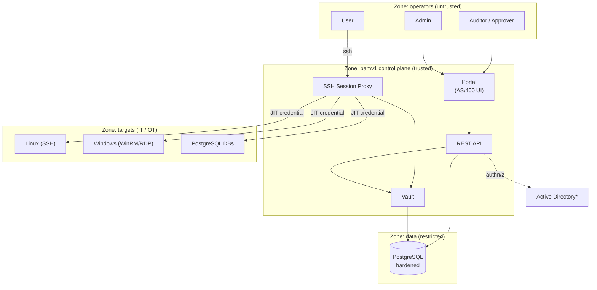
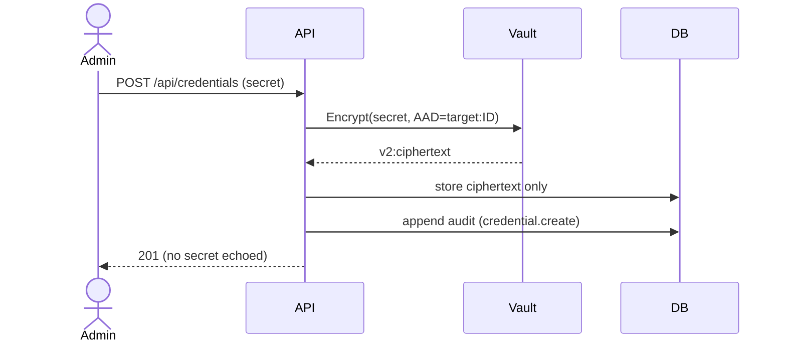
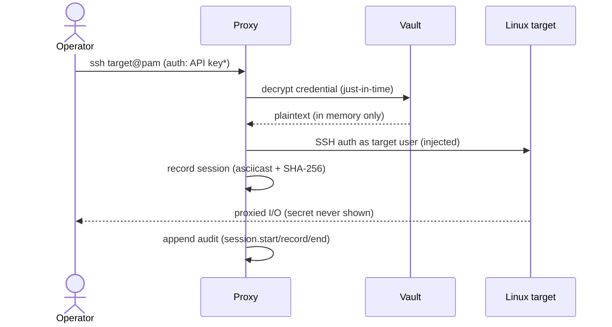
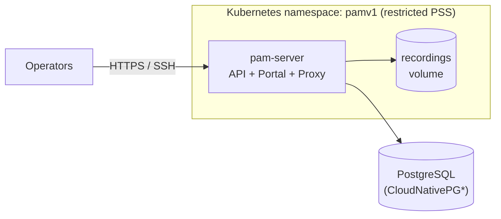

# pamv1 — High-Level Architecture

> **Living document.** Update this on every change that alters components,
> boundaries, data flows or trust zones. Keep it conceptual — implementation
> detail belongs in [ARCHITECTURE-LOW-LEVEL.md](ARCHITECTURE-LOW-LEVEL.md).
>
> **Code-derived diagrams** (package graph, data model, REST surface) are
> generated from the source and CI-enforced current — see
> [ARCHITECTURE-DIAGRAMS.md](ARCHITECTURE-DIAGRAMS.md). This file holds the
> hand-authored conceptual diagrams below.
>
> Last updated: 2026-08-09 · Reflects: Phases 0–94 + the 2026-07 hardening pass — the PostgreSQL database session proxy (15), live session monitoring + command control (16), safes + dependent-account propagation (17), optional CyberArk Conjur secret sourcing (18), access certification campaigns (19), an ITSM/ticketing gate (20), richer approval workflows (21), Zero Standing Privilege via ephemeral SSH certificates (22), privileged threat analytics (23), a Conjur-style application-secrets API for non-agent apps (24), console parity (25), session-recording playback + one-time access (26 — stored recordings replay from the portal hash-verified against the audit trail, and a single-use approval is consumed by the first use it admits), and AI-agent broker completion (27 — approver-group separation of duties, ed25519 in-chain audit checkpoints + signing-key rotation/JWKS + truncation floor, OCSF SIEM export, MCP SSE transport with elicitation; see [AGENT-THREAT-MODEL.md](AGENT-THREAT-MODEL.md)). All four Tier-1 and all three Tier-2 competitive-coverage gaps are closed, plus **two of five Tier-3** (Zero Standing Privilege, threat analytics) and the **first Tier-4** (application secrets); the 5250 console is **keyboard-first** and has **full parity** with the backend. Phases 71–94 deepened rather than widened: bootstrap secrets refreshable at runtime (78), working GitOps deploy examples (79), an end-to-end "prove it is a PAM" CI job (81), **first-class ServiceNow/Jira ticket connectors** (84), **history-aware threat analytics** with a revoke-logins response rung (86), and an adversarial review of the crown-jewel subsystems (91–94) that fixed one SFTP read-only containment gap and confirmed the vault, database proxies and broker four-eyes sound. See the [ROADMAP](../ROADMAP.md) for the authoritative per-phase status and [EXTERNAL-INFRA-GAPS.md](EXTERNAL-INFRA-GAPS.md) for what remains.

## 1. Purpose

pamv1 is an open-source Privileged Access Management system. It stores privileged
credentials in a hardened vault, brokers access to Linux/Windows targets through a
proxy that injects those credentials just-in-time, and records who did what. It is
designed to fit IT and OT (industrial) environments and to support NIS2 obligations.

> ⚠️ Educational project — see the note at the top of the [README](../README.md).

## 2. Actors & trust zones

```mermaid
flowchart TB
    subgraph Z0["Zone: operators (untrusted)"]
        ADMIN["  Admin  "]
        USER["  User  "]
        AUD["  Auditor / Approver  "]
    end

    subgraph Z1["Zone: pamv1 control plane (trusted)"]
        PORTAL["  Portal  <br/>  (AS/400 UI)  "]
        API["  REST API  "]
        PROXY["  SSH Session Proxy  "]
        VAULT["  Vault  "]
    end

    subgraph Z2["Zone: data (restricted)"]
        DB[("  PostgreSQL  <br/>  hardened  ")]
    end

    subgraph Z3["Zone: targets (IT / OT)"]
        LNX["  Linux (SSH)  "]
        WIN["  Windows (WinRM/RDP)  "]
        PGT["  PostgreSQL DBs  "]
    end

    IDP["  Active Directory*  "]

    ADMIN --> PORTAL --> API
    USER -->|"ssh"| PROXY
    AUD --> PORTAL
    API --> VAULT
    PROXY --> VAULT
    VAULT --> DB
    API --> DB
    API -.->|"authn/z"| IDP
    PROXY -->|"JIT credential"| LNX
    PROXY -->|"JIT credential"| WIN
    PROXY -->|"JIT credential"| PGT
```

`*` Active Directory login is partial — LDAP/Entra/OIDC ship; Kerberos/GSSAPI is
deferred (see [roadmap](../ROADMAP.md)). Solid edges = implemented today. Windows
(WinRM/RDP) and the PostgreSQL session proxy ship, but need a real Windows host /
database to verify end-to-end (see [EXTERNAL-INFRA-GAPS.md](EXTERNAL-INFRA-GAPS.md)).

## 3. Components (responsibility view)

| Component | Responsibility | Status |
|---|---|---|
| **Portal** | AS/400-style operator UI; deliberately austere | ✅ Phase 1 |
| **REST API** | CRUD for targets/credentials, audit, authn | ✅ Phase 1 |
| **Vault** | Encrypt/decrypt secrets; key custody | ✅ Phase 1 |
| **Audit** | Append-only trail of every sensitive action | ✅ Phase 1 |
| **Break-glass** | Sealed key + M-of-N quorum unseal, auto-expiring, alerted | ✅ Phase 1/6 |
| **Session Proxy** | Broker SSH; **JIT credential injection**; record sessions | ✅ Phase 2 |
| **Database Proxy** | Broker PostgreSQL; JIT injection; **per-statement query audit** | ✅ Phase 15 |
| **Supervised sessions** | Live watch (SSE) + **command control** (block on exec/WinRM/SQL, the REST WinRM run, and the broker's exec tools) | ✅ Phase 16, 38 |
| **Safes & dependent accounts** | Delegated-access containers; rotation updates service/task/app-pool consumers | ✅ Phase 17 |
| **Access certification** | Periodic campaigns to recertify/revoke who has access to what — scoped to a safe or a subject so a review is finishable, recurring on a schedule, with per-item reviewers and reminders before the due date | ✅ Phases 19, 68–70 |
| **ITSM ticket gate** | Require + validate a change ticket before an access request — first-class ServiceNow/Jira connectors check its state, its change window and that it names the operator (84); re-checked at the moment access is used (60) | ✅ Phases 20/60/84 |
| **Approval workflows** | Multi-tier N-of-M chains, scheduled windows, mandatory reason | ✅ Phase 21 |
| **RBAC** | Four profiles (admin/user/auditor/approver), per-user tokens | ✅ Phase 3a |
| **AD / Entra / OIDC login** | LDAPS + Entra ID (ROPC) + OIDC auth-code SSO, groups/app-roles → roles, session tokens | ✅ Phase 3b |
| **MFA** | TOTP (RFC 6238), recovery codes, enforce-MFA policy | ✅ Phase 3b |
| **Windows access** | WinRM (basic/NTLM) command exec + RDP via Guacamole with an in-portal canvas viewer, JIT credentials | ✅ Phase 4 (only the rendered RDP screen needs a Windows host to verify) |
| **Credential lifecycle** | Rotation (SSH/WinRM connectors), reconciliation + drift remediation, scheduled worker | ✅ Phase 7 |
| **OT session approval** | 4-eyes access-request workflow, per-target/global gate, air-gap mode | ✅ Phase 8 |
| **NIS2 incident export** | Tamper-evident audit export (JSON/CSV, SHA-256), Art. 21 control matrix | ✅ Phase 9 |
| **Observability & ops** | Prometheus `/metrics`, `/healthz`+`/readyz`, Helm chart, SBOM + cosign-signed releases | ✅ Phase 10 (first real release **v0.10.0** published, signed and attested 2026-07-28) | |
| **Custom profiles & config subsystem** | Named capability sets beyond the four roles; DB-persisted, hot-swappable `PAM_*` overrides | ✅ Phase 12 |
| **AI-agent access broker** | Policy over tool + args, JIT server-side execution, keyed-HMAC verifiable audit, MCP transport, SPIFFE SVID | ✅ Phase 13 |
| **Zero Standing Privilege** | `ssh_ca` credentials store no secret; a short-lived SSH certificate is minted per session | ✅ Phase 22 |
| **Privileged threat analytics** | Behavioral risk scoring over the audit trail — history-aware since 86 (baseline from the preceding window, new-target novelty, peer-outlier vs the group median); automated response on the actor's own actions: revoke logins (step-up) or kill sessions | ✅ Phases 23/86 |
| **Application-secrets API** | Conjur-style pull of explicitly-granted secrets by a non-agent app (bearer key) | ✅ Phase 24 |
| **Tamper-evident audit** | Optional HMAC chain over the primary trail + ed25519 signed checkpoints | ✅ 2026-07 hardening |

## 3a. Roles (RBAC)

Four profiles, enforced identically by the API and the proxy through a shared
capability matrix:

| Role | Can | Cannot |
|---|---|---|
| **admin** | everything: manage targets/credentials/users, reveal secrets, connect, read audit | — |
| **user** | connect to targets through the proxy, read the inventory | manage, reveal, read audit |
| **auditor** | read the inventory and the audit trail | manage, reveal, connect |
| **approver** | read inventory + audit, approve/deny access requests (`/api/access-requests`, 4-eyes) | manage, reveal, connect |

Beyond the four built-in roles, admins define **custom permission profiles** — named
capability sets assignable to users (Phase 12) — and AI agents authenticate as a
non-human `agent` role that can only call broker tools (Phase 13).

Identity is a per-user access token, the bootstrap admin key, the break-glass key,
or a directory login (AD/LDAP, Entra ID, OIDC — Phase 3b). A directory user in
several mapped groups carries **all** the roles they map to and is granted the
**union** of those capabilities (not just the single highest role).

## 4. Key flows

### 4.1 Vault a credential (control plane)

```mermaid
sequenceDiagram
    actor Admin
    participant API
    participant Vault
    participant DB
    Admin->>API: POST /api/credentials (secret)
    API->>Vault: Encrypt(secret, AAD=target:ID)
    Vault-->>API: v2:ciphertext
    API->>DB: store ciphertext only
    API->>DB: append audit (credential.create)
    API-->>Admin: 201 (no secret echoed)
```

### 4.2 Access a target via the proxy with JIT injection

```mermaid
sequenceDiagram
    actor Operator
    participant Proxy
    participant Vault
    participant Target as Linux target
    Operator->>Proxy: ssh target@pam (auth: API key*)
    Proxy->>Vault: decrypt credential (just-in-time)
    Vault-->>Proxy: plaintext (in memory only)
    Proxy->>Target: SSH auth as target user (injected)
    Proxy->>Proxy: record session (asciicast + SHA-256)
    Target-->>Operator: proxied I/O (secret never shown)
    Proxy->>Proxy: append audit (session.start/record/end)
```

`*` The operator authenticates with a PAM token (a per-user token, the bootstrap
API key, or a directory/session token); MFA and SSO shipped in Phase 3b.

## 5. Cross-cutting concerns

- **Confidentiality**: secrets encrypted at the application layer (AES-256-GCM) on top of a hardened DB; plaintext exists only transiently inside the proxy during a dial.
- **Attribution**: every sensitive action is an append-only audit event with an actor.
- **Availability / emergency**: break-glass path (Phase 1) → quorum + auto-expiry (Phase 6).
- **Deployability (IaC)**: Docker, docker-compose, Kubernetes manifests, Terraform module — no hand-applied infrastructure.
- **Compliance**: NIS2 Art. 21 mapping (README); IEC 62443 / Purdue positioning for OT (Phase 8).

## 6. Deployment topology (target state)

```mermaid
flowchart LR
    subgraph K8S["Kubernetes namespace: pamv1 (restricted PSS)"]
        POD["  pam-server  <br/>  API + Portal + Proxy  "]
        REC[("  recordings  <br/>  volume  ")]
    end
    PG[("  PostgreSQL  <br/>  (CloudNativePG*)  ")]
    POD --> PG
    POD --> REC
    OP["  Operators  "] -->|"HTTPS / SSH"| POD
```

`*` HA Postgres ships: `deploy/k8s/postgres-cnpg.yaml` is a CloudNativePG `Cluster` with three instances, and `pamv1-pg-rw` follows the primary across a failover.

## 7. Change log

| Date | Change |
|---|---|
| 2026-08-09 | Phase 96 (refactor pass — cross-path security parity): the vendor-contract gate (Phase 29) now binds the agent broker's exec/credential tools as it already bound SSH, the SQL proxies and the RDP/VNC viewer, so a vendor identity is refused an out-of-contract target on every path; a vendor refusal on the SSH proxy now shares the `access.denied` audit vocabulary the SIEM export and risk analytics read; the PostgreSQL/SSH deny paths bound the operator-supplied login like the SQL Server sibling; the proxy WinRM loop fails closed on its run audit; and `-split-key` refuses an unparsable quorum. Plus convention hygiene (doc comments, real gosec annotations, `slices.Contains`, dead-code removal). No structural, schema or route change |
| 2026-08-09 | Phase 95 (documentation currency pass): header 0–70 → 0–94 with the 71–94 arc (runtime secret refresh, deploy examples, the CI PAM proof, ServiceNow/Jira connectors, history-aware analytics, the 91–94 adversarial review); the ITSM and analytics capability rows carry their Phase 84/86 depth |
| 2026-08-06 | Phase 60a: **the use-time gate consumes the approval whose ticket it checked** — Phase 60 looked at one approval's ticket and then let the store pick which approval to spend, so two connections racing could see the second admitted on an approval whose change had been cancelled and whose ticket was never checked; and a single cancelled change could shadow a valid approval behind it for the rest of its window, locking an operator out. The gate now walks the live approvals, claims by id the one it just validated, and refuses only when none passes |
| 2026-08-06 | Phase 61a: **naming a management credential is a use of that credential** — Phase 61 checked only that the named credential existed, which made the reference a way to spend someone else's secret: a caller who could manage credentials but not reveal them could name any credential in the vault, point the dependency at a host they controlled, and let the next rotation deliver the plaintext there. Declaring one now takes the same authorization as revealing it — the capability, a grant on that credential's own target, its approval requirement and the vendor contract gate — and the credential must actually hold a password, so an SSH private key can no longer be sent as a WinRM password |
| 2026-08-02 | Phase 61: **a dependent account names the credential that manages it** — when pamv1 rotated a service account it then logged into the consumer's host *as that same account*, with its new password, to reconfigure the service. That needs administrator rights on the host, which is the opposite of what a service account should have, and hardened ones cannot log on remotely at all — so the feature failed exactly where it was needed, and had nowhere to stand when the rotation was being run to fix a broken account. A dependency can now name a management credential; unset keeps the old behaviour, and the console says in amber which consumers are still relying on it. A named credential that has since been deleted fails the update closed rather than quietly reverting to the old path |
| 2026-08-02 | Phase 60: **the ticket gate holds at connect time** — "no privileged access without an approved change ticket" was enforced when the request was *filed* and never again, so a change cancelled while the approval was still live went on admitting sessions for the rest of its window. With `PAM_TICKET_REVALIDATE` the ticket is put back to the ITSM at the moment access is used, at every gate, through one shared fold — the use-time twin of Phase 58's policy fold, and in the same place because the same five sites were about to drift again. The re-check runs before the approval is consumed, so a refusal costs an operator nothing but the attempt; an ITSM that cannot answer refuses, because a gate that opens when it cannot do its job is not a gate |
| 2026-08-02 | Phase 59a: **the review of the capture** — a max-effort review run the day Phase 59 merged found fifteen defects in it, several of them ways past the very containment it adds, and they are closed here rather than carried. Three bypasses: an open with no access flag (which OpenSSH treats as a read) went uncaptured, a reused request id could orphan the tracking for a whole file, and an overflowing write offset silently turned capture off for the rest of that file. The artifact name is now contained — an unsanitized target name could write outside the recording directory — and a client-chosen path can no longer forge the audit fields the playback tamper check reads. The cap counts reads already in flight, so it bounds a pipelined download rather than only an upload; `lsetstat` joins the governed extensions it should have shipped with; and a captured file's evidence can no longer be crashed, mislabeled as truncated, or served empty by default. The lesson is the same one Phase 38 taught: a control that covers most of a family covers none of it |
| 2026-08-01 | Phase 59: **SFTP per-file content recording** — file operations had an audit trail (32) and paths a policy (51), but the transferred bytes crossed the proxy unrecorded: you could prove `/srv/report.csv` left, never *what* left. With `PAM_SSH_SFTP_CAPTURE` on, every file moved over SFTP leaves a chunk-log artifact beside the session recordings — sealed under the vault KEK, SHA-256 hash-chained, attributed in the audit trail — and replays from the console as the reconstructed bytes. The per-file cap *refuses* data past it (a transfer size limit, not a quiet gap in the evidence), and while capture is on an unparsable stream fails closed instead of passing through opaque. Found along the way and fixed: OpenSSH's `posix-rename` extension had been sliding past the readonly and path-deny gates, which only parsed the classic rename packet |
| 2026-07-31 | Phase 58: **safe-scoped policy** — a safe now carries its own approval requirement and a dual-control floor, binding every target inside it, so "everything in the production safe needs two approvers" is one setting instead of a per-target flag the next onboarding forgets. Strictest-wins with the global and per-target settings (a safe can tighten, never loosen), and the floor is re-read as each approval is cast, so raising it binds requests already in flight. The predicate that decides all this moved into a single shared fold — it had been written out at five enforcement sites, and the proxies are covered by a test that sets neither the global nor the per-target flag |
| 2026-07-31 | Phase 57: **delegation you can issue, remediation you can review** — a parity audit against the [pam-research](https://github.com/morandeirachema/pam-research) prototypes found two mechanisms proven there and missing here, neither needing anything external. The broker now **mints** the delegated agent identities it had only ever verified (RFC 8693 token exchange, `POST /v1/token`): an agent delegates its own authority to a sub-agent, the actor chain grows by exactly one link, impersonation and `scope` are refused by design, and the minted token verifies through the same ingress that issued it. And the blast-radius engine renders its chosen cut as **reviewable Terraform**, so an identity fix goes through the same review-and-apply path as every other infrastructure change here. One catalogue entry was deleted rather than added: token-exchange minting had been listed as blocked on an external STS, and the broker is its own |
| 2026-07-31 | Phase 56: **cross-replica step-up decisions** — the last replica-local session view crosses the cluster: every paused statement is mirrored into a shared, TTL-bounded inventory (the statement itself rests **sealed** under the shared-custody bus key, so a database observer reads ciphertext and a fabricated row is never listed), and a supervisor's decision posted to any replica is dispatched — sealed and freshness-bound, in the kill bus's mold — to the replica whose memory holds the pause, through the same claim point and self-approval refusal. The decide endpoint answers 202 when it dispatches, like a cluster kill. Migration `0026`; no new env var |
| 2026-07-29 | Phase 55: **cross-replica live monitoring** — session *termination* had been cluster-wide since Phase 34, but listing and watching stayed with the pod hosting the session, so a supervisor behind a non-sticky load balancer saw a partial world. Now `GET /api/sessions` merges a shared, heartbeat-refreshed inventory (each session naming its hosting replica; a crashed replica's rows age out) and the SSE watch reaches a session hosted anywhere: an **interest-gated relay** over the store bus forwards a watched session's output only while a remote supervisor is actually watching, so an unwatched session costs the bus nothing. Replicas still never talk to each other directly — the store remains the only inter-replica channel. Step-up decisions remain with the hosting replica (documented) |
| 2026-07-28 | **First release cut: v0.10.0** — the tag ran the test-gated release pipeline end to end for the first time; `ghcr.io/morandeirachema/pamv1:0.10.0` is published (public), cosign-signed, with SPDX SBOM attestation and SLSA provenance. The image pin in the K8s/Helm/Terraform manifests now resolves, meeting the last beta criterion (deploys as code). Docs only — no code change |
| 2026-07-27 | Phase 51: **SFTP path policy** — file transfer could be restricted by operation but not by path, so a read-only session could still download a private key; a regex denylist (the same engine as command control) now refuses named paths in every mode, reads included, and on both sides of a rename |
| 2026-07-27 | Phase 50: **clipboard auditing on the RDP bridge** — the clipboard could be gated but not observed; each transfer is now audited with its direction, type, size and digest (content only on an explicit opt-in, since a privileged clipboard often holds a just-copied password), and auditing never blocks what gating allows |
| 2026-07-27 | Phase 49: **archive to WORM before pruning** — retention no longer just deletes: with `PAM_RETENTION_ARCHIVE_DIR` set, aged audit rows are exported as digest-stamped JSON Lines and aged recordings are moved into a write-once archive, and the delete runs only if that archive succeeded, so a broken archive costs disk space rather than evidence |
| 2026-07-27 | Phase 48: **opaque recording file names** — with `PAM_RECORDING_OPAQUE_NAMES` a recording file is named by timestamp and random hex instead of target and actor, so a backup or snapshot of the recording volume no longer reveals who accessed which system; the mapping lives in the audit trail and the recordings listing resolves it back for anyone who may already read audit |
| 2026-07-27 | Phase 47: **LEEF + TLS for the SIEM forwarder** — the audit stream speaks IBM QRadar's LEEF 2.0 alongside RFC 5424 syslog and CEF, and can leave the building over TLS (RFC 5425, octet-counted) with always-on, optionally CA-pinned certificate verification — the evidence trail no longer travels only in cleartext |
| 2026-07-27 | Phase 46: **per-item four-eyes on certification** — every access grant records who created it, the certification snapshot carries that creator, and certifying a grant you created yourself is refused and audited (self-revoke stays allowed); the reviewer and the grantor can no longer be the same person |
| 2026-07-27 | Phase 45: **the remaining console screens** — vendors & contract grants, operator SSH certificates (plus a new read-only listing route for their serials), identity blast radius, login-session revocation, AI-agent keys, credential dependencies, and the audit chain's verify / signed-head / OCSF controls are now 5250 screens; with Phase 43's pair this restores **full console parity**, keyboard-first |
| 2026-07-27 | Phase 44: **editable objects and bounded lists** — targets, safes, users and vendors gain `PUT` edit-in-place endpoints (create-equivalent validation and authorization, the user edit re-runs the privilege-escalation guard), so fixing a port no longer means delete + recreate cascading away credentials, grants and safe assignment; every top-level inventory list serves a clamped `?limit=&after=` cursor window (default 100, max 500), closing an authenticated memory-exhaustion vector; the console drains the cursor and gains 2=Change on targets, safes and users |
| 2026-07-27 | Phase 43: **the console's two human decision points** — approving a parked AI-agent tool call (menu 20, arguments shown, since that is what policy gated on) and deciding a paused in-session statement (menu 21, which states that entries expire). Both were curl-only and both are decisions with a deadline; the remaining console screens are planned Phase 45 |
| 2026-07-27 | Phase 42: **shared custody of the SSH host and CA keys** — both were per-pod files, so scaling gave every replica its own host key (a host-key-changed warning that looks like a MITM) and its own certificate authority. They are now claimed atomically in the store, vault-encrypted, so replicas converge on one key; an existing on-disk key seeds custody rather than losing to a freshly generated one |
| 2026-07-27 | Phase 41: **session recordings encrypted at rest** — `PAM_RECORDING_ENCRYPT` seals recordings and WinRM transcripts as chunked AES-256-GCM under a per-recording data key wrapped by the same KEK that protects credentials. Chunked so a killed session still decrypts up to its last complete chunk; the audited SHA-256 and the recording hash chain are unchanged because they cover the stored bytes; playback detects the format per file, so existing recordings keep replaying |
| 2026-07-27 | Phase 40: **every brokered execution is a supervised session** — the REST WinRM endpoint and the agent broker's `winrm_exec`/`ssh_exec` tools now register in the live-session registry like the proxies do, so they are listed by `GET /api/sessions`, counted against the concurrent-session caps (checked before the JIT decrypt) and terminated by the kill switch, the analytics auto-response and the vendor sweeper |
| 2026-07-26 | Phase 39: **approver capability on the two decision points** — releasing a paused (step-up) statement and deciding a certification item now need `approve`, not the read-only audit gate or the user-administration gate. A read-only auditor can still watch; a dedicated approver can now run a recertification without holding any access-granting capability |
| 2026-07-26 | Phase 38: **command control on every command path** — the deny policy moved to `internal/cmdguard` and one compiled guard is now shared by the SSH proxy, the PostgreSQL proxy and the API server, so `POST /api/targets/{id}/winrm` and the agent broker's `ssh_exec`/`winrm_exec` tools obey the same patterns as an operator's `ssh target "cmd"` — enforced before the just-in-time decrypt and audited `command.blocked`. An interactive PTY is still never parsed (not a containment boundary) |
| 2026-07-25 | Phase 36: **retention / pruning** — a leader-locked worker prunes aged session recordings (`PAM_RECORDING_RETENTION_DAYS`, preserving the `.chain` head) and audit rows (`PAM_AUDIT_RETENTION_DAYS`), bounding unbounded disk/table growth. Audit pruning is refused while the tamper-evident HMAC chain is on (it would break verification) — integrity is never silently traded for space. No schema change |
| 2026-07-25 | Phase 35: **audit→SIEM forwarding** — a continuous push of every audit event to a syslog/CEF collector (`internal/auditfwd`), tailing the trail from a durable cursor with spool-and-retry, leader-locked in HA. Complements the pull-based OCSF export and event-triggered alerts. `PAM_AUDIT_FORWARD_ADDR`; no schema change |
| 2026-07-25 | Phase 34: **HA session kill-switch** — the live-session registry was per-replica, so a kill (kill-switch, revoke cascade, vendor offboard, analytics auto-response) only reached sessions on the pod that received it. A cross-replica **kill bus** (Postgres LISTEN/NOTIFY; in-process for the memory store) now broadcasts kills so a session is terminated wherever it is hosted. `DELETE /api/sessions/{id}` returns 202 when the kill is dispatched cluster-wide. Live monitoring stays per-replica (documented). No schema change |
| 2026-07-25 | Phase 33: **RDP clipboard control** — the in-portal RDP viewer (Guacamole) left the clipboard on both ways by default, an unaudited copy-out / paste-in channel. `PAM_RDP_CLIPBOARD` now gates it — `allow` / `readonly` (block paste into the target) / `deny` (off both ways) — and drive redirection is always disabled. The RDP analog of Phase 32; no schema change |
| 2026-07-25 | Phase 32: **SFTP file-transfer control + audit** — the SSH proxy now parses the SFTP subsystem stream (`internal/proxy/sftpguard.go`) instead of passing it through opaque. `PAM_SSH_SFTP` sets the policy: `allow` (forward + audit every file op — `sftp.session`/`open`/`modify`), `readonly` (refuse uploads/deletes/renames with a synthesized permission-denied, `sftp.blocked` — the target is never contacted), or `deny` (refuse the subsystem, `sftp.denied`). Closes an unaudited file-exfiltration path in the flagship proxy; no schema change |
| 2026-07-25 | Phase 31: **identity blast-radius / CIEM engine** (`internal/blast`) — a read-only posture engine over a normalized identity graph: a real **AWS IAM effective-permission evaluator** (deny > SCP > boundary > allow, wildcards, unmodeled conditions → uncertain), **pivot-vs-containment** reachability + who-can-reach, toxic-combination **findings** with derived severity, and **remediation-as-code** cutting the earliest escalation edge. `POST /api/blast/analyze`. Opens the Tier-3 cloud-CIEM gap honestly (engine complete; live ingestion is external) |
| 2026-07-25 | Phase 30: **in-session policy + step-up** — the agent-broker policy engine gains **numeric comparators** (`gte`/`gt`/`lte`/`lt`, e.g. gate an amount); the PostgreSQL session proxy gains **in-session step-up** — a `PAM_DB_STEPUP_FILE`-matched statement pauses for a supervisor's live decision (`POST /api/sessions/{id}/stepup`) and the session stays open, unlike a kill (`session.StepUp`) |
| 2026-07-25 | Phase 29: **third-party vendor access gate** — a vendor reaches a target only within a customer-approved, time-boxed **contract grant** (`internal/vendor`, migration `0021`); approval enforces four-eyes + a **live employment attestation** webhook; **offboarding** revokes every grant and cuts live sessions; a **sweeper** ends a session when its window closes; per-vendor **SOC 2/DORA evidence** export. Enforced on every connect path |
| 2026-07-24 | Phase 28: **operator-issued SSH certificates** — the Phase-22 CA now also signs an operator's own public key into a short-lived, principal-scoped certificate (`POST /api/ca/ssh/{challenge,sign}`, proof-of-possession + the same connect authorization as the proxy), with **KRL revocation** (`POST /api/ca/ssh/revoke`, `GET /api/ca/ssh/krl` — a real OpenSSH KRL verified against `ssh-keygen`). Migration `0020`; audit `ssh.cert_{issued,denied,revoked}` |
| 2026-07-24 | Phase 27: **AI-agent broker completion** — approver-group **separation of duties** on parked calls (`broker.approval.refused`), periodic **ed25519 in-chain audit checkpoints** with **signing-key rotation** (JWKS at `/v1/audit/jwks`) and a **min-entries truncation floor** (`/v1/audit/verify?min_entries=`), **OCSF** SIEM export (`/api/audit/ocsf`, `internal/ocsf`), and the **MCP SSE transport with elicitation** (`GET /mcp`; a declined elicitation withdraws the requester's own parked call). New threat-model doc; no schema change |
| 2026-07-24 | Phase 26: **session-recording playback + one-time access** — stored recordings replay via `GET /api/recordings[/{name}]` (auditor+) with the file's SHA-256 re-verified against the audit trail at serve time, and from a 5250 player (menu 19); an access request can be **single-use** — every privileged-use gate (SSH/DB/RDP proxies, reveal, checkout, WinRM run, broker tools) consumes the approval on first use (`access.consumed`, migration `0019`, `PAM_ACCESS_ONE_TIME`) |
| 2026-07-23 | Doc-quality pass: corrected the Windows-access status (marked shipped consistently across the trust-zone diagram, components table, and footnote — it needs a Windows host to verify end-to-end, not "planned"); added the PostgreSQL target node; header currency |
| 2026-07-22 | **Security gap-analysis hardening pass** — closes the gaps from a repo-wide self-audit ([SECURITY-GAPS.md](SECURITY-GAPS.md)) without touching the architecture: safe-scoped targets are default-deny, the DB proxy enforces the MFA-enrollment gate, secret delivery is fail-closed on the audit trail, upstream DB TLS is verifiable, both proxies throttle auth, admin session-revocation lands, and the deployment gets a default-deny NetworkPolicy. The core invariant (operator never holds the credential) was already sound; these harden the trust boundaries around it |
| 2026-08-08 | Phases 68–70: **certification campaigns become operable at scale** — a campaign is scoped to one safe or one subject (an unscoped review of every grant is a list nobody finishes), `recur_days` makes it the anchor of a recurring series whose successors inherit the scope (closing the anchor stops it), every item carries a reviewer with a per-reviewer queue, and a due date produces reminders that name who is holding it up and stop when the work is done. One new leader-locked hourly worker; migrations 0029–0031, all additive |
| 2026-08-07 | Phases 62–67: **the 2026-08-07 sweep, and what closed it** — a cross-replica step-up decision now names the *pause* it was made about (a captured one could otherwise release the operator's next flagged statement inside its freshness window), recording playback fails closed on its audit, the SFTP capture handle table is bounded on the request leg, the container build is cached and pinned by digest, and the token exchange finally has a console screen — the last curl-only capability, so *full console parity* is true rather than nearly |
| 2026-07-24 | Phase 25: **console parity** — 5250 screens for every capability that was API-only: safes (menu 16), certification campaigns (menu 17), risk analytics (menu 18), a live session watch pane (*Active Sessions* option 5, over the Phase 16 SSE stream), and the ticket / N-of-M / scheduled-window fields on access requests. Portal-only; no new routes or schema |
| 2026-07-21 | Phase 24: **application-secrets API** (Tier-4) — a Conjur-style path (`PAM_APP_SECRETS_ENABLED`) where a non-agent application retrieves the specific secrets it was **explicitly granted** with a bearer key (`GET /v1/app-secrets/{credential_id}`); default-deny, granting needs `reveal_secret`, every retrieval audited. Managed from a keyboard-first 5250 console screen (menu 15). Also: the console is now **keyboard-first** (mouse optional) |
| 2026-07-21 | Phase 23: **privileged threat analytics** (Tier-3) — an explainable behavioral risk scorer over the audit trail (`GET /api/analytics/risk`); a background worker alerts on newly elevated high/critical actors and can terminate a critical actor's live sessions. Named signals, per-signal caps, a re-alert cooldown; the CyberArk PTA gap |
| 2026-07-23 | **In-portal RDP viewer** — the portal now renders RDP itself (vendored Apache Guacamole JS client, *Work with Targets* option 7), closing the last-mile display gap; the credential still reaches only guacd. A short-lived token (`POST /api/rdp-token`) keeps the operator's key out of the WebSocket URL, and a latent bug that had broken *all* WebSocket upgrades through the access log (`statusWriter` missing `Hijack`) was fixed. guacd itself ships in the Docker/K8s/Helm deploys |
| 2026-07-21 | Phase 22: **Zero Standing Privilege** (Tier-3) — an `ssh_ca` credential stores no secret; the proxy mints a short-lived SSH certificate just-in-time per session (`PAM_SSH_CA_KEY`), so the account has no standing credential. The Teleport / CyberArk ZSP model on the existing chokepoint |
| 2026-07-21 | Phase 21: **richer approval workflows** — an access request can require several distinct approvers (N-of-M chains), be scheduled for a future maintenance window (not-before/not-after), and demand a reason code. Completes the Tier-2 access-governance gaps |
| 2026-07-21 | Phase 20: **ITSM / ticketing gate** — an access request can require a change/incident ticket, validated by a regex format and/or a webhook the ITSM system answers 2xx for a valid ticket, then stamped into the audit trail. The "no access without an approved change" control (`PAM_REQUIRE_TICKET`) |
| 2026-07-21 | Phase 19: **access certification campaigns** — a manager creates a campaign that snapshots who currently has access to what (target grants + safe members), then certifies or revokes each item; a revoke removes the underlying grant. The SOX/ISO/NIS2 access-review control, and the first Tier-2 competitive-coverage gap |
| 2026-07-21 | Phase 18: **Conjur secret sourcing** — pamv1 can fetch its own bootstrap secrets (master key, API key, DB URL, …) from CyberArk Conjur at startup (`PAM_CONJUR_URL`, authn-api-key or Kubernetes authn-jwt), as a runtime-broker alternative to the SOPS GitOps sealing (Phase 14). Both ship; SOPS stays the zero-dependency default. Hand-rolled client, no new dependency; fail-loud when configured but unreachable |
| 2026-07-21 | Phase 17: **safes + dependent-account propagation** — named containers group targets and delegate who may connect (a safe member reaches every target in the safe; delegated `can_manage` administration), and rotating a credential now updates its declared consumers (Windows Services / Scheduled Tasks / IIS App Pools) over WinRM so auto-rotation doesn't break production. Closes the last two Tier-1 competitive-coverage gaps |
| 2026-07-21 | Phase 16: **supervised sessions** — a supervisor can watch an in-progress SSH or PostgreSQL session live over `GET /api/sessions/{id}/stream` (Server-Sent Events, `CapReadAudit`), and **command control** blocks a dangerous command before it reaches the target on the exec, WinRM and SQL paths (regex denylist, `PAM_COMMAND_DENY_FILE`, audited `command.blocked`). Third Tier-1 competitive-coverage gap |
| 2026-07-20 | Phase 15: **database session proxy** — a second listener (`PAM_DB_ADDR`) brokers PostgreSQL with the same JIT chokepoint as SSH. An operator points `psql` at pamv1 with their PAM key; the proxy runs every authorization gate, injects the vaulted DB credential just-in-time, authenticates upstream (cleartext/MD5/**SCRAM-SHA-256**), and audits **every SQL statement** (`db.query`) — the operator never sees the database password. First of the Tier-1 competitive-coverage gaps (database access management) |
| 2026-07-20 | Post-review hardening: a directory user now gets the **union** of every mapped group's role (not the single highest); a parked agent approval is **re-validated at decision time** (revoked key / expired SVID refused); broker-audit append serializes across processes under a **Postgres advisory lock** so a rolling-deploy/HA overlap can't fork the hash chain; numeric policy args match in plain decimal |
| 2026-07-20 | Phase 14: **SOPS-encrypted secrets** — the Kubernetes Secret manifest is sealed with [SOPS](https://github.com/getsops/sops)+[age](https://age-encryption.org/) (`encrypted_regex` over `data`/`stringData`) so it lives in the IaC repo without leaking; `apply.sh` streams decrypt→`kubectl apply` (plaintext never on disk); a CI `sops` job proves the committed example is encrypted and round-trips |
| 2026-07-20 | Phase 13: **AI-agent access broker** — a policy engine decides allow/deny/require-approval on a tool call **and its arguments**; approved calls execute server-side with a just-in-time credential (the agent never holds one); keyed-HMAC **verifiable audit chain** + signed head. Opt-in via `PAM_BROKER_POLICY_FILE`. Ships with approval/resume + single-use tokens, an **MCP** JSON-RPC transport (`POST /mcp`), and **SPIFFE JWT-SVID + RFC 8693 delegation** identity |
| 2026-07-20 | Phase 12: **configuration subsystem + custom-profile RBAC** — directory/SSO/policy bindings become editable (hybrid: DB-persisted overrides vs IaC-only transport/TLS), hot-swapped without a restart; named permission profiles assignable to users; 5250 console screens for profiles, config, and effective-config/IaC export |
| 2026-07-20 | Phase 11: **full 5250 management console** — role-aware menu (`GET /api/me`) surfacing every operation (targets+grants, credentials, active sessions + kill, 4-eyes approvals, check-out, users, MFA, discovery, reconcile, audit export, break-glass) |
| 2026-07-19 | Phase 10: scale & operations — Prometheus `/metrics`, health/readiness split (`/readyz`), Helm chart, SBOM + cosign-signed release pipeline |
| 2026-07-19 | Phase 9: NIS2 compliance pack — tamper-evident audit export for Art. 23 incident reporting, Art. 21 control matrix, retention/SIEM guidance |
| 2026-07-19 | Phase 8: OT adaptation — 4-eyes session-approval workflow (enforced on proxy/WinRM/RDP), air-gap mode, industrial-DMZ deployment guide (Purdue / IEC 62443) |
| 2026-07-19 | Phase 7: credential lifecycle — automatic rotation (SSH `chpasswd` / WinRM `net user` connectors), account reconciliation with drift detection + remediation, scheduled lifecycle worker |
| 2026-07-19 | Phase 6: break-glass v2 (M-of-N quorum unseal, auto-expiring emergency sessions, real-time alerting); AWS KMS KEK |
| 2026-07-19 | Phase 5: transport hardening (HTTPS/headers/rate-limit), vault key rotation, backup runbook; Phase 2 completed (per-target grants, live sessions + kill, hash-chained recordings, reveal lockdown) |
| 2026-07-18 | Phase 3b hardening: OIDC Authorization Code SSO (PKCE + JWKS signature validation) |
| 2026-07-18 | Phase 4: Windows targets — WinRM (basic/NTLM) command execution + RDP brokering via Guacamole guacd, JIT credential injection |
| 2026-07-18 | Phase 3b: AD (LDAPS) **+ Entra ID (Azure AD)** login, groups/app-roles → roles, session tokens; **TOTP MFA**; envelope-encrypted vault + operational logging |
| 2026-07-18 | Phase 3a: RBAC with four profiles (admin/user/auditor/approver), per-user tokens, enforced in API + proxy |
| 2026-07-18 | Phase 2: SSH session proxy with JIT injection + recording added |
| 2026-07-17 | Phase 1: vault, inventory, audit, break-glass, portal, IaC |
