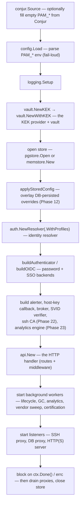
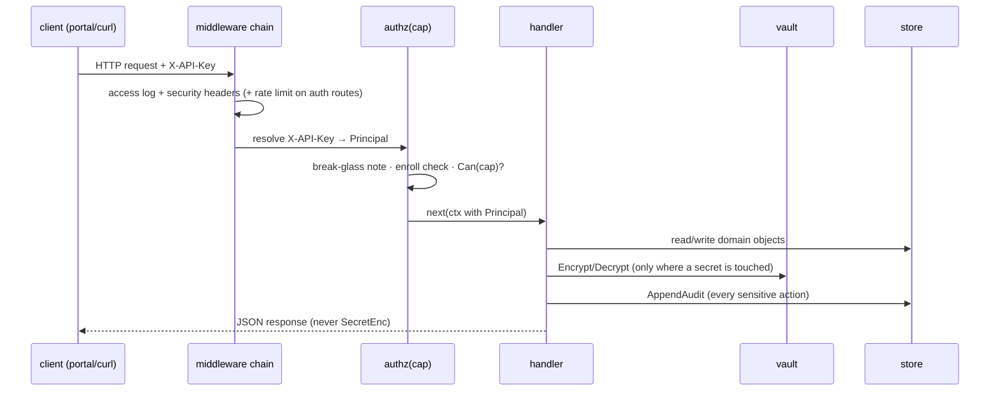
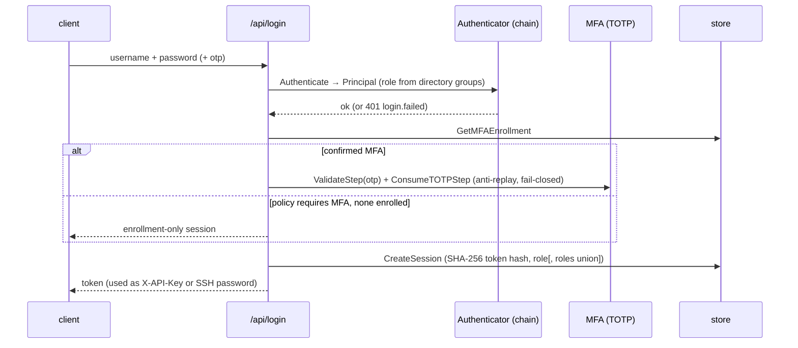
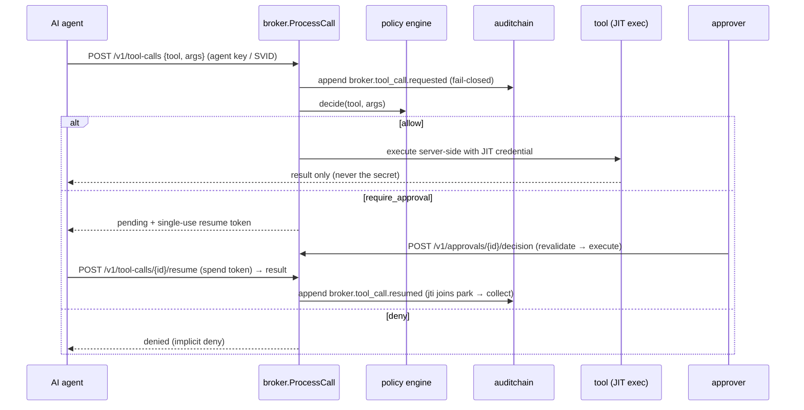

# PAMv1 — Code Guide (how it all works)

> **Living document.** This is the developer's narrative walkthrough of the whole
> codebase: what each package does, how the load-bearing flows work end to end,
> and the invariants that hold it together. It complements the two architecture
> docs — [ARCHITECTURE-HIGH-LEVEL.md](ARCHITECTURE-HIGH-LEVEL.md) (the conceptual
> view) and [ARCHITECTURE-LOW-LEVEL.md](ARCHITECTURE-LOW-LEVEL.md) (the reference
> map) — by explaining *how the code actually runs*. Keep it current: when you
> change a subsystem, update its section here in the same change.
>
> Last updated: 2026-09-02 · Reflects: Phases 0–227 and 229–237 + the 2026-07 hardening passes.
>
> New here and more comfortable in Python than Go? Read
> [§0.1 Reading Go when you write Python](#01-reading-go-when-you-write-python)
> first — it is the translation table for the Go habits that appear on nearly
> every page of this codebase.

---

## 0. How to read this guide

If you are new to the codebase, read §1 (the big picture) and §2 (bootstrapping),
then §5 (the session proxy — the heart of the system). Everything else is a
subsystem you can read on demand. Each section names the real files and the key
functions so you can jump straight to the source.

Prerequisites: Go 1.26 on `PATH` — the floor `go.mod` declares (this environment installs it under
`~/.local/go/bin`). Build with `go build ./...`, test with `go test ./...` (CI
runs `go test -race ./...`), format with `gofmt -l .` (must print nothing).

## 0.1 Reading Go when you write Python

You do not need to *write* Go to follow this codebase, but a handful of Go
habits look strange from Python and appear on nearly every page. This section is
the translation table. If something in a source file confuses you, it is
probably here.

**Errors are returned, not raised.** There is no `try`/`except`. A function that
can fail returns its result *and* an error, and the caller checks it
immediately:

```go
target, err := s.store.GetTarget(ctx, id)   // two return values at once
if err != nil {                             // nil == Python's None
    return err                               // pass the failure upward
}
```

That `if err != nil` appears constantly. It is the equivalent of an `except`
block written inline, and it is why Go code has no invisible control flow — a
function either returns normally or you can see exactly where it bailed out.
In a security codebase this is a feature: every failure path is visible on the
page, which is what makes "fail closed" auditable.

**`nil` is Python's `None`,** with one trap worth knowing: a method can be
called on a `nil` value if it is written to expect it. You will see this
deliberately, e.g. `cmdguard.Guard.Blocked` returns "not blocked" when the guard
itself is `nil`, so callers need no `if guard != nil` around every use.

**`ctx context.Context` is the first argument almost everywhere.** Think of it as
a cancellation signal plus request-scoped values, threaded manually instead of
living in a thread-local. When an HTTP request is aborted or a session is
killed, the context is *cancelled*, and every function holding it can notice and
stop. Passing the wrong context (or `context.Background()`, which is never
cancelled) is a real bug class — see finding O in
[SECURITY-GAPS.md](SECURITY-GAPS.md).

**`defer` runs a line when the function exits,** like a `finally:` block or a
context manager's `__exit__`. `defer f.Close()` right after opening a file means
"close this whichever way we leave".

**Methods hang off a type via a receiver.** `func (s *Server) listTargets(...)`
is roughly Python's `def list_targets(self, ...)` on class `Server`, where `s`
is `self`. The `*` means the method gets a pointer — a reference to the same
object rather than a copy.

**Capitalisation is visibility.** An identifier starting with a capital letter is
exported (public, importable by other packages); lowercase is private to its
package. `Server` is public, `listTargets` is not. There is no `_private`
convention because the compiler enforces it.

**Interfaces are implicit.** A type satisfies an interface simply by having the
right methods — no `implements` declaration. This is why `store.Store` can have
two completely independent implementations (`memstore` for tests, `pgstore` for
production) that never mention each other. It is also why the *contract test*
(`internal/store/storetest`) matters so much: it is the only thing holding the
two to identical behaviour, and when it misses a case they can silently diverge
(finding AF).

**Goroutines and channels are the concurrency model.** `go doSomething()` starts
a lightweight thread; a `chan` is a typed queue used to pass values between
them. `select` waits on several channels at once. Closest Python analogue is
`asyncio` tasks and queues, except goroutines are pre-emptive and can run truly
in parallel — hence `sync.Mutex` for shared state and the `-race` flag in CI,
which detects unsynchronised access at runtime.

**Slices and maps.** `[]Target` is a list; `map[string]bool` is a dict. Both are
passed by reference-like semantics, so a function can mutate the caller's data —
which is why several places in this codebase deliberately copy before returning
(`memstore` clones time pointers so callers cannot mutate stored rows).

**Tests live beside the code** in `*_test.go` files and run with `go test`.
`t.Fatalf` is an assertion that stops the test. A file ending `_internal_test.go`
here is a test *inside* the package (it can see private identifiers); the others
sit in an external `package api_test` and exercise only the public surface.

**Struct tags control JSON.** The backticked text after a field —
`` Name string `json:"name"` `` — is metadata. The one that matters most in this
codebase is `` `json:"-"` ``, which means *never serialise this field*. It is
what stops `Credential.SecretEnc` from ever reaching an API response, and it is
load-bearing security, not decoration.

---

## 1. The big picture

PAMv1 is a **Privileged Access Management** system: it holds privileged
credentials encrypted at rest, and it puts itself *in the middle* of every
privileged connection so that operators reach targets **through** PAMv1 without
ever seeing the credential. The one idea the whole system is built around:

> **Trust the chokepoint, not the client.** The secret is decrypted just-in-time
> inside PAMv1, injected into the upstream connection, and never handed to the
> operator. Every use is recorded and audited.

It is a **single Go binary** (`cmd/pam-server`) that runs several listeners:

- an **HTTP server** (`:8080`) serving the REST API and the embedded 5250-style portal,
- an **SSH proxy** (`:2222`) — the session gateway,
- optionally a **PostgreSQL proxy** (`:5433`) for database sessions.

Everything under `internal/` is a focused package the binary wires together.
Since Phase 153 there is a second, much smaller deployable — `cmd/pam-agent`,
the outbound-only endpoint agent that runs ON a target PAMv1 cannot dial into
and holds a reverse tunnel to the SSH proxy (`internal/endpointagent`); it is
a client of pam-server, not a server of anything.

### Package map


```mermaid
flowchart TB
  subgraph entry["cmd/pam-server"]
    main["main.go — config, wiring, listeners, shutdown"]
  end
  subgraph core["Core security"]
    vault["vault — envelope encryption + pluggable KEK"]
    store["store — persistence interface + domain types<br/>(memstore, pgstore)"]
    auth["auth — roles, capabilities, Principal, Resolver"]
    keycustody["keycustody — shared custody of generated keys"]
    cmdguard["cmdguard — command denylist (all discrete-command paths)"]
  end
  subgraph front["Front doors"]
    api["api — REST handlers + authz middleware + portal wiring"]
    proxy["proxy — SSH/DB session gateway (JIT injection, recording)"]
    web["web — embedded portal (index.html, nonce CSP)"]
  end
  subgraph identity["Identity"]
    ldap["auth/ldap · entra · chain"]
    oidc["oidc"]
    saml["saml — SAML 2.0 SP (crewjam/saml)"]
    mfa["mfa (TOTP)"]
  end
  subgraph lifecycle["Credential lifecycle"]
    rotate["rotate — SSH/WinRM connectors"]
    discovery["discovery"]
    maint["maint — KEK rotation"]
  end
  subgraph agents["AI-agent broker"]
    policy["policy"]
    broker["broker"]
    agentid["agentid (keys + SVID)"]
    auditchain["auditchain"]
    mcp["mcp"]
  end
  subgraph zsp["Zero Standing Privilege / analytics"]
    sshca["sshca — SSH cert authority"]
    analytics["analytics — risk scoring"]
    blast["blast — identity blast radius (CIEM)"]
  end
  subgraph support["Supporting"]
    session["session — registry + live hub + endpoint-agent registry"]
    endpointagent["endpointagent — outbound-only agent client (cmd/pam-agent)"]
    winrm["winrm"]
    guacd["guacd (RDP)"]
    alert["alert"]
    shamir["shamir (break-glass)"]
    conjur["conjur"]
    ticket["ticket — ITSM gate (webhook · ServiceNow · Jira)"]
    vendor["vendor — third-party access gate"]
    recording["recording — sealed session recordings"]
    tds["tds — SQL Server (TDS) parsing"]
    auditfmt["auditfmt — audit-detail sanitiser (Field, OneLine)"]
    jwtutil["jwtutil — shared JWT/JWKS primitives (oidc + agentid)"]
    auditfwd["auditfwd — audit→SIEM forwarder"]
    ocsf["ocsf — OCSF audit export"]
    ratelimit["ratelimit — per-IP auth throttling"]
    posture["posture — device/EDR posture attestation webhook"]
    oncall["oncall — on-call/shift attestation webhook"]
    slack["slack — chat-ops request signing + Block Kit messages"]
    icap["icap — ICAP AV/DLP scan client (RFC 3507)"]
    k8sc["k8s — Kubernetes API client (brokered kubectl ops)"]
    sforensics["sessionforensics — post-session exec reconstruction (parsing)"]
    metrics["metrics"]
    config["config"]
    logging["logging"]
  end
  main --> core & front & identity & lifecycle & agents & zsp & support
  api --> core & identity & lifecycle & agents & zsp & session & winrm & guacd & alert & ticket & vendor & recording & ocsf & auditfwd & posture & oncall & slack
  proxy --> core & session & sshca & winrm & tds & recording & posture & oncall & icap
```

The two most load-bearing cross-package couplings — memorize these:

1. **Vault AAD parity.** `store.CredentialAAD(targetID, credentialID)` produces the
   additional-authenticated-data string used to *encrypt* a secret in `api` and to
   *decrypt* it in `proxy`. If the two sides ever compute it differently,
   decryption silently fails. Never inline the AAD string.
2. **Secrets never leave as data.** `Credential.SecretEnc` is `json:"-"` — it must
   never be serialized to any client. Plaintext exists only transiently inside the
   proxy's `resolve → dialUpstream` path and the audited `reveal` path.

---

## 2. Bootstrapping — `cmd/pam-server/main.go`

`main()` is a small dispatcher over utility flags (`-genkey`, `-hashkey`,
`-rotate-kek`, `-split-key`, `-healthcheck`); the default path is `run()`, which
builds and starts the server. The startup order matters — later steps depend on
earlier ones:


```mermaid
flowchart TD
  A["conjur.Source — optionally fill empty PAM_* from Conjur"] --> B["config.Load — parse PAM_* env (fail-loud)"]
  B --> C["logging.Setup"]
  C --> D["vault.NewKEK → vault.NewWithKEK — the KEK provider + vault"]
  D --> E["open store — pgstore.Open or memstore.New"]
  E --> F["applyStoredConfig — overlay DB-persisted overrides (Phase 12)"]
  F --> G["auth.NewResolver(.WithProfiles) — identity resolver"]
  G --> H["buildAuthenticator / buildOIDC — password + SSO backends"]
  H --> I["build alerter, host-key callback, broker, SVID verifier,<br/>ssh CA (Phase 22), analytics engine (Phase 23)"]
  I --> J["api.New — the HTTP handler (routes + middleware)"]
  J --> K["start background workers — lifecycle, GC, analytics, vendor sweep, certification"]
  K --> L["start listeners — SSH proxy, DB proxy, HTTP(S) server"]
  L --> M["block on ctx.Done() / errc — then drain proxies, close store"]
```

Key points:

- **Fail-loud config.** `config.Load` (`internal/config/config.go`) reads every
  `PAM_*` variable, parses booleans/ints strictly (a garbage value on a security
  toggle is an error, never a silent default), and validates cross-field
  constraints (TLS all-or-nothing, break-glass threshold ≥ 2, business-hours
  window valid, etc.). A bad config aborts startup.
- **The pristine baseline.** `main` keeps `base := *cfg` (the env-only config)
  *before* overlaying DB-persisted overrides, so the hot-swap `reconfigure`
  closure can rebuild identity backends from `env + current overrides` later
  without a restart.
- **Graceful shutdown.** On SIGTERM the run context is cancelled; `drainProxy`
  waits (bounded) for the SSH and DB proxies to flush in-flight sessions' closing
  audit + recordings **before** the deferred `store.Close()` runs. A fatal
  listener error is delivered on `errc` and triggers the same drain.

---

## 3. Cross-cutting foundations

### 3.1 `config` — runtime configuration

All configuration is `PAM_*` environment variables (12-factor). `config.Config`
is a flat struct; `config.Load()` fills it with strict parsing. A subset of
settings (identity backends, SSO, operational policy) is **hot-swappable** at
runtime via `PUT /api/config` — see §4.5. Bootstrap/transport settings (listen
addresses, TLS, DB URL, KEK) stay environment-only and require a restart.

The full env-var table lives in
[ARCHITECTURE-LOW-LEVEL.md §4](ARCHITECTURE-LOW-LEVEL.md#4-configuration-env-pam_)
and [.env.example](../deploy/docker/.env.example).

### 3.2 `vault` — envelope encryption

This is the core at-rest crypto. It uses the KMS-vendor **envelope** pattern:
each secret is sealed with its own fresh random **data key** (DEK), and that DEK
is **wrapped by a Key Encryption Key** (KEK). `internal/vault/vault.go`:

- `Encrypt(ctx, plaintext, aad)`:
  1. generate a random 32-byte DEK,
  2. AES-256-GCM `Seal` the plaintext with a random 12-byte nonce, authenticating `aad`,
  3. `kek.Wrap(dek)` — the DEK is encrypted by the KEK,
  4. pack `uint16(len(wrapped)) ‖ wrapped ‖ nonce ‖ ciphertext`, base64url it, prefix `"v2:"`.
- `Decrypt(ctx, token, aad)` reverses it, unwrapping the DEK via the KEK and
  `Open`-ing the GCM ciphertext. Any failure — wrong version, tampered bytes,
  **wrong `aad`**, or a KEK error — returns `ErrInvalidToken` without leaking the
  cause. The DEK is zeroed (`defer zero(dek)`) after use.

The **`aad`** is the load-bearing binding: `store.CredentialAAD(targetID, credID)
= "target:%d/cred:%d"`. Because it names both the target and the specific
credential row, a ciphertext copied onto another credential fails to decrypt —
which is why a new credential is inserted first (to assign its ID) and its secret
encrypted and stored in a second step.

- **`"v2:"` is a versioned token format** for key/format rotation — preserve it.
- The **KEK is pluggable** (`internal/vault/kek.go`, `KEK` interface — `Wrap` /
  `Unwrap` / `ID`), selected by `PAM_KEK_PROVIDER`:
  - `LocalKEK` — an AES-256-GCM key from `PAM_MASTER_KEY` (base64). **Dev/test only.**
  - `TransitKEK` (`transit.go`) — HashiCorp Vault Transit; the KEK never leaves Vault.
  - `AWSKMSKEK` (`awskms.go`) — AWS KMS `Encrypt`/`Decrypt` of the DEK, with an
    `app=PAMv1` encryption context; the CMK never leaves KMS.
  - `PKCS11KEK` (`pkcs11.go`, build tag `pkcs11`) — an on-prem HSM wraps the DEK;
    the default static build ships a stub that returns "not built in".

  `maint.RotateVaultKEK` (`pam-server -rotate-kek`) re-wraps every stored secret
  from one master key to another, preserving `aad`.

### 3.3 `store` — persistence

`store.Store` (`internal/store/store.go`) is one interface with two
implementations. Domain types live in the same file (`Target`, `Credential`,
`AuditEvent`, `AccessRequest`, `Safe`, `Campaign`, `AgentKey`, `Session`, …).
Sentinel errors `ErrNotFound` / `ErrConflict` map to HTTP/SSH errors upstream.

- **`memstore`** (`store/memstore`) — an in-memory implementation for tests and
  the `PAM_DATABASE_URL=memory` demo. It mirrors pgstore semantics (cascade
  deletes, checkout exclusivity, the same sentinel errors) so the same
  conformance suite passes against both.
- **`pgstore`** (`store/pgstore`) — PostgreSQL via [pgx](https://github.com/jackc/pgx).
  Schema is applied by an embedded **migration runner** (`migrate.go`): ordered
  `migrations/*.sql` files, each run once inside its own transaction, tracked in a
  `schema_migrations` table, under a session-level `pg_advisory_lock` so concurrent
  replicas booting together don't race. `0001_init.sql` is the idempotent baseline;
  every later change is a new numbered file (through `0052_slack_user_id.sql` at time of writing).

  Two implementation details are load-bearing:
  - **Error mapping is the contract.** A pgx `PgError` SQLSTATE is translated to
    the sentinels the whole system keys off: `23505` (unique violation) →
    `ErrConflict`, `23503` (foreign-key violation) → `ErrNotFound`, and
    `pgx.ErrNoRows` → `ErrNotFound`. So memstore and pgstore raise the *same*
    errors for the same situations.
  - **The query tracer never logs arguments.** SQL text + rows + duration are
    traced at debug, but arguments are omitted because they carry ciphertext and
    token hashes.
  - **Atomic single-winner operations** avoid check-then-act races: checkout
    exclusivity rests on a partial unique index (`checkouts_one_active_idx`), the
    TOTP anti-replay guard is a conditional `UPDATE … WHERE $step > last_totp_step`,
    and a broker resume token is spent by `UPDATE … SET used_at=now() WHERE jti=$1
    AND used_at IS NULL AND expires_at>now() AND (subject=$2 OR subject='')
    RETURNING call_id` — the collector binding (Phase 222) is inside the one
    atomic statement, not a check before it. The agent budget
    and the per-token ceiling are spent by `ReserveAgentCall` (Phase 219): the
    purge, both counts and the insert run in one transaction under a per-agent
    advisory lock, so a burst cannot all pass on the same count.
  - **Three distinct advisory locks**: the migration lock and the broker-audit-chain
    append lock (`AppendBrokerAuditLinked`, `pg_advisory_xact_lock`) use different
    single-key values, so a running append never blocks a migration or vice-versa;
    the per-agent reservation lock uses the **two-key** form
    (`pg_advisory_xact_lock(219, hashtext(agent))`), a keyspace of its own, so a
    `hashtext` collision with either of the others is not possible.

The shared conformance suite `storetest.RunStoreContract` exercises the whole
interface — every one of its 220 methods since Phase 217 — against both
implementations (and, in CI, against a live PostgreSQL via
`PAM_TEST_DATABASE_URL`), so the pgstore SQL is verified, not just assumed. Its
assertions are written from the interface's doc comments, not from either
implementation: that is how Phase 217 found four places the two stores
disagreed. `TestStoreMethodSetIsUnchanged` pins the method count, so a role
dropped from the composition fails loudly rather than compiling away.

### 3.4 `auth` — RBAC and identity resolution

`internal/auth` is the **single source of truth for authorization**.

- **Roles**: `admin`, `user`, `auditor`, `approver`, plus the non-human
  `RoleAgent`. Each maps to a `Capability` set via the authoritative `roleCaps`
  matrix. Capabilities: `CapReadInventory`, `CapManageTargets`,
  `CapManageCredentials`, `CapRevealSecret`, `CapConnect`, `CapReadAudit`,
  `CapManageUsers`, `CapApprove`, `CapCallTool`. **Check `principal.Can(cap)` —
  never inline a role string.**
- **`Principal`** is the authenticated identity for a request/session: `Name`,
  `Role` (primary/display), `Roles` (the multi-group union — a directory user in
  several mapped groups gets the **union** of their capabilities), `Caps` (a
  resolved custom-profile capability set), and flags `BreakGlass` / `EnrollOnly`.
  `Can` evaluates the profile set if present, otherwise the union of role
  capabilities.
- **`Resolver.Resolve(ctx, key)`** turns a presented key (the `X-API-Key` header
  or the SSH proxy password) into a Principal, trying in order: the bootstrap
  admin key (`PAM_API_KEY`, compared by SHA-256 in constant time) → admin; the
  break-glass key → admin with `BreakGlass=true`; a per-user token
  (`GetUserByTokenHash`); then a login-session token (`GetSessionByTokenHash`).
  A non-built-in stored role is resolved as a **custom profile**
  (`WithProfiles`). Unresolvable → `ErrUnauthorized` (fail-closed).
- **Custom profiles** (`Profile`) are named capability sets assignable to users as
  an alternative to the four roles. `Covers` enforces "you cannot grant more than
  you hold" when minting users/profiles.
- **Per-target authorization**: `CanConnectTarget(principal, grants)` — a target
  with no grants is open to any connect-capable principal; once it has grants,
  only matching subjects (or admins) may connect. `SubjectMatches` is factored out
  and reused for safe membership.
- **Reachability, the other way round** (`reach.go`, Phase 189):
  `CanConnectTarget` answers "may this principal reach THIS target", which is
  what a connect gate needs. `ReachableTargets(ctx, st, p)` answers "which
  targets may this principal reach at all", which is what a REVIEW needs, and it
  reports the reason for each one (a direct grant, a role grant, safe
  membership, the admin bypass, or nothing gating the target). It is built from
  two subject-indexed store reads instead of asking each target in turn, so the
  cost is four reads no matter how large the estate. Because it re-expresses a
  decision that already exists, the risk is drift, not slowness: the equivalence
  with the `CanConnectTarget` loop is asserted directly in
  `TestReachMatchesCanConnect` (and again over randomly generated estates), which
  is the test to run if you ever touch either.

### 3.5 `logging`, `metrics`, `alert`

- **`logging`** installs the process `slog` logger (json/text, level) and hands
  each component a tagged logger. Distinct from the DB **audit trail** — logs are
  for ops/SIEM, the audit trail is the security record.
- **`metrics`** is a dependency-free Prometheus exposition (`GET /metrics`):
  request counts by status, audit volume, break-glass use, rotations, and an
  active-sessions gauge.
- **`alert`** delivers real-time security alerts (break-glass, analytics) over a
  `Notifier` interface — `Webhook`, `Syslog`, `Email`, and `Multi` (fan-out).
  Delivery is best-effort, non-blocking, and time-bounded. `Noop` drops alerts
  (air-gap mode). One subtle safety property: untrusted fields (an actor name that
  came from a directory claim) have CR/LF stripped before formatting, so a crafted
  name can't inject extra syslog records or forge SMTP headers.

---

## 4. The REST API & portal (`internal/api`, `internal/web`)

### 4.1 Server construction and middleware

`api.New(store, vault, resolver, authn, opts)` builds a `*Server` and its
`http.ServeMux`. The handler chain is `withAccessLog(withSecurityHeaders(mux))`:

- **`withAccessLog`** logs one line per request (method/path/status/bytes/duration/
  actor/remote), skipping health/metrics probes, and increments the request metric.
  It wraps the writer in a `statusWriter` that also delegates `Flush` so the SSE
  streaming endpoints work through the chain.
- **`withSecurityHeaders`** (`middleware.go`) sets `nosniff`, `X-Frame-Options:
  DENY`, `Referrer-Policy: no-referrer`, and HSTS on every response.
- **Rate limiting** (`rateLimiter`, `middleware.go`) is a per-IP fixed-window
  limiter guarding the authentication endpoints (`PAM_AUTH_RATE_LIMIT`); it
  periodically evicts expired windows so the map can't grow unbounded.

### 4.2 The two auth middlewares

Every route is registered in `routes()` (`server.go`) wrapped in one of:

- **`authz(cap, handler)`** — resolves the `X-API-Key` into a Principal, emits the
  loud `breakglass.access` audit + alert if applicable (`noteBreakGlass`), blocks
  an enrollment-only session, then enforces `principal.Can(cap)` (403 +
  `authz.denied` otherwise). The Principal goes into the request context.
- **`authenticated(handler)`** — resolves the Principal without a capability check
  (for endpoints any signed-in identity may call, e.g. `/api/me`, `/api/logout`,
  self-service MFA).

### 4.3 The portal

`internal/web/web.go` serves a single `//go:embed`ed `static/index.html` — the
deliberately austere **AS/400 / IBM 5250 green-terminal** UI. It is vanilla JS
calling the REST API, served under a **per-request nonce-based CSP**: `Index`
mints a random nonce and rewrites the one inline `<script>`'s placeholder, so an
injected inline script cannot execute. If the RNG fails, the nonce is empty and
the page fails closed (blank) rather than downgrading the policy.

The menu is **role-aware**: `GET /api/me` returns the caller's identity + the
stable capability names it holds, and the portal shows only the options the role
may use (panels still tolerate a 403 as a backstop).

It is also **keyboard-first** (the mouse is optional), matching the 5250 heritage:
`render()` calls `focusPrimary()` to land the cursor on each screen's main field
after every redraw (dynamically-inserted `autofocus` is unreliable), `Esc` cancels
/ goes back (the twin of F12), `↑`/`↓` move between subfile option cells, and Tab /
Enter / F-keys work throughout. The look is unchanged — only affordances were added.

Since Phase 25 the console has **full parity** with the backend — screens for
safes, certification campaigns, and risk analytics, plus a live session watch
pane that reads the Phase 16 SSE stream with `fetch` (EventSource cannot send
the `X-API-Key` header; frames are ANSI-stripped into a bounded scrollback).

### 4.4 Request lifecycle (a typical write)


```mermaid
sequenceDiagram
  participant C as client (portal/curl)
  participant M as middleware chain
  participant Z as authz(cap)
  participant H as handler
  participant V as vault
  participant S as store
  C->>M: HTTP request + X-API-Key
  M->>M: access log + security headers (+ rate limit on auth routes)
  M->>Z: resolve X-API-Key → Principal
  Z->>Z: break-glass note · enroll check · Can(cap)?
  Z->>H: next(ctx with Principal)
  H->>S: read/write domain objects
  H->>V: Encrypt/Decrypt (only where a secret is touched)
  H->>S: AppendAudit (every sensitive action)
  H-->>C: JSON response (never SecretEnc)
```

### 4.5 Handler groups

The handlers are split across files by domain; each validates input, translates
store errors to HTTP codes (`storeError`), and appends an audit event:

- **targets / grants / safes** (`targets.go`, `safes_handlers.go`) — inventory
  CRUD, per-target grants, and Phase 17 safes (delegated-access containers whose
  members reach every target in the safe; `EffectiveTargetGrants` = direct ∪
  safe-derived).
- **credentials** (`credentials.go`, `lifecycle_handlers.go`) — create (vaulted),
  reveal (audited, gated), rotate/reconcile, checkout/check-in, delete,
  dependencies. See §7.
- **users / profiles / config** (`users.go`, `profiles_handlers.go`,
  `config_handlers.go`) — mint one-time tokens, custom profiles, and the
  DB-persisted config overrides that **hot-swap** without a restart (an atomic
  `runtimeConf` snapshot behind `s.rtc`, rebuilt by the `reconfigure` closure and
  installed by `applyReconfigure`; a rejected change rolls back).
- **access requests** (`approval_handlers.go`) — the 4-eyes / N-of-M approval
  workflow. See §13.
- **sessions / analytics / audit** (`handlers.go`, `analytics_handlers.go`,
  `compliance_handlers.go`) — live-session list + kill + SSE stream, threat
  analytics (§9), and the tamper-evident audit export.
- **broker** (`broker_*.go`, `mcp_handlers.go`) — the AI-agent access broker (§10),
  served only when a policy file is configured.

---

## 5. The session proxy — the heart of the system (`internal/proxy`)

This is where PAMv1 earns its name. An operator runs
`ssh -p 2222 <creduser>@<target>@pam-host` with their **PAM key/token as the SSH
password**; the proxy authenticates them, resolves the target's credential,
**decrypts the secret just-in-time**, dials the real target injecting that secret,
records the session, and brokers I/O — the operator never sees the credential.

### 5.1 SSH gateway flow (`proxy.go`)

```mermaid
sequenceDiagram
  participant C as ssh client
  participant P as proxy (handleConn)
  participant R as auth.Resolver
  participant S as store
  participant V as vault
  participant U as upstream sshd
  C->>P: SSH handshake; user="root@web-01", password=PAM key
  P->>R: authenticate() resolve password → Principal
  Note over P: username selects the target (splitLogin);<br/>Principal + target stashed in ssh.Permissions
  P->>P: gates: enroll? CapConnect? protocol allowlist?
  P->>S: EffectiveTargetGrants → CanConnectTarget?
  P->>S: approval gate (HasActiveApproval) if required
  P->>V: JIT Decrypt(SecretEnc, CredentialAAD)  %% only after ALL gates
  V-->>P: plaintext (memory only)
  P->>U: ssh.Dial injecting the secret (dialUpstream)
  P->>S: audit session.start · session.record (sha256 + chain)
  loop each session channel
    C-->>U: stdin / requests (pumped)
    U-->>C: stdout/stderr (tee → recording + live hub)
  end
  C->>P: disconnect → audit session.end → optional post-session rotation
```

The critical ordering: **the secret is decrypted only after every authorization
gate passes** (`decryptSecret` is a separate step from `resolveTarget`), so
plaintext never materializes for a session that will be denied.
`dialUpstream` authenticates upstream with a parsed private key (`ssh_key`), a
password (default), or — for Zero Standing Privilege — a freshly minted
certificate (§8). Concurrency: one goroutine per connection (`handleConn`), one
per session channel (`handleSession`), with request pumps and stdin copy in their
own goroutines; teardown is keyed on the connection lifecycle so batch commands'
output and `exit-status` are never truncated. Shutdown is a **bounded drain**
(`Serve` force-closes active connections on ctx-cancel and waits).

### 5.2 Recording + hash chain (`record.go`)

Every session's terminal output is written as **asciicast v2** to
`PAM_RECORDING_DIR` while being SHA-256 hashed as it is written (`Recording`,
concurrency-safe). On close the audit stores the path, byte count, file hash, and
a **chain hash** — `recordChain.append` computes `SHA-256(prevChainHash ‖
fileHash)` and persists the head to a `.chain` file — so recordings are
tamper-evident as a *sequence*, not just individually. `PAM_REQUIRE_RECORDING`
makes a session that can't be recorded fail closed.

### 5.3 Other proxy modes

- **WinRM command loop** (`serveWinRM`/`winrmShellLoop`, `PAM_PROXY_WINRM`) — for
  Windows targets, each operator line runs as a discrete WinRM command (JIT
  credential), output streamed and recorded. Stateless per line.
- **Observer mode** (`<login>+observe`) — a read-only session: output streams and
  records, but operator keystrokes are dropped and exec/subsystem requests refused.
- **Jump host** (`PAM_SSH_JUMP_*`) — reaches targets only accessible via an SSH
  bastion by tunneling a `direct-tcpip` channel (`jumpDial`).
- **Upstream host-key pinning** (`PAM_SSH_KNOWN_HOSTS`) — the proxy verifies the
  target's host key against a known_hosts file (unset ⇒ trust-any + loud warning).
- **Outbound-only endpoint agents** (Phase 153, `endpointagent.go` +
  `internal/endpointagent`, `PAM_ENDPOINT_AGENTS_ENABLED`) — the inverse of the
  jump host: for a target PAMv1 cannot dial at all, a `pam-agent` process ON
  the target dials in to this same listener as `endpoint-agent:<name>` (its
  own bearer key, resolved by hash — `authenticateEndpointAgent`, never the
  human resolver), and `serveEndpointAgent` accepts one `tcpip-forward`,
  refuses every channel the agent opens, and registers an `endpointTunnel` in
  the shared `session.EndpointAgents`. In Python terms: the agent is a client
  that keeps a socket open so the server can later "call it back". When an
  operator's admitted target has an unrevoked `EndpointAgent` row,
  `dialUpstream` receives it as `via` and its dial becomes
  `endpointAgents.Dial(targetID)` → `OpenChannel("forwarded-tcpip")` wrapped
  as a `net.Conn` (`channelConn`) — everything after (`ssh.NewClientConn`,
  JIT auth, recording) is the same code. Offline agent ⇒ error, never a
  direct dial. The agent side (`endpointagent.Run`) is `(*ssh.Client).Listen`
  + `Accept` + pipe to ONE local address, host key pinned, reconnect with
  backoff.

### 5.4 The PostgreSQL proxy (`dbproxy.go`, Phase 15)

A second listener (`PAM_DB_ADDR`, default off) extends the JIT chokepoint to
**databases**. It speaks the Postgres frontend/backend wire protocol via
`pgproto3` (vendored with pgx). An operator connects
`psql "host=pam port=5433 user=<dbcred>@<target> dbname=<db>"` with their PAM key
as the password. It runs the **same authorization gates** as the SSH proxy
(`CapConnect`, `EffectiveTargetGrants`, protocol allowlist, 4-eyes approval), then
JIT-decrypts and authenticates upstream with the vaulted secret (trust / cleartext
/ MD5 / **SCRAM-SHA-256** — the RFC 5802 client that *proves knowledge of the
password without sending it*, best-effort upstream TLS). Every `Query`/`Parse`
becomes a `db.query` audit event and a recorded line. Command control here is
nuanced: a blocked simple `Query` returns an `ERROR` + a fresh `ReadyForQuery` so
the session stays usable, but a blocked extended-protocol `Parse` is fatal
(fail-closed). The shared resolve/decrypt/audit helpers (`lookupTargetCred`,
`jitDecrypt`, `appendAudit`, `recoverPanicLog`) are factored out so both listeners
reuse the security-critical path. It warns loudly at startup if the operator leg
has no TLS (the PAM key would travel cleartext).

### 5.5 Live monitoring + command control (Phase 16)

- **Live monitoring** — `session.Hub` (`session/hub.go`) fans out every recorded
  output byte keyed by session id; `GET /api/sessions/{id}/stream` (`CapReadAudit`)
  streams it as Server-Sent Events so a supervisor watches a session live. The
  proxy tees SSH **and WinRM** output via `teeLive`/`liveWriter` (the WinRM shell
  loop and per-command runner publish the same bytes their recording sees); the
  DB proxy publishes each SQL line; the REST/broker WinRM chokepoint
  (`execWinRM`) publishes a `winrm>` command echo plus output under the session
  id `superviseSession` returns. Fan-out is non-blocking (a slow watcher drops
  frames, never stalls the session). The stream **ends with the session**:
  `Registry.Remove` — the funnel every session-end path passes through — calls
  `Hub.EndSession`, which closes the subscriber channels (wired once via
  `Registry.AttachHub` in `main`), and `streamSession` refuses a not-live id
  with 404 rather than subscribing a watcher to silence (replica-local check,
  audited `session.monitor refused:…`; the recording size cap likewise ends a
  WinRM session via `capWriter` + `session.record_limit` instead of letting it
  run unrecorded with a frozen stream).
- **Command control** — a `CommandGuard` (`cmdguard.go`, regex denylist from
  `PAM_COMMAND_DENY_FILE`) blocks a dangerous command **before it reaches the
  target**: SSH `exec` (the request is vetoed in `pumpRequests`' `onExec`), each
  WinRM line, and each PostgreSQL `Query`/`Parse`. Blocks audit `command.blocked`.

The live-session **registry** (`session/registry.go`) tracks active sessions for
`GET /api/sessions` (list) and `DELETE /api/sessions/{id}` (kill); Phase 23 added
`KillByActor` for automated response.

### 5.6 Session sharing (Phase 116 — `session/share.go`)

A `ShareRegistry` sits beside the Hub and Registry: one `shareSession` per
shared live session, keyed by session id, guarded by its own mutex. Two
mechanisms live there:

- **The input mux** — `mux chan []byte` (buffered, capacity 64). Any writer
  (the primary operator, or any `view_control` joiner) sends into it through a
  `muxWriter`; one reader (`insp.pump`, driven from the proxy's per-session
  goroutine) drains it. Concurrency safety comes from the channel itself — Go
  channels accept any number of concurrent senders natively, so there is no
  lock on the byte path (a `sync.Mutex` guards only the separate roster
  bookkeeping).
- **Guest keys** — `IssueGuestKey` mints 32 random bytes (`crypto/rand`),
  hex-encoded, and stores them **in memory only** (`guests
  map[string]guestBinding`) — never in the database, never hashed. That is a
  deliberate departure from every other bearer credential in this codebase
  (see §2.5 of [PROTOCOLS-AND-CRYPTO.md](PROTOCOLS-AND-CRYPTO.md)), and it is
  why sharing is **replica-local**: unlike `session.Hub`'s Phase 55
  cross-replica relay, a join must land on whichever replica actually hosts
  the session.

Two front doors reach `ShareRegistry`, and neither authenticates the normal
way:

- `internal/proxy/proxy.go`'s SSH `PasswordCallback` recognizes the username
  prefix `join:` — but only *after* its normal `resolver.Resolve(password)`
  call already succeeded, so a join is a PAM login *plus* an invite match,
  never the token alone (see §5.1 for the ordinary handshake this extends).
- `internal/api/sessionshare_handlers.go` serves three routes with no
  `authz(...)` wrapper at all — `POST /api/share/redeem/{token}`,
  `GET /api/share/stream`, `POST /api/share/input` — the same pattern the
  RDP/VNC tunnel routes already use, gated instead by the one-time invite
  token and then the minted guest key.

The store gains a sixth `ShareInviteStore` role (`SessionShareInvite`,
migration `0032`) and eight new audit actions
(`session.share_requested` … `_kicked`); see [ADMIN-GUIDE.md
§9.4c](ADMIN-GUIDE.md#94c-sharing-a-live-session-phase-116) for the
request→approve workflow itself.

---

## 6. Identity & authentication

The login flow lives in `internal/api/authn.go`; the backends under
`internal/auth` (`ldap.go`, `entra.go`, `chain.go`) and `internal/oidc`.

`POST /api/login` (`authn.go`) verifies a username + password against the
configured **`Authenticator`** and issues a **session token** (12h TTL, stored as
SHA-256 only), whose role comes from the directory. If the user has a confirmed
TOTP enrollment, a valid `otp` (or a single-use recovery code) is also required;
if policy requires MFA but the user has none, an **enrollment-only** session is
issued so they can set it up and nothing else.


```mermaid
sequenceDiagram
  participant C as client
  participant L as /api/login
  participant A as Authenticator (chain)
  participant M as MFA (TOTP)
  participant S as store
  C->>L: username + password (+ otp)
  L->>A: Authenticate → Principal (role from directory groups)
  A-->>L: ok (or 401 login.failed)
  L->>S: GetMFAEnrollment
  alt confirmed MFA
    L->>M: ValidateStep(otp) + ConsumeTOTPStep (anti-replay, fail-closed)
  else policy requires MFA, none enrolled
    L-->>C: enrollment-only session
  end
  L->>S: CreateSession (SHA-256 token hash, role[, roles union])
  L-->>C: token (used as X-API-Key or SSH password)
```

- **Password backends** (`Authenticator` interface, composed by `auth.NewChain` —
  try each, first success wins):
  - **LDAP/AD** (`auth/ldap.go`) — service-account bind → search the user under
    `BaseDN` (the filter is `ldap.EscapeFilter`'d, so a username can't inject) →
    read `memberOf` → **re-bind as the user** to verify the password → map groups
    to roles (`MatchedRoles`, so a multi-group user keeps the union). LDAPS is
    *enforced at construction* (the `URL` must be `ldaps://`, so a bind password
    never travels in the clear); the connection is behind an interface so tests
    inject a fake. A credential failure returns `ErrUnauthorized`; an
    infrastructure failure (dial/misconfig) propagates as a distinct wrapped error
    so a misconfig is never silently masked as "wrong password".
  - **Entra ID** (`auth/entra.go`) — OAuth2 ROPC to the tenant token endpoint,
    requesting `openid`; it **validates the id_token's RS256 signature against the
    tenant JWKS** (plus audience + expiry) *and pins the tenant* (`tid` claim must
    equal `PAM_ENTRA_TENANT_ID`) before trusting `roles`/`groups`. The tenant pin
    is load-bearing: Entra signs with keys shared across all tenants, so signature
    + audience alone would accept a token minted in an attacker-controlled tenant.
    ROPC skips IdP-side Conditional Access/MFA — prefer OIDC for production.
  - **OIDC** (`internal/oidc`) — the production browser flow:
    `GET /api/auth/oidc/start` generates PKCE (S256) + state + nonce (persisted via
    `store.PutOIDCState`, so any replica can complete the login), redirects to the
    IdP; `GET /api/auth/oidc/callback` atomically takes the state, exchanges the
    code, and **verifies the ID token against the IdP JWKS**: the algorithm is
    pinned to RS256 (rejecting `none`/HMAC confusion), then iss/aud/nonce/exp are
    checked. `VerifyRS256` (reused by the Entra path) treats a token with *no*
    expiry as invalid — fail-closed, never "never-expires".
  - **SAML 2.0** (`internal/saml`, Phase 151) — the same browser flow for IdPs
    with no OIDC endpoint (AD FS). `saml.New` builds a `crewjam/saml`
    `ServiceProvider` from `Config` (root URL → ACS + metadata URLs, IdP
    metadata fetched or inline, optional RSA key pair); `StartURL` mints the
    AuthnRequest and returns its ID; `ParseResponse` hands the base64
    Response to the library's `ParseXMLResponse` (XML round-trip validation,
    XML-DSig, decryption, Destination/Issuer/InResponseTo/timing/Audience)
    and reduces the assertion to `Claims` (NameID, `NameAttr`, group values,
    session index). The API handlers (`saml_handlers.go`) own the browser
    binding: request ID → `PutOIDCState` with marker `"saml"` + a
    `SameSite=None; Secure` cookie (the ACS is a cross-site POST), taken
    single-use at the ACS before parsing. **Why a library here and not for
    OIDC**: XML-DSig verifies a *canonicalized* form of the XML, and
    canonicalization + `Reference URI` resolution is exactly where the
    signature-wrapping vulnerability class lives — see the package doc comment
    and PROTOCOLS-AND-CRYPTO.md §2.8. `saml/samltest` runs a real IdP
    in-process for tests (`New`, `TrustSP`, `SetSession`, `Login`, `Tamper`).
- **MFA** (`internal/mfa`, TOTP RFC 6238) — self-service `/api/mfa/*`: enroll
  (secret returned once, stored vault-encrypted with AAD `mfa:<user>`), confirm,
  recovery codes (10 single-use, stored as hashes), disable. `checkSecondFactor`
  accepts a TOTP code or a recovery code; the TOTP anti-replay guard
  (`ConsumeTOTPStep`) **fails closed** on a store error.
- **WebAuthn** (`internal/api/webauthn_handlers.go`, Phase 124, the
  `github.com/go-webauthn/webauthn` library) — a second, independent factor
  type: self-service `/api/webauthn/register/*` (any signed-in identity, like
  `/api/mfa/*`) plus `/api/webauthn/login/*`, reachable only by an
  `MFAPending`-scoped session `login()` mints after a correct password when
  the user has no confirmed TOTP but does have a registered credential — see
  `auth.SessionScopeMFAPending` and the `mfaPendingOnly` middleware. Credential
  public keys are stored in the clear (not a shared secret, unlike the TOTP
  secret). Each of `login`/`mfaEnroll`/`mfaDisable`/`mfaRecoveryCodes` reads
  `GetMFAEnrollment`/`ListWebAuthnCredentials` directly rather than through a
  shared "has any factor" helper — `store.EffectiveMFAFactors` (Phase 124)
  attempted that centralization but had no caller that could actually adopt a
  collapsed boolean, since each site needs the concrete `MFAEnrollment` to
  re-prove the current TOTP factor or to branch per-factor; deleted in
  Phase 229.

Session tokens, per-user tokens, recovery codes, and the break-glass key are all
stored **only as SHA-256** — the plaintext is shown once and never persisted.

---

## 7. Credential lifecycle (`internal/rotate`, `lifecycle_handlers.go`, `scheduler.go`)

PAMv1 can change the password **on the target** and re-vault it, so the account's
secret is one only PAMv1 knows and can prove is current.

- **Connectors** (`rotate`): `SSHConnector` rotates over SSH (`chpasswd` fed on
  stdin, so the new password never hits a shell command line) and verifies with an
  SSH handshake; it also rotates `ssh_key` credentials by generating a fresh
  ed25519 keypair and replacing `authorized_keys` (`RotateKey`) and provides the
  broker's one-shot `Exec`. `WinRMConnector` rotates with `net user` and verifies
  with a trivial command. Passwords are generated from a **shell-safe alphabet**
  with guaranteed complexity (`GeneratePassword`), so an injected password can
  never break the command that sets it.
- **Rotate/reconcile** (`lifecycle_handlers.go`): `rotateCredential` records
  `rotate_started` *before* the external change, applies the new secret, then
  re-encrypts + persists on a cancel-detached context; a persist failure after the
  target changed is a **loud, actionable orphan** audit, never a silent lockout.
  Reconciliation verifies the vaulted secret still authenticates and can remediate
  drift by rotating.
- **Checkout/check-in** — an exclusive time-boxed lease (`PAM_CHECKOUT_TTL_MIN`)
  hands the secret to one holder; check-in **rotates** so the seen password dies.
  Enforced single-holder; an expired lease is invalidated (rotated) before re-issue.
- **Discovery** (`internal/discovery`) — TCP-probes hosts for reachable management
  ports and optionally onboards them (reachability only, no credentials tried).
- **Dependent-account propagation** (Phase 17) — after rotation,
  `propagateDependencies` updates each declared consumer (Windows Services /
  Scheduled Tasks / IIS App Pools) over WinRM so rotation doesn't break production.
- **Background worker** (`scheduler.go`, `RunLifecycleWorker`) — reconciles every
  credential each tick and rotates password credentials older than a max age
  (actor `system-scheduler`); it also sweeps expired checkouts.

---

## 8. Zero Standing Privilege (Phase 22 — `internal/sshca`)

Instead of storing a secret for an account, PAMv1 signs a **short-lived SSH
certificate just-in-time** per session — the account has *no standing credential*;
the target trusts only the PAMv1 CA. This is the Teleport / CyberArk ZSP model
built on the existing proxy chokepoint.

- **The CA** (`sshca.CertAuthority`) — `LoadOrCreate(PAM_SSH_CA_KEY)` persists an
  ed25519 CA key (generated on first use, like the host key). `IssueUser(principal,
  ttl, keyID)` generates a **fresh ephemeral keypair** (used for one dial then
  discarded), builds an `ssh.Certificate` (`UserCert`, `ValidPrincipals=[principal]`,
  a serial for audit, `ValidBefore=now+ttl`, standard interactive extensions),
  signs it with the CA, and returns an `ssh.NewCertSigner`.
- **The credential** — `secret_type: "ssh_ca"` stores **no secret** (`SecretEnc`
  empty; only valid on ssh targets; rejected with a secret attached). In
  `proxy.dialUpstream`, an `ssh_ca` credential branches to mint a certificate
  instead of decrypting; a missing CA fails the session closed (`session.error`).
- **Publishing the trust anchor** — `GET /api/ca/ssh` (`CapReadInventory`) returns
  the CA public key in authorized_keys form + a `TrustedUserCAKeys` install hint.
- **Audit** — `session.cert_issued` (serial · principal · valid-before · key-id —
  never the private key). Reconcile reports `ssh_ca` as `unsupported`; post-session
  rotation and the lifecycle worker skip it (nothing to rotate; the cert expired).

```mermaid
sequenceDiagram
  participant Op as operator
  participant P as proxy
  participant CA as sshca CA
  participant U as target sshd (TrustedUserCAKeys = PAMv1 CA)
  Op->>P: ssh root@web-01@pam (PAM key as password)
  Note over P: gates pass; cred.SecretType == "ssh_ca"
  P->>CA: IssueUser("root", 2m, "pamv1:op@web-01")
  CA-->>P: cert signer (fresh ephemeral key, ~2m validity)
  P->>U: dial as root, authenticate with the certificate
  U-->>P: accepts (cert signed by trusted CA, principal matches)
  P->>P: audit session.cert_issued
```

The end-to-end test proves this honestly: the in-process upstream accepts **only**
a CA-signed certificate (no password auth exists), so a passing session proves the
account has no standing secret.

---

## 9. Privileged threat analytics (Phase 23 — `internal/analytics`)

A deterministic, **explainable** behavioral risk scorer over the audit trail — no
opaque model, so every point of a score traces to a named signal.

- **`Engine.Score(events)`** is a pure function (no clock, no I/O): it groups audit
  events by actor and accumulates **signals** — `break_glass`, `command_blocked`,
  `auth_failure`, `off_hours`, `decrypt_failure`, `high_velocity` — each with a
  configurable weight and a per-signal cap. The total maps to a level
  (low/medium/high/critical) via thresholds. `Config` carries the weights,
  thresholds, business hours + their `Location` (off-hours is evaluated in
  `PAM_ANALYTICS_TIMEZONE`, default UTC, because audit timestamps are UTC), and the
  velocity limit; `New` fills zero fields from `DefaultConfig` (a single break-glass
  access alone reaches **high**).
- **Read API** — `GET /api/analytics/risk` (`CapReadAudit`, `?min_level=` /
  `?window_min=`) scores the recent window (`store.ExportAudit`) into per-actor
  findings sorted by score, so an auditor can review risk without changing access.
  `?window_min=` is clamped (7 days) so a single request can't score the whole
  audit table.
- **Worker + automated response** — `RunAnalyticsWorker` (`PAM_ANALYTICS_INTERVAL_MIN`)
  scores each tick and, for a **newly elevated** high/critical actor, appends
  `analytics.risk_flagged` + fires the alert channel, and — with
  `PAM_ANALYTICS_AUTO_KILL` — terminates a critical actor's live sessions via
  `session.Registry.KillByActor` (audit `analytics.auto_response`). The
  alerted-set stores `{score, time}` per actor: a worsening trend alerts
  immediately, a steady state within the cooldown is not re-alerted, and after the
  cooldown (`PAM_ANALYTICS_WINDOW_MIN`) a sustained/recurring incident re-alerts
  and re-kills — the set is pruned on each pass so it can't grow unbounded from
  attacker-controllable actor names.

---

## 10. The AI-agent access broker (Phase 13 — `internal/{policy,broker,agentid,auditchain,mcp}`)

The loop lives in `internal/broker/broker.go`, wired to REST/MCP by
`internal/api/broker_*.go`.

PAM **for AI agents**: an agent holds only an identity key; a policy engine
decides `allow / require_approval / deny` on a **tool call and its arguments**;
approved actions execute **server-side with a JIT credential**; the agent receives
only the result. "Trust the chokepoint, not the agent." Opt-in via
`PAM_BROKER_POLICY_FILE`.

- **Agent identity** (`agentid`) — static bearer keys (`agent_keys`, SHA-256 hash
  lookup) → `RoleAgent` + `CapCallTool`. `SVIDVerifier` also validates **SPIFFE
  JWT-SVIDs** against a file trust-domain JWKS (RS256/ES256/EdDSA), enforcing the
  SPIFFE subject + audience + expiry (fail-closed), with nested RFC 8693 `act`
  delegation capped by `PAM_BROKER_MAX_DELEGATION_DEPTH`. A `MultiVerifier` accepts
  either.
- **Agent identity** (`agentid`) — a verified `Identity` carries more than a
  name: `SPIFFEID`, the RFC 8693 `ActorChain` (innermost..outermost), `MayAct`
  (who the token permits to act for it — enforced when minting since Phase 57,
  and **issued** since 181), `ExpiresAt`, `KeyID` for a static key, and
  `TokenID`, the presented token's `jti`, recorded on every brokered call as
  `svid_jti:` so a mint joins to its uses (183). Every one of them is read from
  the verified credential; none is caller-asserted.
- **Policy engine** (`policy`) — sudoers-style ordered YAML rules, and since
  Phase 173 the analogy is complete: a rule has a **principal side**
  (`agents:` / `not_agents:`, empty = every agent) and `Evaluate` takes the
  VERIFIED `policy.Caller` alongside the tool and args, so a condition can read
  the reserved `caller.*` namespace (`caller.agent`, `caller.spiffe_id`,
  `caller.on_behalf_of`, `caller.delegation_depth`, `caller.identity_kind`) —
  values that come from authentication and can never be forged by sending an
  argument of the same name, because a `caller.` key is a different lookup that
  never touches the argument map. A `Condition`
  is exactly one of `eq`/`not`/`in`/`not_in`/`present`/`gte`/`gt`/`lte`/`lt` over
  the tool name and each argument *value*, and **every one of them requires the
  argument to be present** (Phase 163 — the negative operators used to be
  satisfied by absence, which made a block-list bypassable by omitting the
  argument it guarded; `present: true|false` is how absence is now expressed
  deliberately); `Evaluate` scans top-to-bottom, ANDs all conditions of a rule, and the
  first full match wins; no match is **implicit deny**. The loader is fail-loud
  (`KnownFields(true)`, a required id + valid effect per rule, ≥1 approver on an
  approval rule) — a typo'd operator key fails at load rather than silently
  enforcing only the valid clause. A matched rule whose `scope` template references
  a missing argument still **denies** (never runs with an unfillable scope), and
  numeric args stringify in plain decimal so `10000000` can't miss as `1e+07`.
- **Agent admission** (`api.agentAuth`) — the gate every brokered call passes,
  in a deliberate order, cheapest and most local first: verify the bearer
  (static key or SVID) → **quarantine**, checked against the presenter *and*
  every actor in its delegation chain (169) → **enrollment**, when the
  deployment requires an attested identity to have been claimed (174) →
  **posture**, the only check that leaves the process, so a stopped identity
  never becomes traffic somebody's EDR system absorbs (180) → rate limit →
  budget. Each refusal returns the same 401 a bad bearer gets, so an agent
  learns nothing from the reply about which gate stopped it; the reason is on
  the audit trail, where the responder looks.
- **The broker** (`broker.ProcessCall` / `Resume`) — the one loop both REST and MCP
  share. It caps argument size *before* any work, validates the arguments against
  the tool's own declared schema (Phase 163), caps the RESULT after a tool runs
  (Phase 165 — shortened with a visible marker rather than refused, since by then
  the command has already run, and never for a secret-bearing result; the full
  output lives in the stored transcript), evaluates policy, and then:
  `allow` → a **capability backstop** re-checks `principal.Can(tool.Capability())`
  (policy YAML is never the sole authority), records a tamper-evident
  `broker.tool_call.requested` **before** the side effect and refuses to run if the
  chain append fails (no executed action is ever unaudited), then executes the tool
  JIT and returns the result; `require_approval` → **park** the call (bounded by
  `maxParked`), mint a single-use resume token **bound to the requesting agent's subject** (`collectorSubject`: key row id, else SPIFFE ID — Phase 222; any other presenter is answered as a bad token), and alert an approver; `deny` →
  refuse. A parked call is **re-validated at decision time** (`revalidateAgent` — a
  static key disabled/revoked or an SVID expired since parking is refused). The
  agent collects a post-approval result exactly once via
  `POST /v1/tool-calls/{id}/resume`: `Resume` *peeks* the token, refuses until the
  outcome is terminal, then *atomically consumes* the JTI (replays lose the race),
  and — since Phase 161 — appends `broker.tool_call.resumed` to the chain naming
  that JTI, so the authoritative record covers the moment the agent actually
  **took** the result rather than stopping at the human's decision.
  Self-approval is refused (`ApprovalOwner` vs approver).
- **The audit action names** are constants (`broker.ActionToolCall*`,
  `broker.ActionFor(status)`), not concatenations, and the same names go to BOTH
  trails. That is not tidiness: `internal/ocsf` classifies by exact action name, so
  a name only one trail can emit is a SIEM rule that never fires — which is exactly
  what `broker.tool_call.denied` was between Phase 27 and Phase 161. A brokered
  call's detail also carries `session:`/`client:` (caller-declared run provenance,
  quoted and bounded, never used for a decision), `target:` when the arguments name
  one, and `jti:` when a resume token exists.
- **Tools** (`broker_tools.go`) — `winrm_exec`, `ssh_exec`, `list_targets`,
  `list_credentials`, `rotate_credential`, and `reveal_credential` (shipped
  **default-deny**). Each honors the same target gates (protocol allowlist, grants,
  four-eyes) and never returns a secret except the deliberate, policy-gated reveal.
  The grant half is one function, `agentCanSeeTarget` — the tools that ACT on a
  target and the two that merely LIST one call the same check, since Phase 169;
  before it the listings ignored the principal entirely and answered for the whole
  estate.
- **Verifiable audit** (`auditchain`) — a keyed-HMAC per-event hash chain
  (`broker_audit_events`): each row's HMAC covers the previous row's HMAC, so any
  edit or truncation breaks the chain; an ed25519-signed head checkpoint detects
  truncation. Append is serialized across processes under a Postgres advisory lock
  (`AppendBrokerAuditLinked`) so overlapping pods can't fork the chain.
  `GET /v1/audit/verify` re-checks it.
- **MCP transport** (`mcp`) — a hand-rolled JSON-RPC 2.0 server at `POST /mcp`
  (`initialize`, `tools/list`, `tools/call`, `ping`, `broker/resume`) behind the
  same agent auth and the same `ProcessCall`/`Resume` loop, so an MCP call is
  policy-gated, JIT-injected, single-use-resumed, and audited identically to REST.
  The protocol revision is negotiated (`mcp.Negotiate`, Phase 226): the client's
  when it is one of `mcp.Supported`, else `mcp.Latest`. Batches are accepted
  (`Dispatcher.HandleBatch`) and an unsupported `MCP-Protocol-Version` header is
  refused with 400. The transport itself is the HTTP+SSE pair (`GET /mcp` emits
  the `endpoint` event); Streamable HTTP is not offered.


```mermaid
sequenceDiagram
  participant Ag as AI agent
  participant B as broker.ProcessCall
  participant Pol as policy engine
  participant Ch as auditchain
  participant T as tool (JIT exec)
  participant Hu as approver
  Ag->>B: POST /v1/tool-calls {tool, args} (agent key / SVID)
  B->>Ch: append broker.tool_call.requested (fail-closed)
  B->>Pol: decide(tool, args)
  alt allow
    B->>T: execute server-side with JIT credential
    T-->>Ag: result only (never the secret)
  else require_approval
    B-->>Ag: pending + single-use resume token
    Hu->>B: POST /v1/approvals/{id}/decision (revalidate → execute)
    Ag->>B: POST /v1/tool-calls/{id}/resume (spend token) → result
    B->>Ch: append broker.tool_call.resumed (jti joins park → collect)
  else deny
    B-->>Ag: denied (implicit deny)
  end
```

---

## 10a. Application-secrets API (Phase 24, Tier-4 — `app_secrets_handlers.go`)

The **Conjur-style** counterpart to the agent broker: a **non-agent application**
(a CI job, a legacy service) fetches the specific secrets it needs at startup —
no operator, no session proxy, no tool-call loop. Opt-in via
`PAM_APP_SECRETS_ENABLED`; default-deny.

- **Identity** — `store.AppKey` (`app_keys`, migration `0017`): a bearer key whose
  **SHA-256 hash only** is stored. `appAuth` resolves the `Authorization: Bearer`
  token by hash (a disabled/unknown key → 401, fail-closed).
- **Authorization** — `store.AppSecretGrant` (`app_secret_grants`, both FKs
  cascade): an app may fetch a credential **only** with an explicit grant.
  `AppMayAccessCredential(appID, credID)` is the gate. Granting a secret requires
  **`CapRevealSecret`** — you can only delegate a secret you could reveal yourself,
  which stops a delegated `manage_users` principal from exfiltrating secrets.
- **Fetch** — `GET /v1/app-secrets/{id}` decrypts the granted credential JIT and
  returns it, audited `app.secret_retrieved` (never the secret); ungranted →
  `app.secret_denied` + 403; a Zero Standing Privilege `ssh_ca` credential → 422
  (no secret to deliver). It is independent of `PAM_REVEAL_DISABLED` (apps can't
  use the proxy) and delivers plaintext, so it must be fronted with TLS.
- **Admin** — `POST/GET/DELETE /v1/apps[...]` (`CapManageUsers`) and
  `POST/GET/DELETE /v1/apps/{id}/grants[...]` (`CapRevealSecret`).

## 11. Break-glass (Phase 1 + Phase 6)

The sealed emergency path. Config holds **only the SHA-256** of the emergency key
(`PAM_BREAK_GLASS_KEY_HASH`); presenting the key resolves to an admin Principal
with `BreakGlass=true`, and **every** break-glass use is loudly audited
(`breakglass.access`) and alerted (`noteBreakGlass`). Break-glass bypasses the
approval gate but triggers post-session rotation.

- **M-of-N quorum unseal** (`internal/shamir`, `pam-server -split-key`,
  `POST /api/breakglass/unseal`): custodians submit Shamir shares; when M
  reconstruct a key whose SHA-256 matches the configured hash, a short-lived
  (`PAM_BREAK_GLASS_TTL_MIN`) admin session is issued. Shares are produced offline;
  the server holds none. A malformed/duplicate share is rejected without wiping a
  forming quorum. The GF(2⁸) arithmetic is deliberately **branch-free and
  table-free** (masked multiply, fixed-schedule inverse `a²⁵⁴`) so the reconstruction's
  timing and memory-access patterns don't depend on the secret share values.

---

## 12. Secret sourcing & the KEK backends

- **KEK providers** (§3.2) externalize the root of trust for the *vault key*.
- **SOPS + age** (Phase 14, `deploy/k8s/sops/`) keeps the Kubernetes Secret
  manifest in Git, encrypting only the values — the GitOps sealing option.
- **Conjur** (Phase 18, `internal/conjur`) — the runtime alternative:
  `conjur.Source(ctx)` runs *before* `config.Load` and fills any **empty**
  bootstrap `PAM_*` secret from CyberArk Conjur (authn-api-key or Kubernetes
  authn-jwt), fail-loud if configured but unreachable. An explicit env value wins.
  It returns the authenticated client as well, because with
  `PAM_CONJUR_REFRESH_MIN` set a `conjur.Refresher` then re-reads the
  **refreshable** secrets on a timer and applies them to the running server
  (Phase 78, rebuilt in Phase 80). Refreshable means `PAM_API_KEY` and
  `PAM_BREAK_GLASS_KEY_HASH` only — pure comparison values — and the definition
  lives in one place, the map of appliers `main` passes in: a secret with no
  applier is never fetched, never applied and cannot be audited as refreshed.
  `PAM_CONJUR_VARS` overrides the variable id per secret. The audit is
  fail-closed and precedes the swap, so a change never outlives the record of it.

Which secrets need a real external system to *verify* is catalogued in
[EXTERNAL-INFRA-GAPS.md](EXTERNAL-INFRA-GAPS.md).

---

## 13. Compliance & governance

- **NIS2 incident export** (Phase 9) — `GET /api/audit/export` returns a scoped
  audit slice (JSON/CSV) with a **SHA-256 tamper-evidence digest** over the exact
  bytes; the export is itself audited.
- **Access certification campaigns** (Phase 19) — `POST /api/campaigns` snapshots
  current access (target grants + safe members) into reviewable items; a **revoke**
  decision deletes the underlying grant, a certify attests. Management needs
  `CapManageUsers`, reading needs `CapReadAudit`.
- **ITSM ticket gate** (Phases 20/60/84, `internal/ticket`) — an access request
  can require a change/incident ticket, validated by a regex and/or a webhook —
  or, since Phase 84, **first-class against ServiceNow or Jira**
  (`PAM_TICKET_PROVIDER`): the connector checks the ticket's state, its change
  window and that it **names the operator**, and with `PAM_TICKET_REVALIDATE`
  (Phase 60) the check runs again at the moment access is used — then
  stamped into the audit trail.
- **Richer approval workflows** (Phase 21) — multi-tier **N-of-M** chains
  (`PAM_APPROVALS_REQUIRED`), scheduled windows (`not_before`/`not_after`), and
  mandatory reason codes; enforced on every connect path via `HasActiveApproval`.

---

## 14. Testing philosophy

Tests exercise **real behavior on the security-critical path**, not mocks of it:

- The flagship proxy test proves JIT injection end-to-end against an in-process
  upstream sshd that accepts **only** the vaulted password — so a pass proves the
  client never had it. The DB proxy and ZSP tests use the same pattern (an upstream
  that accepts only the vaulted secret / only a CA-signed certificate).
- The store conformance suite (`storetest.RunStoreContract`) runs against both
  memstore and, in CI, a live PostgreSQL.
- The analytics engine is a pure function, so its tests are deterministic.
- CI (`.github/workflows/ci.yml`) gates on `gofmt -l`, `go vet`, `staticcheck`,
  `govulncheck`, `gosec` (with `G304`/`G101` enforced — deliberate exceptions
  carry a `#nosec Gxxx -- reason`), `go build`, a **`fuzz smoke`** step that
  fuzzes the TDS and SFTP wire parsers ~20s each (their seed corpus also runs as
  a normal test), `go test -race`, a Docker image build, the live-Postgres store
  contract, the PKCS#11/SoftHSM2 build, a manifests job (`helm lint`, a default
  **and** everything-on chart render, `kubeconform`), and the `sops` round-trip.
  `cmd/archgen` regenerates the architecture diagrams and CI fails if they drift.

---

## 15. Security invariants (do not regress)

From [ARCHITECTURE-LOW-LEVEL.md §6](ARCHITECTURE-LOW-LEVEL.md#6-security-relevant-invariants-do-not-regress) — treat these as tests-in-prose:

1. `Credential.SecretEnc` is never serialized to any client (`json:"-"`).
2. All key/secret comparisons use `crypto/subtle.ConstantTimeCompare`.
3. Vault AAD on decrypt must equal AAD on encrypt (`store.CredentialAAD`).
4. Every path that reveals or uses a secret appends an audit event.
5. Break-glass config holds only the SHA-256 hash, never the plaintext key.
6. The proxy's plaintext secret is confined to `resolve → dialUpstream`; never logged.
7. User/session tokens and recovery codes are stored only as SHA-256; the plaintext
   is returned once and never re-derivable.
8. Every protected route/connection declares a capability; the `roleCaps` matrix is
   the single source of truth — don't inline role checks.

---

## 16. Build / run / deploy quick reference

```bash
# Build & test
go build ./...
go test ./...                 # add -race for what CI runs
gofmt -l .                    # must print nothing
go vet ./...

# Local demo (no database)
go build ./cmd/pam-server
export PAM_MASTER_KEY=$(./pam-server -genkey)
export PAM_API_KEY=demo-key PAM_DATABASE_URL=memory
./pam-server                  # portal+API :8080, SSH proxy :2222

# Full stack (Docker/compose files live in deploy/docker/)
cd deploy/docker
cp .env.example .env          # fill the keys
docker compose up --build
```

Deployment manifests are IaC — `deploy/k8s/`, `deploy/helm/pamv1`,
`deploy/terraform/` — do not hand-apply. See [ADMIN-GUIDE.md](ADMIN-GUIDE.md) for
the full deployment and operations reference, and [ROADMAP.md](../ROADMAP.md) for
phase-by-phase status.

---

## 17. Change log

| Date | Change |
|---|---|
| 2026-09-03 | Phase 238 (the review of 236/237): `internal/api/slack_handlers.go` — `slackInteractivity` is now signature check → `slackDecide` (identity + decision, store work, installs the principal with `withPrincipal`/`setActor` so audit rows are attributed) → `Content-Length: 0` ack → `response_url` follow-up; the test helper `followUps` waits for and consumes follow-ups in order, because the ack now completes before the follow-up is posted. No package, interface or migration change. |
| 2026-09-02 | Phase 236 (the review of 232–235): §3.3 — `store.User.SlackUserID`, `UserStore.{GetUserBySlackUserID,UpdateUserSlackUserID}`, migration `0052` (now the latest); `store.Store` 220 → 222. `internal/slack` gains `EscapeText` (mrkdwn's three control characters, not `html.EscapeString`), `EphemeralMessage`, and a domain prefix under the token MAC. `internal/api/slack_handlers.go`'s `slackInteractivity` resolves the member id to a PAMv1 user and decides as it, acks (flushed) before any `response_url` call, and captures `decideAccessRequest`'s response in `slackDecisionRecorder`. `golang.org/x/crypto` → v0.56.0. |
| 2026-09-01 | Phase 234 (Slack chat-ops access-request approval): new leaf package `internal/slack` (request-signature verification, button-value token sign/parse, Block Kit message building), added to the package map's "Supporting" subgraph, used by `api` only. New `internal/api/slack_handlers.go` — `POST /api/access-requests/{id}/slack-notify` (`CapApprove`) and `POST /api/slack/interactivity` (Slack's own request signature is the authentication, registered without `authz(...)` like the magic-link redeem route). `cmd/archgen`'s `guardByWrapper` gained an entry for the interactivity route. Console: `requests()` screen gains option `8=Notify Slack`. No schema/store-surface change. |
| 2026-08-31 | Phase 232 (on-call/schedule-aware access gating): new leaf package `internal/oncall` (mirrors `internal/posture` exactly), added to the package map's "Supporting" subgraph. §5 (`internal/proxy`) — `gates.go` gains gate 7 `gateOnCall` (renumbering 7–16 to 8–17), all three proxy `Config`s gain `OnCallAttestor`. §4 (`internal/api`) — `Server.sourceGates` (§4.1/4.2) checks it alongside posture. Human-only by design: never wired into `agentAuth`. One new env var (`PAM_ONCALL_ATTEST_URL`); no schema/route change. |
| 2026-08-31 | Phase 229 (a gap-analysis pass): §11 — `store.EffectiveMFAFactors`/`internal/store/mfapolicy.go` deleted, zero production callers; `cmd/pam-server` now parses `PAM_SSH_SFTP` through `proxy.ParseSFTPMode` instead of casting the raw string. No schema/route change. |
| 2026-08-27 | Phase 226 (the MCP revision negotiated, not pinned): §3.5 — `mcp.Latest`/`Supported`/`Negotiate`/`IsSupported`, `Dispatcher.HandleBatch`; `internal/api/mcp_handlers.go` — `initialize` reads `protocolVersion` and advertises only `tools`, `serveMCP` checks `MCP-Protocol-Version` and dispatches batches. |
| 2026-08-27 | Phase 224 (the trust bundle follows the file): `internal/agentid/svid.go` — `SVIDVerifier` holds its bundle path and stamp behind a lock, `loadBundle` parses from the open handle, `keyFor` re-reads on a due check or an unknown kid (`Reload(force)`), issuer keys re-applied after every read; `SetBundleRecheck`/`WithLogger` for tests and wiring. |
| 2026-08-27 | Phase 222 (resume token bound to its collector): §3.3 — `store.BrokerToken.Subject`, `ConsumeBrokerToken`/`PeekBrokerToken` take the presenter's subject, migration `0051` (now the high-water mark stated here); §3.5 (`broker`) — `collectorSubject`, written by `park` and presented by `Resume`. |
| 2026-08-27 | Phases 217 and 219: §3.3 (`store`) — the conformance suite covers every method (217; four backend divergences found and fixed), new `BrokerStore.ReserveAgentCall`/`ReleaseAgentCallReservation` (218 -> 220 methods) over `agent_call_reservations` (migration `0050`, now the high-water mark stated here — it had read `0018`), the reservation added to the atomic single-winner list and a third advisory lock (two-key form) to the lock list. `internal/api/agentbudget.go` — `budgetRefusal` returns the reservation, `settleSpend`/`settleParkedSpend` keep or release it on both transports; `Broker.SweepExpiredParked` returns the evicted ids. The `fakeWinRM` test runner is now mutex-guarded (the burst test is the first to drive it concurrently). |
| 2026-08-25 | Phase 199 (a flake, named): `internal/proxy/forensics_test.go`'s audit fixture now writes the real millisecond component instead of `.000`. Flooring to a whole second made the record's survival depend on `frac + delta <= 1s` against `Parse`'s one-second window slack — a ~1% failure rate, reproduced deterministically before the change. `TestWindowSlackEdges` in `internal/sessionforensics` now pins that slack at its edges. Test-only; no production code changed. |
| 2026-08-27 | Phase 215 (second audit): §3.4 (`auth`) — `Directory` gains `GetUserByUsername`; `Resolve` re-reads the local row for a session token (inactive → refused; allowlist/device carried). §4.1/4.2 — `Server.sourceGates` (IP allowlist, device, posture) shared by `authz`, `authenticated` and the viewer tunnel. §4.5 — `Server.cutUserAccess` (users.go) called by `deleteUser`, `updateUser` on a role change, and SCIM `applyScimActiveChange`; `guardPersonalTargetWrite` (safes_handlers.go) on `createCredential`/`deleteCredential`/`deleteTarget`. §5.6 — `session.GuestJoinID`; `ShareRegistry.Kick` revokes a guest by that id. Tests: `useraccesscut_test.go`, `rdp_gates_test.go`, `personalsafe_write_test.go` |
| 2026-08-26 | Phase 212 (security audit): §3.4 (`auth`) — `Principal.MayOpenSession(serving SessionScope)`, the single "may this token open a session" answer both proxies, the desktop and the viewer tunnel now call. §3.5 — `auditfmt.Value` (colon-escaping for any wire-sourced audit-detail value; `proxy.auditPath` generalised). §5.4 — `newBoundedBackend` + `pgPreAuthMaxBody`/`pgSessionMaxBody`, the `pgproto3` body bound a constructor cannot forget, with the rate limiter ahead of the first read; §5.1 — `maxChannelsPerConn`. §4.5 — `api/doublelock.go`: `deriveDoubleLock`, `dlParams` (per-record iteration prefix), `Server.doubleLockMinLen`; §3.1 — `config.DoubleLockMinLength` (`PAM_DOUBLELOCK_MIN_LENGTH`). §10 — one `resumeDetail` shared by both broker transports. §3.3 — migration `0049` (`agent_keys_active_name_unique`); method count unchanged at 218. Phase 213 (display name): comments and display strings say `PAMv1`; identifiers do not — no structural change |
| 2026-08-25 | Phase 197 (ESO backend): §3.3 (`store`) — `app_secret_grants` gains `alias`, migration `0048`, `SetAppGrantAlias`/`AppCredentialByAlias` (215 -> 217 methods). `internal/api/app_secrets_handlers.go` — `fetchAppSecretByAlias` and `setAppGrantAlias`, with both fetch routes folded into one `deliverAppSecret` so the reveal kill switch, the ZSP refusal and the fail-closed audit cannot drift apart. Console screen `PAMAPPALS`. New `deploy/k8s/eso/`. |
| 2026-08-25 | Phase 195 (fail-closed route map): `cmd/archgen` gains `routeGuard`, `guardByWrapper` and `publicRoutes`. The guard label for a route is no longer guessed — an unrecognised middleware is an error that stops the generator, and "public" must be claimed in the allowlist with a reason. Adding a new auth wrapper to the mux now means adding it to `guardByWrapper` too, or CI fails. |
| 2026-08-25 | Phase 193 (the flags that were wrong): §3.3 (`store`) — new `GrantStore.ReachGrantSnapshot` (214 -> 215 methods), pgstore in a read-only REPEATABLE READ transaction, memstore under one lock hold; both query bodies factored so pool and tx share them. §3.4 (`auth`) — `ReachStore` takes the snapshot instead of the two reads, `ReachableTargets` is three reads. `internal/api/reach_handlers.go` — `not_enrolled` gated on `brokerRequireEnrolledSVID`, expiry decomposed from `store.AgentKey.Active`, new `budget_zero` and `quarantine_unknown` reasons. |
| 2026-08-25 | Phase 192 (toolchain parity): CI and `release.yml` move to `go-version: "1.27"`, matching the `golang:1.27` both Dockerfiles now build with — before this the container shipped compiled by a toolchain no test job ran. The `actions/go-versions` workaround step is deleted rather than repointed: it fetched a pinned go1.26.6 onto the front of `PATH`, which under a 1.27 toolchain is a downgrade. `go.mod` stays at `go 1.26` — that is the language floor for module consumers, not the build toolchain. |
| 2026-08-25 | Phase 191 (the subject's own state): §3.4 (`auth`) — `reach.go` gains `CanUseAnyTarget` and `Reach.SafeName`, and swaps its two grant reads so the window fails closed. `internal/api/reach_handlers.go` — `blocked` on the response with its six reason constants, `lookupAgentSubject` now returns them and consults quarantine for every subject, and `safeNames` is deleted (the engine carries the name). Console menu 31 renders the blocked line and the `unlimited_vault_access` count it had been dropping. No package moved, no CI gate changed. |
| 2026-08-23 | Phase 189 (subject-indexed reachability): §3.3 (`store`) — `GrantStore` gains `GrantsForSubjects`/`GatedTargetIDs`, `store.Store` 212 → 214 methods, migration `0047` (two grant-table indexes by subject). §3.4 (`auth`) — new `reach.go`: `ReachableTargets` + `GrantSubjects`, the review-side twin of `CanConnectTarget`, with the equivalence pinned by `TestReachMatchesCanConnect`. New `internal/api/reach_handlers.go` (`GET /api/access/reach`); `agentVisibleTargets` now goes through the same path instead of two store reads per target. Console menu 31. No package moved, no CI gate changed. |
| 2026-08-16 | Phase 149 (SCIM 2.0 user provisioning): §3.3 (`store`) — `User` gains `ExternalID`/`Active`; new `ScimKey` type and `ScimStore` role (4 methods); `UserStore` gains `GetUserByUsername`/`GetUserByExternalID`/`UpdateUserActive`/`UpdateUserExternalID`; `store.Store` 182 → 190 methods. `CreateUser` (both backends) now always creates an active user, ignoring `Active` on the input struct — closes a whole bug class by construction; the two real production callers needed no changes, but `internal/auth/auth_test.go`'s own hand-rolled `fakeDir` fixtures did (a real regression the full suite caught). §3.4 (`auth`) — `Resolve()`'s per-user-token branch now refuses when `!u.Active`, fail-closed. New `internal/api/scim_handlers.go` (`/v1/scim-keys` admin CRUD, `/scim/v2/Users` full CRUD + filter). New migration `0041`. No package moved, no CI gate changed. |
| 2026-08-16 | Phase 147 (browser-extension password autofill): §3.4 (`auth`) gains `SessionScopeExtension` and `Principal.ExtensionOnly`, resolved in `Resolve()` alongside `TunnelOnly`/`MFAPending`. §4.2 — `authz` is now a thin wrapper over a new `authzCore(cap, allowExtension, next)`; a second wrapper, `authzExtOK`, is used at exactly one route (`POST /api/credentials/{id}/reveal`) so an extension token is refused everywhere else without duplicating the checklist. New `internal/api/extension_handlers.go` (`extensionToken`, minting via the existing `issueSessionTTL` — no new store method). New top-level `extension/` (Manifest V3 — `manifest.json`, `background.js`, `content.js`, `options.html`/`.js`), outside `internal/`, not a Go package. No package moved, no CI gate changed, no migration. |
| 2026-08-15 | Phase 145 (generic file-attachment secrets): `store.SecretTypeFile`, capped at creation by new `Server.credentialFileMaxKB`/`Options.CredentialFileMaxKB` (`internal/api/server.go`). `store.Store` gained `ListCredentialsMeta` — a genuinely separate method, not a changed one — after stripping `secret_enc` from the existing `ListCredentials` broke the PostgreSQL proxy's JIT injection in testing (`dbproxy.go`'s `lookupTargetCred` depends on `ListCredentials` staying full-fidelity). Only 4 of 16 real call sites (found by a repo-wide grep, not assumed from package boundaries) were safe to redirect to the new method: the REST list endpoint, the broker's `list_credentials` tool, and two metadata-only checks in `sshca_handlers.go`/`targets.go`. §1 package map unchanged (no new package); `internal/store/methodset_test.go`'s pinned count moved 181 → 182. No package moved, no CI gate changed. |
| 2026-08-15 | Phase 143 (ICAP-based file-transfer scanning): new leaf package `internal/icap` (client only — `NewClient`/`Enabled`/`ScanRespmod`, no dependents besides `proxy`), added to the package map's "Supporting" subgraph alongside the previously-missing `posture` (Phase 133, backfilled here). §5 (`internal/proxy`) — `sftpCaptureFile` gains `scanBuf`, `sftpCapture` gains `icapClient`/`pendingScans`, `finalizeLocked` queues a scan run by the existing `flush()` outside the capture lock. `Config.ICAPClient` new field. No package moved, no CI gate changed. |
| 2026-08-14 | Phase 120 (recurring access requests, password policy, checkout extension): §7 (`internal/rotate`) — `GeneratePassword` now takes a `PasswordPolicy` struct, not a bare `int`; new `generateUnusedPassword` retry loop in `lifecycle_handlers.go`; new `RunAccessRequestScheduler`/`spawnDueAccessRequests` in `scheduler.go`, mirroring the campaign scheduler exactly (own lock key `pam_arq`, own hourly ticker). New `ApprovalStore.{ListDueAccessRequests,SetAccessRequestNextRun,StopAccessRequestRecurrence}`, `CheckoutStore.{GetCheckout,ExtendCheckout}`, and the new `PasswordHistoryStore` role (store surface 157 → 164), migration `0034`. No package moved, no CI gate changed. |
| 2026-08-13 | Phase 118 (CIDR/network-based connect & login authorization): §3.4 (`auth`) gains `Principal.IPAllowlist`, `IPAllowed`, `ValidateCIDRList`; §4.2 (the two auth middlewares) — `authz` now checks it via `s.clientIP(r)`; §5 — `gates.go`'s shared `admit()` gains gate 4, `admitRequest.remoteAddr` threaded from all three proxy call sites. New `UserStore.UpdateUserIPAllowlist` (store surface 156 → 157), migration `0033`. No package moved, no CI gate changed. |
| 2026-08-13 | Phase 116 (live session-sharing): new §5.6 — `session.ShareRegistry` (an input mux any number of concurrent `view_control` joiners can write to, in-memory-only guest keys, replica-local by design), the SSH `join:<token>` prefix dispatch in `proxy.go` (a PAM login *plus* an invite match, never the token alone), and three unauthenticated routes in the new `sessionshare_handlers.go` (the RDP/VNC tunnel's no-`authz` pattern, reused). New `ShareInviteStore` role (6 methods, store surface 149 → 156), migration `0032`. No package moved, no CI gate changed. |
| 2026-08-10 | Phase 107 (documentation currency pass): all 18 `Reflects: Phases 0–N` headers bumped to 0–107; HIGH-LEVEL log gained the five missing phases; this CI-gate list gained the fuzz step + enforced gosec; SECURITY-GAPS recorded the Phase 102 leak finding + 103/104 hardening. Docs-only. |
| 2026-08-10 | Phase 106 (deferred-cleanup backlog): the `"ssh_ca"` magic string → `store.SecretTypeSSHCA` + `Credential.IsZSP()` (13 secret-path guards de-stringified). The rest of the backlog (deleteByID, credAndTarget, single-use pgstore scanners, the vendor N+1, storetest subtests) was evaluated and skipped as churn-with-wrinkles — see ROADMAP Phase 106. |
| 2026-08-10 | Phase 105 (config-validation test hardening): `TestLoadRejectsBadValues` (17 cases over the previously-untested `config.Load` rules — enums, bounds, cross-field deps) and `TestLoadAcceptsRichValidConfig` (a positive guard against false-rejects). Test-only. |
| 2026-08-10 | Phase 104 (enforcement tooling): gosec `G304`/`G101` moved out of the exclude list (now enforced; nine file-read sites annotated). golangci-lint v2 evaluated on a curated set — all 39 findings were test-noise or deliberate idioms, so not adopted as a gate; the two `unconvert` no-ops fixed directly. |
| 2026-08-10 | Phase 103 (fuzzing the wire parsers): Go native fuzz targets for the untrusted-input parsers — `internal/tds` (`FuzzParsePreLogin`/`FuzzParseSQLBatch`/`FuzzParseRPC`) and `internal/proxy` (`FuzzSFTPInspector`). Seeds replay as normal tests (regression guard); a `fuzz smoke` CI step fuzzes each ~20s. ~2M execs found nothing — the parsers hold. |
| 2026-08-10 | Phase 102 (proxy-family structural unification): §5 — the three proxies now share one admission-gate sequence (`gates.go` `admit()`), one embedded listener lifecycle (`listener.go`), and one DB statement pipeline (`sqlproxy.go` `sqlPolicy`/`sqlClient`); each proxy contributes only its protocol's refusal wording and a few narrow hooks. The security decision path is written once. |
| 2026-08-10 | Phase 101 (test hygiene): new `internal/testutil.WaitFor(t, timeout, cond)` bounded poll helper; the highest-traffic hand-rolled poll loops (`proxy.waitForAudit`, `session.waitPending`, the live-bus interest loops) adopt it. Test-only `testutil` package. |
| 2026-08-10 | Phase 100 (wiring readability): `run()` in `cmd/pam-server/main.go` split into `buildVault`, `enableAuditChain` and `startSessionBuses` (the three custody-key-sharing buses, degradation ladder flattened to early returns). ~790 → ~675 lines, behavior-identical. |
| 2026-08-10 | Phase 99 (store & API ergonomics): `ListSessions` deterministic tie-break in both stores; memstore generic `getRow`/`deleteRow`; pgstore `scanAuditEvent` (one definition for the three list/export/tail reads); API `pagedList` for the plain list handlers. No package moved. |
| 2026-08-10 | Phase 98 (shared-helper consolidation): one token-hash definition (`auth.TokenHash`); a new leaf `internal/jwtutil` shared by `oidc` and `agentid` (JWT segment decode, audience check with the empty-claim guard, JWK/RSA reconstruction); `remoteHost` → `ratelimit.Host`; `oneLine` → `auditfmt.OneLine`; `encodePEM` inlined. New `jwtutil` in the package map. |
| 2026-08-10 | Phase 97 (observability parity): `internal/session` (Registry/Cluster/StepUp) now holds a `service=session` logger instead of calling package-level `slog`, so its cross-replica auth-refusal lines are SIEM-filterable; `api.storeError` logs `service=api`; and `alert.Event.Time`/`session.Info.Started` are normalized to UTC at `Webhook.Notify` and `Registry.Register`. No package moved (one new `session → logging` import edge). |
| 2026-08-09 | Phase 96 (refactor pass): cross-path security parity — the agent broker's tools now pass the same vendor-contract gate as every other target path (`Server.vendorGateAgent`), the SSH proxy's vendor refusal uses the shared `access.denied` audit action, the PostgreSQL/SSH deny paths bound the untrusted login with `auditField`, the proxy WinRM loop audits `winrm.run` fail-closed, and `-split-key` rejects an unparsable quorum. Convention hygiene: nine restored doc comments, four `//nolint:` → real `#nosec`/plain comments, `contains` → `slices.Contains`, dead `sshca.LoadOrCreate` removed. No package moved. |
| 2026-08-09 | Phase 95 (documentation currency pass): the package map gains the ten packages that had shipped without a node (`keycustody`, `cmdguard`, `blast`, `vendor`, `recording`, `tds`, `auditfmt`, `auditfwd`, `ocsf`, `ratelimit`); the ITSM gate paragraph covers the Phase 84 ServiceNow/Jira connectors and the Phase 60 use-time re-check; the CI-gate list adds the manifests job (helm lint + render + kubeconform); header 0–80 → 0–94. |
| 2026-07-24 | Phase 25 (console parity): §4.3 notes the new portal screens (safes, campaigns, risk, live watch pane) and the fetch-based SSE reader. Portal-only change — no Go surface moved. |
| 2026-07-23 | Doc-quality pass: current CI-gate list (`staticcheck`/`govulncheck`/`gosec` + live-Postgres/PKCS#11/sops); current migration high-water mark; header currency. |
| 2026-07-21 | Initial code guide covering Phases 0–24 (vault, store, auth, api, proxy, identity, lifecycle, ZSP, analytics, broker, break-glass, governance). |
