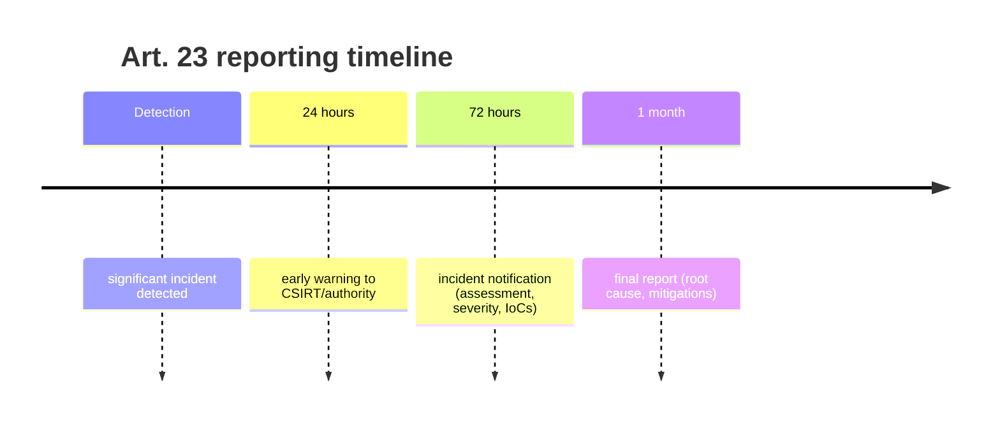

# pamv1 — NIS2 Compliance Pack

> **Living document.** Update when a mapped control or endpoint changes.
>
> Last updated: 2026-08-18 · Reflects: Phases 0–176 (introduced Phase 9, live report added Phase 114; 116's session-sharing is still the same brokered, recorded, four-eyes-gated session underneath — no control mapping changes; 118's IP-allowlist denial reuses the existing `authz.denied`/`session.denied` action families with a new reason string — no new control mapping either; 120's new `access.request_recurred`/`access.recurrence_stopped`/`credential.checkout_extended` actions are new names within the existing `access.*`/`credential.*` families the access-control control already counts by family — no new control mapping; 122's new `session.suspended`/`session.resumed` actions are likewise new names within the existing `session.*` family the same control already counts by family — no new control mapping; 124's new `mfa.webauthn_registered`/`mfa.webauthn_register_failed`/`mfa.webauthn_deleted` actions fall under the existing `mfa` family control (j) already counts by prefix — no new control mapping, and a WebAuthn-only user's login events count exactly like a TOTP user's always have; 126's color-theme toggle is client-side only and emits no audit event at all — no control mapping; 128's new `target.accounts_scanned`/`target.accounts_scan_failed` actions are new names within the existing `target.*` family already counted by prefix — no new control mapping; 129's new `db.zsp_provisioned`/`db.zsp_provision_failed`/`db.zsp_teardown`/`db.zsp_teardown_failed` actions are new names within the existing `db.*` family the access-control control already counts by prefix — no new control mapping; 131's command allow-listing refusals reuse the existing `command.blocked` action with a new `pattern:not-allowed` detail value — no new action name, no new control mapping; 133's device-aware access control refusals reuse the existing `authz.denied`/`session.denied`/`db.session.denied` actions with new `reason:posture-check-failed`/`reason:device-not-trusted` detail values — no new action name, no new control mapping; 135's new `credential.doublelock_enabled`/`_disabled`/`_denied` actions are new names within the existing `credential.*` family the access-control control already counts by prefix — no new control mapping; 137's new `access.invite_created`/`access.invite_revoked` actions are new names within the existing `access.*` family the access-control control already counts by family, and the self-approval-at-creation refusal reuses the existing `access.decision_denied` action with a new `reason:self-approval-invite` detail value — no new action, no new control mapping either. Watermarking emits no audit event at all — same as 126's color-theme toggle — so it adds nothing here; 139's new `safe.personal_override_used` action is a new name within the existing `safe.*` family (create/update/member events already existed) the access-control control already counts generically — no new control mapping; 141's new `forward.start`/`forward.end`/`forward.refused` actions are a new family, counted the same generic way the access-control control already counts every family by prefix — no new control mapping; 143's new `sftp.icap_flagged`/`sftp.icap_scan_failed`/`sftp.icap_skipped` actions are new names within the existing `sftp.*` family the access-control control already counts by prefix — no new control mapping. Worth stating plainly since it is easy to mis-read: ICAP scanning is detection, not prevention, so a flagged or failed scan is evidence for an incident-response *investigation*, not itself a blocked-and-recorded control action the way `sftp.blocked`/`sftp.denied` are; 145's file-attachment secrets add no new audit action at all — creation reuses the existing `credential.create`, and the cap refusal is an unaudited 422 like every other `createCredential` input-validation failure — so no new control mapping; 147's new `extension.token_issued` action is a new family, counted the same generic way the access-control control already counts every family by prefix — no new control mapping; the reveal audit's new `via:extension` detail marker on the existing `credential.reveal` action needs no mapping change either, the same way 133's new `reason:` strings on existing actions didn't; 149's new `scim.key_create`/`scim.key_revoke`/`scim.user_create`/`scim.user_deactivate`/`scim.user_reactivate` actions are a new family, counted the same generic way the access-control control already counts every family by prefix — no new control mapping; 151's SAML login reuses the existing `login` action with a `via:saml` detail marker, exactly as OIDC's `via:oidc` does — no new action, no new control mapping, and the MFA/continuous-auth control (j) already counts `login` events by name, so a SAML login is evidenced the same way an OIDC one is; 153's new `endpoint_agent.*` actions are a new family, counted the same generic way the access-control control already counts every family by prefix, and the `via:endpoint-agent:<name>` marker on an existing `session.start` needs no mapping change — the session itself is the same brokered, recorded, gated session underneath; 159's new `agent.*` lifecycle actions are likewise a new family counted by prefix, and they strengthen the access-control control (i) — an AI-agent identity can now be suspended, quarantined and aged out rather than only destroyed — without changing any mapping; 155's new `k8s.*` actions are likewise a new family counted by prefix, and a brokered Kubernetes operation is evidenced exactly as a WinRM one is — same gates, same transcript, same audit shape — so no control mapping changes; 157's `session.forensics*` actions are a new family counted by prefix like every other, and they strengthen the evidence behind the logging/monitoring control (h) without changing its mapping — the reconstruction is an additional artifact beside a recording that was already evidence; 169's chain-following quarantine adds a `subject:` detail to the existing `agent.quarantine_refused` action rather than a new name — no control mapping change, though it strengthens the evidence behind the access-control control (i): a compromised agent's delegated tokens now stop with it; 170's new `agent.identity_register`/`agent.identity_owner_set`/`agent.identity_remove`/`agent.quarantine_failed` actions are new names within the existing `agent.*` family already counted by prefix — no new control mapping, and they likewise strengthen (i) by making an attested agent's accountable owner a recorded fact that four-eyes and offboarding both read; 171 adds no audit action at all — a policy rule's `ttl_seconds` now bounds an approval window that was already audited at both ends).

> ⚠️ **Beta · for learning purposes. Not production, not externally audited, not legal advice.**
> This maps pamv1 features to [Directive (EU) 2022/2555 (NIS2)](https://eur-lex.europa.eu/eli/dir/2022/2555/oj)
> to show *how a PAM supports* an operator's obligations. Compliance is a
> property of your whole organisation and its national transposition, not of a
> single tool.

NIS2 obliges essential and important entities to take "appropriate and
proportionate" technical measures ([Art. 21](https://eur-lex.europa.eu/eli/dir/2022/2555/oj#art_21))
and to report significant incidents on a strict timeline ([Art. 23](https://eur-lex.europa.eu/eli/dir/2022/2555/oj#art_23)).
Privileged access is where many of those measures are enforced.

## 1. Art. 21(2) control matrix

| # | NIS2 Art. 21(2) measure | How pamv1 supports it | Status |
|---|---|---|---|
| (a) | Risk analysis & information-system security policies | Roles, per-target grants, approval policy are declarative config (IaC); [template](#4-risk-management-documentation-template) below | 🟡 partial (docs) |
| (b) | Incident handling | Append-only audit trail, optionally **HMAC-chained** and cryptographically verifiable (`GET /api/audit/verify`) with ed25519 signed checkpoints (`/api/audit/head`), plus a [tamper-evident export](#2-incident-reporting-art-23) for early-warning/notification. A live session can be terminated **cluster-wide** from any replica, and a broadcast that fails is reported as a failure rather than a false success; the risk engine can auto-kill a critical actor's sessions (`PAM_ANALYTICS_AUTO_KILL`); and audit events reach the SIEM in real time by push, from a durable cursor | ✅ |
| (c) | Business continuity, backup, crisis mgmt | [Backup & restore runbook](BACKUP-AND-RESTORE.md); break-glass emergency access | ✅ |
| (d) | Supply-chain security | A dedicated third-party gate (Phase 29): vendor access needs a **customer-approved, time-boxed contract grant** — the approver cannot be the vendor — with **live employment attestation** checked at approval, so a technician the vendor no longer employs is refused. Disabling a vendor triggers an **instant offboard cascade** (grants revoked, live sessions cut cluster-wide), a sweeper ends sessions when the contract window closes, the gate is enforced on every connect path, and `GET /api/vendors/{id}/evidence` produces a per-vendor SOC 2 / DORA bundle with a SHA-256. No standing vendor credentials | ✅ |
| (e) | Security in acquisition/development/maintenance, vuln handling | Versioned DB migrations; CI gates `gofmt`/`vet`/`staticcheck`/`govulncheck`/`gosec`/`test -race`; SBOM + cosign-signed releases + SLSA provenance (`.github/workflows/release.yml`) | ✅ — releases are published, cosign-signed and attested (SPDX SBOM + SLSA provenance); the first was **v0.10.0 (2026-07-28)**, the current is **v0.48.0 (2026-08-18)** on `ghcr.io/morandeirachema/pamv1:0.48.0`, verifiable with the commands in the README |
| (f) | Policies to assess effectiveness | Audit trail + reconciliation reports (`GET /api/reconcile`) evidence control operation; a **recurring** certification campaign is the periodic re-assessment itself, and its reminders make a lapse visible instead of silent (Phase 70) | ✅ |
| (g) | Basic cyber hygiene & training | AS/400 portal deliberately signals gravity; least-privilege defaults | 🟡 partial |
| (h) | Cryptography & encryption policy | Envelope encryption (AES-256-GCM per-secret data key wrapped by a pluggable KEK — local / Vault Transit / AWS KMS / **PKCS#11 HSM**); LDAPS/HTTPS/TLS only. Session recordings and WinRM transcripts are also **sealed at rest** (`PAM_RECORDING_ENCRYPT`) with a per-recording data key wrapped by the same KEK and chunk-level AAD binding each chunk to its file and position; `PAM_RECORDING_OPAQUE_NAMES` removes target and actor from the **filename**, so access to the volume or a backup no longer reveals who touched what | ✅ |
| (i) | Human-resources security, access control, asset mgmt | Four RBAC roles, per-target grants, 4-eyes approval, break-glass quorum, credential lifecycle (rotation/reconciliation), and **periodic access recertification** — campaigns scoped to a safe or a person, recurring on a schedule, with per-item reviewers and reminders before the due date (Phases 19, 68–70) | ✅ |
| (j) | MFA / continuous auth, secured comms, secured emergency comms | TOTP **or FIDO2/WebAuthn** MFA (either satisfies the enforce-MFA policy) + recovery codes; OIDC/Entra SSO; all sessions brokered, JIT-injected and recorded | ✅ |

Legend: ✅ implemented · 🟡 partially implemented / documented.

Later phases strengthen several of these measures: **supervised sessions**
(Phase 16 — a supervisor can watch a session live, and **command control** blocks
dangerous commands before they reach a target) reinforce (b)/(f)/(i);
**per-statement database audit** through the PostgreSQL session proxy (Phase 15)
extends the audit trail under (b); **safes** (Phase 17 — delegated-access
containers) sharpen least-privilege access control under (i); and optional
**CyberArk Conjur** secret sourcing (Phase 18) adds machine-identity auth and
central rotation of pamv1's own bootstrap secrets under (h)/(i).

**A live version of this table** (Phase 114) is available at
`GET /api/compliance/nis2?since=&until=` — the same ten controls, but scoped
to a time window, with the controls that have a natural audit signal
(supply-chain, policy effectiveness, access control, MFA, incident handling)
carrying a live count of matching events instead of only the static prose
above. Status stays architectural either way — a quiet window doesn't mean a
control regressed. See [ADMIN-GUIDE.md §9.2b](ADMIN-GUIDE.md#92b-a-live-nis2-compliance-report-phase-114).

## 2. Incident reporting (Art. 23)

Art. 23 imposes a staged timeline. pamv1 supplies the **privileged-access evidence**
for each stage via a tamper-evident audit export:


```mermaid
timeline
    title Art. 23 reporting timeline
    Detection : significant incident detected
    24 hours  : early warning to CSIRT/authority
    72 hours  : incident notification (assessment, severity, IoCs)
    1 month   : final report (root cause, mitigations)
```

Produce a scoped, verifiable slice of the audit trail:

```bash
# All privileged-access events in the incident window (JSON, with a SHA-256 digest)
curl -H "X-API-Key: $PAM_API_KEY" \
  "https://pam.example.com/api/audit/export?since=2026-07-19T00:00:00Z&until=2026-07-19T06:00:00Z" \
  -o incident-export.json

# Scope to one actor or action; export as CSV for a spreadsheet
curl -H "X-API-Key: $PAM_API_KEY" \
  "https://pam.example.com/api/audit/export?since=...&actor=break-glass&format=csv" \
  -o breakglass.csv
```

- **Query params:** `since`, `until` (RFC3339), `actor` (substring), `action`
  (exact), `format` (`json` | `csv`).
- **Tamper evidence — two layers.** *At rest:* enable the primary audit chain
  (`PAM_AUDIT_HMAC_KEY`) and every event is HMAC-linked to the previous one, so any
  edit, reorder, or deletion is detectable via `GET /api/audit/verify`; add
  `PAM_AUDIT_SIGN_SEED` and archive the ed25519-signed checkpoint from
  `GET /api/audit/head` to also catch tail-truncation. *In transit:* the export
  carries a **SHA-256** over the exact delivered bytes, in the
  `X-PAM-Export-SHA256` header — so `sha256sum <downloaded file>` matches, for
  both `json` and `csv`. Record it when you hand the file to the authority;
  anyone can recompute it, and the same closed window always yields the same
  digest. (It is deliberately no longer echoed inside the JSON body: a body
  containing its own digest cannot be hashed against itself.)
- **The export is itself audited** (`audit.export` with the digest), so the act of
  producing evidence is on the record too.
- Requires `CapReadAudit` (`admin`, `auditor` — and `approver`, which also holds it).
- ⚠️ **Omitting `since` gives you the last 90 days, not everything.** An incident
  older than that produces a quietly truncated hand-off; always pass an explicit
  window when exporting for a regulator.

## 3. Audit retention & SIEM forwarding

- **Retention:** audit rows are append-only in normal operation.
  `PAM_AUDIT_RETENTION_DAYS` (Phase 36) opts into deleting rows older than N
  days — and is **refused while `PAM_AUDIT_HMAC_KEY` is set**, because deleting
  the oldest rows would break `GET /api/audit/verify`. Set
  `PAM_RETENTION_ARCHIVE_DIR` (Phase 49) and aged rows are first exported to
  write-once storage as digest-stamped JSON Lines, with the delete running **only
  if that archive succeeded** — a failed archive costs disk, never evidence. Set
  your database backup/retention policy to satisfy the period your sector
  requires; see [Backup & restore](BACKUP-AND-RESTORE.md).
- **Forwarding — push, not just collect.** `PAM_AUDIT_FORWARD_ADDR` streams every
  audit event from a **durable cursor** as RFC 5424 syslog, ArcSight **CEF** or
  QRadar **LEEF 2.0**, over UDP, TCP or **TLS** (`PAM_AUDIT_FORWARD_CA` pins the
  collector and fails closed). The cursor survives restarts, so a collector
  outage delays evidence rather than losing it, and one forwarder runs per
  cluster under a Postgres leader lock. `GET /api/audit/ocsf` additionally serves
  the trail as **OCSF** for platforms that expect it.
- **Or collect:** operational logs remain structured JSON on stdout, tagged by
  service, shippable with your platform's collector (a Kubernetes DaemonSet,
  Vector, Fluent Bit). Audit events are emitted to that stream too
  (`action=audit`).
- **Real-time alerting:** break-glass use and access-request decisions fire a
  webhook (`PAM_ALERT_WEBHOOK`) — wire it to your on-call/SOAR. (Disabled in
  [air-gap mode](OT-DEPLOYMENT.md#3-air-gap--offline-mode).)

## 4. Risk-management documentation template

A minimal record an operator can keep alongside pamv1 (Art. 21(2)(a)):

| Field | Example |
|---|---|
| Asset / scope | Privileged access to OT cell 3 (PLCs, HMI) |
| Data classification | Operational; safety-critical |
| Threats considered | Credential theft, standing access, insider misuse, vendor compromise |
| Controls (pamv1) | RBAC + per-target grants; 4-eyes approval; JIT injection; rotation; MFA; recording |
| Residual risk & owner | \<accepted-by\>, review \<date\> |
| Emergency procedure | Break-glass quorum (M-of-N), auto-expiring, alerted |
| Review cadence | Quarterly + after any significant incident |

---

*See also: [ADMIN-GUIDE.md](ADMIN-GUIDE.md), [OT-DEPLOYMENT.md](OT-DEPLOYMENT.md),
[ARCHITECTURE-HIGH-LEVEL.md](ARCHITECTURE-HIGH-LEVEL.md), [ROADMAP.md](../ROADMAP.md).*
