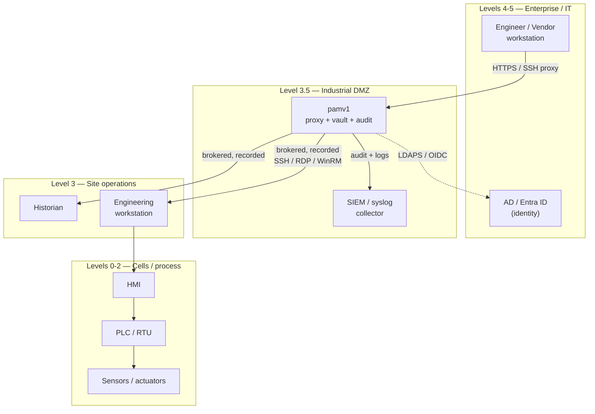

# pamv1 — OT / Industrial Deployment Guide

> **Living document.** Update when an OT-relevant control or flow changes.
>
> Last updated: 2026-08-26 · Reflects: Phases 0–212. **206–207 add nothing OT-specific**: proof of possession is on the agent-broker path, and it makes no outbound call, so it is compatible with `PAM_OT_AIRGAP` (**161–183 add nothing OT-specific either**: the AI-agent broker is opt-in and off unless `PAM_BROKER_POLICY_FILE` is set, which an OT deployment typically does not set at all — and where it is set, the batch's changes narrow what an agent may do rather than adding any egress: the two inventory tools stop answering for the whole estate, quarantine follows a delegated token's chain, and a policy rule can name the agent it applies to. No new listener, no new outbound call, nothing that `PAM_OT_AIRGAP` needs to govern. Earlier: 53–94 add nothing OT-specific; the certification reminders use the existing alert channel, which `PAM_OT_AIRGAP` already governs, and Phase 92 made read-only SFTP fail closed on native link/lock operations — a containment tightening OT sites get automatically. **Phase 116 breaks that streak**: live session-sharing's external-invite email is *not* governed by `PAM_OT_AIRGAP` the way every other alert channel is, and its guest redemption page is a new unauthenticated surface — see §3. **Phase 118 stays inside the fix**: a CIDR allowlist is a local, offline authorization check — no alert channel, no new external surface. **Phase 120 stays inside it too**: recurring access requests, password policy and checkout extension are all local, no alert channel, no new external surface. **Phase 122 stays inside it too**: suspend/resume gates an in-memory input mux already in the process — no alert channel, no new external surface. **Phase 124 stays inside it too**: the WebAuthn ceremony is a same-origin browser↔server exchange, no alert channel, no outbound call, no new external surface. **Phase 126 stays inside it too**: the color-theme cycle is a client-side `localStorage` preference — no alert channel, no outbound call, no new external surface. **Phase 128 stays inside it too**: the enumeration connection is the same kind of ssh/winrm dial pamv1 already makes to that target — no alert channel, no new outbound destination, no new external surface. **Phase 129 stays inside it too**: the provisioning/teardown dials are the same kind of PostgreSQL connection pamv1 already makes to that target — no alert channel, no new outbound destination, no new external surface. **Phase 131 stays inside it too**: allow-list matching is a local regex check on a command already crossing the connection — no alert channel, no new outbound destination, no new external surface. **Phase 133 breaks the streak again, the same way 116 did**: the live device-posture webhook (`PAM_POSTURE_ATTEST_URL`) is a genuine new outbound destination, called on every connect and every authenticated call — but unlike 116, it does NOT slip past `PAM_OT_AIRGAP` unnoticed: it joins the same `airGapConflicts` list as the vendor/ITSM/SIEM webhooks, so an air-gapped site that sets it without adding it to `PAM_OT_AIRGAP_ALLOW` is refused at startup, not silently left exposed. The device-identity half stays inside the fix: it reads an inbound header, no outbound call, no new external surface. **Phase 135 stays inside it too**: DoubleLock's second encryption is entirely in-process (PBKDF2 + AES-256-GCM, no webhook, no KEK call) — no alert channel, no new outbound destination, no new external surface. **Phase 137 inherits 116's break, rather than introducing a new one**: magic-link approval email rides the *exact same* `shareEmailEnabled` channel Phase 116 established, verbatim — so it is not governed by `PAM_OT_AIRGAP` either, for the same reason 116 wasn't, and `approve.html` is a second unauthenticated surface of the same kind as `share.html` (see §3). Session watermarking stays inside the fix: the RDP/VNC overlay is client-side, and the text-session banner is an in-process `Hub.Publish` write — no alert channel, no outbound call, no new external surface. **Phase 139 stays inside it too**: the personal-safe check is a local capability comparison against an already-resolved principal and an already-fetched safe row — no alert channel, no new outbound destination, no new external surface. **Phase 141 stays inside it too**: a forward dials only the connected target's own host — the same destination pamv1's session itself already dials, on a different port — never a new one, and never a third-party service `PAM_OT_AIRGAP` exists to gate. **Phase 143 breaks the streak again, the same way 133 did**: the ICAP AV/DLP scan (`PAM_ICAP_URL`) is a genuine new outbound destination — but like 133, and unlike 116/137's email exception, it does NOT slip past `PAM_OT_AIRGAP` unnoticed: it joins the same `airGapConflicts` list, so an air-gapped site that sets it without adding it to `PAM_OT_AIRGAP_ALLOW` is refused at startup. Worth flagging for an OT reviewer specifically: this is a **detection-only** control (§3 below and ADMIN-GUIDE.md), so its whole value proposition already assumes an AV/DLP appliance reachable from the DMZ — a site that keeps `PAM_ICAP_URL` unset loses nothing it had before this phase. **Phase 145 stays inside the fix**: a file-attachment secret's content flows entirely in-process through the existing vault pathway — no alert channel, no new outbound destination, no new external surface. **Phase 147 stays inside it too**: the extension calls the pamv1 server exactly as the portal itself already does, from the operator's own browser — no new outbound destination from the server, no alert channel, no new external surface. **Phase 149 stays inside it too, from the opposite direction**: SCIM is push, an IdP calling *in* to pamv1 over `/scim/v2/Users` — no new outbound destination, no alert channel, and unlike 116/137's email-invite exception, there is no new *unauthenticated* surface either, since every SCIM route requires a bearer key. **Phase 151 stays inside the fix, the same way 133/143 did**: the SAML SP's one outbound call — the IdP metadata fetch (`PAM_SAML_IDP_METADATA_URL`) — joins the same `airGapConflicts` list, so an air-gapped site is refused at startup unless it switches to `PAM_SAML_IDP_METADATA_FILE` (the intended OT form: the metadata document carried in on media, no network fetch at all); the login itself is browser-mediated — the operator's browser carries the request to the IdP and the signed Response back — so pamv1 makes no per-login call anywhere. Its three routes are new *unauthenticated* endpoints of the login kind (`/api/auth/oidc/*` already is), rate-limited like them, not a guest surface like `share.html`/`approve.html`. **Phase 153 is worth an OT reviewer's explicit attention, in the opposite direction from everything above**: an outbound-only endpoint agent is a process ON a target that opens a persistent OUTBOUND connection to pam-server:2222 — for a level-2/3 device inside a Purdue enclave that is a new egress from the enclave toward the DMZ where pam-server lives, precisely the direction OT firewalls are strictest about. It is opt-in (`PAM_ENDPOINT_AGENTS_ENABLED`, off), per target (only a target you deliberately bind gets one), and the agent can carry nothing but streams pam-server opens toward its ONE configured local port — but it IS a standing outbound session from the OT side, so use it only for the endpoints that genuinely cannot be reached the normal way (§7 of PORTS-AND-FLOWS.md still applies: pam-server in the DMZ dialing DOWN into the target zone remains the default posture) and put the `endpoint → pam-server:2222` rule through the same change control as any other enclave egress. Not governed by `PAM_OT_AIRGAP`: the connection is toward pam-server itself, not to a third party. **Phase 155 stays inside the fix**: a Kubernetes API server is a *target*, not a third-party service — the brokered request goes to the target zone exactly as an SSH or database session does, so it is governed by the same segmentation rules and not by `PAM_OT_AIRGAP` (which exists to catch calls OUT of the enclave to vendors' clouds). An OT site with no clusters simply never defines a `kubernetes` target, and `PAM_ALLOWED_PROTOCOLS` can forbid the protocol outright. **Phase 157 stays inside the fix but deserves an OT reviewer's judgement**: the post-session reconstruction opens one extra SSH connection to the target after every interactive session and runs one fixed read-only command on it. That is the same destination and protocol the session itself used — no new egress, no third party, nothing `PAM_OT_AIRGAP` governs — but on a level-1/2 device where every additional connection is a change-controlled event, it is a deliberate decision rather than a free default; it is off by default, and a site can enable it for its Windows-domain/DMZ tier while leaving the sensitive tier untouched, since the switch is global but only interactive SSH sessions trigger it). (introduced Phase 8).

> ⚠️ **Beta · for learning purposes. Not production, not externally audited.** This guide
> describes how pamv1 is *designed* to fit an OT architecture; validate every
> control against your own risk assessment and [IEC 62443](https://www.isa.org/standards-and-publications/isa-standards/isa-iec-62443-series-of-standards)
> program before relying on it.

pamv1 is meant to be adaptable to Operational Technology (OT) environments —
factory floors, utilities, building management — where availability and safety
outrank confidentiality, change is dangerous, and the network is segmented by the
[Purdue model](https://en.wikipedia.org/wiki/Purdue_Enterprise_Reference_Architecture).
This guide covers the deployment pattern, the OT-specific controls, and how the
Phase 8 approval workflow and air-gap mode support them.

## 1. Where pamv1 sits: the industrial DMZ (Level 3.5)

pamv1 runs in the **industrial DMZ (Level 3.5)** and is the *only* sanctioned path
from IT into the OT cells. No engineer or vendor connects to a PLC, HMI or
historian directly; they go through the pamv1 proxy, which injects the credential
just-in-time and records the session.


```mermaid
flowchart TB
    subgraph L5["Levels 4-5 — Enterprise / IT"]
        USER["Engineer / Vendor<br/>workstation"]
        IDP["AD / Entra ID<br/>(identity)"]
    end
    subgraph DMZ["Level 3.5 — Industrial DMZ"]
        PAM["pamv1<br/>proxy + vault + audit"]
        SIEM["SIEM / syslog<br/>collector"]
    end
    subgraph L3["Level 3 — Site operations"]
        HIST["Historian"]
        ENG["Engineering<br/>workstation"]
    end
    subgraph L2["Levels 0-2 — Cells / process"]
        HMI["HMI"]
        PLC["PLC / RTU"]
        SENS["Sensors / actuators"]
    end

    USER -->|HTTPS / SSH proxy| PAM
    PAM -.->|LDAPS / OIDC| IDP
    PAM -->|audit + logs| SIEM
    PAM -->|brokered, recorded<br/>SSH / RDP / WinRM| ENG
    PAM -->|brokered, recorded| HIST
    ENG --> HMI
    HMI --> PLC
    PLC --> SENS
```

**Firewall rule of thumb:** the OT cells accept management connections *only* from
the pamv1 host. See [PORTS-AND-FLOWS.md](PORTS-AND-FLOWS.md) for the exact port
matrix to encode in the L3.5 firewall.

## 2. Session approval (4-eyes / maintenance windows)

In OT, a privileged session is a change event. pamv1 gates connections behind an
**approved access request** so that opening a session is a deliberate, dual-control
act tied to a maintenance window.

```mermaid
sequenceDiagram
    participant E as Engineer (user)
    participant P as pamv1
    participant A as Approver
    participant T as OT target
    E->>P: POST /api/access-requests (target, reason)
    P-->>E: 201 pending
    A->>P: GET /api/access-requests?status=pending
    A->>P: POST /api/access-requests/{id}/approve
    Note over P: four-eyes — approver ≠ requester;<br/>approval valid for PAM_APPROVAL_WINDOW_MIN
    P-->>A: 200 approved (+ real-time alert)
    E->>P: connect (SSH proxy / WinRM / RDP)
    P->>P: HasActiveApproval(engineer, target)?
    P->>T: brokered, recorded session (JIT credential)
```

Enable it per target or globally:

```bash
# Per target (at creation):
curl -H "X-API-Key: $PAM_API_KEY" -X POST .../api/targets \
  -d '{"name":"plc-cell-3","host":"10.20.0.5","port":22,"os_type":"linux","protocol":"ssh","require_approval":true}'

# Or globally (every target requires approval — OT default):
PAM_REQUIRE_APPROVAL=true
PAM_APPROVAL_WINDOW_MIN=60        # an approval is valid for 60 minutes
```

- **Four-eyes:** the approver must be a *different* principal than the requester;
  self-approval is refused (`access.decision_denied`).
- **Roles:** the `approver` role (and `admin`) hold `CapApprove`. Requesters need
  `CapConnect` (`user`/`admin`).
- **Enforced everywhere:** the SSH proxy, the **PostgreSQL proxy**, WinRM, RDP,
  **credential reveal**, **checkout** and the **AI-agent broker's tool calls** all
  check for an active approval before brokering, through one shared gate. A
  one-time approval (`PAM_ACCESS_ONE_TIME`) is **consumed** by the first use it
  admits — audited `access.consumed` — not merely checked.
  **Break-glass bypasses** it (emergency access is already loud and alerted).
- **Audited + alerted:** `access.request`, `access.approve`, `access.deny`,
  `access.denied`, `access.consumed` (one-time use), `access.approve_partial`
  (an M-of-N approval that has not yet reached quorum) and
  `access.ticket_rejected` (the ITSM gate refused the change ticket);
  approvals/denials also fire the real-time alert webhook.
- **In-session step-up (Phase 30).** Where the approval gate is a door, step-up is
  a checkpoint *inside* the room: `PAM_DB_STEPUP_FILE` marks statements that
  **pause mid-session** for a second person's live decision instead of killing
  the session. The operator waits, an approver allows or refuses from the console,
  and the session survives either way. Nobody may decide the step-up for their own
  session (audited `session.self_stepup_denied`) — for a plant, this is the
  strongest available expression of "a privileged session is a change event".

## 3. Air-gap / offline mode

Many OT sites forbid outbound connections from the DMZ. Air-gap mode makes pamv1
self-contained:

```bash
PAM_OT_AIRGAP=true
```

- Disables the **alert channels** — webhook, syslog and email are replaced by a
  no-op (alerts still land in the audit trail and local logs).
- **Session-share invite email (Phase 116) is a separate path this no-op does
  not cover.** An external session-share invite's email — the guest's
  QR-coded redemption link — is sent by a dedicated call that bypasses the
  alert-channel abstraction the bullet above silences; it fires for real
  under air-gap if `PAM_ALERT_EMAIL_*` and an absolute `PAM_PORTAL_URL` are
  configured, which they may already be for other alerting. There is no
  separate switch for it: the only way to guarantee no egress from this path
  at an air-gapped site is to leave `PAM_ALERT_EMAIL_*` unset (external
  invite creation then refuses loudly, at the API) or simply not use external
  invites — **internal** invites (redeemed over the existing `:2222` SSH
  ingress by a principal who already holds a PAM credential) carry no such
  exposure, and the guest page it opens is reachable only from wherever an
  invite was actually sent, not from this DMZ generally. See [ADMIN-GUIDE.md
  §9.4c](ADMIN-GUIDE.md#94c-sharing-a-live-session-phase-116) and
  [PROTOCOLS-AND-CRYPTO.md
  §4](PROTOCOLS-AND-CRYPTO.md#4-where-verification-is-opt-in-read-this-before-deploying).
- **It also refuses to start alongside anything that would egress.** The flag
  used to be read in exactly one place — choosing the alerter — so it silenced
  alerts and nothing else while the ITSM webhook, the vendor-attestation webhook,
  the SIEM forwarder, Conjur, a cloud KEK and a cloud identity provider all still
  reached the network. It now enforces its own name.
- **The rule is default-deny with a per-variable escape hatch**, because
  "air-gapped" rarely means "no network" — it usually means *nothing leaves this
  enclave*. A local Conjur, an in-DMZ SIEM collector or a self-hosted Keycloak
  are legitimate, so they are permitted when you name them in
  **`PAM_OT_AIRGAP_ALLOW`** (a comma-separated list of variable names),
  certifying that they resolve inside the enclave:

  ```bash
  PAM_OT_AIRGAP=true
  PAM_AUDIT_FORWARD_ADDR=siem.internal:514
  PAM_OT_AIRGAP_ALLOW=PAM_AUDIT_FORWARD_ADDR   # yes, that collector is ours
  ```

  Egress therefore becomes impossible by accident and possible on purpose, with
  the exceptions written down in the deployment rather than living in somebody's
  head.
- **Two have no escape hatch at all**: `PAM_KEK_PROVIDER=aws-kms` and
  `PAM_ENTRA_TENANT_ID`. There is no in-enclave version of somebody else's cloud
  — use `local`, `pkcs11` (an on-prem HSM) or an in-enclave Vault Transit, and
  LDAP against a directory you run.
- Pair it with local identity (local tokens or an on-prem LDAPS DC reachable
  inside the DMZ) rather than a cloud IdP, and collect logs via a **local**
  syslog/SIEM.
- The vault's `local` KEK keeps the root key on-box; there is no call to a cloud
  KMS. (If you use HashiCorp Vault Transit, run it inside the DMZ.)

## 4. Purdue / IEC 62443 alignment

| OT concern | pamv1 control |
|---|---|
| Zones & conduits (SR 5.1) | pamv1 at L3.5 is the sole IT→OT conduit; per-target grants scope who reaches which cell |
| Least privilege (SR 1.1–1.2) | Four RBAC roles + custom profiles + per-target grants + **safes** (delegated-access containers) + approval gate |
| Use control / approval (SR 2.1) | 4-eyes access-request workflow, maintenance-window validity |
| Restricted use / command control (SR 2.1) | **Command control** (`PAM_COMMAND_DENY_FILE`) blocks dangerous commands before they reach a cell on *every* path a discrete command is visible — SSH exec/shell, the WinRM proxy loop, SQL statements, the REST WinRM endpoint, the agent broker's `ssh_exec`/`winrm_exec`, and dependent-account propagation — all refused with the same `command.blocked` audit action. Read-only observer sessions for interactive shells, which are never parsed |
| Monitoring (SR 6.1–6.2) | Append-only audit trail + session recording (hash-chained) + **live session monitoring** (a supervisor watches a session as it happens). Recording is only *mandatory* with `PAM_REQUIRE_RECORDING=true`, which refuses a session it cannot record — pair it with `PAM_RECORDING_ENCRYPT` and `PAM_RECORDING_OPAQUE_NAMES` so the artifact is sealed and the filename leaks no metadata. Push evidence to a DMZ collector with `PAM_AUDIT_FORWARD_ADDR` (RFC 5424 / CEF / LEEF over TCP or TLS, from a durable cursor, so a collector outage loses nothing) |
| Emergency access | Break-glass (M-of-N quorum, auto-expiring, alerted). A live session can be cut cluster-wide from any replica (`DELETE /api/sessions/{id}`, published over Postgres LISTEN/NOTIFY); a broadcast that fails is reported as a failure rather than a false success |
| Restricted data flow (SR 5.2) | **File and clipboard conduits are the ones that matter in a cell**: `PAM_SSH_SFTP` (`allow`/`readonly`/`deny`) plus `PAM_SSH_SFTP_DENY_FILE` path policy gate SFTP transfers, and `PAM_RDP_CLIPBOARD` plus `PAM_RDP_CLIPBOARD_AUDIT` gate the RDP clipboard, with drive redirection always off — tightenable per target (`rdp_clipboard[_audit]`, strictest wins), so one cell's HMI can be `deny` while the fleet stays `readonly`. Air-gap mode (`PAM_OT_AIRGAP`) refuses to start alongside any integration that would egress, unless you name it in `PAM_OT_AIRGAP_ALLOW` as resolving inside the enclave |
| Least functionality | Disable the SSH proxy (`PAM_SSH_ADDR=off`) or RDP/WinRM you don't need; restrict what may be reached at all with `PAM_ALLOWED_PROTOCOLS`, and cut file/clipboard conduits with the SFTP and clipboard policies above |

## 5. Roadmap (not yet implemented)

Most OT items have since shipped — a **protocol allowlist** (`PAM_ALLOWED_PROTOCOLS`),
**read-only observer** sessions (a `+observe` login suffix), **jump-host** bastion
connectors, and the 4-eyes **access-request approval** workflow (surfaced in the
portal's "Work with access requests" screen). The one item that remains genuinely
unbuilt (it needs hardware to verify honestly) is:

- **Serial connectors** for legacy equipment (RS-232 / terminal servers).

---

*See also: [ARCHITECTURE-HIGH-LEVEL.md](ARCHITECTURE-HIGH-LEVEL.md),
[PORTS-AND-FLOWS.md](PORTS-AND-FLOWS.md), [ADMIN-GUIDE.md](ADMIN-GUIDE.md),
[ROADMAP.md](../ROADMAP.md).*
