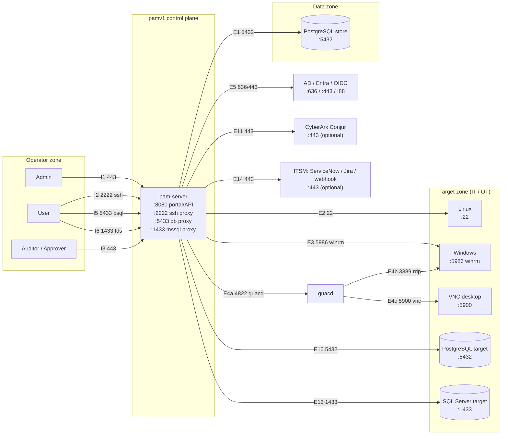

# pamv1 — Ports & Network Flow Matrix

> **Living document.** Update whenever a listener, an upstream protocol, or a
> deployment flow changes. This is the reference for firewall rules, security
> groups, NetworkPolicies and OT segmentation. The *what and why* of each
> protocol and cipher lives in [PROTOCOLS-AND-CRYPTO.md](PROTOCOLS-AND-CRYPTO.md).
>
> Last updated: 2026-08-14 · Reflects: Phases 0–128. **Phase 53 added the first new
> listener since Phase 24** — the SQL Server (TDS) proxy on `:1433`; nothing after
> it adds a port or listener (55–94 ride the existing listeners and flows: the
> live-monitor relay and the step-up decision bus ride the server ↔ PostgreSQL
> store connection, flow E1; token exchange (57), safe policy (58), SFTP content
> capture (59), the certification scheduler and reminders (68–70) and everything
> through the Phase 91–94 adversarial review reuse the database and the existing
> channels). **Phase 116 adds no listener either** — live session-sharing rides
> the existing `:8080` (a new unauthenticated guest surface, **I7**) and `:2222`
> (the `join:<token>` SSH form, still ordinary PAM password auth, so no new
> ingress row) — but it is the first phase since the 2026-08-09 pass to add a
> **new egress purpose** on a port already in the matrix: **E9b**, session-share
> invite email, alongside E9 on the same `:587`. The 2026-08-09 currency pass
> records a flow this matrix had omitted
> since Phase 20: **E14, the outbound ITSM ticket-validation call** — a generic
> webhook (Phase 20), first-class ServiceNow/Jira REST lookups since Phase 84,
> re-checked at the moment access is used with `PAM_TICKET_REVALIDATE` (Phase 60).
> **Phase 118 adds no port, listener or flow either** — the CIDR allowlist
> check runs against the source address each connection already resolves
> (`s.clientIP(r)` on `:8080`, the proxies' own `RemoteAddr()` on `:2222`/
> `:5433`/`:1433`), in-process, with nothing new on the wire.
> **Phase 120 adds no port, listener or flow either** — the new access-
> request scheduler and the password-history check both ride the existing
> server ↔ PostgreSQL store connection (flow E1), same as the certification
> scheduler; checkout extension is a new route on the existing `:8080`.
> **Phase 122 adds no port, listener or flow either** — suspend/resume are
> two new routes on the existing `:8080`, gating an in-memory input mux
> already in the process; nothing new crosses the wire.
> **Phase 124 adds no port, listener or flow either** — the WebAuthn
> ceremony is six new routes on the existing `:8080`; the browser talks
> directly to its own platform/hardware authenticator, never to pamv1 or
> anywhere else, so there is no new egress purpose either, unlike OIDC's
> discovery/token calls.
> **Phase 126 adds no port, listener or flow either** — the
> color-theme toggle never leaves the browser: no new route, no server
> round-trip, nothing on the wire.
> **Phase 128 adds no port, listener or flow either** — one new route on
> the existing `:8080`, dialing the target over the exact ssh/winrm flow
> that target's own credential already uses for a real session.
> Everything from 25 to 52g rides `:8080`, `:2222` or `:5433`. Ports marked *planned* have
> no listener/dialer yet — do not open them until the phase lands. Phases 19–24 add
> **no new listeners**: certification/ticketing/approvals (19–21), threat analytics
> (23) and the application-secrets API (24) all ride the existing HTTP control plane
> (`:8080`), and Zero Standing Privilege (22) is served over the existing SSH proxy
> (`:2222`) — it only adds an outbound SSH-certificate authentication to targets.

Legend: ✅ implemented · 🔷 planned (roadmap phase noted). All ports are TCP
unless stated. `pam-server` is a single binary exposing the portal/API and the
SSH proxy; `db` is PostgreSQL.

## 1. Listening ports (what `pam-server` binds)

| Port | Proto | Service | Env var | Bind guidance | Status |
|-----:|-------|---------|---------|---------------|--------|
| 8080 | HTTP¹ | Portal + REST API | `PAM_LISTEN_ADDR` | Behind TLS in prod; expose to operators only | ✅ |
| 2222 | SSH | Session proxy (JIT injection) | `PAM_SSH_ADDR` (`off` disables) | Expose to operators/users only | ✅ |
| 5433 | PostgreSQL | Database session proxy (JIT injection) | `PAM_DB_ADDR` (`off` by default) | Expose to operators only; TLS via `PAM_TLS_CERT/KEY` (negotiated in-protocol — see ¹) | ✅ P15 |
| 1433 | TDS (SQL Server) | Database session proxy (JIT injection) | `PAM_MSSQL_ADDR` (`off` by default) | Expose to operators only; **set `PAM_TLS_CERT/KEY`** — modern TDS clients require encryption | ✅ P53 |

¹ **Secure protocols only.** Operators must reach the portal/API over **HTTPS** —
either native (`PAM_TLS_CERT`/`PAM_TLS_KEY`, Phase 5) or terminated at an
ingress/load balancer; the container otherwise listens on plain HTTP internally,
so never expose 8080 directly off-host. The **database proxies' operator legs**
(`:5433` PostgreSQL, `:1433` TDS) negotiate TLS **in-protocol** (Postgres
`SSLRequest`, the TDS PRELOGIN encryption handshake), so a generic ingress cannot
terminate them — set native `PAM_TLS_CERT/KEY`. Without it each proxy warns and
runs plaintext, and modern SQL Server clients (`Encrypt=Mandatory`, the default)
**refuse to connect**; TDS 8.0 "strict" (TLS-first) is not supported — have
clients use `Encrypt=Mandatory`. `PAM_REQUIRE_DB_CLIENT_TLS` refuses to start
either DB proxy without TLS. On the **credential-bearing upstream legs**, pin the
target's certificate with `PAM_DB_UPSTREAM_CA` or verify against system roots
with `PAM_DB_UPSTREAM_TLS_VERIFY` (shared by both DB proxies; unset =
trust-any-with-warning). Prefer **LDAPS (636)** over LDAP and **TLS** to
PostgreSQL and SQL Server. Plain-text variants are for isolated local dev only.

Kubernetes Service (`deploy/k8s/service.yaml`) maps `8080 → 8080` and `2222 → 2222` (Helm uses `service.httpPort` / `service.sshPort`, same defaults);
add `5433 → 5433` and/or `1433 → 1433` when the database proxies are enabled (neither is mapped by default).

## 2. Ingress — who connects **to** pamv1

| # | Source (zone) | → Destination | Port | Proto | Purpose | Status |
|---|---------------|---------------|-----:|-------|---------|--------|
| I1 | Admin (operator zone) | pam-server | 8080/443 | HTTPS | Portal + management API (X-API-Key / token) | ✅ |
| I2 | User (operator zone) | pam-server | 2222 | SSH | Brokered session to a target (role `user`) | ✅ |
| I3 | Auditor / Approver | pam-server | 8080/443 | HTTPS | Read audit trail, live session stream (SSE), approve requests | ✅ |
| I4 | Prometheus (mgmt) | pam-server | 8080 | HTTP | Scrape `/metrics` | ✅ P10 |
| I5 | User (operator zone) | pam-server | 5433 | PostgreSQL | Brokered `psql` session to a `postgres` target | ✅ P15 |
| I6 | User (operator zone) | pam-server | 1433 | TDS | Brokered SQL Server session to a `mssql` target (`sqlcmd`, SSMS, drivers) | ✅ P53 |
| I7 | Session-share guest (**untrusted** — no zone; wherever the emailed link/QR reaches) | pam-server | 8080/443 | HTTPS | Redeem a session-share invite and stream/control the shared session it names — **unauthenticated** (`/share.html`, `POST /api/share/redeem/{token}`), then a minted guest key on every further call (`GET /api/share/stream`, `POST /api/share/input`), never `X-API-Key` | ✅ P116 |

## 3. Egress — what pamv1 connects **to**

| # | Source | → Destination (zone) | Port | Proto | Purpose | Status |
|---|--------|----------------------|-----:|-------|---------|--------|
| E1 | pam-server | PostgreSQL (data zone) | 5432 | TCP/TLS | Inventory, vaulted secrets, audit, users; the cross-replica kill, live-monitor and step-up decision buses (LISTEN/NOTIFY) | ✅ |
| E2 | pam-server (proxy) | Linux target (target zone) | 22 | SSH | JIT-injected privileged session | ✅ |
| E3 | pam-server | Windows target | 5985 / **5986** | WinRM / WinRM-TLS | JIT command execution (`/api/targets/{id}/winrm`) | ✅ |
| E4a | pam-server | guacd (control plane) | 4822 | Guacamole | RDP broker handshake (JIT credential) | ✅ |
| E4b | guacd | Windows target | 3389 | RDP | Rendered RDP session | ✅ |
| E4c | guacd | VNC target (any OS) | 5900 | RFB (VNC) | Rendered VNC session. **Plaintext with no server authentication** — the protocol offers neither; keep this hop inside a trusted segment (see [PROTOCOLS-AND-CRYPTO §3.5](PROTOCOLS-AND-CRYPTO.md)) | ✅ P54 |
| E5 | pam-server | Active Directory / Entra / OIDC (identity zone) | **636** / 443 | **LDAPS** / HTTPS | Authn + group→role mapping (LDAPS, Entra ROPC, OIDC) | ✅ |
| E6 | pam-server | Active Directory (identity zone) | 88 | Kerberos | Optional Kerberos auth | 🔷 P3b |
| E7 | pam-server | AD / target | 636 / 22 / 5986 | LDAPS / SSH / WinRM | Credential rotation (password change), reconciliation | ✅ P7 |
| E8 | pam-server | SIEM / syslog collector (mgmt zone) | 514 / 6514 | Syslog **UDP** (default) / TCP / **TLS** | **Continuous** audit→SIEM forwarding from a durable cursor — RFC 5424, CEF or LEEF (`PAM_AUDIT_FORWARD_ADDR`, `_PROTO` default `udp`, `_FORMAT`, `_CA` pins the collector for TLS) | ✅ P35/P47 |
| E8b | pam-server | syslog (mgmt zone) | 514 | Syslog | **Event-driven alerts** only (`PAM_ALERT_SYSLOG`) — a different feature from E8 | ✅ P9 |
| E9 | pam-server | SMTP / webhook (mgmt zone) | 587 / 443 | SMTP / HTTPS | Break-glass & approval alerts | ✅ P6 |
| E9b | pam-server | SMTP (mgmt zone) | 587 | SMTP | **Session-share invite email** (external/vendor invites only) — the QR-coded redemption link, to the invited **guest**, not an admin: a different recipient/purpose from E9. Same `PAM_ALERT_EMAIL_*` config and opportunistic-StartTLS posture; **not** covered by `PAM_OT_AIRGAP`'s alert no-op (§7) | ✅ P116 |
| E10 | pam-server (DB proxy) | PostgreSQL target (target zone) | 5432 | PostgreSQL/TLS | JIT-injected brokered database session (`:5433` ingress) | ✅ P15 |
| E13 | pam-server (mssql proxy) | SQL Server target (target zone) | 1433 | TDS/TLS | JIT-injected brokered database session (`:1433` ingress); upstream certificate verified via `PAM_DB_UPSTREAM_CA` / `_TLS_VERIFY` | ✅ P53 |
| E11 | pam-server | CyberArk Conjur (identity/secrets zone) | 443 | HTTPS | Source bootstrap secrets at startup, and — with `PAM_CONJUR_REFRESH_MIN` — re-read the refreshable ones every N minutes from **every replica** (optional) | ✅ P18, P78 |
| E12 | pam-server | KMS / HSM (Vault-Transit / AWS-KMS / PKCS#11) | 443 / — | HTTPS / PKCS#11 | Envelope-encryption KEK (wrap/unwrap), when not `local` | ✅ P5 |
| E14 | pam-server | ITSM (mgmt zone: ServiceNow / Jira / generic webhook) | 443 | HTTPS | Change-ticket validation on access requests — generic 2xx webhook (P20) or **first-class ServiceNow/Jira lookup** (P84: ticket state, change window, ticket **names the operator**); with `PAM_TICKET_REVALIDATE`, checked again at the moment access is used (P60) | ✅ P20/P60/P84 |

## 4. Internal / data-plane

| # | Source | → Destination | Port | Proto | Purpose | Status |
|---|--------|---------------|-----:|-------|---------|--------|
| D1 | db | (local volume) | — | — | Encrypted-at-rest storage (`pgdata`) | ✅ |
| D2 | pam-server | (local/PVC volume) | — | — | SSH host key + session recordings (`/data`) | ✅ |

## 5. Flow diagram


```mermaid
flowchart LR
    subgraph OPS["Operator zone"]
        A["Admin"]
        U["User"]
        R["Auditor / Approver"]
    end
    subgraph PAM["pamv1 control plane"]
        S["pam-server<br/>:8080 portal/API<br/>:2222 ssh proxy<br/>:5433 db proxy<br/>:1433 mssql proxy"]
    end
    subgraph DATA["Data zone"]
        DB[("PostgreSQL store<br/>:5432")]
    end
    subgraph TGT["Target zone (IT / OT)"]
        L["Linux<br/>:22"]
        W["Windows<br/>:5986 winrm"]
        V["VNC desktop<br/>:5900"]
        PG[("PostgreSQL target<br/>:5432")]
        MS[("SQL Server target<br/>:1433")]
    end
    ID["AD / Entra / OIDC<br/>:636 / :443 / :88"]
    CJ["CyberArk Conjur<br/>:443 (optional)"]
    TK["ITSM: ServiceNow / Jira / webhook<br/>:443 (optional)"]

    A -->|"I1 443"| S
    U -->|"I2 2222 ssh"| S
    U -->|"I5 5433 psql"| S
    U -->|"I6 1433 tds"| S
    R -->|"I3 443"| S
    S -->|"E1 5432"| DB
    S -->|"E2 22"| L
    S -->|"E3 5986 winrm"| W
    S -->|"E4a 4822 guacd"| G["guacd"]
    G -->|"E4b 3389 rdp"| W
    G -->|"E4c 5900 vnc"| V
    S -->|"E10 5432"| PG
    S -->|"E13 1433"| MS
    S -->|"E5 636/443"| ID
    S -->|"E11 443"| CJ
    S -->|"E14 443"| TK
```

Solid = implemented · dashed = planned.

## 6. Firewall / NetworkPolicy summary

Least-privilege intent (replace `<cidr>` with real ranges):

```
# Ingress to pam-server
allow  <operator-cidr>      -> pam-server:8080   (or :443 at ingress)   # portal/API
allow  <operator-cidr>      -> pam-server:2222   tcp                    # ssh proxy
allow  <operator-cidr>      -> pam-server:5433   tcp                    # db proxy (if enabled)
allow  <operator-cidr>      -> pam-server:1433   tcp                    # mssql proxy (if enabled)
deny   any                  -> pam-server:*                             # default deny

# Egress from pam-server
allow  pam-server -> db:5432                   tcp   # own store
allow  pam-server -> <target-cidr>:22          tcp   # linux targets (SSH)
allow  pam-server -> <target-cidr>:5985,5986   tcp   # windows targets (WinRM)
allow  pam-server -> <target-cidr>:5432        tcp   # postgres targets (db proxy)
allow  pam-server -> <target-cidr>:1433        tcp   # sql server targets (mssql proxy)
allow  pam-server -> guacd:4822                tcp   # rdp/vnc broker

# Egress from guacd (it, not pam-server, reaches the graphical targets)
allow  guacd      -> <target-cidr>:3389        tcp   # rdp targets
allow  guacd      -> <target-cidr>:5900        tcp   # vnc targets
deny   guacd      -> any                              # default deny
allow  pam-server -> <idp-cidr>:636,443,88     tcp   # AD/Entra/OIDC (+ Conjur:443, if enabled)
allow  pam-server -> <siem>:514                 udp   # audit forwarding (DEFAULT proto)
allow  pam-server -> <siem>:514,6514           tcp   # audit forwarding over TCP/TLS; syslog alerts
allow  pam-server -> <smtp/webhook>:587,443    tcp   # alerts (if enabled)
allow  pam-server -> <itsm>:443                tcp   # change-ticket validation (if enabled)
deny   pam-server -> any                              # default deny

# Database is never reachable from operator or target zones
deny   <operator-cidr>,<target-cidr> -> db:5432
```

**External session-share guests (I7) ride the same `:8080` allow-line as
everyone else.** If you scope ingress to `<operator-cidr>` only, a guest — by
definition outside it, wherever the emailed link reached — cannot open
`/share.html` to redeem their invite. Either carve out a narrower, path-scoped
allow at a reverse proxy or ingress controller (NetworkPolicy and
security-group rules match on port, not path), or keep sharing
**internal-only**: an internal invite redeems over the `:2222` SSH ingress
operators already reach (I2), with no additional exposure.

Kubernetes: pamv1 ships the pod-level restrictions (restricted PSS, non-root,
read-only rootfs, dropped capabilities) **and** a default-deny `NetworkPolicy` —
`deploy/k8s/networkpolicy.yaml` (raw manifest, applied by `kubectl apply -f deploy/k8s/`)
and a gated Helm template (`networkPolicy.enabled`, default `false` in `values.yaml`).
Both mirror the allow-list above: ingress only on the app ports, egress only to DNS,
PostgreSQL, and your target networks. Tighten the ingress `from` CIDRs and the
RFC-1918 egress blocks for your topology and CNI before relying on it.

## 7. OT / industrial placement (Phase 8)

In an [IEC 62443](https://www.isa.org/standards-and-publications/isa-standards/isa-iec-62443-series-of-standards) / Purdue deployment, `pam-server` (the proxy)
sits in the **industrial DMZ, level 3.5**, and is the **only** node permitted to
open E2–E4, E10 and E13 into the OT cell (levels 2–3). Operators never reach targets directly through the brokered paths; those are
operator → proxy (`:2222` SSH/WinRM, `:5433`/`:1433` SQL, or `:8080` for the RDP viewer
and the REST WinRM endpoint) → target. Keep egress to the OT zone pinned to the
specific target hosts and protocols, and default-deny everything else across the
3.5 boundary.

> ⚠️ **Operator certificates (Phase 28) create a direct operator→target path, by
> design.** When `PAM_SSH_CA_KEY` is set, `POST /api/ca/ssh/sign` issues a
> short-lived certificate that the operator uses with their **own** SSH client,
> straight to the target on `:22` — no proxy, and therefore no recording.
> Authorization is still enforced at *issuance* (grants plus the approval gate),
> and certificates are revocable by serial through the KRL
> (`GET /api/ca/ssh/krl`, installed as sshd's `RevokedKeys`), but the session
> itself is not brokered.
>
> **Do not permit this across the level-3.5 boundary.** Keep any
> operator→target:22 rule out of the OT firewall so `:2222` remains the only way
> in, and leave the feature off (`PAM_SSH_CA_KEY` unset) unless you want it.

> ⚠️ **External session-share invites (Phase 116) reach the portal from
> outside the operator zone, by design (I7).** The whole point of an external
> invite is a guest with no pamv1 account and no presence in your network — the
> emailed QR code has to be reachable from wherever they are, which for an OT
> site usually means outside the 3.5 DMZ entirely. Keep sharing
> **internal-only** at OT sites (`kind:"internal"` invites redeem over the
> existing `:2222` SSH ingress, no new exposure), or front `/share.html` with
> whatever perimeter already faces the outside world for this deployment — it
> grants no more than the one invite names (view, or type into, a session
> that was already legitimately opened), but it is unauthenticated by design,
> unlike everything else on this port. See [ADMIN-GUIDE.md
> §9.4c](ADMIN-GUIDE.md#94c-sharing-a-live-session-phase-116) and
> [PROTOCOLS-AND-CRYPTO.md §4](PROTOCOLS-AND-CRYPTO.md#4-where-verification-is-opt-in-read-this-before-deploying)
> for the email egress this same feature adds (E9b) and why air-gap mode does
> not stop it.

## 8. Change log

| Date | Change |
|---|---|
| 2026-08-13 | **Phase 116 — live session-sharing, no new listener.** Adds a new *ingress* row rather than a new port: **I7**, an unauthenticated external/vendor guest redeeming an emailed invite at `/share.html` and streaming/controlling the shared session with a minted guest key — reaches the existing `:8080`. Adds a new *egress* row too: **E9b**, the invite email itself — same `PAM_ALERT_EMAIL_*` SMTP config as E9 but a different recipient (the guest, not an admin) and, worth flagging for OT sites, **not** covered by `PAM_OT_AIRGAP`'s alert no-op, since it bypasses the alerter abstraction that gets silenced. The internal-invite `join:<token>` SSH form rides the existing I2 ingress with ordinary PAM password auth, so it gets no new row. §6 and §7 updated with the exposure this implies |
| 2026-08-09 | **Phase 95 — documentation currency pass.** Header brought from 0–80 to 0–94 (no port or listener changed in 81–94), and the egress matrix gains **E14 — the outbound ITSM ticket-validation call** it had omitted since Phase 20: generic webhook (P20), first-class ServiceNow/Jira connectors (P84), use-time re-check (P60). Diagram and firewall summary updated with it |
| 2026-07-31 | **Phase 56 — cross-replica step-up decisions.** No new port, listener or flow: the sealed decision channel (`pam_stepup_decision`) rides the existing pam-server ↔ PostgreSQL store connection (flow E1) as a third `LISTEN/NOTIFY` bus beside the kill and live-monitor buses, and the shared pending-pause inventory is a table (statements stored sealed). A supervisor's `GET /api/sessions/stepups` / `POST /api/sessions/{id}/stepup` may land on any replica; replicas still never talk to each other directly, so no pod-to-pod firewall rule exists to add |
| 2026-07-29 | **Phase 55 — cross-replica live monitoring.** No new port, listener or flow: the session-frame relay and watch-interest announcements ride the existing pam-server ↔ PostgreSQL store connection (flow E1) as `LISTEN/NOTIFY` channels beside the Phase 34 kill bus, and the shared session inventory is a table. In a multi-replica deployment the supervisor's `GET /api/sessions[/{id}/stream]` may land on any replica; the inter-replica hop is always through the store — replicas never talk to each other directly, so no pod-to-pod firewall rule exists to add |
| 2026-07-29 | **Phase 54 — VNC connector.** No new listener: the in-portal VNC viewer rides the existing `:8080`/443 control plane (a WebSocket upgrade of `GET /api/targets/{id}/vnc`, preceded by `POST /api/vnc-token`), exactly as the RDP viewer does. New egress **E4c**: guacd → VNC target on **5900**, plaintext RFB with no server authentication, so that hop belongs inside a trusted segment. Diagram and firewall summary updated (guacd's own egress is now stated separately); discovery probes 5900 |
| 2026-07-29 | **Phase 53 — SQL Server (TDS) session proxy.** New `:1433` listener (`PAM_MSSQL_ADDR`, off by default) — the first new listener since Phase 24 — with ingress I6 and egress E13 to SQL Server targets on `:1433`. Crypto made explicit for both DB proxies: TLS is negotiated **in-protocol** (Postgres `SSLRequest`, TDS PRELOGIN), so a generic ingress cannot terminate it — native `PAM_TLS_CERT/KEY` is required for encrypted operator legs, `Encrypt=Mandatory` clients refuse a plaintext proxy, TDS 8.0 "strict" is unsupported, `PAM_REQUIRE_DB_CLIENT_TLS` fail-closes both, and the upstream legs verify via the shared `PAM_DB_UPSTREAM_CA`/`_TLS_VERIFY`. Diagram, firewall summary and OT placement updated; the K8s Service/Helm map neither DB port by default |
| 2026-07-23 | **Helm NetworkPolicy: pam→guacd egress.** When `guacd.enabled` + `networkPolicy.enabled`, the pam-server default-deny NetworkPolicy now includes the `pam-server → guacd:4822` egress rule (E4a) — it was only in the raw k8s manifest, so a Helm deploy with a narrowed `egressTargetCIDRs` blocked the bundled guacd. guacd resource limits raised (256Mi→512Mi) since a large RDP display is a ~64 MiB framebuffer; guacd resource names re-truncated to the 63-char limit |
| 2026-07-23 | **In-portal RDP viewer** — the browser now renders RDP over the **existing** `:8080/443` control plane (a WebSocket upgrade of `GET /api/targets/{id}/rdp`, preceded by `POST /api/rdp-token`); no new listener. The guacd egress (E4a `:4822` → E4b `:3389`) is unchanged |
| 2026-07-23 | **guacd** (RDP broker) now ships as a co-deployed **internal** service (docker-compose + `deploy/k8s/guacd.yaml` + gated Helm), reached on `:4822`; `PAM_GUACD_ADDR` is wired for you and its NetworkPolicy admits only pam-server. No new *external* listeners |
| 2026-07-23 | Phases 19–24 add no new listeners (all ride `:8080`); ZSP (22) rides `:2222`. Corrected §6: pamv1 now **ships** a default-deny `NetworkPolicy` (`deploy/k8s/networkpolicy.yaml` + a gated Helm template), not just pod-level restrictions |
| 2026-07-21 | Refreshed for Phases 0–18: added the **`:5433` database-proxy listener** (I5) and its egress to postgres targets (E10, `:5432`); marked the now-shipped flows implemented — Prometheus scrape (I4), rotation/reconciliation (E7), syslog (E8), alerts (E9); added **CyberArk Conjur** (E11, `:443`, optional) and the **KMS/HSM KEK** egress (E12); folded Entra/OIDC into the identity egress; noted native HTTPS + the db-proxy operator-leg TLS. Diagram and firewall summary updated |
| 2026-07-18 | Initial ports & flow matrix (Phase 3a): 8080/2222 listeners, 5432 egress, 22 target SSH; planned WinRM/RDP/LDAP/syslog/alerting flows |
