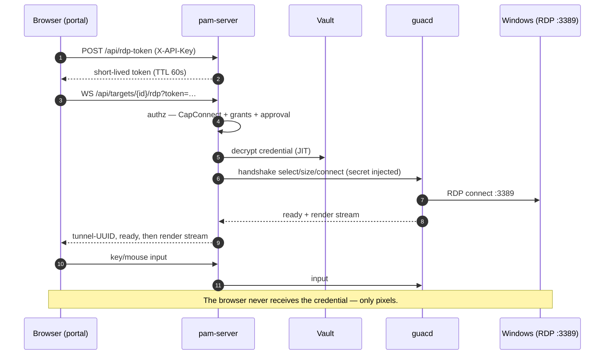

# pamv1 — RDP viewer: testing procedure

> **Living document.** Update whenever the RDP path (guacd handshake, the tunnel
> prelude, the token endpoint, or the in-portal viewer) changes.
>
> Last updated: 2026-08-18 · Reflects: Phases 0–180 (161–173 are AI-agent-broker phases and change nothing a viewer renders or a test procedure touches; **Phase 137 is the first phase since 52g to change the rendered viewer**: a small `.rdpwatermark` overlay — operator, target, start time — is appended as a sibling of the Guacamole canvas, client-side, `pointer-events: none`; see "Two things" below. Nothing else since 52g changes the RDP path or how it is exercised — Phase 116's session-sharing is SSH-only and does not touch guacd or the viewer. Phase 118's CIDR allowlist does reach this path indirectly — `POST /api/rdp-token` goes through the same `authz` middleware as every other route — but doesn't change this testing procedure, since the demo setup uses an unrestricted admin key. Phase 120 doesn't touch this path at all. Phase 122's suspend/resume is SSH-only too and doesn't touch this path either. Phase 124's WebAuthn is a login-time change only — once signed in, by whichever factor, the RDP viewer path is unchanged. Phase 126's theme toggle doesn't touch this path either — it's a global console preference, not per-protocol. Phase 128's account discovery is SSH/WinRM only and doesn't touch RDP either. Phase 129 explicitly does NOT extend to RDP — see the "Zero Standing Privilege: ephemeral database roles" section of ADMIN-GUIDE.md for why: Guacamole's own documentation confirms no certificate-based RDP auth parameter exists, a permanent protocol limitation this testing procedure cannot work around. Phase 131's command allow-listing doesn't touch this path either — RDP has no discrete command surface for cmdguard to see, same as VNC. Phase 133's device-aware access control reaches this path indirectly, same as Phase 118 — `POST /api/rdp-token` goes through the same `authz` middleware every other route does — but doesn't change this testing procedure, since the demo setup configures neither `PAM_POSTURE_ATTEST_URL` nor `PAM_DEVICE_HEADER`. Phase 135's DoubleLock doesn't touch this path either — it gates the credential-management reveal/checkout endpoints, not a connect path. Phase 139's personal-safe check reaches this path more directly than 118/133 did — `viewer_handlers.go` computes `EffectiveSafePersonal` and passes it to the exact same `auth.CanConnectTarget` call the connect gates use, not just the outer `authz` middleware — but still doesn't change this testing procedure, since the demo setup places `demo-rdp` in no safe at all. Phase 141's port-forwarding doesn't touch this path either — it's a new SSH channel type on the `:2222` proxy; RDP has no SSH channels of any kind. Phase 143's ICAP scanning doesn't touch this path either — it hooks the SFTP subsystem's file-finalization step; RDP has no SFTP subsystem, and clipboard file transfer, RDP's own data-movement surface, is a separate, unscanned mechanism. Phase 145's file-attachment secrets doesn't touch this path either — it's a `secret_type` value on `POST /api/credentials`; how a credential's secret is stored has nothing to do with how the RDP viewer connects with it. Phase 147's browser-extension autofill doesn't touch this path either — it calls only `POST /api/credentials/{id}/reveal`, never `POST /api/rdp-token` or the RDP tunnel, and its `ExtensionOnly` token is refused on both. Phase 149's SCIM provisioning doesn't touch this path either — it manages `store.User` rows over `/scim/v2/Users`; a SCIM key cannot mint an RDP token or open the tunnel, and how an operator's account was provisioned has nothing to do with how the RDP viewer connects). — RDP has changed in Phases 33
> (clipboard control), 40 (brokered runs are supervised sessions), 50 (clipboard
> auditing), 52c (recording-required, throttled tunnel auth), 52e and 137
> (watermark overlay).

This is the procedure to verify pamv1's **RDP function** end to end: an operator
opens an RDP target from the 5250 portal, the credential is injected server-side
at the guacd handshake, and the browser only ever receives the rendered screen.

## 1. What the RDP path is


```mermaid
sequenceDiagram
    autonumber
    participant B as Browser (portal)
    participant S as pam-server
    participant V as Vault
    participant G as guacd
    participant W as Windows (RDP :3389)

    B->>S: POST /api/rdp-token (X-API-Key)
    S-->>B: short-lived token (TTL 60s)
    B->>S: WS /api/targets/{id}/rdp?token=…
    S->>S: authz — CapConnect + grants + approval
    S->>V: decrypt credential (JIT)
    S->>G: handshake select/size/connect (secret injected)
    G->>W: RDP connect :3389
    G-->>S: ready + render stream
    S-->>B: tunnel-UUID, ready, then render stream
    B->>S: key/mouse input
    S->>G: input
    Note over B,W: The browser never receives the credential — only pixels.
```

The two facts that make this "the RDP function" and not just a proxy:

1. **JIT injection** — the vaulted secret is decrypted only for the guacd
   handshake and is never sent to the browser.
2. **Tunnel prelude** — `guacamole-common-js` needs an internal tunnel-UUID
   instruction to open the tunnel, then a `ready` to reach the CONNECTED state.
   pam-server's handshake consumes guacd's own `ready` (to learn the connection
   id), so the tunnel handler re-emits both before piping the render stream. If
   this prelude is wrong, the browser viewer hangs silently. See
   `internal/api/viewer_handlers.go` (`guacamolePrelude`).

## 2. Automated tests (no external host needed)

These run in CI and locally with only the Go toolchain — a fake guacd stands in
for the daemon, so **no real Windows host or guacd is required**.

```bash
# The whole RDP surface (prelude wire-format, token endpoint, and a full
# WebSocket round-trip against a fake guacd):
go test ./internal/api -run 'RDP|Guac|Clip|TunnelUUID' -v

# The guacd protocol client (handshake + credential injection ordering):
go test ./internal/guacd -v

# The portal CSP that the viewer depends on (img-src data:/blob:, script-src 'self'):
go test ./internal/web -run TestIndexNonceCSP -v
```

| Test | Proves |
|---|---|
| `TestGuacamolePrelude` | The exact bytes `0.,<len>.<uuid>;` and `5.ready,<len>.<id>;` are emitted first. |
| `TestTunnelUUID` | The tunnel id is a fresh 16-byte hex value per session. |
| `TestRDPTunnelEndToEnd` | Full path over a real WebSocket: prelude first, the vaulted secret injected into guacd's `connect` (never sent by the browser), **both** piping directions, and that a **>8 KB instruction arrives as one intact WebSocket message** (the bridge never splits a screen paint). |
| `TestRDPTokenRequiresConnect` | `POST /api/rdp-token` is 404 without guacd, 403 for a non-connect role, 200 for a connector. |
| `TestRDPTokenIsTunnelScoped` | A minted RDP token is 403 on `/api/targets` and `/api/me` and cannot re-mint — usable only at the tunnel, so a URL leak grants nothing. |
| `TestRDPAuthAndTargetChecks` | Pre-upgrade auth: missing token → 401, wrong role → 403, non-RDP target → 422. |
| `TestConnectInjectsCredentials` (guacd) | `connect` values are supplied in the order guacd advertised, with the credential injected. |

> **Regression note:** `TestRDPTunnelEndToEnd` was what caught that the
> access-log middleware's `statusWriter` did not forward `http.Hijacker`, which
> had silently broken *every* WebSocket upgrade with `501`. The fix is the
> `statusWriter.Hijack` method in `internal/api/server.go`.

## 3. Manual / local procedure (real guacd, still no Windows host)

This verifies the live server serves the viewer client, sets the right CSP, and
mints tokens correctly. It does **not** need a Windows host — it stops at the
guacd dial.

```bash
# 1. Bring up guacd next to the server (guacd ships in the compose file):
#    from deploy/docker/  ->  docker compose up --build
#    or run guacd alone:   docker run --rm -p 4822:4822 guacamole/guacd:1.5.5

# 2. Run pam-server pointed at it (in-memory demo store):
go build -o pam-server ./cmd/pam-server
export PAM_MASTER_KEY=$(./pam-server -genkey)
export PAM_API_KEY=demo-key
export PAM_DATABASE_URL=memory
export PAM_GUACD_ADDR=127.0.0.1:4822   # enables the RDP endpoints
./pam-server &

# 3. The viewer client is served, same-origin, immutable:
curl -sI http://localhost:8080/static/guacamole-common.min.js | grep -i 'content-type'
#   -> text/javascript; charset=utf-8

# 4. The portal CSP admits the viewer (data: images + same-origin module):
curl -sI http://localhost:8080/ | grep -i content-security-policy
#   -> … script-src 'nonce-…' 'self'; img-src 'self' data: blob: …

# 5. A connector can mint a short-lived WS token; a plain request cannot:
curl -s -X POST -H "X-API-Key: demo-key" http://localhost:8080/api/rdp-token   # -> {"token":"…","expires_at":"…"}
curl -s -o /dev/null -w '%{http_code}\n' -X POST http://localhost:8080/api/rdp-token  # -> 401
```

## 4. Full end-to-end — the rendered pixels

The rendered screen is the only part the automated tests cannot cover. Two ways
to see it:

### 4a. The bundled demo (no Windows host needed)

A compose file ships a real **xrdp Linux desktop** as an RDP target alongside
guacd and pam-server, with the pamv1 target auto-seeded — so you can watch a
desktop paint end to end on any Docker host:

```bash
cd deploy/docker
docker compose -f docker-compose.rdp-demo.yml up --build
# then open http://localhost:8080
#   sign on: leave Password blank, enter the access token  demo-api-key-pamv1
#   Work with Targets → type 7 next to "demo-rdp" → Enter → an XFCE desktop renders
#   Ctrl+Alt+Q disconnects
```

It's **demo-only** (throwaway master key, weak creds, an unhardened xrdp
target — never deploy it). If the desktop never paints, set
`PAM_GUACD_RDP_SECURITY=rdp` on the `pam` service and re-up. Then run the
verification checklist in §4b against `demo-rdp`.

### 4b. Against your own Windows/xrdp host

See [EXTERNAL-INFRA-GAPS.md](EXTERNAL-INFRA-GAPS.md).

1. Add an **rdp** target (`os_type: windows`, port `3389`) and a credential.
2. Ensure `PAM_GUACD_ADDR` is set and the operator's role has **connect**.
3. In the portal → *Work with Targets*, type option **7** on the target, Enter.
4. **Verify:**
   - the green title bar shows the target, and the Windows desktop renders;
   - **credential secrecy** — open the browser dev-tools Network tab, inspect the
     WebSocket frames: they carry Guacamole drawing/`img` instructions only, never
     the password;
   - **audit** — `GET /api/audit` shows `rdp.token`, then `rdp.connect`, then
     `rdp.end` for the session;
   - **live session** — the session appears in *Work with Active Sessions* and an
     admin can kill it;
   - **disconnect** — `Ctrl+Alt+Q` tears the viewer down and returns to the list;
   - **token expiry** — a token older than 60s is rejected by the tunnel (re-open
     mints a fresh one automatically);
   - **least privilege** — an `auditor` (no connect) never sees option 7 and is
     refused by both `/api/rdp-token` (403) and the tunnel (403).

### Three things that will change what you see

**You should see a watermark overlay (Phase 137).** The moment the viewer
connects, a small translucent label appears over the desktop naming the
signed-in operator, the target, and the time the session started. It's
`pointer-events: none` — it never intercepts a click — and there's nothing to
configure; every RDP/VNC session gets it.

**`PAM_REQUIRE_RECORDING` breaks this demo.** Neither compose file sets
`PAM_GUACD_RECORDING_PATH`, so with the flag on the tunnel returns **503
`recording is required but not configured for RDP`** and audits `rdp.refused`
— *before* guacd is contacted and before the credential is decrypted. That is
the correct behaviour (Phase 52c widened the flag to cover the viewer); set the
recording path if you want both.

**The clipboard is wide open by default.** Compose sets neither
`PAM_RDP_CLIPBOARD` nor `PAM_RDP_CLIPBOARD_AUDIT`, so the demo runs with
`allow` and no content auditing. To exercise the gate, set
`PAM_RDP_CLIPBOARD=readonly` (copy out, no paste in) or `deny` on the `pam`
service. To see the audit half, set `PAM_RDP_CLIPBOARD_AUDIT=meta`, copy text
out of the XFCE desktop, and look for an `rdp.clipboard` event carrying
direction, mimetype, size and SHA-256 — `full` records the content too. Both
can also be tightened on the demo target alone (its `rdp_clipboard` /
`rdp_clipboard_audit` fields — portal *Change Target*); the stricter of global
and target wins. The mode in force also rides the `rdp.connect` event as
`clipboard:<mode>`. Drive redirection is forced off in every mode.

## 5. Troubleshooting

| Symptom | Likely cause |
|---|---|
| Viewer opens then stays black, no error | guacd reached the RDP host but the handshake failed (cert/security mode). Try `PAM_GUACD_RDP_SECURITY=nla`; for self-signed hosts, `PAM_GUACD_IGNORE_CERT=true` (dev only). |
| `RDP CONNECTION FAILED` immediately | pam-server could not reach guacd (`PAM_GUACD_ADDR`) or guacd could not reach `:3389`. Check the guacd NetworkPolicy/egress. |
| WebSocket closes with `501` | A response-writer wrapper on the path does not forward `http.Hijacker` (see §2 regression note). |
| `RDP VIEWER IS STILL LOADING` | The vendored client module has not finished importing; retry. If it never loads, check the CSP `script-src 'self'` and that `/static/guacamole-common.min.js` is 200. |
| Blank canvas but frames flow | CSP `img-src` is missing `data:` — guacd's PNG instructions are `data:` URIs. |
