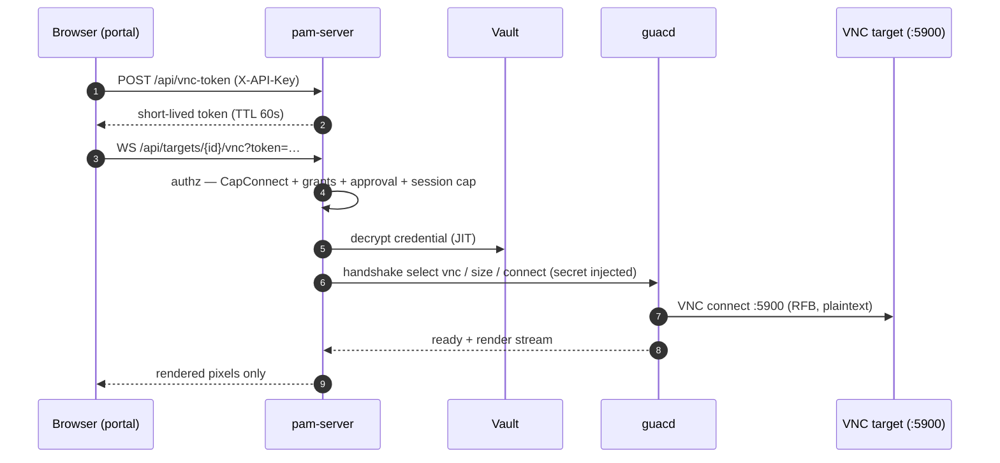

# pamv1 — VNC viewer: testing procedure

> 🟢 **Living document** — updated in the same change as the code. Update
> whenever the VNC path (the guacd handshake, the tunnel prelude, the token
> endpoint, or the in-portal viewer) changes.
>
> Last updated: 2026-08-13 · Reflects: Phases 0–118 (nothing since 55 changes the VNC path or how it is exercised — Phase 116's session-sharing is SSH-only and does not touch guacd or the viewer. Phase 118's CIDR allowlist reaches this path indirectly, same as RDP — `POST /api/vnc-token` goes through the same `authz` middleware — but doesn't change this testing procedure). (VNC shipped in 54).

This is the procedure to verify pamv1's **VNC function** end to end: an operator
opens a VNC target from the 5250 portal, the credential is injected server-side
at the guacd handshake, and the browser only ever receives the rendered screen.

It is the sibling of [RDP-TESTING.md](RDP-TESTING.md), and deliberately so: both
viewers run the **same** tunnel code (`internal/api/viewer_handlers.go`), so a
difference in behaviour between them is a bug, not a feature.

## 1. What the VNC path is



The operator never receives the VNC password, and the browser never sends it.

## 2. The fastest check: the bundled demo stack

A real TigerVNC desktop, guacd and pam-server, with the target seeded for you:

```bash
cd deploy/docker
docker compose -f docker-compose.vnc-demo.yml up --build
# → http://localhost:8080
#   Sign On: leave Password blank, enter the access token (demo-api-key-pamv1)
#   Work with Targets → type 7 next to "demo-vnc" → Enter
#   → an XFCE desktop renders in the portal. Ctrl+Alt+Q disconnects.
```

**Demo only** — throwaway keys and a well-known VNC password. Never deploy it.

Note the demo password is eight characters (`DemoVnc1`). That is not a
coincidence: classic VNC authentication uses the password as a **56-bit DES
key**, so every implementation truncates it to 8 characters. See
[PROTOCOLS-AND-CRYPTO.md §3.5](PROTOCOLS-AND-CRYPTO.md).

## 3. What to verify

| # | Check | How | Expected |
|---|---|---|---|
| 1 | The desktop renders | Option **7** on the `demo-vnc` target | XFCE paints in the portal; `Ctrl+Alt+Q` closes it |
| 2 | The credential never reaches the browser | Browser devtools → WS frames | Only Guacamole render instructions; no password anywhere |
| 3 | The session is audited | *Work with Audit* (or `GET /api/audit`) | `vnc.token`, then `vnc.connect` with `target:`, `cred_user:` and `clipboard:`, then `vnc.end` |
| 4 | It is a live session | *Work with Active Sessions* | One entry, protocol `vnc`, killable — a kill closes the viewer |
| 5 | The clipboard gate works | Restart with `PAM_RDP_CLIPBOARD=deny` (it gates VNC too) | Copy/paste between browser and desktop does nothing |
| 6 | The gate is auditable | With `PAM_RDP_CLIPBOARD_AUDIT=meta` and the policy back to `allow` | Copying text produces an `rdp.clipboard`-style `vnc.clipboard` event with direction, size and SHA-256 |
| 7 | Recording is enforced | Restart with `PAM_REQUIRE_RECORDING=true` and no `PAM_GUACD_RECORDING_PATH` | Option 7 refuses; `vnc.refused reason:recording-required` |
| 8 | An unenforceable policy refuses | A guacd too old to advertise `disable-copy`, with a non-`allow` policy | Session refused; `vnc.refused reason:clipboard-unenforceable` naming the missing parameter |

## 4. What the automated tests already cover

`internal/api/vnc_ws_test.go` proves, against a fake guacd advertising the real
VNC argument list (from guacamole-server's `GUAC_VNC_CLIENT_ARGS`):

- guacd is asked to `select vnc`, with the target's host and port;
- the **vaulted secret is injected** into guacd's handshake and never sent by the
  browser;
- `enable-sftp=false` reaches the wire — VNC's file-transfer channel is off;
- a `deny` clipboard policy arrives as `disable-copy`/`disable-paste`;
- a policy guacd **cannot** enforce refuses the session and audits why;
- a VNC viewer token is refused by every non-tunnel endpoint and cannot re-mint.

What tests cannot cover is the rendered pixels against every VNC server
implementation — hence §2.

## 5. Related reading

- [RDP-TESTING.md](RDP-TESTING.md) — the same procedure for RDP.
- [PROTOCOLS-AND-CRYPTO.md](PROTOCOLS-AND-CRYPTO.md) — §3.5 on why VNC is
  brokered rather than exposed (plaintext RFB, DES-truncated password, no server
  authentication).
- [PORTS-AND-FLOWS.md](PORTS-AND-FLOWS.md) — flow **E4c**, guacd → VNC target on
  5900.

## 6. Change log

| Date | Change |
|---|---|
| 2026-07-29 | First version, with Phase 54: the demo stack, the eight checks, and what the automated tests already prove. |
